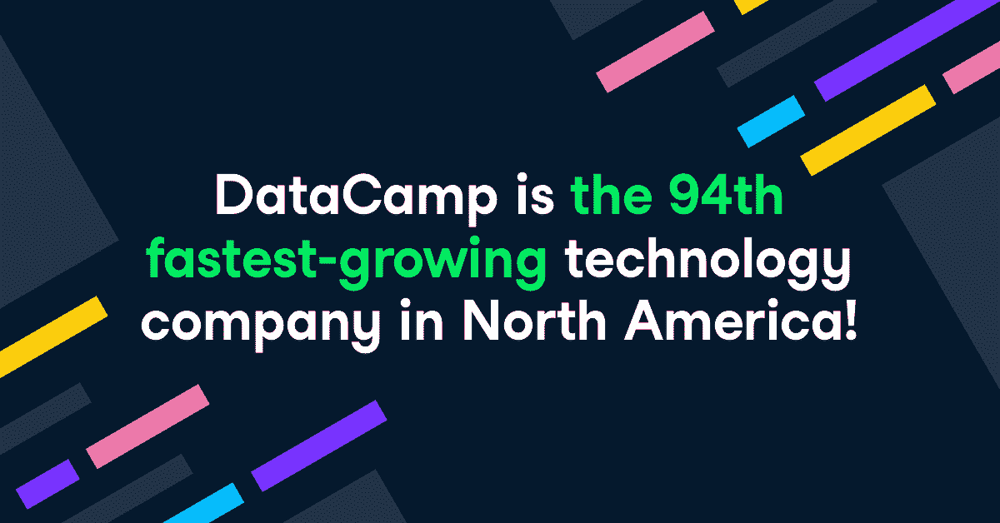
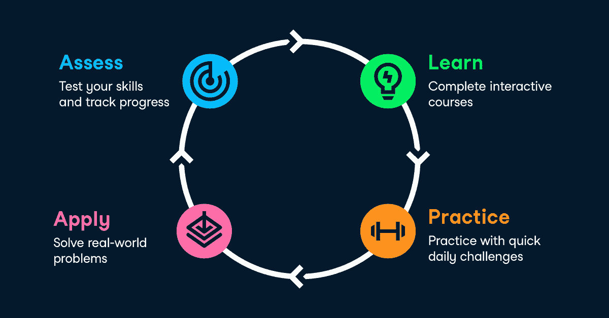
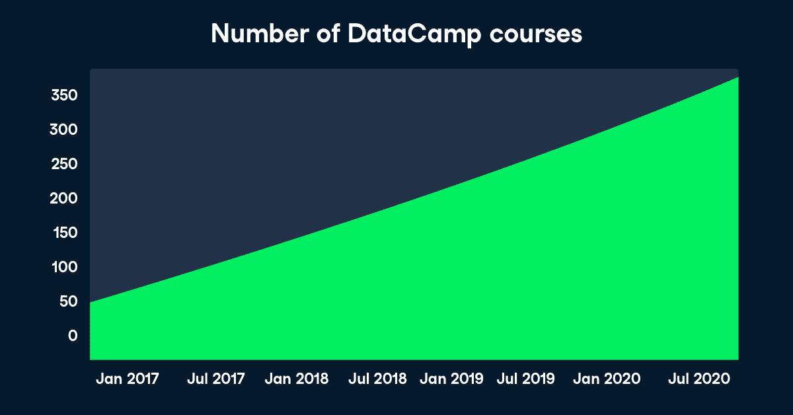

# DataCamp 是德勤科技快速 500 强中增长最快的 100 家公司之一

> 原文：<https://web.archive.org/web/20221129034451/https://www.datacamp.com/blog/datacamp-is-in-the-top-100-fastest-growing-companies-on-deloittes-technology-fast-500tm>

DataCamp 自豪地宣布，我们已经连续第二年获得德勤的 Technology Fast 500，这是北美发展最快的 500 家技术、媒体、电信、生命科学、金融科技和能源科技公司的排名。DataCamp 今年排名第 94 位，在 2016 年至 2019 年的三年期间增长率为 1，232%，是增长第二快的教育科技公司。

DataCamp 首席执行官兼联合创始人 Martijn Theuwissen 将我们的增长归功于我们平台和课程的发展，以及在线学习在数字化转型计划中的重要作用。

“我们很高兴连续第二年被德勤评为北美发展最快的公司科技 500 强，”Theuwissen 说。“DataCamp 拥有近 700 万名学习者和 1，600 多家企业客户，可帮助企业建立大规模的数据流畅度。数据技能不再只是技术角色的专利，最成功的公司都知道，如今，每个人都需要数据技能来有效地完成工作。

“除了提供一流的学习解决方案来培养这些数据技能之外，DataCamp 还允许公司跟踪其团队的技能进步，衡量项目采用和参与情况，将他们的进步与行业同行进行比较，并确定组织优势和技能差距。我们知道数据是当今每个企业的核心，这就是为什么我们致力于为公司和个人学习者提供世界上最好的平台来实现数据流畅。"

## 我们的平台和课程

### 面向企业的数据营

我们帮助组织根据其团队的技能和期望的学习成果创建定制的学习之旅。数据驱动型组织渴望在各个层面上保持数据流畅，这意味着每个人都有能力用数据来回答业务问题。数字化转型计划的成功取决于整个组织是否拥有适当的数据技能。

[DataCamp for Business](https://web.archive.org/web/20220518132535/https://www.datacamp.com/groups/business) 使公司能够在每个角色和每个技能水平上培养这些数据技能。任何规模的团队都可以轻松实施和管理，管理仪表板支持基于角色和部门的定制学习路径，[高级企业报告](https://web.archive.org/web/20220518132535/https://www.datacamp.com/groups/business/reporting)用于衡量在线学习的影响，[来自专门客户成功经理的专家指导](https://web.archive.org/web/20220518132535/https://www.datacamp.com/groups/business/customer-success)，以及[无缝 SSO 和 LMS 集成](https://web.archive.org/web/20220518132535/https://www.datacamp.com/groups/business/integration)。我们正在为组织奠定基础，通过自动化技能矩阵来大规模可视化其团队的优势和技能差距。

### 数据技能培训最有效的平台

DataCamp 成熟的学习方法帮助公司和个人系统地建立和应用他们需要的数据技能，以做出更好的商业决策。

#### 评定

有效的学习始于评估学习者的技能，以确定优势和技能差距。组织可以利用[data camp Signal](https://web.archive.org/web/20220518132535/http://datacamp.com/signal)来提供个性化的学习建议，通过准确识别每个学习者需要改进的内容来节省时间，并专注于实现其业务目标所需的技能。

我们现在有 14 个关于 Python、R、SQL 以及理解和解释数据的主题的评估，还有更多正在进行中。[进一步了解](https://web.archive.org/web/20220518132535/https://www.datacamp.com/resources/whitepapers/datacamp-signal)Signal 成为应用数据技能评估黄金标准背后的方法论。

#### 学习

我们扩展了我们的课程，以涵盖广泛的技术和主题，包括面向需要能够分析和解释数据并与数据专业人员更有效地合作的非技术人员的新内容。我们创建了关键主题的内容，如面向所有人的[机器学习](https://web.archive.org/web/20220518132535/https://www.datacamp.com/tracks/machine-learning-for-everyone)和面向所有人的[数据可视化](https://web.archive.org/web/20220518132535/https://www.datacamp.com/courses/data-visualization-for-everyone)，以及技能课程，如面向企业的[数据技能](https://web.archive.org/web/20220518132535/https://www.datacamp.com/tracks/foundational-data-skills-for-business-leaders)和[数据素养基础](https://web.archive.org/web/20220518132535/https://www.datacamp.com/tracks/data-literacy-fundamentals)。我们还增加了以商业智能工具为中心的内容，如 [Tableau](https://web.archive.org/web/20220518132535/https://www.datacamp.com/courses/analyzing-data-in-tableau) 、 [Power BI](https://web.archive.org/web/20220518132535/https://www.datacamp.com/courses/introduction-to-power-bi) 和 [Excel](https://web.archive.org/web/20220518132535/https://www.datacamp.com/courses/data-analysis-in-excel) ，并扩大了我们对[数据工程](https://web.archive.org/web/20220518132535/https://www.datacamp.com/tracks/data-engineer-with-python)的关注，以帮助您收集、清理和分类您的业务数据。我们还通过九种新语言的字幕让学习变得更加容易！

我们的互动课程库从 2015 年 1 月 1 日的仅一门课程发展到今天的 340 多门课程，我们 60%的平均课程完成率远远高于仅 15%的行业平均水平。

#### 实践和应用

DataCamp [移动应用](https://web.archive.org/web/20220518132535/https://www.datacamp.com/mobile/)现已全面优化，通过自动完成等功能在移动设备上提供最佳编码体验，使学习如何在移动设备上编码变得前所未有的简单。移动学习体验现在也是围绕课程而不是完整的课程来构建的，这样更容易在较短的单元中取得进展。

[无指导项目](https://web.archive.org/web/20220518132535/http://datacamp.com/projects)提供了一种新的方式来应用专业的数据科学技能，并建立学习者在现实世界中独立编写代码所需的信心。无指导项目是为想要解决开放式数据科学问题而不需要循序渐进的任务的中级和高级学习者设计的。如果他们遇到困难，学习者可以跟随实时代码视频，看看我们的专家教师如何找到许多可能的解决方案之一。

## 我们的客户

我们的使命是让全球数百万人和企业都能获得流畅的数据。我们的学习者已经增长到近 700 万人，拥有超过 1600 家企业客户，包括谷歌、英特尔、汇丰、易贝、贝宝、优步等等。通过课堂数据营，[我们为来自 180 个国家的 350，000 多名学生提供了免费访问数据营](https://web.archive.org/web/20220518132535/https://www.datacamp.com/groups/education)的机会。

## 我们的伙伴关系

DataCamp 致力于支持全民数据教育。作为我们让每个人的数据技能民主化的使命的一部分，我们目前有超过 [30 个非营利合作伙伴](https://web.archive.org/web/20220518132535/https://support.datacamp.com/hc/en-us/articles/360051596574)—如 [DataU](https://web.archive.org/web/20220518132535/https://www.datacamp.com/community/blog/datau) 、 [Blossom Academy](https://web.archive.org/web/20220518132535/https://www.datacamp.com/resources/case-studies/blossom-academy) 和[杜克大学的 Fuqua 志愿者团队](https://web.archive.org/web/20220518132535/https://www.datacamp.com/resources/case-studies/duke)—我们将为全球超过 25，000 名学习者提供免费访问 DataCamp 的机会。在全球疫情期间，我们对支持这些社区的关注变得更加重要，因为现在学习者比以往任何时候都更需要建立数据流畅性，以实现更安全的未来。

“对于许多学生来说，在疫情很容易感到失落，”杜克大学富卡定量管理硕士(MQM)项目的副主任杰里米·彼得兰卡说。“让他们感受到 Fuqua 和 DataCamp 的支持对我们来说很重要。能够在早期说 DataCamp 支持他们，让他们感到真正受到重视。”

#### 要了解更多关于 DataCamp 获得技术快速 500 强奖项的信息，[请阅读新闻稿](https://web.archive.org/web/20220518132535/https://www.prnewswire.com/news-releases/datacamp-ranked-94th-fastest-growing-company-in-north-america-on-deloittes-2020-technology-fast-500-301179267.html)。

## 关于德勤 2020 年技术 500 强

今年是德勤科技 500 强的第 26 个年头，它是北美发展最快的 500 家科技、媒体、电信、生命科学和能源科技公司的排名。总体而言，2016 年至 2019 年，2020 家技术 500 强公司实现了 175%至 106，508%的收入增长，增长中值为 450%。

为了有资格获得“技术快速 500 强”认证，公司必须拥有专有知识产权或技术，这些知识产权或技术以产品形式出售给客户，为公司的大部分营业收入做出贡献。公司的基准年营业收入必须至少为 50，000 美元，当年营业收入必须至少为 500 万美元。此外，公司必须开业至少四年，并且总部设在北美。

