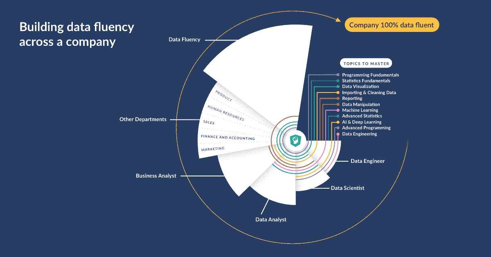
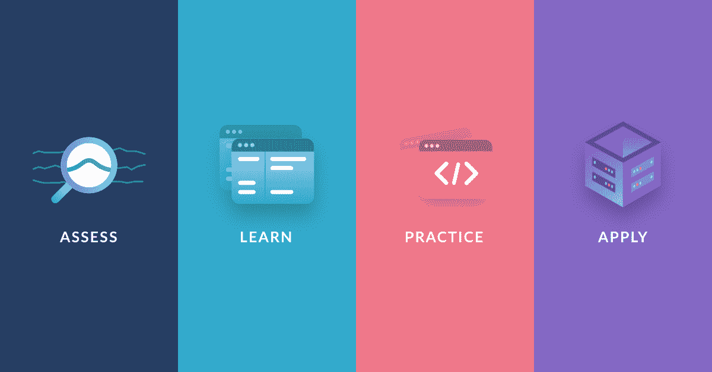
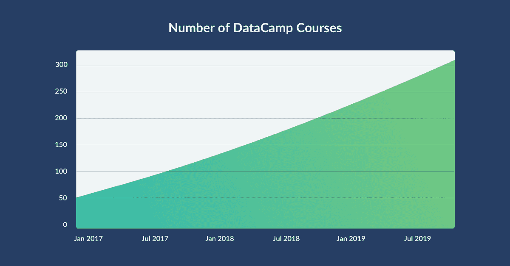
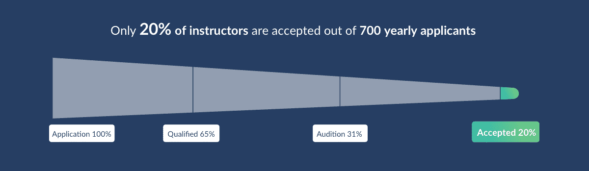
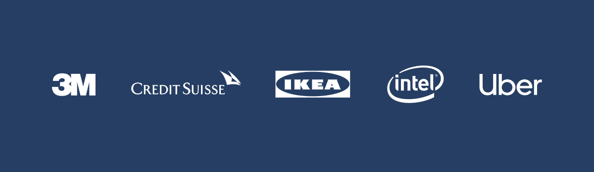

# DataCamp 是德勤科技 500 强中增长最快的第 36 家公司

> 原文：<https://web.archive.org/web/20230101103328/https://www.datacamp.com/blog/datacamp-is-the-36th-fastest-growing-company-on-deloittes-technology-fast-500tm>

DataCamp 自豪地宣布，我们在德勤的技术快速 500 强(Technology Fast 500)中排名第 36 位，这是北美发展最快的 500 家技术、媒体、电信、生命科学和能源技术公司的排名。从 2015 年 1 月 1 日到 2018 年 12 月 31 日，DataCamp 增长了 3，437%，是增长第二快的 edtech 公司，获得了这一殊荣。

“DataCamp 的快速增长凸显了我们的学习者、企业客户和数据科学社区从我们的平台中实现的价值，”DataCamp 联合创始人 Martijn Theuwissen 表示。“我们发现，随着数据进入业务的各个方面，所有专业人员每天都要面对越来越多的数据交互。我们一直专注于帮助企业和个人学习这些关键技能，并将继续以我们的技术为基础，提供市场上最有效的实践学习体验。德勤的创新文化和行业领先地位与我们的使命完全一致，即让每个人都能获得流畅的数据。”

### 要了解更多关于 DataCamp 获得技术快速 500 强奖项的信息，[请点击此处](https://web.archive.org/web/20220522134050/https://www.prnewswire.com/news-releases/datacamp-ranked-36th-fastest-growing-company-in-north-america-on-deloittes-2019-technology-fast-500-300956476.html?tc=eml_cleartime)阅读完整的新闻稿。

DataCamp 的强劲增长可归因于许多因素，从我们平台和课程的发展，到我们的讲师社区和客户群。

## 我们的平台和课程

### 面向企业的数据营

在 DataCamp，我们认为数据流畅性——理解数据、从数据中传达见解并最终做出更明智决策的能力——是 21 世纪数据驱动型公司和专业人士的一项要求。根据我们对代表不同行业的 300 多名 L&D 领导者进行的调查，[89%的公司将构建数据流畅度作为中度或高度优先事项](https://web.archive.org/web/20220522134050/https://www.datacamp.com/resources/whitepapers/what-300-l-and-d-leaders-have-learned-about-data-fluency)。这些公司在收入增长、市场份额、盈利能力以及客户和员工满意度方面都超越了同行。

[DataCamp for Business](https://web.archive.org/web/20220522134050/https://www.datacamp.com/discover/enterprise) 为个人团队和整个组织提供适应其数据培训需求的在线学习体验，以降低其人工智能和机器学习计划的风险，缩小其数据技能差距，并跟踪和报告其组织的数据技能差距和优势。借助高级分析和洞察力、定制学习路径以及无缝的 SSO 和 LMS 集成，任何规模的团队都可以轻松实施和管理。

员工需要适当水平的培训来发展数据技能，这将使他们能够在各自的岗位上取得成功。 [DataCamp 专业服务](https://web.archive.org/web/20220522134050/https://s3.amazonaws.com/assets.datacamp.com/email/other/Professional+Services.pdf)旨在帮助我们的客户确定他们在每个团队或整个组织中所需的数据技能组合，以实现他们的战略业务目标。我们帮助团队将他们的核心职责映射到一组定制的推荐课程。我们的定制学习计划确保团队准备好利用他们的数据，消除组织孤岛和瓶颈以提高效率，并做出推动公司前进的数据驱动型决策。

### 创建最有效的平台来提高数据流畅性

DataCamp 是数据驱动型公司的学习平台，用于构建和应用他们做出更好的业务决策所需的数据技能。

#### 评定

[DataCamp Signal](https://web.archive.org/web/20220522134050/http://datacamp.com/signal) ，我们的适应性技能评估，帮助团队和个人快速获得他们在 Python 和 r 中的技能水平的鸟瞰图。Signal 不像其他测试:学习者除了完成选择题之外还要编写实际代码，评估的难度会根据表现自动调整。Signal 根据学习者的优势和技能差距提供个性化的课程建议，帮助他们充分利用在 DataCamp 上学习的时间。

#### 学习

为了帮助我们的学习者建立数据流畅性，我们扩展了我们的课程，以涵盖广泛的技术和主题，包括 Python、R、SQL、Git、Shell、Scala、数据工程、电子表格和面向商业领袖的[数据科学](https://web.archive.org/web/20220522134050/https://www.datacamp.com/community/blog/data-science-for-managers)。我们的互动课程库从 2015 年 1 月 1 日的仅一门课程发展到今天的 300 多门课程，我们 60%的平均课程完成率远远高于仅 15%的行业平均水平。

#### 实践和应用

除了我们课程库的大规模增长之外，我们还增加了新的方法，让学习者按照自己的速度建立数据流畅性，包括用于移动学习的[移动应用](https://web.archive.org/web/20220522134050/https://www.datacamp.com/mobile/)，每日简短的[练习](https://web.archive.org/web/20220522134050/https://www.datacamp.com/practice)，以及将他们的技能应用于现实世界问题的[项目](https://web.archive.org/web/20220522134050/https://www.datacamp.com/projects)。

#### 我们的讲师社区

我们的教师代表不同的专业领域，从工业到政府和学术界，在 36 个国家和美国 32 个州授课。我们只和最好的导师合作——我们每年收到 700 多份申请，但只接受其中的 20%。

## 我们的客户

DataCamp 的使命是使数据科学和分析教育民主化，并使全球数百万人和企业能够获得数据流畅性。自 2015 年以来，我们的学习者增长了 5，600%以上，达到 470 多万人，现在在全球拥有 1，600 多家企业客户，包括 3M、瑞士瑞信银行、宜家、英特尔、优步等。通过课堂数据营，[我们为来自 180 个国家的 20 多万名学生提供了免费访问数据营的机会。](https://web.archive.org/web/20220522134050/https://www.datacamp.com/community/blog/datacamps-free-classroom-model-used-in-180-countries)

## 关于德勤 2019 年科技 500 强

今年是德勤科技 500 强的第 25 个年头，它提供了北美发展最快的科技、媒体、电信、生命科学和能源科技公司的排名，包括上市公司和私营公司。技术 500 强获奖者是根据 2015 年至 2018 财年的收入增长百分比选出的。

为了有资格获得“技术快速 500 强”认证，公司必须拥有专有知识产权或技术，这些知识产权或技术以产品形式出售给客户，为公司的大部分营业收入做出贡献。公司的基准年营业收入必须至少为 50，000 美元，当年营业收入至少为 500 万美元，增长率为 75%或更高。此外，公司必须开业至少四年，并且总部设在北美。

