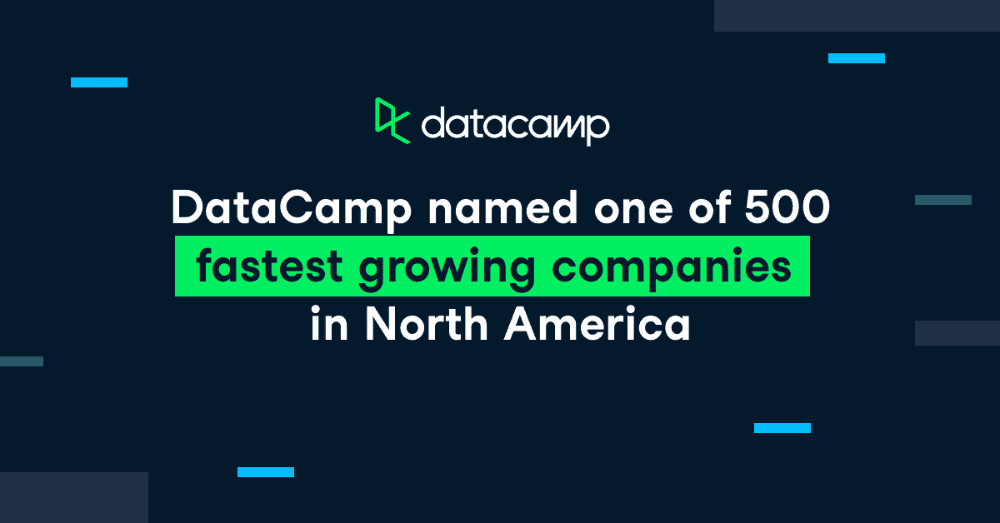

# DataCamp 被评为北美发展最快的 500 家公司之一

> 原文：<https://web.archive.org/web/20221129045128/https://www.datacamp.com/blog/datacamp-named-one-of-500-fastest-growing-companies-in-north-america>

DataCamp 自豪地宣布，我们已经连续第三年获得德勤科技快速 500 强(Technology Fast 500)的认可，这是北美发展最快的 500 家科技、媒体、电信、生命科学、金融科技和能源科技公司的排名。

DataCamp 首席执行官 Jonathan Cornelissen 表示:“我们很高兴连续第三年被评为德勤科技 500 强。“我们现在生活在一个不同的时代。每个行业都在数字化，并产生大量数据，但许多组织没有合适的技能来利用这些数据并超越竞争对手。就像过去公司必须培养计算机知识和软件知识一样，现在我们必须具备数据知识。数据素养正在推动每个行业的变革，并使每个部门都能交付更好的结果。

“为了更有效地支持我们的企业客户和学习者实现数据素养，我们扩展和发展了我们的平台，以包括针对数据科学家和数据分析师的强大认证、职业服务和工作匹配产品，从而使雇佣数据人才和被雇佣变得更容易，我们还构建了一个浏览器内协作工具，以弥合学习数据科学和实际从事数据科学之间的差距。”

## 最全面的数据提升平台

DataCamp 为个人和组织提供业内最全面的数据技能提升体验，以弥补数据技能差距，使雇佣和被雇佣变得更容易，并改善数据见解的协作和共享。

### 学习最热门的数据技能

DataCamp 为每个角色提供交互式数据分析和数据科学技能提升，从商业的非编码基础到数据科学和机器学习，都由该领域的专家教授。最重要的是，不需要安装或下载——所有课程和编码练习都在您的浏览器中运行，包括 Python、R、SQL 等语言的交互式学习内容。作为数据教育的领导者，我们一直在不断扩展我们的课程，以包括更多内容，涵盖基本的数据素养技能、Tableau 和 Power BI 等 BI 工具和数据可视化，以及 Plotly、Dask 和 AWS 云概念等更高级的主题。

今年，我们还通过[数据营竞赛](https://web.archive.org/web/20221212135819/https://www.datacamp.com/data-science-competitions)为学习者创造了一种全新的方式来应用他们的数据技能并向社区中的其他人学习。每个竞赛都要求学员通过提交在 Workspace 中创建的分析来分析数据集和解决现实世界的问题。学习者可以看到他们的同龄人的工作，投票赞成特殊的提交，并赢得提交的现金奖励。

我们还通过在一个地方组织个人的学习体验和进度，并让管理员快速访问群组管理设置和组织洞察力，使学习者和管理员更容易浏览 DataCamp 平台。

### 通过精确的学习计划加快学习速度

展望 2022 年，我们对即将启动的精确学习计划感到非常兴奋。这将是个人和数据驱动团队增长数据技能的最快方式。

一旦上线，公司将能够定制学习计划，以满足他们的目标。学员将参加一个简短的评估，以了解他们今天拥有的技能和明天需要的技能。一旦完成，他们将收到一份精确的学习计划，该计划专门针对他们将数据技能提升到下一个级别所需的培训。

这是一种有效的快速学习方法。通过获得个性化和适应性的学习路径，您可以减少提高技能所需的时间，并更快地实现学习目标。这对单个学习者来说相当于节省了大量时间，因为你没有学到你已经知道的东西，如果应用于整个组织，对公司来说节省的时间甚至更多。如果您有兴趣了解更多关于 precision learning 的信息，请联系您的客户成功经理。

### 认证和职业服务

尽管对数据专业人员的需求不断增长，但个人很难向潜在雇主展示他们的技能，公司也很难验证候选人是否真的具备他们需要的工作技能。我们的[数据科学家和数据分析师认证](https://web.archive.org/web/20221212135819/https://www.datacamp.com/certification)结合了定时评估、编码挑战和由真正的专家评估的案例研究式演示，以验证学习者是否具备成功完成其角色所需的技术和沟通技能。

一旦学员获得认证，我们还会为他们提供在数据科学领域找到理想工作所需的关键工具和资源。DataCamp 的[职业服务](https://web.archive.org/web/20221212135819/https://www.datacamp.com/careerservices)包括访问了解数据科学就业市场的专业职业专家、简历审查以及关于面试准备策略等主题的研讨会。

### 聘用(和被聘用)DataCamp 人才的更好方式

我们知道，招聘数据科学家和其他数据专业人员的竞争非常激烈，也非常复杂。我们让组织更容易找到拥有 [DataCamp 人才](https://web.archive.org/web/20221212135819/https://www.datacamp.com/hire-data-professionals)的优秀候选人。我们帮助招聘经理找到具备您所寻求的特定技能的专业人士，以更快地确定合适的候选人，我们消除招聘偏见，将重点放在候选人的技能上。

我们也想让个人更容易找到潜在的雇主。DataCamp Talent 允许个人在 DataCamp 上轻松创建完美的专业档案，以展示他们的技能和数据科学组合，并与对他们的经验感兴趣的公司匹配。

### 借助 Workspace，无需设置即可立即开始分析和探索数据

我们相信从事数据科学工作应该是轻松、愉快和协作的，这就是为什么我们建立了[data camp Workspace](https://web.archive.org/web/20221212135819/https://www.datacamp.com/workspace)—一个浏览器内编码环境，在这里您可以应用您的数据技能来编写真正的代码、运行分析和分享您的见解。无论您想要使用自己的数据从头开始编码，还是从我们现成的数据集或模板开始，Workspace 都可以让您立即开始。通过我们的一键式发布工具，您可以轻松地与他人分享您的分析，并创建以您的工作为特色的专业作品集。

### 衡量并报告贵组织学习计划的影响

DataCamp 使组织能够[获得对学习计划的可行见解，并衡量投资回报率](https://web.archive.org/web/20221212135819/https://www.datacamp.com/groups/business/reporting)。通过 [DataCamp Signal 技能评估](https://web.archive.org/web/20221212135819/https://www.datacamp.com/signal)，您可以对您团队的技能进行基准测试，并随着时间的推移不断重新评估进度，并通过技能矩阵可视化学习者的技能优势和差距。

我们也知道，报告学习计划的影响需要时间。这就是我们创建定制报告的原因，这是一个点击式报告生成器，让每个人都可以轻松展示您的学习计划的投资回报。借助定制报告，您可以从我们预先制作的模板中单击一下即可创建专业报告，详细了解您的学习计划，并安排自动报告，以确保所有相关人员及时获得信息。

### 与企业系统集成

我们让组织能够轻松地将 DataCamp 插入到他们现有的学习生态系统中。单点登录(SSO)使用您现有的 SSO 提供商为学习者提供无缝的一键式登录体验，LMS/LXP 集成允许您集中学习活动数据并将学习内容添加到您的学习管理系统中。

## 我们的客户

我们的使命是帮助每个人在数据驱动的世界中茁壮成长，这就是为什么 DataCamp 让全球数百万人和企业能够获得数据素养。我们的学习者已经增加到 900 万人，拥有 2000 多家企业客户，包括谷歌、PayPal、汇丰银行、法国巴黎银行、巴克莱银行、Liberty Mutual Group 等等。

## 我们的数据营捐赠合作伙伴

我们启动了 [DataCamp 捐赠](https://web.archive.org/web/20221212135819/https://www.datacamp.com/donates)，通过为其成员提供一年的免费 DataCamp 访问，帮助世界各地的组织弥合数据技能差距。从 2019 年到 2020 年，全球失业率增长了 35%，但熟练的技术工人严重短缺，无法填补需要数据素养的面向未来的工作。原因很简单:普遍缺乏负担得起的高质量数据教育。到目前为止，我们已经与 90 多个国家的 125 个组织建立了合作伙伴关系，并捐赠了超过 1000 万美元的数据营奖学金。我们目前接受新合作伙伴组织的申请，截止日期为 2021 年 12 月 24 日。点击[这里](https://web.archive.org/web/20221212135819/http://www.datacamp.com/donates)报名！

## 关于德勤 2020 年技术 500 强

德勤科技 500 强现在已经进入第 27 个年头，它提供了北美发展最快的科技、媒体、电信、生命科学、金融科技和能源科技公司的排名，包括上市公司和私营公司。技术 500 强获奖者是根据 2017 年至 2020 财年的收入增长百分比选出的。点击[此处](https://web.archive.org/web/20221212135819/https://www2.deloitte.com/us/en/pages/technology-media-and-telecommunications/articles/fast500-winners.html)了解更多。