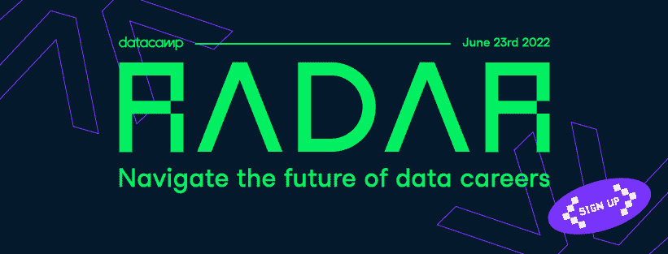
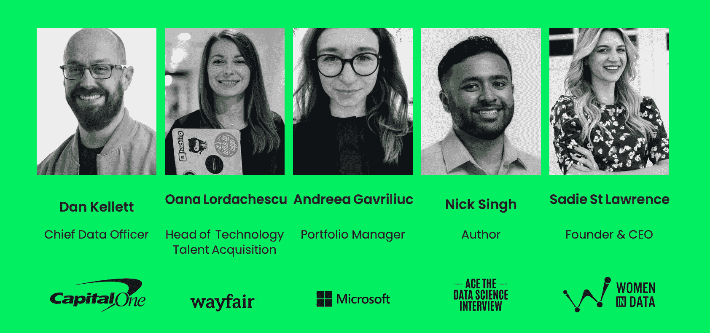

# DataCamp Radar，帮助您驾驭数据职业的未来

> 原文：<https://web.archive.org/web/20221129040406/https://www.datacamp.com/blog/datacamp-radar-helping-you-navigate-the-future-of-data-careers-june-23rd-2022-900am-to-315pm-est>

DataCamp 邀请您参加 Radar，这是一项免费的在线活动，旨在帮助您探索数据职业的未来。无论你是在寻找你梦想的工作，还是在招募你梦想的数据团队，我们的两个同步流都可以满足你。

**什么时候？**2022 年 6 月 23 日

什么时候？ 美国东部时间上午 9:00-下午 3:15

## [保住你今天的位子](https://web.archive.org/web/20221212140052/http://events.datacamp.com/radar)

## 谁应该参加？

###   **1。如果你想在数据领域开始或继续你的职业生涯**

### 2.如果您希望建立自己的数据团队

将会有两个系列的讲座、小组讨论和网络研讨会，每个系列都经过精心策划。因此，如果您正在寻找关于如何扩展您的数据团队或推进您自己的职业生涯的见解，Radar 可以满足您。

## 谁会加入我们？

正在塑造数据职业未来的个人和公司也将加入我们的行列。我们的一些演讲者包括:

## **期待什么**

### 1)如果您想开始或继续您的数据职业生涯

如果你刚刚开始找工作，或者你想让你的职业生涯更上一层楼，我们可以帮你。会议主题将包括如何开始数据职业生涯，展示您的数据科学简历并创建一个令人敬畏的投资组合。你也将有机会询问如何找到工作以及认证是否值得的问题，并得到回答。

### 2)如果您想组建自己的数据团队

作为一名招聘人员，你的工作流将涵盖整个招聘过程等等。演讲者将讨论如何雇用和留住数据人才，包括如何提高您的品牌，建立和扩大远程团队，扩大数据人才流动，以及关于数据职业未来的内部知识。

## 谁会在那里

我们很高兴能够邀请到一些数据领域最聪明、最有影响力的领导者。这是即将加入我们的演讲者的一个预览。

对于 stream 1，我们的演讲者阵容将帮助您在数据职业生涯中脱颖而出。我们请到了女性数据公司的创始人兼首席执行官 **赛迪·圣劳伦斯** ，就如何开始你的职业生涯发表演讲。 **Jay Feng** ，Interview Query 的联合创始人，给出了应对数据科学面试的技巧。你甚至有机会向 DataCamp 的招聘团队询问你最迫切的问题。职业服务主管珍妮·布里克 和分析主管 **豪尔赫·巴斯克斯** 将分别为你的简历和如何获得你梦想中的数据工作提供建议。

 对于 stream 2，该阵容将帮助您完成从吸引人才到扩展您的梦之队的过程。企业分析和数据高级总监 **Meenal Iyer** 为您提供如何雇佣和留住数据人才的建议。帮助你解决雇主品牌问题的是微软投资组合经理**安德里亚·加夫里柳克**。首席数据官 Capital one、 **Dan Kellet** 将提供如何雇佣和建立高影响力数据团队的内部知识，而劳伦斯哈维的 SVP**Mariano Allegra**则专注于建立和扩展远程团队。

## [查看当天的日程](https://web.archive.org/web/20221212140052/http://events.datacamp.com/radar)

## **保存您的位置**

无论你是在寻找你梦想中的工作还是招募你梦想中的团队，你都不想错过这个机会。 [在这里注册雷达。](https://web.archive.org/web/20221212140052/https://events.datacamp.com/radar) 报名免费，但名额有限。