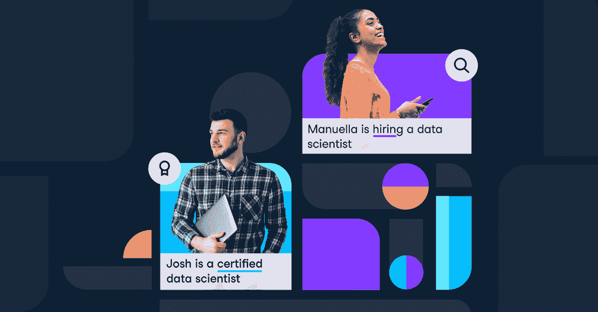

# DataCamp 的专业数据科学家认证计划

> 原文：<https://web.archive.org/web/20221129054701/https://www.datacamp.com/blog/datacamps-professional-data-scientist-certification-program>

我们创办了 DataCamp，帮助数百万学生培养数据技能。虽然我们已经提高了许多学生的技能，但劳动力市场上仍然存在巨大的数据人才技能缺口。

我们的[数据科学家专业认证](https://web.archive.org/web/20220525171335/http://datacamp.com/certification)让合格的个人向雇主展示他们的能力。这有助于他们脱颖而出，更快地获得工作或晋升。这也有助于雇主在内部和招聘过程中发现合格的人才。面试通过 DataCamp 认证的候选人的雇主可以放心，这些候选人拥有成为成功的数据科学家所必需的技能。

### 我们如何创建认证流程

通过与我们的行业合作伙伴密切合作，我们很快意识到需要一个个人和企业都可以信任的认证。因此，在创建我们的认证流程时，我们将此作为我们的首要任务。我们进行了深入的实践分析，以确定数据科学家经常执行或关键的任务。

我们考察了各种环境和位置，包括:

*   行业专家的实际采访
*   分析在不同公司规模和行业中的角色
*   评估团队结构差异的影响——分布式团队与集中式团队
*   职位的资历
*   地理位置的差异

### 产品需要什么:

我们的认证流程由两部分组成:

1.  认证过程
2.  职业服务(针对我们的个别学员)

### 1.认证流程:

我们的数据科学家专业认证不仅测试所需的技术技能，更重要的是测试交流发现和见解的能力。

为了获得认证，我们的学员必须通过我们的自动化测试，以及案例研究提交和实际的一对一面试。其中包括:

| 步骤 | 挑战 | 技能测试 |
| --- | --- | --- |
| 1. | 定时评估 | R、Python 和 SQL 方面的一般数据科学技能 |
| 2. | 编码挑战 | 编写和运行复杂代码的能力 |
| 3. | 案例研究提交 | 获取真实世界的数据集并分析它们 |
| 4. | 现场案例研究演示 | 能够向技术和非技术受众描述和组织分析 |

在案例研究部分，技术和非技术受众都会对学员进行评估。我们超越了自动化诊断测试，通过案例研究引入了人为因素。通过我们的论文式结构，我们全面测试候选人交流其发现的能力。

一旦学员获得认证，他们就可以访问我们的个性化职业服务团队。

### 2.我们的职业服务团队:

我们的职业服务团队专门帮助合格的候选人在数据科学领域找到他们梦想的工作。通过我们的会议，我们帮助指导候选人通过他们的求职无论是通过简历审查，面试准备，或一般提示。我们想给我们的证书持有者一个机会，不仅可以通过证书证明他们的技能，还可以更进一步，帮助他们在求职过程中展现出最好的一面。目前，我们的职业服务仅面向个人客户。

### 我们的第一批证书持有者要说的话:

我们已经有超过 30，000 名学员开始了认证过程，我们被他们的热情所感动。

> “这是一个值得的过程，它激励我将我的数据科学技能提升到一个全新的水平。”-拉迪卡·加尔格
> 
> “这次使用 DataCamp 的经历真的超出了我的预期”——祁伟门
> 
> “我喜欢认证过程，我很高兴能够成功获得认证。”-延斯·斯文马克

### 接下来是什么？

我们才刚刚开始。这是一系列专业认证中的第一个。我们希望给我们的学生机会，让他们专攻他们最感兴趣的领域，并帮助雇主雇佣最好的候选人。

点击了解有关我们的数据科学专家认证[的更多信息。](https://web.archive.org/web/20220525171335/http://datacamp.com/certification)