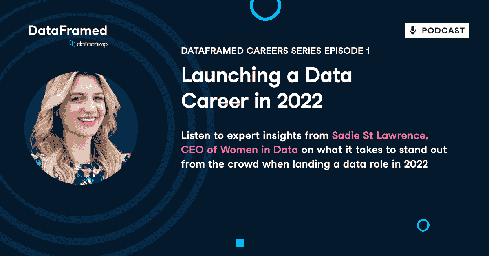

# [数据框架职业系列# 1]2022 年开始数据职业生涯

> 原文：<https://web.archive.org/web/20221129040406/https://www.datacamp.com/blog/dataframed-careers-series-1-launching-a-data-career-in-2022>

[https://web.archive.org/web/20220818194605if_/https://embed.podcasts.apple.com/us/podcast/dataframed-careers-series-1-launching-a-data-career-in-2022/id1336150688?i=1000564490436](https://web.archive.org/web/20220818194605if_/https://embed.podcasts.apple.com/us/podcast/dataframed-careers-series-1-launching-a-data-career-in-2022/id1336150688?i=1000564490436)

DataCamp 播客 DataFramed 的主持人 Adel Nehme 最近采访了女性数据的创始人兼首席执行官赛迪圣劳伦斯 T2 T3。

# [介绍赛迪·圣劳伦斯](https://web.archive.org/web/20220818194605/https://www.datacamp.com/podcast/dataframed-careers-series-1-launching-a-data-career-in-2022)

赛迪。 真是 伟大的 到 有 有 有的表演。

Sadie St. Lawrence: Oh, it's great to be here. Thanks so much.Adel Nehme: I'm super excited to talk to you about, breaking into data science today. How aspiring data practitioners need to think about their career paths, best practices to stand out in a competitive space, your work leading women in data, and much more, but before, can you give us a bit of a background about yourself and how you got into the data?Sadie St. Lawrence: Yeah, I'd love to share. So I came into data career in 2014. At the time I was working in a neuroscience lab with the plans to go and get my PhD. Science and soon revise. I really love the analysis side of things and didn't so much enjoy taking care of rats. And then unfortunately having to kill my rats at the end of using them.

和 那个 被 一个 一个 一个 位 劝阻。 和 如此。 什么做了什么 做了什么做了什么做了什么说了什么 什么 零件 做了什么 我的 什么 零件 能不能做 用 做那个？什么 我 曾 左 它 又曾分析，科学 方法。我 被 幸运 够了找术语 数据 科学。当 我 发现 术语 数据 科学 或 一个 谷歌 搜索， 我

它 本来是 只是 喜欢， 是的， 这个 就是 我。 这个 就是 就像 万物 那个 我 要 要 做 和 要 要 做。 我 辞职 我 工作实验室内 下 几天内所以 我 开始 关 当 一个 研究 分析师， 然后 开始 服用 一些 意识到了 我已经 真的 爱过了 它 和 然后 决定 去 去 和 去

开始 只是 一个 真正 激动人心的 时刻。 凡被到 被研究 分析师然后 被 分析 工程师 和 然后然后 我 被 能干的领导 一个 数据 科学 团队，然后 所以 我已经 有了 一个 真的 好玩的 旅程 在 这个 的空间。然后 现在 今天 我 得到 到 做 什么 我 爱T134 其中 为为 与 为 新增 数据 帮助 教练 其他 和

Adel Nehme: I love this story and I'm very excited to unpack a lot more of your journey. But there's definitely a lot to discuss today when it comes to breaking into data science. When I first . Joined the industry, , and that wasn't necessarily that long ago, you'd only see two main ones.

右 至 聘 为 四 数据 分析师 或 数据 科学家。这个 就是中的有些 的感觉 真实 今天， 但是 我们 见 一 很多 更有 我们 有涌现 的杂种 角色 像 金融 分析师 认为 需要 更

所以 作为 一个 教育家， 你是 某人 此人 此人被 嵌入 这个 空间 为 一个 长 什么 做 你 认为 是不同的 类型数据 职业 可用 为 有志 从业者？ 寻找 到 打破 成 的数据？

Sadie St. Lawrence: Great question because a lot has changed since 2014 at this phase when I first entered. So on the positive side, there are so many more resources for learning today. So when I was getting into the space, I'm in the U S. There are only five universities even offering master's degree at the time. So I just share that because if someone has been interested in getting a master's or, going through formal education, they'll know the plethora of resources and options available, let alone the courses are available through.

我 别 连 都知道 如果 数据 阵营 存在时间 那 就是 可用 通过 私有 和 所以 我觉得 实在是 刺激 所以 还有 所以 很多 的资源。 但是硬的 部分 现在的 是 今天的 到底是 什么 你 提到了。 有 所以 很多 更多 工作岗位 在 这个 空间 和 现在 他们正在 变 一个

所以 人人 事 事 我 见 是 人 是 望 不是 只是 为 一个 数据 但 他们是 找 找 有人 谁 有 那些 技能也有。 行业 技能 或 业务 功能 技能 为 嗯。 所以 为 你 提到了，真的是 重要的 为 人 不是 为 只是 说

做 你 想要 到 成为 一个 产品 数据 的科学家？ 做 你 想要成为 一个 金融 数据 的科学家？ 做 你 要 要 工作 要 一个 消费者 商品 公司 喜欢 真的 狭义的 在， 在 喜欢 保健 是 我 觉得 一个 真的 刺激 地方 到 是 因为。 嗯， 为什么 不 我们 有见过如何重要 健康 是 中的 最后两个 车型 说明 我们已经 造好了 大概 命 他们 能 救。

所以 我 会 说， 使 肯定 如果 你就 望 到 把 弄进空间， 你就 而不是 不管是 还是 都是从 一个 行业 或者 一个 功能 从 一个 的工作。 的意思是 是 吗 是 营销 的一面？ 是 它 一个 财务， 一个 操作 身边的东西？ 我 想 如果 你 把 那些 两个 组合在一起， 你 有 一个

Adel Nehme: That's really great. And in some sense, this creates an easier career pathway into data science, because if you're a marketer, a financial analyst or someone who has the subject expertise. You just need the technical expertise on top of that to break into data science.Sadie St. Lawrence: Exactly. And it also really helps to distinguish you as well as with the crowd. So it's just a, win-win all girl.Adel Nehme: How do you assess the importance or the trade-off to a certain extent between these business skills and these hard skills, what do you think are the most important skills in that mix?Sadie St. Lawrence: Oh, yeah, That's a hard question, right? Because both are important. And so that doesn't really answer your question of one versus the other. But I would tell people though, is if you need both of them, how do you balance living both of them on your learning journey? And gee GI like to do this for people.

是 挑 贵 道， 然 知 贵 洋是什么意思？ 嗯，海洋 是 一个 非常 广大 地方， 对吗？那是 一个 一批次 呃， 数据事业 感觉 还有 所有这些你 需要 到 学习 获取 数据 清理 和数据 数据 治理数据 工程。

然后 你 得到 变成分析机器 学习 侧面数据 可视化 所以 那就够了只不过是中的本身对技术上的 侧面的 对 的东西。现在 你是 话说 要 我是 你是问我是 要 也要 学 这些 像 如何 做 我 做 它 都？

那是 那里的知 贵 波 来 中， 对。有 有 真 明 异 为 凡 他 要 为 要。所以 我倒要说 上下上 下 上 下 真的 使 确信 你 服用时间 到 说话 到 人 人 已经工作 在 那个 洞里， 制作 确定 你是 不是 只是 阅读技术 文章怎么回事 上

所以 为 我， 一个人一个人 一个人 我 就像理解 商家 就是 到 读 所以 我 认为 那是美女 的。 呃， 上市 公司 是 当 你看 看 自己 财务 报表， 你 真的

怎么做 他们 怎么用 的钱？ 什么产品试吃卖什么？末理解 贵 商 是 相当于 简单， 对吗？ 这事儿 好办。我们 赚 钱 所以 那 我们 能 继续 到

## 数据叙事的重要性

Adel Nehme: And you mentioned here something in your answer around communicating your brand or communicating the technical skills that you have. How important are communication skills and data storytelling skills, as a means to break into data science and to jump out and stand out from the crowd.Sadie St. Lawrence: The analogy I like to use is like a music box, So if you've ever seen a music box, if it's closed and just sitting on the table, you never actually get to hear what the beautiful sound is inside of it. that's similar in terms of data scientists, not having communication skills, they may have these amazing skills, but they're all locked in this box and then no one ever.

那么 你 有 要 打开盒子如何 做打开盒子？ 你 打开盒子 通过能够 到 告诉 那些 故事 和 到 沟通 那些 所以， 真的是起来你， 对不对？ 做 你 要 人 要 听 你的故事 和 要 听 你的 惊艳 嗯， 那么 你就 要 要 需要 沟通技能 那么 那 你就

Adel Nehme: That's great. And you're someone who's, in my opinion, a great communicator. And that sits at the intersection of like technical skills and communication. How did you grow your communication skills over time? I know there's some form of it that is innate, but I'm sure you've gotten better at it over time.

什么之 之道 之道 之道 之道 之道 之道 之道 之道更好吗？

Sadie St. Lawrence: I would say, take every opportunity to use those communication skills. So I know early on in my career, it can be daunting to say, yes, I'll need this presentation or I'll present a portion of this, right. But one take any opportunity that presents itself. And also if there aren't any opportunities that present itself, volunteer yourself to be able to lead that communication.

所以 它 真的 是 的一种 事的做法。其他 选项。 正如 我们 活 在 一个 数字 世界 和我们 有 这些 伟大的 工具 社会 媒体 到 只是 开始 到 写出 和 进行交流。 即 是 这样的 一个 伟大的 选择 中的 条款 的。 一个人但是更重要的是， 如同 你 走 经过 那 练 之

所以 我 会 说 练 使 完美把握 每一次 机会寻求 出去 机会 向 沟通

Adel Nehme: That's awesome. I couldn't agree more, especially on taking that leap of faith and kind of going for the presentation whenever you get the chance. So moving in, in our chat on our chat, I think there's never been more interest in a data science career as a career path today. there are a lot more learning resources, as you said, a lot more organizations opening up data science department.

更多 数据 技能 和 种类组合业务 技能数据 技能 即 是 所需要的。 本 意为需求 为 数据 角色 是 的上级， 却是竞争 是 也是 那么 什么 会 你 认为 是 顶 理 为 站 出中

Sadie St. Lawrence: First I would say, I think it's great. There's this momentum and so much interest in the data. The forecast of the opportunity in this space is looking really, really well. So the world economic forum produces this job report that predicts the top jobs over the next five years. And so in 2020 predicted again for the next five years.

所以 那个 推移 通过 2025 和中的 顶10、 三个那些 顶 10 的工作。 我们是 所有 数据、 职业、 机器、 学习、 工程师、 数据、 科学家、 数据、 分析师。我 认为 它 是一个大 数据 的专家。 正确。 所以机遇是真的真的 伟大的 在 这个 事业中， 但是 你说得对 。 它 能 感觉 像 那里 是 一个 很多 的 竞争 在 这个 空间 就像 我 拿了 这个 类没有 一个人的 给予 我 一个 工作

所以 什么， 有些 的 这些 因素 那些见 作一期 同。 公司 都是真的好 人 人 不是 只是 有学历， 但 有贵。 他们 需要知道 那个， 嘿 对 走开， 我们就 绑着 时间 我们 知道我们 能 把 你 变成 这个 角色 和 你会 自动【T119

所以 为 人 出 有 人 有赶22的喜欢， 嗯， 我在 努力对对。 我在 尝试 到 获得的经验。 那就是 为什么 我是 申请这些 的工作。 什么 做 你 做什么？ 如何 做 你 解决 那？ 所以 这个 就是 其中 建筑 项目 和 建筑 一个 作品集 作品 真的 好。

这个 就是 那里 志愿， 为 组织 那里 你 可以 使用 这些 技能 可以 帮助 建造 那个 进步。然后 最后， 这个 是 哪里的 那些 沟通 技能 来了 中的 分享 你的 作品、 因为 为 你在 建 出项目 组合你在分享什么 你的

所以 那些 都是 真的两个 战术 那个 我 会 拿 对 现在 在 这个。

## 简历提示

Adel Nehme: I couldn't agree more. I love every single point. You mentioned one from, building a portfolio of projects. Sharing your work and even putting yourself out there and getting the experience and volunteering, so of course, when it comes to the practical side, as we mentioned here, breaking into data science, we need to talk about resumes, portfolio projects more deeply, and also sharing your work, building a community. So I'd love to first talk about kind of resume tips, right? How would you structure a resume for it?Sadie St. Lawrence: Yeah.

我是 庆幸 你是 请示 这个 问题 因为 只是 两个 周 前 我是 被 回顾 一对 夫妻 我 想 我 要创造岗位 从 不 坏 到 具备【条件 对吗？ 起因 那是 通常 什么 我 见 同 简历 是 它 开始 关闭。 是 不是 不好。

但是 如何 做 你 做 如何 做了 我们 得到 你 到 真的 发光 出来吗？所以 我 认为那还有夫妇关键 因素记简历 一条 直线 旅程 穿越 你的 生涯。 简历 应 讲 一个 故事 和它 应 讲 一个 故事 作

难道 这个 的意思是 那个 你 应该 躺 上 你 简历 或者 把 事情上 发？ 不是， 而是 什么 你 要要 做 你 要 要 摇 你 简历 和那么 为什么 就是 这个 重要吗？ 那么 咱们就 说 你是 要去 找 一个 营销 数据 科学 角色， 对不对？

你 要 要 使 确定 那当 你要 嫂 出来 你要 历练 和 你要 教育 你要 为什么？ 因为 人 谁 拿到 简历， 如何 成千上万简历 到 走 通过。所以想要让 把 当成 简单的把 当成 吧。 它的 为 简单的 为 它们的 为 可能的 为 为 像， 是的， 此 人

你 不要 要 人 人 回顾 你的 简历有走试挖 所以 一个人 一件事 我 会 说 是 挑， 有 一个 真的 清楚 远见 又来了， 不是 只是数据 科学 角色 焦点 上 下 行业 或 一 那是告诉 一个 的故事为什么 你就是 那个 完美的 人最大的 事 我 见 是 同简历 是 人 别 他们在 只是 投掷 所有 他们的 技能 出来 那里， 他们的 经验 出来 那里

所以 事先 给 起草 那份 简历， 拿到 真的 明确 上 什么 那份 是 你 想要的， 然后 拉 出来 把 的 的 你的 和 你的 教育 那 适用 到

Adel Nehme: That's really great. So let's pick it out through an example, I want to be a data analyst in the healthcare space. I have a few experiences here and there. And healthcare bit touching data. I've learned a lot of data projects. I've done a portfolio of projects on healthcare data, How would you structure a resume for a data analysts going into healthcare for.Sadie St. Lawrence: Yeah. So this one, because it's a technical role, you definitely want to have your technical skills at the top, right? So this is a goal where you're not going to be managing people. You're going to be an individual contributor. So you want to show right away. Here's my technical skills, right? So I'm a bullet point.

我 知道 Python， 我 知道甚至 寻人中的中的 库 即 你 可能 有然后 右 走 走 进 你的 经验， 右？ 所以 上 下上下 上 下 上 下 上 下 上下 但是 我 赌 你曾经 工作过 关于 的问题 那 都是 类似 到 什么 你

所以 什么 你 要 要 做 就是 拉出来 那些 的问题塑造 那个 故事 在 一个所以 那就是 要 要 要真正的 有帮助 中的 条款 中的 只是 制作 更简单 为为 为 阅读。 好吧。 耶。 也许 他们 曾在消费 商品 公司但 我 能 见

现 将 应用于 将 分析师 池 作为 井。然后 最后，通常是 结束 与教育 身边 的 事情。教育可以走夫妻的路子。 人 常 问 应 我 放 一切附加 教育 我 有 上 这个 要看我 中的 术语 中的 是否 你 已经 有 一个 学士 附加 教育 你已经 搞定了 应该 来了 通过 中的技能 那个

不是 你的 学士 或 硕士。 如果 你 不 有学士 或 硕士 肯定 加 说明上有 因为 我 也许 中的 一个 不同的 大道那就是 好吧。 但是 我 认为 那是 只是 重要要 知道 那是 一个人 或者 那个 其他的，

## 创建投资组合项目

Adel Nehme: That's really great. moving on to the second element of breaking into data science here, which is like portfolio projects. What do you think are some of the most important aspects of creating a portfolio project? And what do you think makes a great portfolio?Sadie St. Lawrence: I think the thing that makes a great portfolio project is the subject that you are interested in. So one of the best ones I saw was someone did an analysis. they were a big movie, but for me did analysis of all the movies that. Over the last five years. And they categorize them into all these really fun categories based on like how long the film is, who the director is.

焉 多 共部电影， 中的只是 一个 实在 有趣好玩 的故事。他们 做了 它 在 一个 好玩、 互动 的仪表盘上。 什么 我 爱过 关于 这个 作品集 项目。 你 得了见 自己的 个性。我 认为 那是真的重要 要 记住 太过了， 就是 你是在 努力 要

见， 因为 你就 要去然后 找对 契合的文化， 对。 如果 你真的 真的显示你的 是你的 个性 是 你真的 要去吸引 如此。 一个人 找一个 一个 主题 那个 你真的 有兴趣 中的和 有事 那个 你真的

然后 其次， 找 创意 方式讲述故事。 所以 你 可以 肯定 添加 它 到得到页面。 你可以创建 一个 中型 博客 帖子。 所有中的 那些 都是 伟大的 但是 也许 你 走多余的 哩。 搞不好 你 搞个好玩的 少了。 即 人 能 用过滤 通过的视频，对吗？ 也许是 它是 一个 交互式 仪表盘。

我 找 创意 方式 给 讲故事。我 觉得 那就是真的 什么 会让你的 组合？

项目 团队。

Adel Nehme: I love this, especially on the authenticity and having a great, genuine interest in the subject because there's kind of Nick saying who I interviewed as well on the podcast on async the data science interview mentions this as the halo effect, if you are genuinely interested in a topic, people will gravitate towards.

和 他们 会 会 会 会 会 会 会会会会 会 会 会

Sadie St. Lawrence: Yeah, I couldn't agree more. I think softened times, if you're trying to break into the field, you can just feel like I just want my first chance. Right. And so you're willing to just do whatever to get that first job. But what I would say is don't lose, don't neglect that like, you really want to care about the culture of the team that you're going into.

只有 道 到 做 那个， 那就分享 谁 你 都是 所以 那个 他们

Adel Nehme: I completely agree. what do you think are key mistakes people make when creating a portfolio?Sadie St. Lawrence: I would say doing what's already been done. So there's a lot of fun names out there. It's the, it's the, I think it's like a golden retrievers. To like aware Wolf right. In the golden retriever house. Like if I have this data set and then the like werewolf picture is like real word world data, right.

真是 像 一个 经典 模因

Adel Nehme: Yeah.Sadie St. Lawrence: Community. And it's so true. Like we all, like, this is why meetings are so great because we see it in automatically get it. But I think also more importantly, not just in terms of why this meeting is so great, but it's in terms of like the complexity of the two different data sets, but.

你 知道， 我们 说 就像虹膜 状态 说 那是 所以 过度使用 术语 中的 什么 所以 又来了， 它 能， 当 你 轻点 成 什么 你真的 有兴趣在， 你’ 也许 它会 用 你的网 获取 这个 的数据。 也许 它 痊愈 数据 从 你的 苹果 手表 或 你的 健康对吗？

喜欢 也许 你真的 感兴趣对 RA 和你 开始 到 分析 喜欢艺术 购买 和市场。对对。 走 进 什么 你对 感兴趣 中的 和 停止 做 什么 大家都 别的 有 凯特琳 被 一个 伟大的 地方 去 找一些 自由的 数据 集合 和 得到 我 认为 那是 一个 伟大的 地方 去 实践 但是 在 你的 作品集

所以 我 会 说 最大的 问题 或 错误 认为 人 做 就是 只是 而不是 做

## **构建数据社区**

Adel Nehme: 所以，当我们谈论原则时，我们提到的最后一件事是，从人群中脱颖而出，分享你的工作，在你周围建立社区，我很乐意在你的经历中锚定这一点，在数据中启动女性。

我在准备这个播客的过程中度过了一段美好的时光，在准备这个播客的过程中了解了你的故事。我发现这是勇气和团体力量的伟大见证。那么，你介意详细介绍一下你最初是如何推出一个最小数据和类似的故事，以及它是如何把你带到现在这个位置的吗

赛迪圣劳伦斯: 耶。所以当时我全职工作是一名研究分析师，我还在全职攻读硕士学位，显然这两件事都很忙。嗯，但是在这个过程中我感到很孤独。所以我，我觉得我没有可以真正交流的人来讨论想法，合作。

正是对归属感和联系的需求让我开始研究新数据。这真的是从我个人对社区的需求开始的，然后是对空间中更多平等的更广阔的愿景。所以不幸的是，在我的硕士项目中，你知道，我们第一批有 30 个人，只有我自己和另外一个人留在了项目中。

所以我真的觉得有必要和像我一样的人交流。所以女性和数据从一个聚会团体和我所在的城市开始。我以为会有很多人出席。每个人都会对这件事的发生感到兴奋。不幸的是，随着时间越来越近，没有人出现，我感到非常沮丧，真的只想收拾行李回家。

谢天谢地，我决定在开始时间后再等 15 分钟。一个人冲进门，她带了另外三个人进来。这就是生活在数据中的诞生。我认为这也表明，你不会遇到那么多原本应该联系的人，对吧。

就像找一两个人。是某事的开始。今天呢？

你知道，women and data 是一个由 30 个国家和 50 个城市的 30，000 多人组成的社区。但这真的真的很不可思议，当你只是打电话说，嘿，让我们联系，让我们成长。让我们成为可能需要时间的人。

但是最终通过一些坚持和奉献，它会成长。

Adel Nehme: 所以，当我们谈论原则时，我们提到的最后一件事是，从人群中脱颖而出，分享你的工作，在你周围建立社区，我很乐意在你的经历中锚定这一点，在数据中启动女性。

我在准备这个播客的过程中度过了一段美好的时光，在准备这个播客的过程中了解了你的故事。我发现这是勇气和团体力量的伟大见证。所以，你介意详细介绍一下你最初是如何推出一个最小数据和类似的故事，以及它是如何把你带到现在这个位置的吗？

赛迪圣劳伦斯: 耶。所以当时我全职工作是一名研究分析师，我还在全职攻读硕士学位，显然这两件事都很忙。嗯，但是在这个过程中我感到很孤独。所以我，我觉得我没有可以真正交流的人来讨论想法，合作。

正是对归属感和联系的需求让我开始研究新数据。这真的是从我个人对社区的需求开始的，然后是对空间中更多平等的更广阔的愿景。所以不幸的是，在我的硕士项目中，你知道，我们第一批有 30 个人，只有我自己和另外一个人留在了项目中。

所以我真的觉得有必要和像我一样的人交流。所以女性和数据从一个聚会团体和我所在的城市开始。我以为会有很多人出席。每个人都会对这件事的发生感到兴奋。不幸的是，随着时间越来越近，没有人出现，我感到非常沮丧，真的只想收拾行李回家。

谢天谢地，我决定在开始时间后再等 15 分钟。一个人冲进门，她带了另外三个人进来。这就是生活在数据中的诞生。我认为这也表明，你不会遇到那么多原本应该联系的人，对吧。

就像找一两个人。是某事的开始。今天呢？

你知道，women and data 是一个由 30 个国家和 50 个城市的 30，000 多人组成的社区。但这真的真的很不可思议，当你只是打电话说，嘿，让我们联系，让我们成长。让我们成为可能需要时间的人。

但是最终通过一些坚持和奉献，它会成长。

Adel Nehme:我真的很敬畏这个故事，因为克服这种沮丧并继续下去的心理障碍。令我印象深刻。我想，当你鼓起勇气，勇往直前，建立一个可以帮助你成长的同伴和导师群体时，你可以分享哪些经验？

赛迪·圣劳伦斯:我真的认为勇气是肌肉，对吗？这是我们必须练习和加强的东西。所以我认为我们都需要增强肌肉的勇气，这样我们才能在这个世界上展现真实的自我。我们可以让别人听到我们的想法。那么，我们如何开始做这件事呢？

你从一小步开始，对吗？你可以从举手发言开始，也许你可以从自愿做陈述开始。你从迈出勇敢的一小步开始，然后发生了什么。当你迈出第一小步的时候，它并不像我们想象的那样可怕，让我们相信所有对将要发生的事情的恐惧。

我们可以放松下来，接受更大的工作。这就是真正发生的事情，意思是说，这只是一小步，嘿，我要开始了，看看是否有人想展示。还有几个人。因此，增强勇气的第一步是关键，但更重要的是，我要说的是一致性和韧性，在这里非常值得称赞。

我想很多人都熟悉这位英雄的旅程，这是一段跌宕起伏的旅程。我认为这是一个非常美丽的故事，也非常适用于我们所有人的生活，好吧，你增强了你的勇气，可能会有点高，但你必须坚持下去，因为在这个过程中可能也会有一些低。

就这样。拥有这种坚韧和奉献精神是很重要的，而这只能来自于你对自己想要实现的目标的愿景。所以，为了能够有勇气度过那些艰难的时刻，不要对未来的自己或者你想要创造的东西抱有幻想，这真的很重要，因为那会让你度过那些低谷。

我真的很敬畏这个故事，因为克服这种沮丧并继续下去的心理障碍。令我印象深刻。我想，当你鼓起勇气，勇往直前，建立一个可以帮助你成长的同伴和导师群体时，你可以分享哪些经验？

赛迪·圣劳伦斯:我真的认为勇气是肌肉，对吗？这是我们必须练习和加强的东西。所以我认为我们都需要增强肌肉的勇气，这样我们才能在这个世界上展现真实的自我。我们可以让别人听到我们的想法。那么，我们如何开始做这件事呢？

你从一小步开始，对吗？你可以从举手发言开始，也许你可以从自愿做陈述开始。你从迈出勇敢的一小步开始，然后发生了什么。当你迈出第一小步的时候，它并不像我们想象的那样可怕，让我们相信所有对将要发生的事情的恐惧。

我们可以放松下来，接受更大的工作。这就是真正发生的事情，意思是说，这只是一小步，嘿，我要开始了，看看是否有人想展示。还有几个人。因此，增强勇气的第一步是关键，但更重要的是，我要说的是一致性和韧性，在这里非常值得称赞。

我想很多人都熟悉这位英雄的旅程，这是一段跌宕起伏的旅程。我认为这是一个非常美丽的故事，也非常适用于我们所有人的生活，好吧，你增强了你的勇气，可能会有点高，但你必须坚持下去，因为在这个过程中可能也会有一些低。

就这样。拥有这种坚韧和奉献精神是很重要的，而这只能来自于你对自己想要实现的目标的愿景。所以，为了能够有勇气度过那些艰难的时刻，不要对未来的自己或者你想要创造的东西抱有幻想，这真的很重要，因为那会让你度过那些低谷。

Adel Nehme:那真是太棒了。我完全同意。你是一个经历过女性数据的人，既有导师，也有导师，很多人，有抱负的从业者应该如何对待导师与学员的关系。确保它对导师非常有用，但他们也真的从中受益。

赛迪·圣劳伦斯:是的。所以我要说的第一件事是把导师看作一种关系。我很高兴你用了这个词，因为我认为很多时候，每个人都知道导师很重要，有很多人希望能够找到一个导师。所以我喜欢给人们一些建议，让你首先找到一个导师，但这要从与人建立关系开始。

那你是如何做到的呢？你，你通过对话，通过寻找共同权利，创造联系来做到这一点。大多数，我所有的导师都非常有机，从与他们建立关系开始，有那种共性，那种共同的联系。然后随着这种关系的发展，很多时候你只是自然而然地进入导师关系，但中途你会问，你是我的导师吗？

他们说，你不是我的学生吗？这是非常自然的。对吗？这是最好的情况，对吗？这是这些联系有机发生的地方。所以我告诉人们，不要把太多精力放在寻找导师上，而是要多和你真正钦佩的人建立关系。我认为，如果你有这种心态，就会减轻一点压力。

然后当你成为导师时，有些事情。你可以的，我听别人说过，嘿，你需要对你的导师有用。也许能帮他们。或者。这很好。我认为如果有机会出现，我们一定要抓住。但对我来说，我为什么指导人们是因为没有什么比看到他们成长和改变更让我开心的了。

因此，你能为你的导师做的最好的事情就是在自己身上下功夫。因为当他们看到他们给你的时间、精力和建议有所改变时。他们会很开心，会想对你倾注更多。通过在七点开始工作，准时参加会议。

做他们问的事情，作业带着问题进来，做好准备。有些事情很简单，但是他们的导师会发现，他们会很乐意给你更多。一旦他们看到这是值得的，他们只想看到你成功。

Adel Nehme:那真是太棒了。我喜欢这样。特别是在最后，当你提到做作业时，我认为没有什么比看到他们的建议被采纳更让导师高兴的了，这也是导师觉得值得的。考虑到你作为社区组织者的工作，你已经把自己放在了那里。无论是在女性和数据领域，还是在社交网络领域，你如何？走近冒名顶替综合症？一个初级从业者可能有，对。分享作品时

赛迪·圣劳伦斯:是的。所以我想向人们澄清，海报综合症永远不会消失，它只是在改变。没错。所以我不是来打击任何人的，对吧。就像，哦，我只是想进入这个领域。我有冒名顶替综合症。哦，别担心。你仍然可以在你的职业生涯中继续前进，继续领导。

你甚至可能。更多。因为你肩负着更多的责任。那么你如何和你的冒名顶替综合症交朋友呢？这就是我喜欢做的事情，我该如何看待它？不要用它来限制我，而是用它来锻炼我的勇气。所以我认为冒名顶替综合症是一件好事，因为它提醒我们哪里有恐惧，哪里需要鼓起勇气去克服。

因此，如果你害怕在网上分享你的作品，从小事做起，从一步一步做起，从每周发布一次开始。我认识一些人当他们开始向。对他们来说太可怕了，他们说，嘿，我要发帖了。然后我甚至不会看任何结果。

也许他们会告诉你，你必须开始。不要每 10 分钟检查一次。看，有人喜欢，有人评论吗？这是一个很好的起点，只是把它放在那里，然后当你开始这样做时，你会意识到，哦，它并不可怕。世界上的巨魔并没有我们想象的那么多。

实际上，人们相当重视和支持。所以一旦你开始克服第一个障碍，你就能做得更多。所以我的建议是利用你的冒名顶替综合症来看看你勇气的这种变化在哪里为你自己设定了小目标。并坚持这种一致性。

最终，他们将能够在那里取得突破。

Adel Nehme:是的，我完全同意。绝对冒名顶替综合症不会消失。把它框定为和你的冒名顶替综合症做朋友，并把它作为推动你前进的工具，这也是我感到纠结的一件事。你知道，我在这里主持播客，冒名顶替综合征仍然是我的困扰。

鉴于你作为社区组织者的经验。致力于增加多样性、公平性和数据科学的人。我喜欢听你说，如果我是一名申请人，我来自一个少数族裔群体，我正在申请一份工作，我正在面试一家公司，我如何了解我需要问什么问题才能了解这是一个将提升我的组织类型，或者我必须比男性同行更加努力才能被人看到。

赛迪·圣劳伦斯:这与问题和你在这种情况下的感受无关。我为什么这么说呢？因为。我还没有遇到一家公司会站出来直截了当地说我们不支持多元化。没错。我们并不包容。没错。没有人会这样回答这个问题。谢天谢地，但有时他们可能会说，是的，我们支持他，你做了所有这些事情，但他们的行动与他们的语言不同。

对。这是一件非常令人沮丧的事情。也是我们想要保留的东西。那么你如何摆脱这种情况呢？你真的看他们的行动。你的感受基于他们在面试中对你的态度。所以我在面试时告诉每个人，他们不仅仅是在面试你，你也在面试，他们对你的回答有什么反应？他们是否以合作的方式回应并说，是的。你是这样想的，还是以一种封闭的、侵略性的方式，让你感觉不好？没错。你可以自由地接受你从现在开始获得的洞察力。不是因为你做错了什么，而是洞察这个组织的文化是什么。

因此，我会说我不太喜欢提问，而是在面试中注意那些细微的问题。肢体语言和音调会让你了解整体文化。

Adel Nehme:我完全同意文化是在组织中取得成功的一个重要方面。不管你的技能如何，那都是可以的。就像你必须加倍努力才能获得这些技能一样。这是一场艰难的战斗，我不建议任何人去经历。

这就是为什么我很乐意，我喜欢你在面试过程中能够衡量公司的观点。能够做到这一点。

现在，Sadie，在我们结束之前，我必须谈谈真正塑造行业未来的未来趋势，以及我们如何看待每天的数据工作。那么，随着职业生涯的发展，你认为有抱负的人和现在的从业者应该注意哪些趋势呢？

Sadie St. Lawrence:哦，我很高兴你问了这个问题，因为我确实喜欢谈论未来，大多数时候我宁愿呆在未来，也不愿呆在这里，但是参与到想要参与的地方是很重要的，所以，是的，我认为有几件关键的事情。我想。我最感兴趣的事情之一是区块链技术将如何改变数据职业。

区块链技术的核心是数据库，对吗？是交易和记录。它的特别之处在于它是分散的。而从分权中，我们可以达成这种共识。所以在这个领域有很多伟大的事情发生，到现在为止，网络的应用。

这将极大地改变企业的运营方式。对于数据专业人员来说，意识到这一点非常重要，因为业务是如何运营和变化的，您可以从这些业务运营流中获取数据。因此，我认为数据专业人员不要让自己的头站在。

机器学习模型和数据可视化，但要看得更远一点，看更广泛的行业。所以我会密切关注 web 和区块链技术。作为这一领域的从业者，我会鼓励在我的组织中使用这一技术，因为区块链技术最美妙的地方之一是。

上面有时间标记，高度适中。那么，这些非常有线索的数据会发生什么呢？没有什么比在可见的地方拥有非常干净和准确的数据更能让数据科学家安心工作了，对吗？不，记录的是发生的事情。如果我是一名数据科学家，我会希望我的组织使用这项技术。

那会使工作成功的。就我能够工作的数据的整洁性而言，我做得容易多了。

Adel Nehme:那真是太棒了。再说一个实际的方面，如果我现在是一名数据科学家，我想学习一些技术或者更多地了解区块链技术和 web。什么是技术技能？我应该知道。

赛迪·圣劳伦斯:是的。所以，在你学习技术技能之前，我首先从了解行业现状开始。因此，有很多很棒的网络研讨会正在举行，妇女和数据现在正在做一个关于 web 的完整系列，应用程序以及这对数据专业人员意味着什么。

但是我会从对这项技术及其应用的大致了解开始。从那里，你要做的事情类似于数据科学，你要选择一种语言，比如，你是从 Python 开始的吗？你是不是从我们所有的不要同时做两件事开始，就像坚持一件事，擅长一件事，你会想要找到一条你想用的链子。

因此，区块链只是一个链条，但实际上还有数百个链条。那里。hi Dara 哈希包或哈希图，这是一个链。你可以使用许多不同的链条。因此，这与数据端和类似的空间类似，不要试图一次完成所有工作。

只需选择一个，并了解智能合约和令牌的工作原理。然后从那里，你知道。

你可以去任何地方。

## **遗言**

Adel Nehme:最后，Sadie，在我们结束这一集的时候，在我们结束之前，你还有什么要说的吗？

赛迪·圣劳伦斯:是的，我想，我只想对所有的听众说，保持好奇，不要害怕。从空白的一页、空白的笔记本、空白的画布开始，从一些新的东西开始，创造新的自己，让真实的自己被看到，因为这真的是你找到给你带来最大快乐的职业的方法。

Adel Nehme:那真是太棒了。桑迪，非常感谢你能来。

赛迪·圣劳伦斯:我的荣幸。望谈反对。