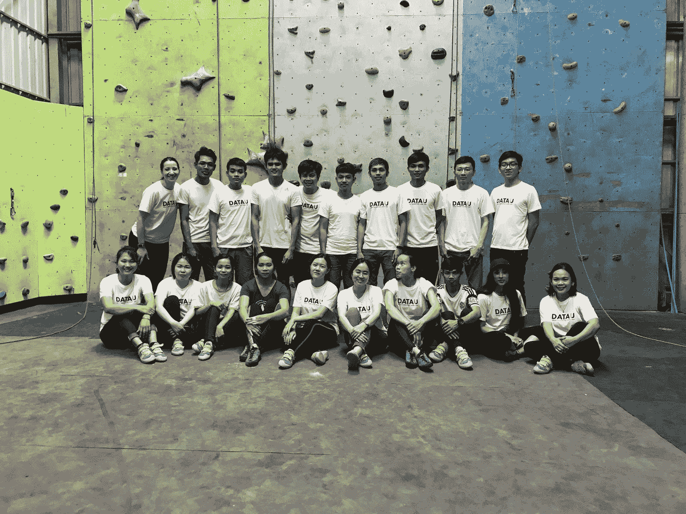

# DataU 学院为柬埔寨青年提供全球数据革命所需的技能

> 原文：<https://web.archive.org/web/20221129040116/https://www.datacamp.com/blog/datau-academy-equips-cambodian-youth-with-in-demand-skills-for-the-global-data-revolution>

## 请介绍一下 DataU Academy 以及您与 DataCamp 的合作关系。

[DataU Academy](https://web.archive.org/web/20220529052311/https://mydatau.org/) 成立于 2019 年，是柬埔寨首家致力于数据科学、数据 IT 和数字营销的技能培训学院。我们项目的独特之处在于，超过 30%的课程致力于软技能培训，以确保我们的学员完全具备工作能力。我们位于金边，与柬埔寨电信、银行、金融科技、消费品、制造等行业的领先组织合作，通过招聘、培训和部署高技能毕业生来释放数据的力量。DataCamp 在通过按需学习提供硬数据科学技能和在线内容方面发挥着关键作用。

DataCamp 的课程将视频与动手编码实践相结合，以优化学生的学习和信息记忆。由于该平台的灵活性和数字弹性，我们的学生能够很好地适应并提高工作效率，即使在新冠肺炎封锁期间也是如此。我们能够轻松跟踪学生的进步和表现，他们更喜欢 DataCamp 的边做边学方法，而不是视频讲座。

因此，在四到六个月内，我们的毕业生能够从零到很少的数据背景成为具有热门技能的专业人士。通过 DataCamp，柬埔寨青年有机会发展世界级的数据技能，建立梦想职业，提高生活水平，并参与全球数据革命。

> 我们很高兴能够从全球教师社区中学习，这非常符合我们的愿景。Sokhna Vor

## 你希望解决的最大挑战和需求是什么？

1970 年代末柬埔寨的种族灭绝给我国留下了创伤。今天，我们的青年正在努力克服我们悲惨的历史，积极学习急需的技能，并积极努力改造和发展我们的国家。他们努力工作，渴望学习，适应力强。柬埔寨青年占我国目前人口的三分之二，我们国家的未来取决于他们。

与西方世界相比，柬埔寨的潜力很大，培训成本也相对低廉，因此我们预计重点将从低技能劳动力转移到创新、高收入和基于技能的职业。由于柬埔寨的经济以制造业为主导，自动化和工业流程的发展无疑会使许多角色过时。这些变化产生的大量数据将创造巨大的机会和许多新的角色，对此，数据科学和分析技能将至关重要。

正是基于这种远见，我们建立了 DataU——我们致力于国家的发展。一年多来，我们不知疲倦地与公共和私营部门合作，为工业 4.0 做准备，以将柬埔寨建成数据科学的区域卓越中心。10 年后，我们希望柬埔寨不仅能与吴哥窟联系在一起，还能与全世界的数据科学联系在一起。柬埔寨可以成为数字和数据技能的工厂，为世界提供人才。

为了实现这一愿景，我们正在建立一个世界级的培训项目，以帮助柬埔寨青年结合技术和软技能。传统的面对面教学过分强调讲课，增加了运营开销，并且不能以我们想要的速度扩展。

## 你喜欢 DataCamp 的什么？

DataU 的教学结合了现场学习和 DataCamp 上的在线学习。传统的面对面教学提供有限的课程内容，并且教师的标准各不相同。此外，与快速变化的行业需求相比，它可能会很慢—我们希望我们的解决方案更广泛、更具可扩展性。我们发现，MOOCs 有很好的理论课程内容，但都是在筒仓中教授的，我们的需求需要更全面的计划，如数据营的[评估](https://web.archive.org/web/20220529052311/http://datacamp.com/signal)和[实践](https://web.archive.org/web/20220529052311/http://datacamp.com/practice)练习。

我们评估了许多基于文本和视频的学习平台，有些有，有些没有平台内编码，有些没有实际练习和项目。我们的目标是通过概念和实践机制的平衡组合，提供最大化学生知识记忆的内容。与此同时，我们想要一些足够灵活和强大的东西来结合在线和离线的讲师指导教学和辅导。

我们的高度职业化、行业聚焦和市场化的技能培训项目也需要平台内编码练习和实践以及项目和技能评估。在 DataU，我们与行业合作伙伴和客户密切合作，以确保我们的毕业生拥有在工作场所迅速脱颖而出的技能和心态。

到目前为止，我们发现 DataCamp 是一个高效、直观、实用的学习平台，提供了灵活、互动的学习体验。DataCamp 拥有大量受过国际培训的教师，他们提供高质量的内容。我们很高兴能够从全球教师社区中学习，这非常符合我们的愿景。DataCamp 支持我们的综合培训计划，并帮助我们培养具有各种技能的成熟数据科学家。

> DataCamp 支持我们的综合培训计划，并帮助我们培养具有各种技能的成熟数据科学家。Sokhna Vor

## 自从实施 DataCamp 以来，你看到了什么结果？

我们的 alpha 团队在六个月的时间里使用了 DataCamp 平台，最近已经毕业并过渡到全职岗位。我们调整了我们从第一批学生中学到的知识，推出了第二批学生。我们所有的学生都在利用 DataCamp 世界一流的内容、评估和平台内编码练习。我们的内部数据科学家、讲师、项目总监和管理层监督学生在平台中的进度，并管理他们的学习路径。

我们的学员来自不同的背景——从计算机科学到英语再到会计——并且拥有不同的行业经验。超过 65%的学员来自省级地区，约 45%为女性。此外，超过 90%的人通过了我们自己的标准化测验和考试，并展示了在实验项目环境中应用技能的能力。

有了 DataCamp，我们能够最大限度地提高学生的学习效果，培养出具有高需求技能的毕业生来振兴柬埔寨的经济。我们的目标是成为数据人才的世界中心，并加强全球技术社区。

## 你会对考虑与 DataCamp 合作的其他人说些什么？

采用 DataCamp 的便利性和灵活性是帮助我们的学员获得数据技能的关键。虽然英语对一些柬埔寨年轻人来说仍然是一个挑战，但他们能够通过观看、重新观看和在 DataCamp 平台上练习编码来吸收和保留知识。DataCamp 还为他们提供了交互式用户体验，让他们可以轻松浏览课程材料。

我们使用混合学习，通过模拟工作场所的现场学习环境来补充在线学习。我们观察到，我们的学员经常选择在家里使用 [DataCamp Mobile](https://web.archive.org/web/20220529052311/http://datacamp.com/mobile) 来提前了解概念，并利用自己的时间复习内容。这提供了极大的灵活性，对学生的成绩有积极的影响。

此外，DataCamp 提供了广泛的课程——从高级基础知识到技术数据工程和机器学习概念。他们的内容很深入，关于 Python 和 R 的课程也在不断更新。

如果您所在的组织希望提高员工的技能和技能，以提高组织数据的流畅性，我们绝对可以推荐 DataCamp。

了解更多关于[达图学院](https://web.archive.org/web/20220529052311/https://mydatau.org/)的信息，并在 LinkedIn 上联系索克娜[。索克纳也是](https://web.archive.org/web/20220529052311/https://www.linkedin.com/in/sokhnavor/)[湄公河大数据](https://web.archive.org/web/20220529052311/https://mekongbigdata.com/)的联合创始人。

点击了解更多关于 DataCamp 合作关系的信息[。要成为合作伙伴，请联系](https://web.archive.org/web/20220529052311/https://www.datacamp.com/community/blog/free-datacamp-subscriptions) [【邮箱保护】](/web/20220529052311/https://www.datacamp.com/cdn-cgi/l/email-protection#84e3edf2e1e5f3e5fdc4e0e5f0e5e7e5e9f4aae7ebe9) 。