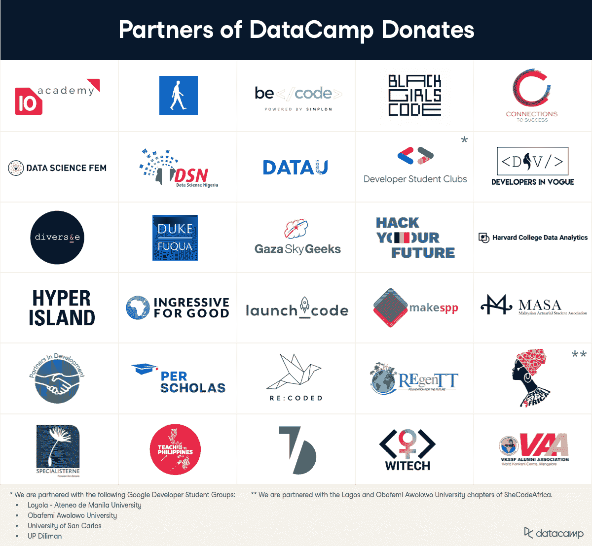

# 向世界各地的组织捐赠 25，000 份 DataCamp 订阅

> 原文：<https://web.archive.org/web/20221129033105/https://www.datacamp.com/blog/donating-25000-datacamp-subscriptions-to-organizations-around-the-world>

在去年夏天全球经济衰退和创纪录的失业率中，我们看到了帮助经历前所未有的困难的人们的机会。我们决定以最直接的方式提供帮助——向非营利组织捐赠数据营订阅，为社区提供免费教育、职业培训和劳动力发展。五个月后，我们与除南极洲以外的各大洲 24 个国家的 35 个非营利组织合作，超额完成了捐赠 10，000 个许可证的最初目标。成功的故事层出不穷:

> DataCamp 让更多女性进入科技领域，了解数据科学，练习英语。有了这些知识，我们中的许多人已经在科技公司找到了工作。—Sharon Camacho，数据科学 FEM 的管理工程师

“对于 DataCamp 的员工来说，设立这项奖学金是最有成就感的举措之一，”DataCamp 的人才和认证负责人韦斯顿·斯特恩斯(Weston Stearns)说。“我们的使命是使数据科学民主化，并为大众带来流畅的数据。通过让学习者免费获得推进职业发展所需的技能，我们离完成这一使命越来越近了。”

我们计划的范围必须随着对数据流畅性日益增长的热情和需求而发展。这就是为什么我们正式宣布三项令人兴奋的进展:我们已经正式将该计划命名为 [DataCamp Donates](https://web.archive.org/web/20221212135912/https://www.datacamp.com/donates) ，我们已经将我们的承诺增加到 25，000 个订阅，我们正在将该计划扩展到非营利科研机构、公立中学和社会福利机构。

## 赠送项目现在被称为“数据营捐赠”

“DataCamp 捐赠”清楚地描述了我们正在做的事情——向非营利组织捐赠数千份一年期高级订阅(每份通常价值 399 美元),以及通常为我们的企业客户保留的功能，包括 24/7 客户支持。除此之外，我们长期运行的课堂数据营项目仅在 2020 年就为超过 170，000 名学生和教授提供了六个月的免费订阅。

## 我们已经将我们的承诺增加到 25，000 份

我们正在匹配额外 15，000 名 DataCamp 学习者的购买，这些人与您一样，希望提高数据技能，同时也帮助其他人领先一步。这使得我们的承诺订阅总数达到 25，000。我们有信心在 2021 年 7 月 [DataCamp 捐赠](https://web.archive.org/web/20221212135912/https://www.datacamp.com/donates)一周年之前实现这一目标，如果不是更早的话！我们将通过加强现有的伙伴关系并在世界其他地区建立新的伙伴关系来实现这一目标。哪里需要免费的数据科学、分析和数据工程教育，哪里就是我们想要的地方。

## DataCamp 捐赠现在对更多类型的合格组织开放

由于每个人都会从数据流畅中受益，我们正在扩大 DataCamp 捐赠的合格合作伙伴的范围。DataCamp 现在将向注册的科研非营利组织捐赠订阅，因为研究科学家正在解决我们这个时代的重大问题，如气候变化和新冠肺炎。

我们还寻求与政府社会福利机构合作，以支持大量失业公民。我们希望为这些社区提供最好的知识和工具来收集、可视化和分析他们的数据，以造福当地社区和整个世界。

我们长期以来一直支持大学教育，在课堂上免费使用 DataCamp。现在，我们正在扩大公立中学的数据营捐赠渠道。任何 16-18 岁的学校管理者、教师和他们的学生都有资格获得免费的高级访问。请继续阅读，了解如何申请。

## 成为 DataCamp 捐赠合作伙伴

如果您是非营利组织或公立学校的管理人员或教师，或者政府社会福利组织的官员，请遵循以下三个简单的步骤成为 DataCamp 捐赠合作伙伴。

*   首先，向 [【电子邮件保护】](/web/20221212135912/https://www.datacamp.com/cdn-cgi/l/email-protection#dfbbb0b1beabba9fbbbeabbebcbeb2aff1bcb0b2) 发送一封电子邮件，详细说明贵组织的目标以及您打算如何使用捐赠的订阅。我们的团队会阅读每一封电子邮件，并回复将帮助我们产生重大影响的组织。
*   接下来，将邀请合格的组织填写一份正式的申请表。
*   如果选中，最后一步是在 Zoom 上召开会议，最终确定合作条款。然后，我们在一周内将许可证捐赠给我们的新合作伙伴组织。

## DataCamp 的合作伙伴捐赠

没有您，我们的学习者和合作伙伴，DataCamp 的捐赠就不会成功。感谢您向我们发送您的见解和鼓励，并在您的社交网络上宣传我们的计划。如果没有个人和组织直接联系我们，我们不可能捐赠这么多的订阅。敬请关注本博客，了解更多关注合作伙伴的帖子，如[尼日利亚数据科学公司](https://web.archive.org/web/20221212135912/https://www.datacamp.com/community/blog/data-science-nigeria)和[数据科学公司](https://web.archive.org/web/20221212135912/https://www.datacamp.com/community/blog/datau)以及像本文这样鼓舞人心的成功故事[。](https://web.archive.org/web/20221212135912/https://www.datacamp.com/community/blog/felix-ayoola)

您也可以通过社交媒体 ***@DataCamp*** 联系我们，并使用标签 ***#DataCampDonates*** 来帮助我们传播消息并找到更多合作伙伴。

[查看我们的完整合作伙伴列表](https://web.archive.org/web/20221212135912/https://support.datacamp.com/hc/en-us/articles/360051596574)，包括他们的网站、按国家划分的 DataCamp 捐赠范围以及关于该计划具体条款的常见问题解答。非常感谢我们所有的合作伙伴帮助我们实现数据科学教育民主化的目标。

