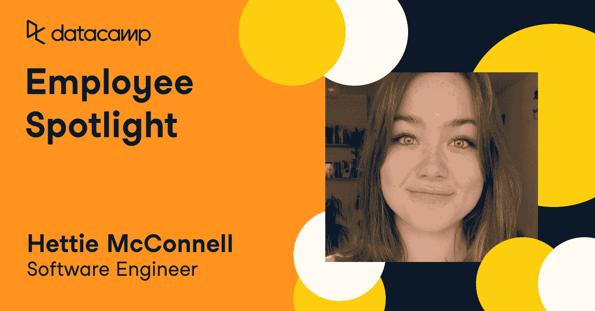

# 员工聚焦:Hettie McConnell，软件工程师

> 原文：<https://web.archive.org/web/20221129044300/https://www.datacamp.com/blog/employee-spotlight-hettie-mcconnel-software-engineer>

### 你是如何成为一名软件工程师的？

由于我在大学里学的是经济学，所以我接触工程的时间比一些人晚一些。我真的很享受我在大学的时光，毕业后我很快就进入了就业市场，但我发现我一直在做错误的工作。这份工作对我来说不够有挑战性，所以我和我姐姐聊了聊，作为一家金融科技公司的软件工程师团队的负责人，我非常尊敬她。她把我介绍给了她团队中与我背景相似的人，他们给我指出了我可以自己尝试的在线资源。接下来的几个月里，我真的钻研了这些资源，然后决定这可能真的是我的职业。没过多久我就确定了——我辞掉了工作，申请了伦敦市中心一个为期 16 周的编码训练营。不幸的是，由于疫情，我们的团队不得不主要在网上工作，所以我们在某些方面错过了，但在这个忙碌的时间里有一个真正的目标是很好的。新兵训练营结束后，我开始在一家人工智能网络安全公司工作，一年后加入了 DataCamp。

### 你觉得学习成为一名软件工程师所必需的技能很难吗？

是也不是。我从小就有数学天赋。我妈妈是一名数学老师，她的热情被传递了下去。工程学和数学有很多相似之处。解决工程问题的逻辑步骤和过程与解决数学问题的逻辑步骤和过程非常相似。同样，如果你的答案不正确，你可以请人来检查你的工作。他们会准确地告诉你哪里出了问题，如何解决。这种逻辑思维吸引我走向工程，并让我留在这里。我也发现学习这些技能的过程很愉快，这真的很有帮助。软件工程可能很难，它并不总是容易的，但能够破解一个困难的工程案例只是让它对我来说更加有趣和令人满意。

### 你为什么决定加入数据营？

当我在以前的公司工作时，我想拓展一下业务。我主要是一名 JavaScript 开发人员，但也想涉足 Python。我喜欢软件工程的一点是完全没有进入壁垒。对于任何编程语言来说，网上都有大量真正高质量的资源，更不用说周末和晚上聚会的实体社区了。时间不多了(在疫情中还有 *和* )我选择寻找一个在线平台，在那里我可以[轻松地学习 Python](https://web.archive.org/web/20221212135820/https://www.datacamp.com/learn/python) 并从容不迫地使用它，于是我遇到了 DataCamp。我尝试了入门课程，很快就被吸引住了。当我在寻找订阅的时候，我注意到在网站的角落里有一个框，上面写着，“我们正在招聘。”我找到了一个适合我技能的角色，所以我申请了，结果证明这是一个很好的匹配。我们生产的软件的质量是驱使我申请这里的原因，我很高兴我这样做了。

### 你的超能力是什么？

当谈到解决问题时，我真的只有一个想法。包罗万象。当工作变得更困难时，我会更有动力。我喜欢用我大脑的逻辑部分工作。这让我在工作中自我激励，不需要太多的外部输入。我的毅力和组织能力使我在工作中表现出色。

### 你最喜欢的数据营记忆或时刻是什么？

我还是个新人，大多数人，包括我自己，都主要在家工作，所以我没有太多机会留下特别的回忆。但我确实记得我对公司的介绍。我喜欢 DataCamp 的一个原因是它在各个层面上的开放政策。其中一部分是两周一次的全公司会议，会上每个人都被告知公司的重要事务。这也是一个介绍新员工和向离职员工告别的好机会。我被要求介绍自己，这是一项相当艰巨的任务，因为有相当多的人从你的屏幕上看着你。除此之外，我还跟踪了两名相当资深的新员工。我们的新任首席税务官做了一个简短但非常鼓舞人心的演讲，介绍了他自己和他之前从事的工作。另一个雇员也照着做了。作为一个只有一年软件工程师经验的人，我有点慌了。有人告诉我，我所需要的只是一个简短的问候！当我告诉妈妈我的新工作时，我脑海中唯一浮现的是她的反应:“数据和露营——你最喜欢的两件事！”—所以我说。我立刻觉得有点傻，但每个人都喜欢它。许多人通过我们的内部消息系统联系我，说这让他们笑了，询问我的情况，并真的试图与我联系。我真的很欣赏这一点，尤其是当你无法直视他人的眼睛时，网上互动会让人感觉很冷。热情的欢迎总是让我对 DataCamp 大家庭产生积极的感觉，我在这里真的感觉很舒服，所以我不得不说这是我迄今为止最喜欢的回忆，但我相信随着人们回到办公室，会有更多的回忆。