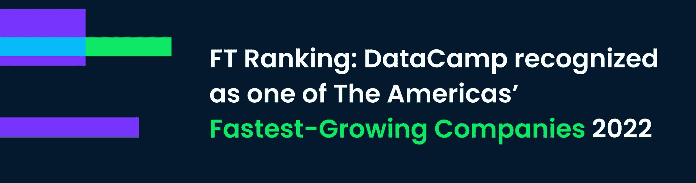

# FT 排名:DataCamp 被公认为 2022 年美洲发展最快的公司之一

> 原文：<https://web.archive.org/web/20230101103007/https://www.datacamp.com/blog/ft-ranking-datacamp-recognized-as-one-of-the-americas-fastest-growing-companies-2022>

DataCamp 连续第二年被评为美洲发展最快的公司之一。《金融时报》(FT)和全球领先的统计门户网站和行业排名提供商 Statista，Inc .将这一荣誉授予 2017 年至 2020 年期间复合年收入增长最高的公司。你可以在英国《金融时报》的网站上找到成长速度足够快的公司的完整名单，这些公司入选了 2022 年美国成长最快的公司[。](https://web.archive.org/web/20221212135820/https://www.ft.com/content/6ee8f978-a2e0-4644-b7c7-0718a334adb7#:~:text=FT%20The%20Americas%E2%80%99%20Fastest%20Growing%20Companies%202022)

DataCamp 的首席执行官兼联合创始人 Jonathan Cornelissen 将 DataCamp 的成功归功于对懂数据的角色的需求增加以及 DataCamp 平台的创新:

DataCamp 已经发展到为超过 1000 万会员和超过 2，500 家公司提供服务，帮助他们利用我们全新的基于云的 IDE Workspace 来弥合学习和工作之间的差距。乔纳森补充道:

## 2022 年会有什么？

我们不会就此止步。除了寻求在这一享有盛誉的排名中连续第三次排名之外，在 2022 年，我们将扩大我们的培训目录，为您带来新的 Power BI 和 Tableau 课程、MLOps，并在 Julia 中添加一项新技术。我们还在制作[Workspace](https://web.archive.org/web/20221212135820/https://www.datacamp.com/workspace)终极笔记本，用于在浏览器中分析数据，并发布我们新的[data camp Jobs](https://web.archive.org/web/20221212135820/https://www.datacamp.com/talent)平台。

无论你是在提升技能、更新技能、找工作，还是想雇佣优秀的数据人才。DataCamp 可以帮助你在 2022 年取得成功。注册参加我们即将举办的 [路线图网络研讨会](https://web.archive.org/web/20221212135820/https://www.datacamp.com/webinars) ，了解我们新的培训、工作空间和 DataCamp 工作平台的运行情况。

## 加入我们不断壮大的团队

DataCamp 的使命是为全球数据专业人士提供支持。如果你对改变全球人民使用数据的方式充满热情，你热爱协作，重视透明度，[加入我们](https://web.archive.org/web/20221212135820/https://www.datacamp.com/careers)！

## 关于 DataCamp

我们是数据科学教育的领导者。我们的互动和自定进度学习、专家讲师和创新的数据解决方案让我们脱颖而出。我们已经帮助 1000 多万学习者和 2500 多个组织提高了数据素养，而我们才刚刚开始。

访问我们的 [求职页面](https://web.archive.org/web/20221212135820/https://www.datacamp.com/careers) ，找出你适合的位置！