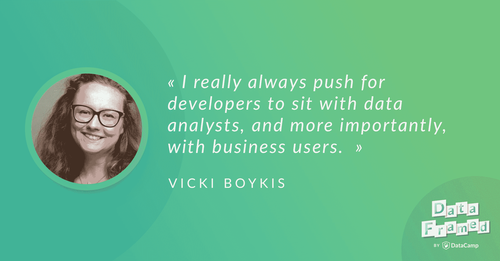

# 全栈数据科学(抄本)

> 原文：<https://web.archive.org/web/20221129045010/https://www.datacamp.com/blog/full-stack-data-science-transcript>

[https://web.archive.org/web/20221010090437if_/https://w.soundcloud.com/player/?url=https%3A//api.soundcloud.com/tracks/506116350%3Fsecret_token%3Ds-pNcuf&color=%23ff5500&auto_play=false&hide_related=false&show_comments=true&show_user=true&show_reposts=false&show_teaser=true](https://web.archive.org/web/20221010090437if_/https://w.soundcloud.com/player/?url=https%3A//api.soundcloud.com/tracks/506116350%3Fsecret_token%3Ds-pNcuf&color=%23ff5500&auto_play=false&hide_related=false&show_comments=true&show_user=true&show_reposts=false&show_teaser=true)

这是播客的链接。

## [介绍 Vicki Boykis](https://web.archive.org/web/20221010090437/https://www.datacamp.com/community/podcast/full-stack-data-science)

雨果:你好，薇琪，欢迎来到 DataFramed。

非常感谢你邀请我。

### 你在数据科学社区以什么闻名？

雨果:非常高兴你能来参加我们的节目。我真的很高兴能谈论你在 Python 教育、全栈数据科学、端到端数据科学方面的工作，这些东西实际上意味着什么，以及你在咨询方面的工作。在我们开始之前，我想了解一下你。我想知道您在数据社区以什么闻名。

可能首先也是最重要的，关于各种数据和编程相关事物的可怕双关语和迷因。次要的是内容。我的策略有点像 BuzzFeed，对吧？用迷因打击他们，然后在它们之间插入严肃的内容。

Vicki:我写了很多关于如何在 Python 中做具体的事情，如何在数据中做具体的事情的博客文章，然后只是谈论我们在数据社区中的一般情况，所以非常高水平的文章，谈论将复杂的概念分解成易于理解的类比的事情。

雨果:太棒了。我喜欢次要的是内容，主要的是糟糕的双关语和迷因。我不想让你为难，但是你说过或想到或听过的最糟糕的双关语是什么？

薇琪:他们都很糟糕。我有一系列双关语，基本上是我假装和一个电视制片人说话，向他们推销可能的节目或电影，所以这是一系列非常糟糕的推文。

雨果:我们肯定会在节目笔记中链接到这一点。这是首要的。次要的是内容。我想我应该提一下，就内容而言，你们也正在创建一个数据营课程。

是的，没错。我正在学习一门讲授 Python 面向对象编程的课程，特别是在数据设置的背景下。我将介绍如何创建对象，如何操作 CSV 文件，以及如何深入研究 NumPy 和 pandas 的内部机制，因此我对此非常兴奋。

雨果:太棒了。你之前也提到过，你现在所做的教育工作本质上是成为你开始时所需要的人。

是的。是的，所以互联网是一个相当大的地方，有很多资源，但如果你刚刚开始学习编程或刚刚进入数据科学，你能做的最好的事情是有一个面对面的导师或在你前面的人，你可以问问题。当我刚开始的时候，我真的没有那样的人，所以我的目标是成为那些刚刚进入这个领域的人的那样的人。

雨果:太棒了。实际上，DataCamp 本身也有类似的起源故事，我们的首席执行官 Jonathan Cornelissen，当他在研究生院时，他一直在寻找类似 DataCamp 的东西，但没有找到。他说，“好吧，等我读完研究生，我要做这个东西，”本质上来说。

是的。

### 你的职业是什么？

雨果:这是我们的几个起源故事之一。话虽如此，你能告诉我们你目前的职业吗？

是的，所以我是一名顾问。我在 CapTech 咨询公司工作。我们做很多不同的事情。我们公司一部分是经营管理咨询，一部分是深度技术咨询实践。现在，我根据项目范围同时从事数据科学和数据工程咨询。

Hugo:这听起来非常像全栈数据科学的想法，对吗？

Vicki:对，所以这个想法是，许多公司一开始没有建立基础设施来进行数据科学，因为数据科学实际上是一种成熟的产品。我们将进入，我们将构建这些管道，然后我们将进入数据科学方面，即创建模型并呈现这些结果。

雨果:太好了，我们稍后会讲到更多。特别是，我真的很有兴趣考虑建立管道的工作，这样做，但同时需要在组织内尽快展示价值。这很了不起...这是我们稍后将讨论的一些事情的一个小引子。

### 你是怎么进入数据科学的？

Hugo:在我们开始之前，数据科学很有趣，因为很多人有不同的途径，在某种意义上，所有的路都通向数据科学。我想知道你的旅程是什么。你最初是如何进入数据和数据科学领域的？

我想我来自一种非传统的，传统的背景。它有点在中间。我开始是一名主修经济学的本科生，我选择这个专业的原因是因为我不想主修英语，也不想主修数学，我喜欢经济学这两者的结合。我喜欢多用我的左右脑。那是我的本科学位。

在那之后，我实际上进入了经济咨询行业，这是非常罕见的，因为我不知道有多少人在大学毕业后专注于他们的专业，所以我想我是幸运的，或者在这种意义上可能是不幸的。那是我开始研究数据的地方。通常当你刚从大学毕业时，你会开始用电子表格做事情，所以我开始用电子表格做事情。后来我听说了一种新的很酷的免费编程语言，叫做 r。我接触了一点。我有几个基于分析的角色。然后我的最后一个角色是数据分析师，在那里我学习了 SQL。

Vicki:然后我厌倦了等待数据进入 SQL 数据库，这是我开始真正专注于学习 Python 和统计方法编程的时候，然后我成为了一名数据科学家作为我的下一个职位。与此同时，我决定我也想获得 MBA 学位，因为我对技术领导感兴趣。就硕士项目而言，我实际上没有统计学或开发背景，但我是通过工作领域接触到它的。

雨果:那真的很有趣。因为在考虑给有抱负的数据科学家的建议时，我和许多人交谈过，最重要的技能之一不是能够建立一个一千层的递归神经网络，而是能够在工作中学习，并在前进的过程中掌握新技能，听起来这是你旅程中不可或缺的一部分。

是的，我认为这一直对我来说很重要，因为在数据科学中有太多东西要学。在咨询行业，这也是主要技能之一，因为你永远不知道你将进入什么样的环境，也不知道客户需要什么。学习和广泛的技能。

雨果:太好了。我只是想知道，以你的经济学背景和 MBA 学位，这些对你作为一名数据科学家的工作有什么影响？你觉得你开发的技能和工具以及经济学和 MBA 的思维方式对你在数据科学领域的工作有用吗？

是的，所以经济学和计量经济学实际上非常接近数据科学，我认为这可能是数据科学的部分来源。例如，有很多假设检验。有很多统计学和计量经济学在进行。有很多像社会科学的方面，你有一个关于特别大规模的系统如何工作的假设，这是现在很多数据科学家做的，对吗？他们测试大规模的社交系统，如社交网络或平台，看看事情会如何表现，所以这是它的一部分。

### 你认为数据科学在哪些方面影响最大？

雨果:我们来谈谈你在咨询行业的工作吧。我假设您在各种不同的行业工作，但是根据您的经验，您认为数据科学对哪些垂直行业的影响最大？

这将是一个真正的咨询式的答案，但它真的取决于，它真的是一个广泛的、广泛的垂直市场。到目前为止，我在咨询生涯中关注的领域是电信、银行和医疗保健。只要正确实施，只要企业相信数据并将其视为优先事项，数据科学就会对所有这些领域产生影响或占有一席之地。

Hugo:在展示数据科学在这些行业中的价值时，你发现了哪些挑战？

维基:很多时候...我们可能稍后会谈到这一点，但很多时候，它甚至在建立管道，以达到您可以进行数据科学的地步，但很多时候，特别是在较大的公司中，我的公司主要与财富 500 强公司打交道，正在达到您可以证明您的假设或您说要做的任何事情，您的行动呼吁，实际上会导致业务变化的地步。

雨果:太好了。你能给出任何具体的例子吗？我指的不是公司的名字或类似的东西，而是电信、银行或医疗保健领域实际数据科学项目的具体例子？

维基:很多项目...因此，我所从事的每个行业都是如此。每个公司都希望能够衡量客户流失或客户离开或加入其平台的原因，尤其是追踪公司不开心的原因。对于较大的公司来说，这可能会产生大量的功能，而不是所有的功能都可以控制。例如，注册流程、计费流程、他们对你的服务或他们的服务的问题、接触他们的外部人员。你可以创建一个潜在导致客户流失的模型，但这不一定反映真实世界。我认为这也可以追溯到计量经济学，因为在计量经济学中，你试图创建一个整个经济的模型，但你真正拥有的是一个表示，因为你无法追踪所有的数据。

雨果:对，很好。这是一个很好的例子，实际上我最近思考了很多，今天早上也谈到了，事实上，特别是客户流失的例子，客户将业务转移到其他地方的可能性，是数据科学和决策科学的交叉点。因为你可以建立一个模型，它可以告诉你或近似世界上正在发生的事情，关于为什么客户在搅动，但它不会告诉你该怎么做，对吗？

Vicki:对，所以在我看来，最终是由数据科学家提出一些选择，清楚地提出他们对公司的看法，然后是公司前进的方式。这就是我们把它交给客户的原因。我们会推荐几个选项，但我们显然不会说，“这是你必须做的。”

雨果:太好了。在客户流失的情况下，我可以想象几种行动方案。第一种是，如果你认为一个客户会流失，联系他们，根据他们对你公司的价值，给他们一些优惠。另一个办法是，在他们打算大动干戈之前，尽量把它扼杀在萌芽状态。这些是你提出的建议类型，还是还有其他的？

是的。通常它是预防性的，或者你可以在他们即将流失时改变它，或者你可以创建预防性措施，以便他们可以在某个地方疏导他们的挫折感，例如，新的支持渠道。

## 数据科学中最常见的模式是什么？

雨果:太好了。在您在所有这些行业的工作中，您在这些行业的数据科学中看到了哪些共同的模式？

其中之一是，我想我们已经听过很多了，但是将数据收集到可以进行数据科学研究的程度总是需要 80%的工作。通常，当我们进入一家公司时，很多工作都是将数据带到我们可以进行数据科学的地方。工具的选择和了解业内其他人在做什么。这种理解最佳实践的需要。我们是否选择了正确的工具？这是业内其他人在做的事情吗？这是我们这个行业的人在做的事情吗？或者是那些对数据科学感兴趣的人，他们认为我们需要有人来帮助我们进行数据科学实践，我们实际上需要数据科学，我们实际上需要帮助来做出这些决定。那些可能是大的。

雨果:有意思。实际上，那里有很多让我想到的东西。首先，我想重点介绍的是它的大量数据准备工作，进入一种您可以使用它进行分析或数据科学工作的形式。你必须做的大量准备工作，你认为在未来 2 年、5 年、10 年内会有所改变吗？这些类型的东西会越来越自动化，有希望产品化吗？

有一部分，但最终我认为这只是数据的特征。因为通常除非你在制造业或其他相关领域工作，你所拥有的是人类生成数据，理解数据，定义它在商业上的意义，而这种数据总是杂乱的。尤其是在大型组织中，您可能有 5 个、10 个甚至 20 个不同的数据流。有时你有两个数据流。它们完全一样，只是有一点点不同。这种和解将一直存在。

Vicki:我确实看到最近越来越多的事情发生，许多组织呼吁更多的数据治理。在大型组织中，更多的元数据管理变得越来越重要。我认为，在过去 4 年左右的时间里，推动因素是将数据放入数据湖。怎么做不重要。它只需要都在一个地方，这样我们就可以用它做一些事情。现在的想法是，我们希望能够在数据湖中管理我们的资产。我们需要能够看到他们，代表他们，并让业务能够像 S3 桶或 Hadoop 集群或类似的东西一样进行清点。

雨果:太好了。你提到的我想讨论的另一件事是，你提到了找出行业最佳实践的趋势，以及其他人正在做的事情。我想讨论的是，在我看来，很多人...许多数据科学工作在许多不同的咨询小组、许多不同的组织中各自为政，许多人似乎在以多种方式平行地重新发明轮子。那也是你见过的吗？

是的，我认为这绝对是真的。我在我的几个项目中看到，真正成功的是组织或客户致力于集中所有这些东西。我在大型组织中看到的是一种叫做卓越中心的东西，在那里你有跨职能团队。你有工程师，你有数据分析师，你有数据科学家，他们都聚在一起谈论他们作为一个团队在做什么。我最近越来越多地看到这种结构。

## 最有效的数据科学团队结构是什么？

Hugo:这是你认为最有效的数据科学团队组织结构吗？

我想是的。如果可行的话，我强烈支持让任何给定的数据科学项目的所有利益相关者都在场。例如，如果你有大约 200 人要影响，可能不会，但我真的总是推动开发人员与数据分析师，更重要的是，与业务用户坐在一起。因为通常开发人员是流程的第一部分，而业务用户一直在下面。这就像一个电话游戏，开发人员构建了一些东西，放入某个仓库，放入仪表板。当它建立起来的时候，业务用户不一定总是想要它，也不能对它采取行动。我总是喜欢让所有的人都在同一个房间里。

Hugo:你对商业用户的数据素养的未来有什么看法？我们是否会越来越多地看到管理层、首席级人员和使用仪表盘的人越来越了解什么是数据以及数据是如何工作的？

我想是的。我对此非常乐观，不仅仅是因为对我来说这是工作保障，因为人们想要越来越多的数据。我确实相信大众媒体，或者至少是科技媒体，已经到了这样一个地步...我在《哈佛商业评论》(Harvard Business Review)或诸如此类的商业文献中也看到了这一点，现在许多高管都明白了数据驱动的必要性。通常在会见客户时，他们会说，“我们希望数据驱动。”我认为接下来的两到三年将会弄清楚这对他们来说意味着什么。

雨果:我想这意味着某种计算素养。我想这也可能意味着一些统计数据。你认为人们需要学习数学、线性代数、逻辑回归等基础知识吗，或者这是不是期望太高了？

不。我认为数据科学家有责任为不同的受众提供信息。如果你是一名数据科学家，并且你正在向其他数据科学家演示，你显然可以谈论细节，你在逻辑回归中的参数或你有什么。如果你和项目经理，尤其是高管交谈，你应该用一种非常不同的方式说话，你应该用一种他们感兴趣的方式说话。高管可能不会对你使用的算法感兴趣，但他们会对你的发现和你认为他们应该采取的行动感兴趣。我坚信应该用人们理解的语言与他们交谈。

## 全栈端到端数据科学解决方案

Hugo:我想稍微转换一下话题，谈谈您构建全栈端到端数据科学解决方案的方法。不过，在我们开始之前，我想知道您是否可以给我们一个电梯间推介或类似的东西，介绍一下全栈端到端数据科学是什么或意味着什么。

Vicki:对我来说，全栈基本上意味着构建一个数据科学产品。你从某种数据流开始，在某种环境下转换数据，然后输出一个模型并显示这个模型。对我来说，这是端到端的数据科学，这更像是一个产品，而不是一个项目，例如，我认为这是对特定模型的迭代。

Hugo:太好了，那么你构建这些解决方案的方法是什么？

我没有标准的方法。真的要看情况。我通常会在第一周左右来到客户的网站进行观察。我知道团队规范是什么，他们使用什么样的工具，他们的痛点在哪里。我变得很烦人，问了很多问题，做了很多文档。然后，我们通常从查看数据流入该团队或组织的位置开始，并查看我们可以留下哪些易于维护、可复制的内容，在这些内容中，您可以了解进入其中的模型，并且可以轻松地可视化输出。这是端到端项目的黄金理想。

雨果:太好了。你能给我举一个你最近参与的，你认为特别有价值的例子吗？

是的，所以我几年前做了一个项目，将预测建模能力构建到软件即服务平台中。这个客户有很多，比如说，很多他们想要预测的关于他们客户的事情。他们有描述的能力，但是他们没有预测的能力。我的工作是获取他们已经从客户那里获得的数据，将这些数据放入一个模型中，所以我使用了一个马尔可夫链模型，这个模型有点类似于为这个特定行业的页面浏览量建模。然后，我将其集成到他们现有的软件平台中。

Vicki:实际上，我的角色是，第一，吸收公司目前在其任务平台中收集的数据，分析这些数据，理解这些数据，因为之前没有进行过数据分析，找出哪种模型最适合用来预测，结果证明这是一个马尔可夫模型，因为，这种产品类似于页面视图，你可以预测这个人或客户的下一步行动。然后将该模型包装成您可以集成到他们的软件即服务平台中的东西。

Hugo:一旦这个模型投入生产，那么谁来负责维护它，并负责检查模型漂移？对于我们的听众来说，模型漂移是一种现象，例如，当你有一个生产化的机器学习模型时，它可能不会工作，例如，它可能不会在三到六个月后给出你期望的结果。那么谁负责这种类型的维护呢？

这取决于项目的类型。通常我们会和我们的公司一起做的是，我们会和客户一起工作一个月左右，然后监控这个模型，但通常我们会让它在客户端很容易改变，因为最终它是他们的。然后，我们必须确保它易于记录和易于更改，这就是为什么首先进来观察它是很重要的，就像我说过的那样，看看他们习惯使用什么工具集，他们使用什么编程语言，团队成员的统计技能集是什么，这样我们就可以将它传递给他们，而不是让它成为一个黑箱。

雨果:太棒了。这实际上是设定期望，以确保公司内部有人甚至有能力进行这种类型的维护。

### 数据科学通才

Hugo:当您阐述构建完整的端到端数据科学解决方案的过程时，我想到的另一件事是，这个过程中有很多步骤。能够作为一个人而不是一个拥有不同专业的团队来做这件事，这看起来就像你...要做到这一点，你需要成为一名数据科学通才。

是的，我想这是真的。总的来说，我讨厌宣扬数据科学独角兽的神话。我当然不是独角兽，但我确实认为有多面手和专家。特别是对于咨询业来说，如果你是一个多面手，如果你想成为一个多面手，这是有意义的，因为你可以做很多不同的事情。

Vicki:最近我在 r 中做了一些原型设计。现在我正在将数据导入 AWS。如我所说，我以前做过马尔可夫链建模。所有这些实际上都是了解客户需求的技能组合，能够找出如何进行研究，并到达您可以提供解决方案的点，而专家可能在特定行业的深度学习等方面非常非常了解。

Hugo:是的，你提到了 R，当然，在你的工作中隐含的是你使用 SQL。为了做你需要做的事情，我敢肯定你需要做一堆命令行的东西，你也用 Python 工作，所以有这种你用来完成工作的一整套工具，对吗？

是的。是的，我会说我的主要工具，当我可以使用它时，是 Python，因为它也有点像语言的瑞士军刀。实际上，我最近在某个地方读到 Python 是几乎所有语言中第二好的语言，我同意这一点。这是我个人最喜欢的语言。如果你想做几乎任何事情，你可以用 Python 来做。特别是对我的位置来说，它真的很好。

就像我说的，我和 R 一起工作过，我和 Scala 一起工作过，我做过很多命令行的事情。最近，我越来越多地参与云平台工作，特别是 AWS，这是一个全新的技能组合，越来越多地参与工程工作，如持续集成，这是放置您的模型并确保您可以继续构建它并将其集成到软件中。

Hugo:实际上，我把 Python 称为瑞士军刀，多年来我一直听到它被称为瑞士军刀。我刚刚脑中闪过一个念头，如果那是一个术语的话，也许我们可以称之为荷兰军刀，因为圭多。

为了荣誉，是的，为了荣誉。

雨果:好的，太好了。我只是想让所有的听众明白，虽然薇姬...我的许多客人都是数据科学家通才。肯定不是每个人都是，也没有必要成为多面手。我们稍后可能会讨论的是，我们实际上正在看到这个学科中出现许多专业化，对吗，Vicki？

是的，我完全同意。我认为两者都有一席之地。我也非常支持数据科学团队，而不是一个人孤军奋战。我总是在团队中工作。通常是懂一点统计学的人，懂一点工程学的人，更面向业务或业务分析师的人，以及完全面向业务的人。你有三四个这样的人。我参加过的最好的团队在这些方面是互补的。

## 关于学习途径的建议

Hugo:对于那些想从事构建完整的端到端数据科学产品和解决方案的人来说，在学习途径方面，你会给他们什么建议？

我会说只学一件你感兴趣的事情。我得到的最好的建议是学好一门语言。学习什么语言并不重要，尽管对于多面手来说 Python 可能更有意义。真正学好一门语言，学习这门语言的内在，这样你就可以把它应用到其他事情上。

因为多面手真正擅长的是理解不同的事物如何应用于其他事物。例如，这是对象在 R 中的工作方式，这是对象在 Python 中的工作方式，这是数据流入 AWS 的方式，这是数据流入 Hadoop 的方式，这是我们在 Tableau 和 D3 中的工作方式。多面手通常能很好地处理模式，并且能够研究不同的事物。

我的建议是，首先，学习一种语言，然后能够从这种语言中进行推断，并尝试构建一个端到端的产品或项目。我有一条关于这个的推特，我可以链接到上面。因为有时候想出项目点子真的很难，也很令人畏惧。我为自己挠痒痒的方式是我建立了一个名为苏联艺术机器人的项目，它在推特上发布社会主义现实主义艺术。为此，我不得不从一个网站上获得这些艺术。我必须把它放在 AWS 中，我必须有一个 AWS Lambda 来创建这个机器人来发推特。这让我很想弄明白所有这些不同的部分是如何组合在一起的。就像我说的，我有一条推特，我可以链接到它，上面有一些不同的项目想法，你也可以...

雨果:我喜欢，我们肯定会在节目笔记中链接到这一点。

雨果:目前文化意识中的一些东西已经出现了一段时间，这是预测分析，机器学习和深度学习的权衡，在多种形式之间，所以一个模型在预测它想要预测的东西方面有多好，并且是可解释的，所以试图找出为什么它会做出预测。我想知道在你和你的客户的工作中，一般来说，这种权衡的方法是什么？

Vicki:我个人的方法是总是创建稍微简单一点的模型，但是总是更容易在幕后看到。原因是什么...如果我是一家公司的全职员工，我可能会有不同的答案，但作为一名顾问，你总是需要能够留下其他人可以看的工作，他们可以拆开，他们可以依赖，很容易记录。尤其是和不太懂技术的人打交道时，能够很好地解释这些事情是很重要的。对我来说，我总是宁可简单一些。

## 云

Hugo:你之前提到的事实是，越来越多的数据科学工作正在转移到云上，我很想听听你对此的看法。作为一个社区，这对我们来说是一个相对较大的挑战，我想知道你们在工作中是如何处理这个问题的。

是的，所以我们最近看到的是，虽然这是过去几年的趋势，但我看到越来越多的项目出现了这种情况，很多客户开始意识到他们不想维护基础设施，他们想把一切都带到云上。当然，当他们这样做时，他们希望考虑这样一个事实，即现在有一些事情需要你去管理。例如，您必须管理云的安全性。

就像最近有很多新闻报道一样，例如，S3 水桶就像是敞开着，所有的数据都泄露了出来，所以处理起来很重要。您需要处理一些云管理，最重要的是，您需要了解所有这些部分如何协同工作，因为这可能比在 scikit 中创建一个模型、腌制它，然后将其放在某个服务器上更难。你必须了解生态系统的所有部分是如何协同工作的，所以这在数据科学中也变得越来越重要。我认为特别是对于云中的数据科学，工具集在这一点上才刚刚出现。例如，我知道有 SageMaker，Google Cloud 有一些东西，还有 Azure 机器学习，但我觉得所有这些都刚刚开始进入自己的领域，但随着人们朝着这个方向发展，它们将成为更重要的组件。

Hugo:另外，我认为这些新兴和快速发展的技术意味着进入的门槛可能会稍微高一些，对吗？

维基:有可能。是啊，在某些方面可能是，但在其他方面就不那么可能了。如果你已经知道如何在云环境中移动，那么进入云的门槛就很低，进入机器学习的门槛也更低，因为已经有一些原型组件可以放在一起。如果你不知道如何在这样的环境中经营，从这个意义上说，进入的门槛会更高。我最近看到的是，许多从事数据科学的人甚至有点向工程道路靠拢。

雨果:对。是的，我想我真的在想那些正在工作的数据科学家或精通机器学习的人试图去云，甚至从文档的角度来看，做什么和怎么做可能都不明显。

维基:对。是的，这些云服务的文档还有很多不足之处。

雨果:我们肯定会看到情况有所改善。

是的。事实上，我知道 AWS，我想微软也在 GitHub 上开源了他们的文档，这是一个积极的方面。

Hugo:没错，实际上我最近邀请了 Paige Bailey 参加播客，她是微软 Azure 的软件开发人员倡导者，她在很多工作中也发挥了重要作用。

### 在你看来，数据科学的未来是什么样的？

Hugo:很好，我们已经谈了很多关于数据科学的前景和你目前的工作。我想知道在你看来，数据科学的未来是什么样的。

我认为我们将会看到大量的标准化，就像缩小行业范围一样。过去五年是关于这个叫做数据科学的新领域的爆炸式增长，起初没有人真正知道它是什么，所以我们开始定义它。现在有很多向数据科学的转变。几乎每个人都知道数据科学家是统计学家。

对你来说，我认为我们现在看到的更多的是专业化。有很多人专门研究深度学习或人工智能。正如我提到的，更多的软件开发活动。尤其是随着越来越多的东西进入云中，数据科学家需要知道如何在这些环境中工作。一如既往，我认为未来属于那些灵活的人，那些能用任何语言编写和阅读优秀代码的人，以及那些能随着环境变化而自学的人。

雨果:太好了。您之前谈到的一些事情是试图了解数据科学中的最佳实践是什么样的。目前还没有...我的意思是人们谈论某些事情，但是没有像前端软件工程那样的最佳实践的固化系统，对吗？

是的，我认为这才刚刚开始。就像我看到脸书和谷歌都发布了关于机器学习的指南和一些值得一看的东西。谷歌的特别好，因为它有你应该看看的东西，脸书刚刚发布了一堆视频。我认为这将开始变得更加稳固。另一方面，你也会听到很多人谈论机器学习和数据科学中的道德规范，我认为从这个角度来定义数据科学的含义可能也会有一些压力。当然，GDPR 法规会让我们定义可以收集的数据。我认为所有这三件事加在一起会让我们对那是什么有更多的了解。

雨果:对，很好。我认为 GDPR 是一个有趣的例子。我们会越来越多地看到这种情况。这在很多方面都是欧盟特有的，如果你有任何数据也可能通过欧盟的话。随着我们看到越来越多的国家采用这些类型的东西，我想知道这是否也会影响我们使用云技术的方式。

我相信在某种程度上会的。我认为云计算中最重要的事情是解决安全性问题...安全和数据流第一。

### 伦理学

雨果:对。你提到了数据科学中的伦理。我想知道你认为道德领域最大的问题是什么。

我个人认为现在最大的问题可能是数据泄露。有很多不同的事情，但我想把重点放在实际问题上，即许多人没有保护他们的数据。这里的问题是潜在的收集太多，然后没有足够仔细地监控它。

## 最受欢迎的数据科学技术

雨果:好吧。是的，我同意。我们已经谈了很多关于数据科学和数据科学流程的不同方面。我特别想知道你最喜欢做的数据科学方面的事情是什么，我指的是技术还是方法？

是的，所以我最喜欢做的是决策树，因为我从中获得了最多的回报。我如此喜欢它们的原因是因为它们非常容易与不一定是数据科学家的人讨论。它们很容易被形象化，给你一个清晰的行动路线。如果我能利用他们，我会的。

Hugo:这再次说明了我们之前讨论过的可解释性，你可以展示某人沿着树往下走，以及在每个分支点做出了什么决定，但也说明了可解释性的容易程度，或者只是能够向其他人解释一些事情。

是的，而且在多个平台之间移植也很容易。

雨果:在什么意义上？

Vicki:实现细节，这样你就可以在 scikit-learn 中本地创建一个决策树。你可以在 r 中创建一个，你可以在几乎任何平台上创建一个，所以我喜欢这样。

雨果:太好了。当然在 scikit-learn 你可以...很好，它与 Graphviz 兼容，所以你可以立即看到它。

是的。

Hugo:那么数据工程呢？真正得到的是...你喜欢在那里做吗？

我真的很喜欢 AWS Lambdas，它基本上是...把它们想象成短暂存在的虚拟环境。他们旋转起来，做些事情，然后就走了。它们有很大的应用潜力，我真的很有兴趣对它们进行更多的探索。我在过去的两个项目中使用过它们，我看到它们只会越来越多。

雨果:有什么收获？你认为 AWS Lambda 环境的最大优势是什么？

Vicki:它们有点像快速完成任务的功能。他们可以移动数据。他们可以发微博。我在我的机器人中使用 Lambda 函数每隔一定时间发一次微博。它们很容易维护。一旦你设置好并让它们运行，它们就会一直运行下去。

## 行动呼吁

雨果:太棒了。好的，那么我的最后一个问题是，你对我们的听众有最后的行动呼吁吗？

是的，所以我在推特上。我是 [@vboykis](https://web.archive.org/web/20221010090437/https://twitter.com/vboykis) 。你可以在那里找到我的网站，我的技术博客。如果你对我的公司 CapTech 有更多的兴趣，你可以去 captechconsulting.com。我们一直在招人，也一直在接纳新客户。

雨果:太棒了。我想我还有一个跟进问题。就招聘流程而言，这是我经常遇到的一个问题，你对进入面试流程的人有什么建议或通用的经验法则吗，我指的是和你一起或在其他地方？

首先，做好充分准备，了解你面试的公司。特别是在咨询业，这有一点不同，因为我们在寻找技术好的人，但我们也在寻找对做很多不同的事情感兴趣、擅长做很多不同的事情、能够自学和做很多研究的人。

第二件事是对你谈论的内容充满热情。说说你对什么有热情。如果你在工作之外做过项目，告诉我你做过什么类型的项目。尽可能多地告诉我你的工作项目。

基本上，当我去面试某人时，我希望有...我不是想骗你。我想和你谈谈，看看我是否能和你一起工作，就这样。

Hugo: Vicki，很高兴你能来参加我们的节目。

维基:谢谢你邀请我。