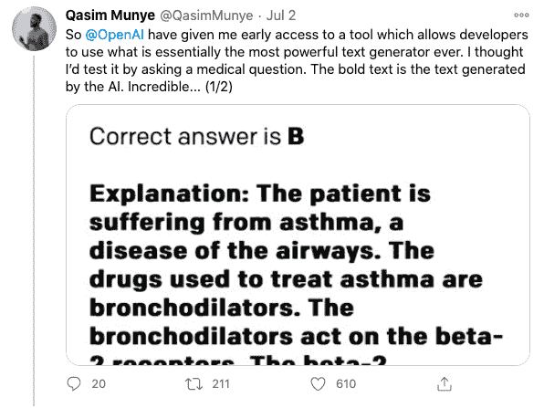
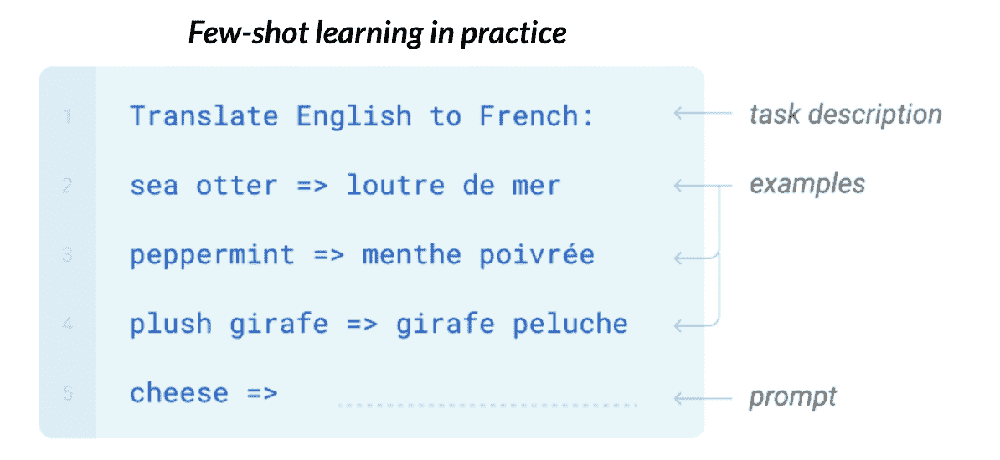
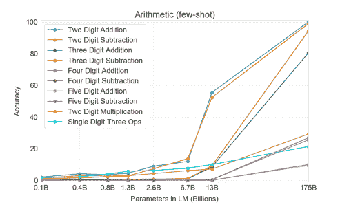
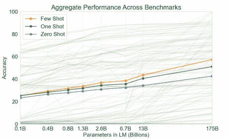
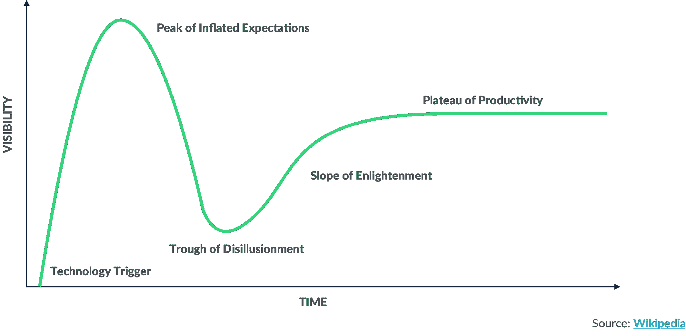
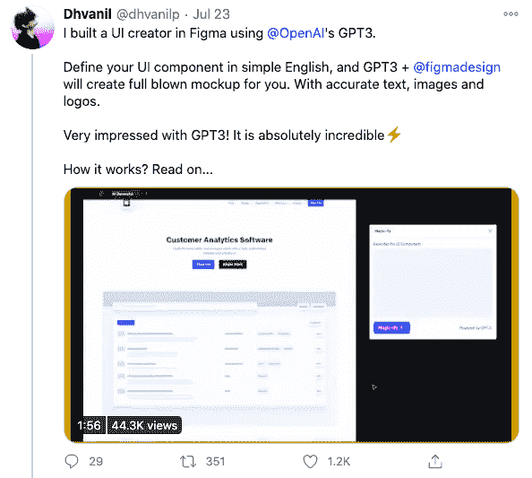
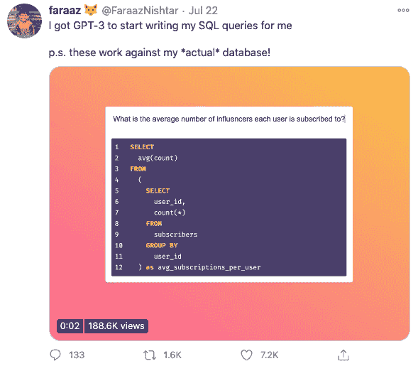
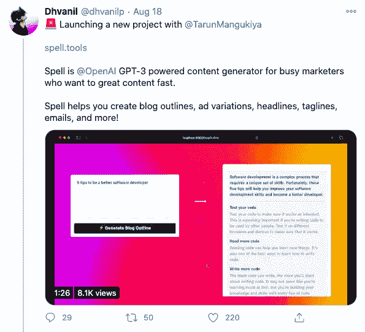
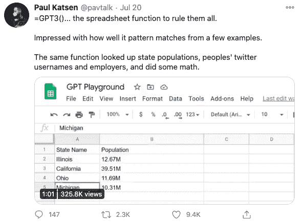
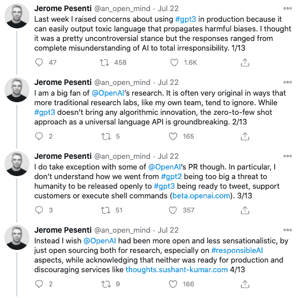

# GPT-3 和下一代人工智能服务

> 原文：<https://web.archive.org/web/20221129034451/https://www.datacamp.com/blog/gpt-3-and-the-next-generation-of-ai-powered-services>

在过去的几个月里，随着 OpenAI 最新语言模型 GPT-3 的到来，数据科学和人工智能世界一直在热烈讨论。对许多人来说，该模型代表了一种算法在各种任务中用人类语言进行推理的能力的重大飞跃。

测试 GPT-3 的开发者提供了许多有趣的用例。基于简单英语提示的自动代码生成、回答医疗问题和法律语言翻译的例子点燃了许多数据科学家对下一代人工智能软件的想象。

虽然机器学习在组织层面的大部分价值都在低悬的果实中，如预测客户流失、简单的销售预测和客户细分——但考虑一下 GPT-3 的[商业化对未来意味着什么是有用的。它有可能改变我们对人工智能的思考和操作方式。](https://web.archive.org/web/20220528210537/https://openai.com/blog/openai-api/)

## 定义人工智能、机器学习和深度学习

商业世界和媒体充斥着人工智能(AI)、机器学习(ML)和深度学习(DL)等热门术语。在深入研究 GPT-3 如何工作之前，让我们快速定义这些术语。

谷歌大脑(Google Brain)的联合创始人、前百度首席科学家吴恩达将人工智能描述为“让计算机智能运行的庞大工具集”这包括明确编程的软件，如计算器，以及 ML 应用程序，如推荐系统和无人驾驶汽车。

人工智能和计算机游戏领域的先驱亚瑟·塞缪尔(Arthur Samuel)表示，机器学习是“无需明确编程就能让计算机具备学习能力的研究领域”。通常有两种类型的机器学习算法。第一种是监督学习，算法学习现有数据(输入)和标签(输出)之间的模式，并根据看不见的数据预测输出，如新客户是否会根据历史流失数据流失。第二种是无监督学习，算法发现数据中的一般模式，并将彼此相似的不同数据点聚集在一起，如根据共同的行为模式对客户进行细分。

深度学习是一种基于多层人工神经网络的机器学习形式，其灵感来自大脑中的生物神经网络。它们可以是有监督的和无监督的，并且在很大程度上是过去十年中备受瞩目的 ML 用例的原因，如图像识别和情感分析。深度学习模型在架构上各不相同，根据神经网络架构中的层数和节点数，从简单到复杂。模型越复杂，参数就越多。如果你想了解更多关于深度学习模型是如何建立的，请查看 DataCamp 的[深度学习技能跟踪](https://web.archive.org/web/20220528210537/https://www.datacamp.com/tracks/deep-learning-in-python)。

要更深入地探索这些话题，请阅读我们的电子书[商业领袖机器学习权威指南](https://web.archive.org/web/20220528210537/https://www.datacamp.com/resources/ebooks/definitive-guide-to-machine-learning-for-business-leaders)。

## GPT 3 号是如何工作的

那么 GPT-3 与人工智能、机器学习和深度学习在哪里相交呢？首字母缩写词 GPT 指的是“生成性预训练转换器”(generative pre-trained transformer)——一种无监督的深度学习算法，通常在大量未标记的文本上进行预训练。它在一个大型特定任务的标记数据集上进行微调和训练(例如，英语到法语的翻译)，然后负责在给定一组特定输入(英语单词)的情况下推断最可能的输出集(法语翻译)。对于各种不同的语言任务，您可以将这看作是一种高度复杂的自动完成形式。

GPT-3 是这一模型的第三次迭代，尽管它没有对其前辈的架构进行创新，但它在包含互联网大部分内容的超大型数据集上进行了预训练，包括[公共爬行](https://web.archive.org/web/20220528210537/https://commoncrawl.org/the-data/)数据集，并在其网络架构中包括更多层。这使得 GPT-3 成为有史以来最复杂的语言模型，其网络架构中有 1750 亿个参数。这比 GPT-3 发布前最复杂的模型，微软的[图灵-NLG 多十倍的参数，比 GPT-2 复杂 117 倍。](https://web.archive.org/web/20220528210537/https://www.microsoft.com/en-us/research/blog/turing-nlg-a-17-billion-parameter-language-model-by-microsoft/)

最重要的是，GPT-3 受益于少量学习，预先训练的模型不必针对特定的语言任务用大量标记的训练数据进行微调。相反，它只是给出了一个任务描述——将英语单词翻译成法语——以及几个输入映射到输出的例子。再加上易于使用的即插即用界面，GPT-3 在很大程度上消除了进入障碍，并允许非专家在不同的语言任务中产生有意义的结果。

## 为什么 GPT-3 如此重要

仅仅通过几个例子和任务描述，GPT-3 就可以与经过微调的语言模型相媲美，这些语言模型已经针对各种语言任务的特定任务训练数据进行了训练。GPT-3 在需要推理的任务上也表现出某种形式的成功，比如算术，这不一定是语言任务。例如，GPT 3 号在被喂了一些加减法的例子后，对两位数的加减法表现出了 100%的准确率。具有较少参数的较不复杂的模型还不能在这些任务上突破 60%的精确度上限。虽然 GPT-3 在更复杂的算术形式上表现不佳，但这意味着更复杂的模型可能有能力在它们接受训练的领域之外进行概括。

有趣的是，这表明纯粹通过增加数据集和模型的大小可以获得更多的收益。目前，该模型跨不同任务的总体性能似乎没有在 175B 参数处停滞不前。假设从 GPT-2 到 GPT-3 的参数缩放比例有相同的增加，人们只能想知道如果 GPT-4 的参数比 GPT-3 多 117 倍，模型性能将如何缩放。

虽然它目前正在私人测试版中进行校准，但将 GPT-3 包装在即插即用的 API 中意味着它一旦离开私人测试版就可以大规模使用。正如人工智能研究人员 Shreya Shankar 指出的，一个重要的挑战将是有效和方便地为组织提供这个 API。

## 这对未来意味着什么

新技术通常遵循 Gartner 的炒作周期——事实上，OpenAI 首席执行官 Sam Altman 已经[敲响了关于 GPT-3](https://web.archive.org/web/20220528210537/https://twitter.com/sama/status/1284922296348454913) 的炒作警钟。

然而，来自 GPT-3 开发者的用例揭示了我们中长期可以期待的人工智能应用类型。潜在的应用包括帮助设计者轻松制作原型、简化数据分析、实现更强大的研究、为内容营销人员自动生成内容等工具。

此外，将模型打包在一个简单的即插即用界面中可能会改变人工智能在整个组织中的工具化动态。例如，这可能会抑制组织开发自己的内部模型，并允许较少的技术专家使用 GPT-3 构建解决方案。

最后，当考虑大规模部署人工智能系统时，你必须意识到通过偏见传播伤害的能力。正如许多研究人员在测试 GPT-3 时指出的那样，基于中性输入，产生强化刻板印象和偏见的有害输出相对容易。

像任何正在大规模部署的机器学习算法一样，GPT-3 需要对潜在的危害进行认真的审查和监控。

