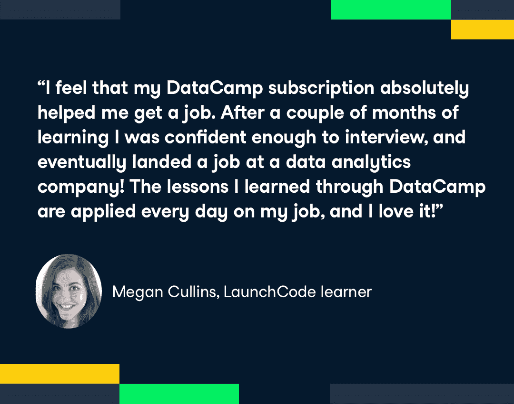

# 非营利组织如何利用数据营让学习者快速就业

> 原文：<https://web.archive.org/web/20230101103227/https://www.datacamp.com/blog/how-a-nonprofit-leveraged-datacamp-to-get-learners-employed-fast>

DataCamp 首批捐赠合作伙伴之一是 LaunchCode，这是一家提供免费技术教育和就业机会的非营利组织，总部位于密苏里州圣路易斯市。DataCamp Donates 是我们向那些在当今严峻的经济形势下需要帮助开始 STEM 职业生涯的人捐赠优质 DataCamp 订阅的计划。八个月后，我们在全球捐赠了超过 21，000 份订阅，我们见证了 DataCamp 如何帮助当地社区的人们实现职业目标。

LaunchCode 的社区参与经理 John Woolbright 表示:“DataCamp 与我们在 LaunchCode 的使命非常契合，即为任何希望学习编程的人提供免费教育，不管你在参加 LaunchCode 课程之前有什么经验。“当我们开始合作时，我们几乎没有人支持想要在堪萨斯城学习数据科学的人。从那以后，我能够让我们的学生从 web 开发过渡到数据科学，以获得更广泛的学习体验。”

## 在 DataCamp 上实现高参与度和高采用率

这种合作关系在他们的许多学习者中一炮而红。“我很高兴能有一个个人和职业发展的新途径，”Forest Roberts 说。

像珍·墨菲这样的其他学习者锁定了特定的课程。“Seaborn 数据可视化简介”用清晰的视频解释概念。实践学习是以这样一种方式建立的，即每个问题都需要我作为一个学习者付出更多。到最后一步，我已经自己提供了几乎所有需要的代码。”

成为 DataCamp 捐赠合作伙伴所带来的兴奋感导致了极高的采用率和参与度。“我们的学生非常喜欢 DataCamp，并发现花在该软件上的时间非常有价值，”John Woolbright 说。数字不会说谎——LaunchCode 的学员平均每人已经完成了四门数据营课程(此外还有 launch code 自己的计算机科学和编程课程)。

## DataCamp 为工作准备培养技能

LaunchCode 社区的一些成员甚至利用从 DataCamp 捐赠合作伙伴关系中获得的技能找到了工作。Megan Cullins 第一次开始学习 LaunchCode 和 DataCamp 时，她已经在一家办公家具公司工作了九年。她完成了 50 门 DataCamp 课程，积累了 322，000 XP 来扩展她的 Python 技能。“经过几个月的学习，我有足够的信心去面试，并最终在一家数据分析公司找到了工作！在这门课之前，我对 Python 一无所知，但由于 DataCamp，我能够诚实地告诉面试官我确实有经验，这帮助我在他们公司找到了一份工作。”

约翰对梅根能够获得一个职位并不感到惊讶。令人印象深刻的是她和其他人做好工作准备的速度。“我们从 9 月份开始为堪萨斯城推出 25 个席位。让学生入职轻而易举。到年底，四名顶尖的 DataCamp 学员获得了数据科学领域的工作，他们之前没有任何经验，只在 DataCamp 学习了三个月。”

Megan 没有忘记在 DataCamp 上学习的时间和工作准备之间的相关性。“我觉得我进入 DataCamp 绝对有助于我找到工作，”她说。“我在 DataCamp 上学到的知识每天都应用在我的工作中，我喜欢它！”

*要了解更多关于数据营捐赠的信息，请阅读我们最近的[博客文章](https://web.archive.org/web/20220529043357/https://www.datacamp.com/community/blog/datacamp-donates-50-partners)宣布向非营利组织捐赠 20，000 个许可证，以及[数据营捐赠常见问题](https://web.archive.org/web/20220529043357/https://support.datacamp.com/hc/en-us/articles/360051596574)。代表组织申请，邮箱 [【邮箱受保护】](/web/20220529043357/https://www.datacamp.com/cdn-cgi/l/email-protection#5d3932333c29381d393c293c3e3c302d733e3230) 。如果你住在大堪萨斯城和圣路易斯地区，想要免费的数据科学教育，或者你想直接支持 LaunchCode 的努力，请访问[www.launchcode.org](https://web.archive.org/web/20220529043357/https://www.launchcode.org/)。*