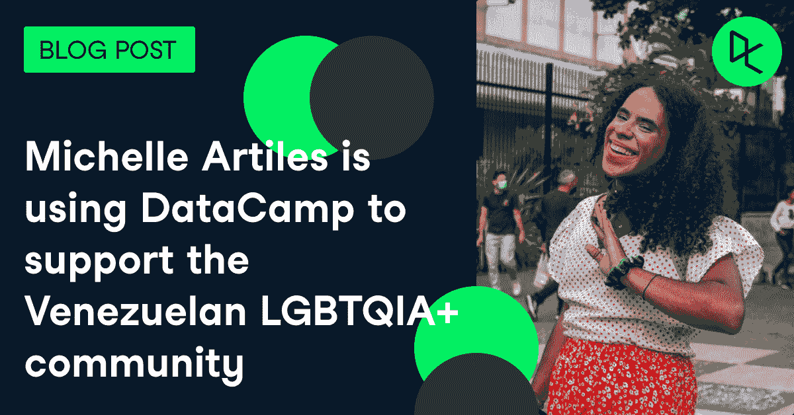
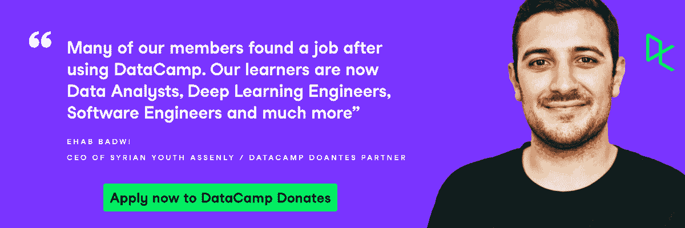

# 一名跨性别活动家如何使用 DataCamp 支持委内瑞拉 LGBTQIA+社区

> 原文：<https://web.archive.org/web/20221129033335/https://www.datacamp.com/blog/how-a-trans-activist-is-using-datacamp-to-support-the-venezuelan-lgbtqia-community>

### 委内瑞拉 LGBTQIA+社区面临的挑战

委内瑞拉正在经历的情况是极其悲惨的，被经济学家称为 20 世纪中期以来在一个没有战争的国家发生的最严重的经济危机。食品危机、不稳定的医疗体系和不断上升的失业率让这个国家的生活变得更加艰难，如果你属于 LGBTIQ 社区，就更是如此。在我国危机的不同后果中，还有因我的性别身份而受到歧视的问题。我不可能在足够的条件下找到一份工作来养活自己。在委内瑞拉，任何我称之为“普通工作”的普通商店或办公室工作对我们 LGBTIQ 社区来说都是不可能的，因为我们受到歧视，甚至不会被视为真正的工人。我们唯一的方法是瞄准更大的国际公司，并拥有我们高度精通的特定技能。这样一来，我们的专业知识就胜过了我们的个人身份，招聘人员别无选择，只能承认我们是求职者。因为这个和我的研究，我需要开始学习数据科学。事实上，我正在攻读新闻与传播硕士学位，必须写一篇研究论文。自从我开始攻读硕士学位以来，我一直在寻找开始数据科学培训的机会，但一直找不到出路。

### 米歇尔使用她的免费数据营捐赠访问教育她的社区

在寻找如何学习数据分析的过程中， [Yakera](https://web.archive.org/web/20220810144016/https://yakera.org/) 通过社交媒体出现。一个众筹平台，负责创建一个新的模式来释放世界各地的国际慷慨，人们可以创建他们的活动，并接收来自世界各地的人们的捐款。他们已经开始与[数据营捐赠](https://web.archive.org/web/20220810144016/https://www.datacamp.com/donates)合作，我申请了这项奖学金。

DataCamp 已经成为我接触许多大学学位没有提供的知识的渠道。对我来说更有影响的是，由于我可以免费访问 DataCamp，我能够让我社区的另外 12 个人(其中一些是无家可归者)掌握 [SQL 技能](https://web.archive.org/web/20220810144016/https://www.datacamp.com/learn/sql?utm_source=adwords_ppc&utm_medium=cpc&utm_campaignid=1565610606&utm_adgroupid=64773273532&utm_device=c&utm_keyword=data%20camp%20sql&utm_matchtype=p&utm_network=g&utm_adpostion=&utm_creative=469789579140&utm_targetid=kwd-825981922266&utm_loc_interest_ms=&utm_loc_physical_ms=9060351&gclid=Cj0KCQjwlK-WBhDjARIsAO2sErRtV_dTO11KhUjbhu33ALQ9b0xFVoO3XP7qQBeD7_QJI-7yNBad2jgaAkpbEALw_wcB)。

### 通过数据科学讲述引人入胜的故事的力量

作为安德烈斯·贝略天主教大学的一名新闻专业学生，我不断被要求讲述引人入胜的故事。数据分析是讲述故事的最佳方式，因为它可以召集任何观众，无论他们的背景和世界观如何，达成共识。在大赦国际的一篇文章中，我谴责了委内瑞拉社会中的变性恐惧症:从法律和制度到委内瑞拉文化的根深蒂固，变性恐惧症使得 LGBTIQ 社区的成员很难过上他们的身份每天都不会被质疑的生活。虽然我们可以只从自己的经历中讲述我们的故事，但数据技能让我能够创造一种基于事实和数字的方式来展示面对压迫时的反抗故事。讲述我的故事是最基本的，但有数据证实我的经历可以吸引观众。因此，我应该在这里说 [92%的 LGBTQIA+社区成员都是委内瑞拉歧视和暴力的受害者，其中 73%的人因为歧视考虑过移民](https://web.archive.org/web/20220810144016/https://tbinternet.ohchr.org/Treaties/CCPR/Shared%20Documents/VEN/INT_CCPR_CSS_VEN_20596_E.pdf)。

在这个比以往任何时候都更需要积极争取平等的时代，全民数据科学教育是人类所需要的。因此，这些倡议必须持续下去，以惠及尽可能多的人。

我感谢 Yakera 的爱、关注和耐心，感谢 DataCamp 给我机会训练自己和他人。你们的支持有助于我的事业:拥抱一个人的性取向和性别表达不会成为获得服务或机会的障碍的委内瑞拉社会。

对于世界各地的所有非营利组织，让您的学习者和员工能够免费使用数据科学技能讲述更有影响力的故事。立即向 DataCamp 申请捐款:[https://www.datacamp.com/donates/apply](https://web.archive.org/web/20220810144016/https://www.datacamp.com/donates/apply)

