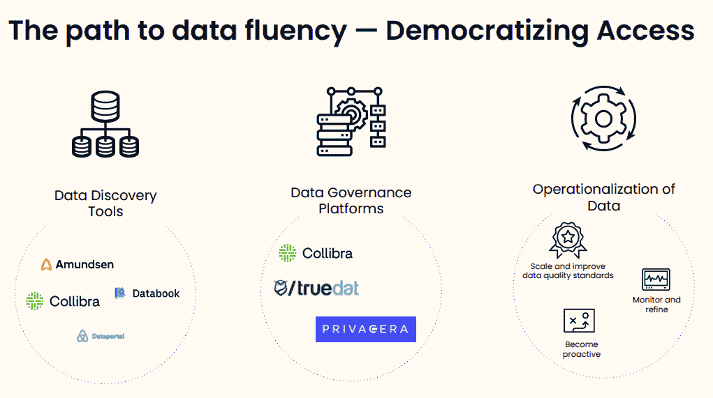

# 数据发现工具如何实现数据民主化

> 原文：<https://web.archive.org/web/20230101103227/https://www.datacamp.com/blog/how-data-discovery-tools-enable-data-democratization>

当今最成功的组织都非常依赖数据来做出决策。许多这些数据流畅的组织每天都会生成数百万行数据，供各种团队使用和分析。让团队具备访问和使用数据的能力的关键挑战之一是确保数据是[收集的、可信的、可靠的、可操作的和可发现的](https://web.archive.org/web/20220701193103/https://www.datacamp.com/resources/webinars/operationalizing-data-within-large-organizations)。

为了驾驭这些复杂的数据环境，许多组织开发并开源了内部技术，称为数据发现工具。

在最近的网络研讨会中，DataCamp 的产品研究副总裁 Ramnath Vaidyanathan 描述了组织如何从数据反应型(没有人拥有处理数据的技能或权限)发展到数据流畅型(每个人都拥有处理数据的权限和技能并做出数据驱动的决策)。组织可以通过对 [IPTOP 框架](https://web.archive.org/web/20220701193103/https://www.datacamp.com/community/blog/iptop)的投资来提高他们的数据成熟度:基础设施、人员、工具、组织和流程。随着组织通过投资数据基础架构来扩展对数据的访问，他们将需要使用数据发现工具来提供轻松的数据发现能力。

> 如果人们无法访问数据，如果他们不了解所收集数据的背景，如果他们找不到他们需要的东西，那么数据就是无用的。这就是数据发现工具非常重要的原因。Ramnath Vaidyanathan，DataCamp 产品研究副总裁

## 数据流畅的公司如何使用数据发现工具

许多数据驱动型公司已经在其数据基础架构中实施了数据发现工具。让我们来看看像[优步数据手册](https://web.archive.org/web/20220701193103/https://eng.uber.com/metadata-insights-databook/)和 [Lyft Amundsen](https://web.archive.org/web/20220701193103/https://www.amundsen.io/) 这样著名的数据发现工具背后的动机和驱动因素。

### 要考虑的数据发现挑战

一个关键的数据发现挑战是生产效率和合规性。 [Lyft 概述了](https://web.archive.org/web/20220701193103/https://eng.lyft.com/amundsen-lyfts-data-discovery-metadata-engine-62d27254fbb9)随着其数据规模呈指数级增长，并且预计至少在未来 10 年内将继续以类似的速度增长，Lyft 将面临这些挑战。在开发 Amundsen 时，他们注意到分析师大约 25%的时间花在数据发现上。他们还发现，他们所服务的国家对合规性的要求越来越严格。

优步表达了类似的担忧,因为它开始超越其作为拼车应用的主要功能，向优步 Eats、优步货运和 Jump Bikes 等服务扩张。在开发 Databook 时，优步每天有超过 1500 万次旅行，不同团队有 18，000 名员工。另一个挑战是它的数据[以许多不同的形式](https://web.archive.org/web/20220701193103/https://eng.uber.com/databook/)存在，包括[蜂巢](https://web.archive.org/web/20220701193103/https://hive.apache.org/)、[普雷斯托](https://web.archive.org/web/20220701193103/https://prestodb.io/)和 [Vertica](https://web.archive.org/web/20220701193103/https://www.vertica.com/) 。分析师需要能够有效地访问和理解各种数据源，以实现数据流畅。

[脸书建立了其 Nemo 数据发现平台](https://web.archive.org/web/20220701193103/https://engineering.fb.com/2020/10/09/data-infrastructure/nemo/)，以满足随着不同角色和地理位置的数据量和复杂性的增加，对高质量、值得信赖的数据的需求。由于与他们分析的数据相关的隐私问题，脸书还面临着重大的法规遵从性问题，在向特定分析师提供表格时必须解决这些问题。

来自 Airbnb 的约翰·博德利在 2017 年会议的一次演讲中说[“随着 Airbnb 的发展，围绕数据的数量、复杂性和模糊性的挑战也在增加。”这意味着员工经常发现数据是“孤立的、不可访问的和缺乏上下文的”因此，员工会制作重复的表格，如果不信任数据，就不会使用。Airbnb 开发了](https://web.archive.org/web/20220701193103/https://www.youtube.com/watch?v=gayXC2FDSiA)[数据门户](https://web.archive.org/web/20220701193103/https://medium.com/airbnb-engineering/democratizing-data-at-airbnb-852d76c51770)，通过消除生产性数据分析的这些障碍，帮助显著提高数据发现过程的效率。

这些挑战普遍存在，不受行业限制，适用于任何希望扩大数据驱动型决策的组织。随着组织希望实现数据流畅，对易于发现的数据的需求将变得至关重要。

## 数据发现工具的四个关键目标

现在我们已经了解了数据发现挑战，让我们看看各种数据发现工具是如何应对这些挑战的。[优步](https://web.archive.org/web/20220701193103/https://eng.uber.com/databook/)将成功的数据发现平台的目标分为四个部分:

1.  可扩展性:轻松向表中添加元数据、存储和实体的能力
2.  可访问性:以编程方式访问所有元数据的能力
3.  可伸缩性:支持大量并发读请求的能力
4.  电源:支持跨多个数据中心的读写请求的能力

随着组织数据能力的成熟，实现这些数据发现目标的机会越来越多。随着数据规模的增加，这些组件变得越来越重要。

## Lyft 和 Airbnb 提供了详细的元数据

Lyft 的工程团队认为“元数据是未来应用的圣杯”他们将元数据分成两个子类别。第一个是描述性数据集，由应用程序上下文(即，人们需要了解数据的哪些内容才能对其进行操作)、行为(即，谁拥有特定的数据集及其常见的使用模式)和变化(即，数据集如何随时间变化)组成。第二个组件是所描述的数据，即以任何格式存储在组织中的任何数据，如数据存储、仪表板、数据流等。

在开发 Airbnb 的数据发现平台 [Dataportal](https://web.archive.org/web/20220701193103/https://medium.com/airbnb-engineering/democratizing-data-at-airbnb-852d76c51770) 时，元数据是该平台对数据管道的附加值的一个组成部分。在引入 Dataportal 之前，由于缺乏上下文和元数据，许多员工不信任他们使用的数据。Airbnb 认为，“对整个数据生态系统的理解，从事件日志的产生到可视化的消费，比其各个部分的总和提供了更多的价值。”

##### 资料来源: [Airbnb](https://web.archive.org/web/20220701193103/https://medium.com/airbnb-engineering/democratizing-data-at-airbnb-852d76c51770)

## 通过数据发现确保高质量的搜索结果

一旦提供了这个上下文，数据发现就需要有效的搜索。无论每个表多么值得信赖和易于理解，只有当分析师能够快速找到他们需要的数据时，数据发现平台才有用。

[Lyft Amundsen 的](https://web.archive.org/web/20220701193103/https://www.amundsen.io/)登录页面允许用户使用自然语言查询来搜索表格，并提供组织中最常用表格的可见性，以便快速访问。此外，分析师可以选择在表格上留下反馈，以调整未来的搜索结果。

脸书的数据发现解决方案 [Nemo](https://web.archive.org/web/20220701193103/https://engineering.fb.com/2020/10/09/data-infrastructure/nemo/) ，允许分析师对数据的使用、隐私限制和新近性进行过滤，同时还利用了脸书在自然语言处理方面的能力，允许用户在搜索栏中键入问题以获得相关表格。

优步数据薄允许分析师根据名称、所有者、列和嵌套列等维度进行筛选，从而实现类似的搜索筛选功能。优步利用弹性搜索快速有效地提供搜索结果。

## 通过数据发现实现数据民主化

扩展数据流畅性和数据可发现性是相辅相成的，因为分析师需要轻松访问数据以做出基于数据的决策。

数据成熟度较低的组织应该专注于培养数据技能和文化，并扩展数据基础设施。然而，随着组织在其数据成熟度之旅中取得进展并扩展数据访问，支持可扩展和可伸缩的数据发现将是成为数据驱动型组织不可或缺的一部分。有关提高组织数据成熟度的所有手段的深入讨论，请观看我们关于[数据流畅之路](https://web.archive.org/web/20220701193103/https://www.datacamp.com/webinars/the-path-to-data-fluency)的网络研讨会。