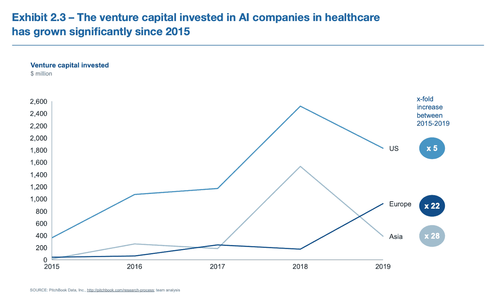

# 数据科学如何改变医疗保健

> 原文：<https://web.archive.org/web/20230101103227/https://www.datacamp.com/blog/how-data-science-is-transforming-healthcare>

## 医疗保健中数据科学和机器学习的现状

随着医疗保健通过数字化和数字化转型不断进步，它已经成为最有条件最大限度地利用数据科学和机器学习的行业之一。自 2015 年以来，仅在欧洲，对医疗保健领域人工智能公司的风险投资就增长了 22 倍([麦肯锡](https://web.archive.org/web/20220627141715/https://eithealth.eu/wp-content/uploads/2020/03/EIT-Health-and-McKinsey_Transforming-Healthcare-with-AI.pdf))。

数据科学和机器学习正在改变几个垂直领域的医疗保健，从病人护理到制药等等。但是，扩大数据科学在医疗保健领域的影响需要仔细考虑许多挑战，包括合规性、数据治理和监督、数据文化以及数据技能的可用性。

## 医疗保健中数据科学和机器学习的机遇

今天，由于大量的医疗保健数据和许多适用于公共卫生结果的用例，医疗保健领域对于机器学习和数据科学来说已经成熟。根据 [Statista](https://web.archive.org/web/20220627141715/https://www.statista.com/statistics/1037970/global-healthcare-data-volume/) 的数据，全球医疗保健行业每年生成的数据量约为 2314 艾字节(1 艾字节= 1B 千兆字节)，这标志着自 2013 年以来全球医疗保健行业生成的数据量增长了 15 倍。

就改善人口健康结果而言，对社会有数不清的好处。 [Deloitte](https://web.archive.org/web/20220627141715/https://www.medtecheurope.org/wp-content/uploads/2020/10/mte-ai_impact-in-healthcare_oct2020_report.pdf) 估计，仅在欧洲，通过数据科学和机器学习用例获得的效率就可以挽救 38 万至 40.3 万人的生命。从预防和早期检测到诊断，再到治疗和护理管理，数据科学和机器学习可以集成到患者的整个旅程中。

例如，个人可以利用可穿戴设备和[个性化应用](https://web.archive.org/web/20220627141715/https://www.babylonhealth.com/product/monitor)进行早期疾病检测和预防，或者利用[深度学习驱动的医学图像分析](https://web.archive.org/web/20220627141715/https://alixir.ai/)缩短等待时间。研发领域也在准备创造健康成果的巨大收益，从[自动药物发现](https://web.archive.org/web/20220627141715/https://postera.ai/about/)到 DeepMind 利用其 [AlphaFold](https://web.archive.org/web/20220627141715/https://deepmind.com/blog/article/AlphaFold-Using-AI-for-scientific-discovery) 算法在蛋白质折叠方面的进展。

各垂直行业的医疗保健提供商也可以在节约成本和提高效率方面实现巨大收益。例如，实施数据科学和机器学习每年可以为欧洲医疗保健系统节省 1709 亿至 2124 亿欧元([德勤](https://web.archive.org/web/20220627141715/https://www.medtecheurope.org/wp-content/uploads/2020/10/mte-ai_impact-in-healthcare_oct2020_report.pdf))。从制药公司改善供应链流程，到保险提供商通过预测客户流失来优化商业支出，再到通过跨多个垂直行业的工作流自动化来提高生产力，效率的提高可谓无所不包。

## 医疗保健中的数据科学和机器学习用例

### 病人护理

数据科学和机器学习用例可以改善个人的健康状况，并自动化医疗保健专业人员耗时的管理任务。

***预约管理*** :通过使用机器学习和基于规则的人工智能，医疗保健提供商可以通过自动化的预约管理来优化患者的结果并缓解资源管理不善。

***早期诊断和预防*** : [健康监测应用](https://web.archive.org/web/20220627141715/https://www.babylonhealth.com/product/monitor)和[可穿戴设备](https://web.archive.org/web/20220627141715/https://store.alivecor.com/products/kardiamobile)利用机器学习和描述性分析，提供关于个人健康各个方面的重要见解。这些工具可以让个人围绕自己的健康做出数据驱动的决策，并在早期诊断潜在的疾病。

***患者分流*** :通过使用机器学习驱动的[症状检查器应用](https://web.archive.org/web/20220627141715/https://www.mediktor.com/en)，医疗保健提供商可以根据需求和紧急程度对患者进行分流。这可以大幅减少患者的等待时间，并大幅提高医疗保健提供商的效率。

*:医疗成像和诊断可以说是医疗保健中数据科学和机器学习最重要的用例之一([麦肯锡](https://web.archive.org/web/20220627141715/https://eithealth.eu/wp-content/uploads/2020/03/EIT-Health-and-McKinsey_Transforming-Healthcare-with-AI.pdf))，医疗成像和诊断有望全面提高效率和改善健康状况。通过使用深度学习，医疗保健提供商可以[自动化工作流程](https://web.archive.org/web/20220627141715/https://arterys.com/)并更快地为患者提供价值。*

 *### 业务流程和管理

与任何行业一样，数据科学和机器学习的医疗保健应用涵盖一系列用例，以提高运营效率和客户体验。

***机器人流程自动化*** :通过结合使用机器学习和基于规则的人工智能，各垂直行业的医疗保健提供商可以简化工作流程并实现流程数字化。

***客户流失*** :保险提供商可以使用机器学习来预测哪些客户会流失，这可以帮助他们留住客户，优化营销支出。

***聊天机器人*** :通过使用聊天机器人，从医院到保险机构的医疗保健提供商可以为医疗保健消费者提供更好的客户服务和更快的价值实现。

***商业智能*** :商业智能结合了商业分析、数据操作和可视化，帮助组织做出更多数据驱动的决策。通过利用数据洞察，医疗保健提供商可以获得对财务运营的更多可见性，自动化合规性报告，等等([维拉诺瓦大学](https://web.archive.org/web/20220627141715/https://www.villanovau.com/resources/bi/business-intelligence-in-healthcare/#:~:text=By%20providing%20a%20foundation%20for,monitor%20and%20forecast%20patient%20diagnoses.&text=With%20business%20intelligence%2C%20providers%20can,costs%20and%20improve%20operational%20efficiency.))。

### 药物

借助人工智能驱动的药物发现和改进的供应链管理，制药公司可以利用数据科学和机器学习为个人提供更多价值。

*:根据【2021 年人工智能指数报告，人工智能驱动的药物发现初创公司获得了所有行业中最多的私人人工智能投资。基于 ML 的药物发现的承诺开始结出果实，并可能导致人口健康结果的巨大收益。*

 ****供应链规划*** :在供应链规划中使用数据科学和机器学习可以减少生产时间，减少疫苗交付的等待时间，并优化制药公司的供应链支出。

***卓越预测*** :利用简单到复杂的预测工具，制药公司可以利用人口健康数据来预测某些药物的供应和需求，并全面优化财务、营销、销售等业务流程。

***改善临床试验流程*** :使用数据科学和可穿戴设备可以通过[自动监控和标记](https://web.archive.org/web/20220627141715/https://www.berghealth.com/)临床试验期间的任何不良反应来降低患者的风险。此外，机器学习驱动的应用程序可以通过评估患者资格、预筛选和随机化来加快临床试验。

## 在医疗保健领域实施数据科学和机器学习的挑战和风险

### 数据质量和基础设施

对于任何试图运营和扩展数据科学和机器学习的组织来说，一个重大挑战是实现现代化、安全、集中和可发现的数据基础设施( [DataCamp](https://web.archive.org/web/20220627141715/https://www.datacamp.com/resources/webinars/webinar-scaling-data-science-at-your-organization-pt-2) )。对于数据仍在数字化的医疗保健机构来说，这个问题尤为突出，医疗保健提供商之间缺乏数据互操作性和质量不一致阻碍了大型数据集的构建([麦肯锡](https://web.archive.org/web/20220627141715/https://eithealth.eu/wp-content/uploads/2020/03/EIT-Health-and-McKinsey_Transforming-Healthcare-with-AI.pdf))。

### 合规和治理

由于医疗保健组织收集非常有价值和敏感的数据，治理和合规性是在医疗保健中实施数据科学和机器学习的核心方面( [Collibra](https://web.archive.org/web/20220627141715/https://www.collibra.com/blog/what-is-data-governance-in-healthcare) )。虽然不同地区的监管有所不同([麦肯锡](https://web.archive.org/web/20220627141715/https://eithealth.eu/wp-content/uploads/2020/03/EIT-Health-and-McKinsey_Transforming-Healthcare-with-AI.pdf))，但医疗保健行业拥有最复杂的监管格局之一。例如，美国的健康保险携带和责任法案(HIPAA)规定了保护和管理患者健康数据的国家标准。

这些类型的特定健康法规只是医疗保健行业复杂监管环境的一个方面。当构建和链接用于数据科学和机器学习应用的不同数据集时，欧盟的通用数据保护法规(GDPR)和加州消费者保护法案(CCPA)等数据保护法给医疗保健组织带来了额外的复杂性。因此，创建强大的数据治理和合规性对于在医疗保健领域运营数据科学和机器学习至关重要。

### 技能

支持数据基础设施并就监管框架达成共识，对于在医疗保健领域运营数据科学和机器学习至关重要。但在医疗保健中采用这些技术的最大威胁是数据技能差距。事实上，根据 [Qlik](https://web.archive.org/web/20220627141715/https://thedataliteracyproject.org/files/documents/Qlik%20-%20The_Data_Literacy_Index_October_2018.pdf) 的研究，在对各行业的数据素养进行排名时，医疗保健行业是表现最差的一个。医疗保健组织缺乏数据技能，这阻碍了数据科学和机器学习在各垂直行业中的应用，并限制了组织围绕数据计划建立信任的能力。

例如，一线卫生工作者需要具备基本的人工智能素养，以便能够理解基于机器学习的系统和应用并与之交互([麦肯锡](https://web.archive.org/web/20220627141715/https://eithealth.eu/wp-content/uploads/2020/03/EIT-Health-and-McKinsey_Transforming-Healthcare-with-AI.pdf))。制药或保险公司的经理和领导者需要了解数据科学和机器学习的可能性，以便他们能够推动数据计划，并为发展数据驱动的文化做出贡献([数据营](https://web.archive.org/web/20220627141715/https://www.datacamp.com/resources/webinars/path-to-data-fluency))。

仅仅雇佣熟练的数据工作者是不够的。理解医疗保健复杂性的人才短缺，数据科学人才也普遍短缺。

> 缺乏数据素养是我们面临的最大敌人。随着世界越来越受数据驱动，这是一个更大的挑战。每个人都必须了解基本知识，我们必须能够以直观和有趣的方式传达这些知识
> 
> ##### [美国国际集团日本公司首席数据和分析官 Bill Zhang](https://web.archive.org/web/20220627141715/https://go.thoughtspot.com/white-paper-hbr-new-decision-makers-thank-you.html)

## 数据培训如何解决医疗行业的数据挑战

解决数据技能差距是在医疗保健领域实施数据科学和机器学习的基础。据世界经济论坛称，到 2030 年，医疗保健和制药领域的数字和数据培训可以推动全球 GDP 增长超过 4000 亿美元。创造一种持续学习的文化是培养下一代医疗保健领导者的当务之急([麦肯锡](https://web.archive.org/web/20220627141715/https://eithealth.eu/wp-content/uploads/2020/03/EIT-Health-and-McKinsey_Transforming-Healthcare-with-AI.pdf))，他们将结合数据和生物医学科学，以扩展和实现数据科学和机器学习在医疗保健中的价值。

**