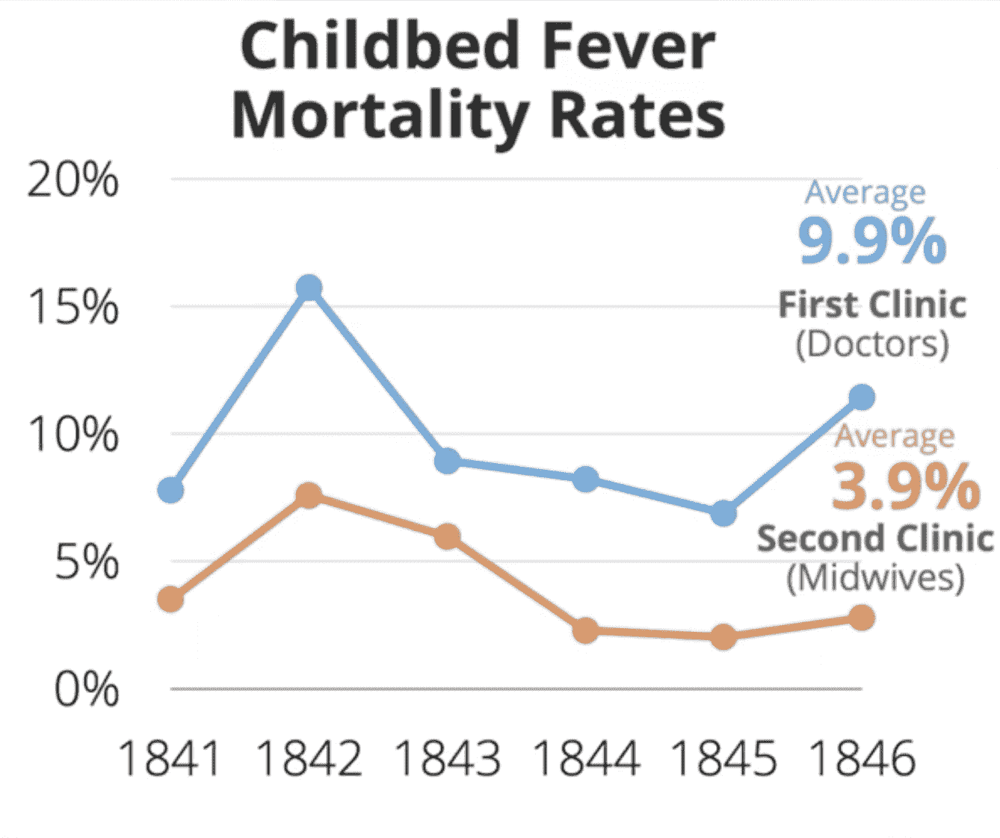
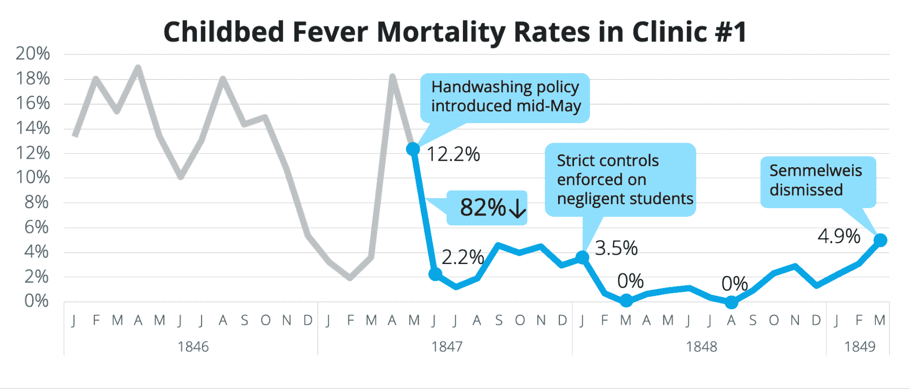

# 数据故事如何拯救生命 Semmelweis 的案例研究

> 原文：<https://web.archive.org/web/20221129045128/https://www.datacamp.com/blog/how-data-storytelling-could-save-lives-the-case-study-of-semmelweis>

数据故事讲述是一种结构化的方法，使用叙事元素和探索性视觉效果来交流数据见解。那些希望将数据转化为见解和决策的人将从掌握讲述数据故事的艺术中受益。

与展示统计数据相反，数据故事更吸引人、更令人难忘、更有说服力。在一项对救助儿童会慈善组织的两个版本的宣传册进行测试的研究中，获得信息图版本[的捐赠者比获得故事版本的捐赠者少捐赠了大约 50%的资金。在另一项独立的研究中，研究人员发现，当人们听到一个故事时](https://web.archive.org/web/20220817155801/https://www.forbes.com/sites/brentdykes/2016/03/31/data-storytelling-the-essential-data-science-skill-everyone-needs/?sh=27b7692052ad)[不那么怀疑，但当只看到统计数据时，却更加吹毛求疵。](https://web.archive.org/web/20220817155801/https://www.fastcompany.com/1680581/why-storytelling-is-the-ultimate-weapon)

数据故事由三个关键要素组成— [数据、视觉和叙事](https://web.archive.org/web/20220817155801/https://www.datacamp.com/community/blog/telling-effective-data-stories-with-data-narrative-and-visuals)。要讲述一个好的数据故事，需要选择正确的数据，使用引导数据故事流程的叙述结构，并用引人注目的视觉效果来说明数据故事。

Figure 1: Narrative, visuals and data are data stories that drive changes

## Semmelweis 的案例研究

历史充满了糟糕的数据可视化的警示故事，这些数据可视化未能像数据故事那样推动行动。Brent Dykes 在他的书《有效的数据叙事:如何用数据、叙事和视觉推动变革》中引用了 Ignaz Semmelweis 博士的故事。

发现洗手可以拯救生命后，Semmelweis 未能说服持怀疑态度的医学界相信他的发现。事后看来，数据讲故事的原则本可以帮助他更好地传达自己的见解，从而挽救成千上万人的生命。

被称为“手部卫生之父”的 Semmelweis 是一名匈牙利医生。1844 年，Semmelweis 在一家产科诊所担任助理，那里的许多妇女都患有产床热——一种由产后感染引起的发烧。

在诊所工作期间，Semmelweis 被一种特殊的趋势所吸引。**医生和医学生经营的诊所的死亡率与助产士经营的诊所的死亡率(3.9%)相比，产床热的死亡率(9.9%)明显较高(图 2)** 。与内科医生和医科学生不同，助产士在分娩前不做任何尸检。这使他得出结论，来自尸体的物质增加了这些女性的死亡风险。

Figure 2\. Clinics operated by doctors who did not wash their hands caused more deaths.

知道了这一点，他提出了洗手的习惯，这大大降低了死亡率。然而，这些发现并没有帮助他说服他的导师克莱恩教授相信他的理论。

Semmelweis 在他的余生中一直是洗手的强烈支持者，但却无济于事。1861 年，Semmelweis 向医学界发表了他的著作《产床热的病因、概念和预防》,医学界对他的学说作出了批判性的回应。1865 年，塞麦尔维斯在精神病院去世，远在细菌理论被广泛接受之前。

Figure 3\. The Etiology, Concept, and Prophylaxis of Childbed Fever have hundreds of pages and no charts

## 为什么他没能说服社区？

Brent 用这个案例研究证明了数据叙事的三个组成部分——数据、叙事和视觉——在通过数据故事推动变革中是不可或缺的。在这个案例研究中，Semmelweis 的数据被置若罔闻，因为它们既没有令人信服的叙事结构，也没有用视觉效果来说明。结果，尽管 Semmelweis 的数据是准确的、有价值的、可操作的，但他未能说服他的观众。

回想起来，Semmelweis 本可以用数据故事更令人信服地传达他的信息。这里有一个 Brent Dykes 的折线图的例子，它结合了数据、叙述和视觉效果来讲述一个令人信服的数据故事。

Figure 4\. A data story by Dykes that better illustrates Semmelweis’ point.

Semmelweis 的方法与英国医生 John Snow 的方法形成了直接对比，他研究了 1854 年 Broad Street 霍乱爆发，并假设细菌污染的水导致了霍乱。在证明了水泵附近的死亡率很高之后，斯诺说服了地方议会关闭了水泵。

FIgure 5: John Snow’s data visualization

## 结论

与 Semmelweis 不同，今天的数据故事讲述者可以使用大量工具来创建引人入胜的数据故事，从 Tableau 等商业智能工具到 T2【python 等编程语言。对于现代数据从业者来说，掌握数据叙事的艺术和科学来推动行动才是明智的。

