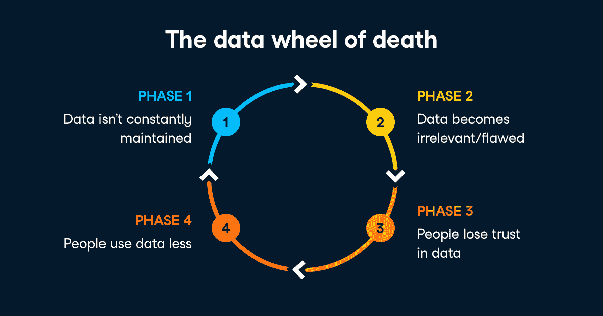

# 企业组织如何成为数据驱动型企业

> 原文：<https://web.archive.org/web/20221129034451/https://www.datacamp.com/blog/how-enterprise-organizations-can-become-data-driven>

亚马逊、网飞、谷歌和 Airbnb 等成功的科技公司有什么共同点？他们都扩展并运营了他们的数据科学功能。这意味着他们已经建立了一流的数据团队，并采购或构建了自己的数据工具。这需要设计强大的内部流程和架构，利用数据推动业务发展。

在我们上个月的[网络研讨会上，世界银行数据工程师、圣地亚哥市前首席数据官马克西姆·佩彻斯基解释说，这些公司非常适合这样做，因为他们是在数据中成长起来的。“金融机构、医疗保健机构和政府等老牌机构没有[围绕数据开展业务]的特权。圣地亚哥市成立于 19 世纪，他们仍在学习调整，他们仍在学习如何有效地将数据与他们的运营保持一致。”](https://web.archive.org/web/20221012064721/https://www.datacamp.com/resources/webinars/operationalizing-data-within-large-organizations)

让我们来看看大型组织如何构建有效的数据科学功能。近年来，许多组织聘请了首席数据官，建立了数据科学家和数据工程师的团队，并找到了一种货币化和共享数据的方法。但 NewVantage Partners 在 2020 年 1 月的调查显示，在接受调查的 70 家公司中，98.8%的公司一直在投资大数据和人工智能计划，但只有 37.8%的公司能够声称他们创建了一个数据驱动的组织。

成为数据驱动型的最常见障碍是人员和流程挑战，即运营和构建可重复的流程、创建功能性数据基础架构以及弥合数据技能差距。

## 数据要求

以下图片总结了数据的可用性和可靠性:

第一，数据必须是*在正确的时间，以正确的方式，有目的的收集。然后，它必须是 ***可发现的*** ，这意味着组织中的所有数据用户都必须知道这些数据已经被收集，并且能够找到它们。接下来，数据必须被证明是 ***可靠的*** ，没有缺口或者不一致。它还必须容易理解*——例如，它应该有正确的结构和标签。符合*标准至关重要——必须有适当的安全协议来控制对敏感数据的访问，一些行业有监管标准。最后，数据必须是 ***可操作的*** ，这意味着数据用户拥有正确使用数据的技术、培训和道德框架。***

 **## 成为数据驱动型的挑战

要满足这些数据需求，有三大挑战:组织、文化和技术。

### 组织挑战

大型组织通常有竖井，团队在竖井中可能有不同的目标。这些孤岛可能是由于法律要求而存在的，这在财务中很常见，或者它们的存在可能只是因为团队在过去没有协作过。无论是什么原因，孤岛都会导致沟通不畅和不一致，从而损害组织的整体效率。

这种情况的一个症状可能是经理们想要建立更大的团队或创建一个以上的人工智能卓越中心。

### 文化挑战

组织数据素养——其中每个人都拥有成功的数据技能——通常被认为是一个崇高的目标，一些组织可能不愿意冒险去实现它。这就是为什么 DataCamp 试图解开像[机器学习](https://web.archive.org/web/20221012064721/https://www.datacamp.com/resources/ebooks/definitive-guide-to-machine-learning-for-business-leaders)这样的主题，以帮助组织了解数据如何有实际用途。给员工授权，让他们更容易掌握技能是关键。

文化挑战也可以体现在整个组织的不同激励机制中。管理层可能希望向他们的上级展示引人注目的仪表板，工程师希望使用最新、最好的工具，而业务用户可能只想回答一个特定的问题或简化流程。不可能总是让每个利益相关者都满意。这与前面提到的组织挑战相关，目标是使数据战略与整体业务战略保持一致。

### 技术挑战

马克西姆说，大型组织通常将“一堆拼凑起来的遗留系统”作为记录数据的核心系统。这些系统可能很难提取数据或进行扩展，但通常情况下，部门领导不想承担大项目。他们害怕承担替换他们的转换成本、潜在的项目失败成本、额外的再培训成本以及对生产力的短期打击。这些都是缺乏统一数据战略导致的短视错误。

其他技术挑战包括法规遵从性和安全标准，如 HIPAA、FERPA、GDPR 和 CCPA。公司必须遵守这些标准，以避免不道德的数据使用。

面对这些挑战，Brian Balfour 称之为[数据死亡之轮](https://web.archive.org/web/20221012064721/https://brianbalfour.com/essays/growth-data-mistakes)，如下所示。它表明，没有持续维护的数据会变得不相关或有缺陷，导致人们对数据失去信任，最终减少对数据的使用。

## 实现数据驱动的解决方案

那么，老牌企业如何才能像网飞和 Airbnb 一样成为数据驱动型企业呢？他们必须围绕数据进行重建。以下是方法。

### 了解地形

大型组织必须了解存在的不同孤岛以及它们如何相互通信。他们必须在管理层培养支持这一旅程的拥护者。他们必须与所有利益相关者交流数据目标。

### 识别您的用户

接下来，为了促进成功的数据驱动转型，您必须[了解您的角色](https://web.archive.org/web/20221012064721/https://www.datacamp.com/community/blog/eight-personas)。深入理解每个角色，无论他们是数据消费者、领导者、数据分析师还是数据科学家，都将有助于您了解如何最好地帮助他们，并在您的任务中利用他们。

### 从小处着手，保持简单

马克西姆说，首先，不可能一下子解决所有问题。专注于影响是非常重要的。选择一个在整个组织中可见且有影响力的项目，并且不需要大量的利益相关者或协调。首先获得一系列轻松的胜利将会促进认同并确保数据项目的可见性。您还将能够迭代数据工作，并为未来的数据项目利用学到的知识。

### 使数据战略与业务战略保持一致

将数据战略与业务战略结合起来意味着什么？马克西姆的实际建议是，选择能够扩展和测试你的基础设施、服务于你的商业用户、并与公司目标和结果相一致的数据项目。确保每个项目都有文档记录，可重复，并遵循最佳实践。然后，在管理层的支持下在全公司范围内扩大你的成功，这样你就可以在这些成功的基础上继续迭代。

## 数据驱动是什么样子的

数据驱动要求能够衡量数据计划的成功。马克西姆说，使用容易获取的指标很有吸引力，比如项目总数、完成的数据集数量或回购追随者数量。

“这些都是很好的衡量标准，但它们并没有真正解决你成功的核心问题，”马克西姆说。“我会更多地考虑利用数据做出决策的数量。还有，找人找一组数据需要多长时间，或者说获取数据的时间。你还应该看看有多少目标、目的和 okr 被设定并被数据追踪，包括它们是如何被审核的。”

有关在流程复杂的大型组织中实现数据可操作性的更多信息，请观看马克西姆关于在大型组织中实现数据可操作性的网络研讨会。

**