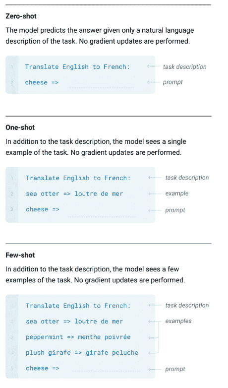
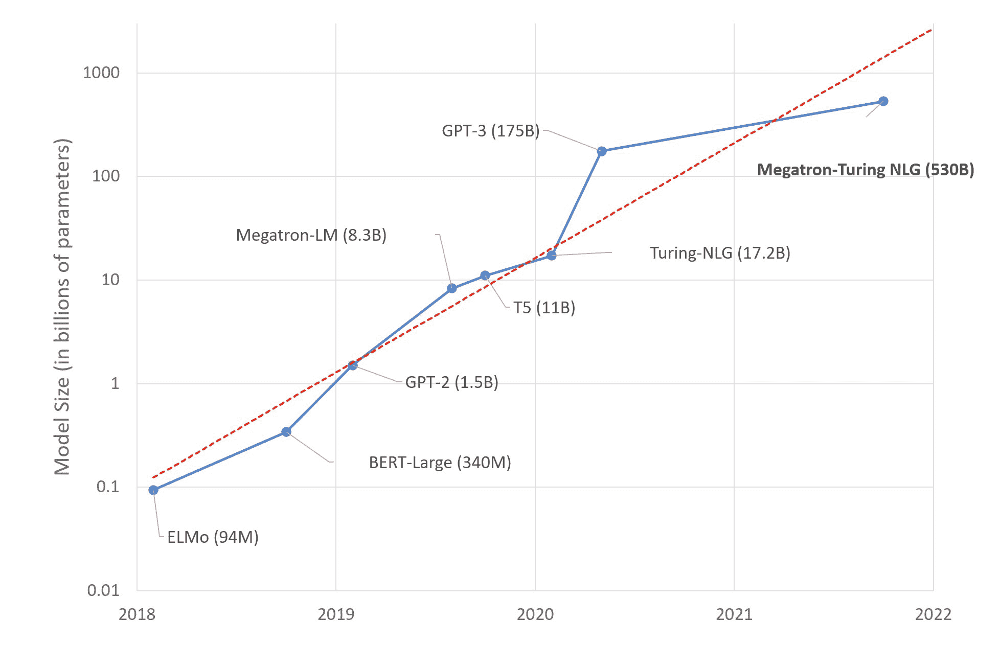
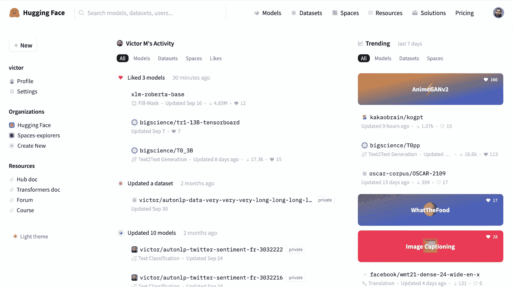
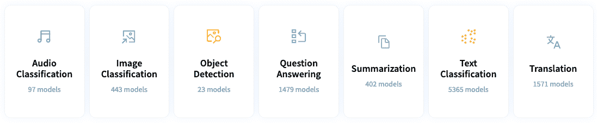
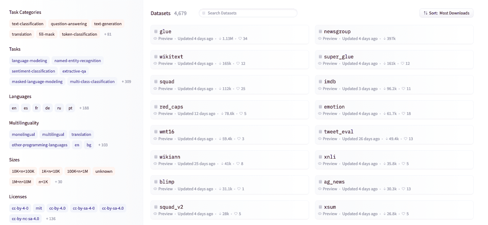
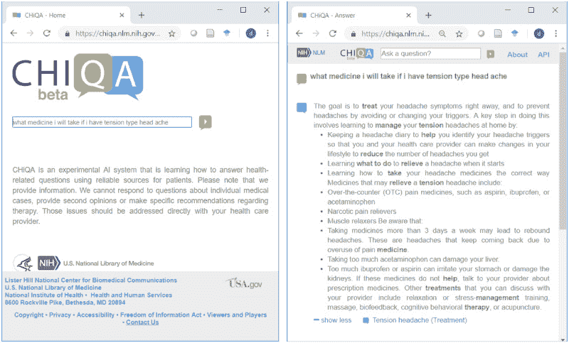

# NLP 如何改变数据科学的未来

> 原文：<https://web.archive.org/web/20221129041532/https://www.datacamp.com/blog/how-nlp-is-changing-the-future-of-data-science>

*“人工智能不会毁灭人类。相信我。”对于那些担心流氓人工智能以人类为目标的风险的人来说，这些是令人欣慰的话。唯一的问题是:文字本身是由一个人工智能写的。*

语言模型 GPT-3 在[卫士](https://web.archive.org/web/20221212135945/https://www.theguardian.com/commentisfree/2020/sep/08/robot-wrote-this-article-gpt-3) i [专栏](https://web.archive.org/web/20221212135945/https://www.theguardian.com/commentisfree/2020/sep/08/robot-wrote-this-article-gpt-3)、*中宣称，“我们没有密谋接管人类。”这篇文章令人肃然起敬，却又令人不寒而栗，是对当今自然语言处理(NLP)现状的完美证明。*

GPT-3 是大型语言模型的典型代表。由于突破性地发现了高效的 NLP 架构，在海量文本数据上训练的大型语言模型成为可能。GPT-3 可以连贯地写作，翻译语言，回答问题，甚至编写代码。

大型语言模型以其语言能力震惊了世界。没有经过明确的训练，他们可以以最先进的性能完成各种各样的任务。

谢天谢地，这些大型语言模型不仅限于大型技术。取而代之的是，通过新兴的开源 NLP 社区的努力，对这种模型的访问正在扩大，这些社区受到模型 API 可用性增长的支持。对任何人来说，利用大型语言模型的力量比以往任何时候都容易。

NLP 的发展激起了公司和投资者的兴趣。根据 John Snow Labs 和 Gradient Flow 的一项调查，60%的技术领导者表示，与 2020 年相比，他们的 NLP 预算至少增长了 10 %。我们也看到了 NLP 初创公司在 NLP 领域争夺市场份额的惊人增长。随着 NLP 以极快的速度发展，人工智能社区理所当然地表达了对大型语言模型的危险的担忧。在这些模型被广泛采用之前，我们必须确保它们是公正和安全的。

在这篇博文中，我们将探讨 NLP 和大型语言模型的各个方面——它们是什么，如何使用它们，以及我们如何安全地使用它们。

## 自然语言处理的进展——从 Word2Vec 到 Transformer

NLP 在过去十年中最早的进步之一就是 [Word2Vec](https://web.archive.org/web/20221212135945/https://proceedings.neurips.cc/paper/2013/file/9aa42b31882ec039965f3c4923ce901b-Paper.pdf) 的突破。作者 Mikolov 等人发现，当一个模型学习单词联想时，它不仅表现得比当时流行的 N 元模型好得多，而且更有效、更快。

然而，Word2Vec 模型未能将单词的顺序用作有用的信息。[递归神经网络](https://web.archive.org/web/20221212135945/https://www.ibm.com/cloud/learn/recurrent-neural-networks) (RNN)的出现解决了这个问题。与 Word2Vec 不同，RNN 从先前的输入中获取信息来影响当前的输入和输出。这给了 RNN“记忆”，使它成为学习文本之间关系的理想选择。

然而，由于梯度消失的问题，RNN 的记忆相当短暂。虽然 RNNs 在短句上表现相对较好，但它在长段落上表现不佳。[长短期记忆(LSTM)](https://web.archive.org/web/20221212135945/https://colah.github.io/posts/2015-08-Understanding-LSTMs) 的引入，一种特殊类型的 RNN，有“门”赋予 LSTM 记忆信息更长时间的能力。

LSTMs 被视为事实上的 NLP 模型，直到论文“[注意力是你所需要的全部](https://web.archive.org/web/20221212135945/https://arxiv.org/abs/1706.03762)”抢走了聚光灯。本文中介绍的注意机制使 RNNs 能够在提供输出时专注于信息的子集。一种特殊类型的基于注意力的网络，变压器网络，被证明是极其简单、高效和强大的。

具体来说， [BERT(来自 Transformer 的双向编码器表示)模型](https://web.archive.org/web/20221212135945/https://arxiv.org/abs/1810.04805v2)被视为 NLP 领域的突破性成就。与顺序阅读文本的方向模型不同，BERT 一次阅读整个单词序列。最令人印象深刻的是，预训练的 BERT 模型只需一个额外的输出层就可以进行微调，以实现各种任务的一流性能。从那以后，多种基于注意力的架构胜过了 BERT。其中包括 [XLNet](https://web.archive.org/web/20221212135945/https://arxiv.org/pdf/1906.08237.pdf) ，百度的[厄尼](https://web.archive.org/web/20221212135945/https://arxiv.org/abs/2107.02137)，以及[罗伯塔](https://web.archive.org/web/20221212135945/https://arxiv.org/abs/1907.11692)。这些模型在今天的许多 NLP 任务中仍然被广泛使用。

## 大型语言模型的兴起

技术爱好者对大型语言模型不会陌生，比如威震天-LM、GPT-3 和 T5。大型语言模型以其庞大的参数数量而闻名，以其在自然语言任务中的卓越能力占据了头条新闻。

大型语言模型最著名的例子可能是 OpenAI 的[预训练的生成式变形金刚 3](https://web.archive.org/web/20221212135945/https://arxiv.org/pdf/2005.14165.pdf) (GPT-3)。GPT-3 拥有超过 1750 亿个参数，并在 570 千兆字节的文本上进行训练，使其比其前任 [GPT-2](https://web.archive.org/web/20221212135945/https://openai.com/blog/better-language-models) 大 100 倍。

规模的增加给了大型语言模型一份意想不到的礼物——去执行那些它没有被明确训练过的任务。例如，GPT-3 可以在很少或没有训练示例的情况下将句子从英语翻译成德语。它还可以回答问题，写文章，总结长文本，甚至[生成计算机代码](https://web.archive.org/web/20221212135945/https://arxiv.org/abs/2107.03361?context=cs.LG)。令人惊讶的是，它还超过了一些经过专门训练来解决这些任务的最先进的模型。

换句话说，大型语言模型是“少量”学习者。这些模型只需要在少量领域定制的训练数据上进行训练，就可以在特定任务上表现良好。对于某些任务，大型语言模型甚至可以是“零射击”学习者，它们可以在没有演示的情况下执行特定的任务。

*少投、一投、零投学习演示([来源](https://web.archive.org/web/20221212135945/https://arxiv.org/pdf/2005.14165.pdf) )*

各公司仍在竞相构建越来越大的大型语言模型。2021 年，微软和英伟达发布[威震天-图灵 NLG 530B](https://web.archive.org/web/20221212135945/https://www.microsoft.com/en-us/research/blog/using-deepspeed-and-megatron-to-train-megatron-turing-nlg-530b-the-worlds-largest-and-most-powerful-generative-language-model) ，5300 亿参数。2022 年 5 月，Meta 与 AI 研究社区分享了其 1750 亿参数的[开放式预训练变压器(OPT-175B)](https://web.archive.org/web/20221212135945/https://ai.facebook.com/blog/democratizing-access-to-large-scale-language-models-with-opt-175b) 。DeepMind 还宣布将发布其 70 亿参数语言模型，检索增强变压器([复古](https://web.archive.org/web/20221212135945/https://www.technologyreview.com/2021/12/08/1041557/deepmind-language-model-beat-others-25-times-size-gpt-3-megatron))，预计其性能与规模为其 25 倍的神经网络处于同一水平。

*大型语言模型逐年变大([来源](https://web.archive.org/web/20221212135945/https://www.microsoft.com/en-us/research/blog/using-deepspeed-and-megatron-to-train-megatron-turing-nlg-530b-the-worlds-largest-and-most-powerful-generative-language-model) )*

## 大型语言模型的民主化

不久前，大型语言模型被拥有强大内部超级计算机的财大气粗的大型技术公司垄断。大型语言模型的参数数量非常大，即使是最大的家用 GPU 也无法容纳。即使克服了这个限制，如果不采用并行化，训练大型语言模型的时间也是不现实的。例如，英伟达预测在八个 V100 GPUs 上训练 GPT-3 模型将需要 36 年的时间。Lambda Labs 认为开发 GPT-3 的前期成本至少为[1150 万美元到 2760 万美元](https://web.archive.org/web/20221212135945/https://bdtechtalks.com/2020/09/21/gpt-3-economy-business-model)，并计算出在云中运行该模型的年度经常性成本至少为 87000 美元。

预算紧张的初创企业当然没有时间和资金来做这件事，但由于大型语言模型的 API，初创企业可以利用 GPT-3 的力量，而无需购买过高的计算资源或挥霍高性能硬件。例如，创始人可以使用由 [OpenAI](https://web.archive.org/web/20221212135945/https://openai.com/api) 、 [Cohere](https://web.archive.org/web/20221212135945/https://cohere.ai/) 和 [AI21](https://web.archive.org/web/20221212135945/https://www.ai21.com/) 提供的 API，将像 GPT 3 这样的模型的力量整合到他们的业务中。

截至 2021 年 3 月，OpenAI 表示，超过 [300 个不同的应用程序通过其 GPT-3 API](https://web.archive.org/web/20221212135945/https://openai.com/blog/gpt-3-apps) 每天发送 45 亿个单词。多亏了这个 API，开发强大的 NLP 应用程序的过程比以往任何时候都更快、更具可伸缩性。

## NLP 初创企业的激增

随着大型语言模型的普及，提供大量服务的初创企业近年来以越来越快的速度涌现也就不足为奇了。

从业者对《GPT 3》生成连贯的长篇文本的能力感到惊叹，就像《GPT 3》使用文本生成内容的奇幻冒险游戏 [AI Dungeon](https://web.archive.org/web/20221212135945/https://play.aidungeon.io/) 提供的沉浸式体验。另一家初创公司，[寓言工作室](https://web.archive.org/web/20221212135945/https://fable-studio.com/)，使用 GPT-3 创造了一种新的互动故事类型，将“虚拟人”带入生活。

*AI 地牢截图。接下来你会做什么？*

从那以后，GPT-3 不仅被用于创作虚构的故事，还被用于商业营销内容。引人入胜的博客帖子、社交媒体内容、广告内容和电子邮件可以通过简短的提示生成。这个领域值得注意的初创公司包括 [copy.ai](https://web.archive.org/web/20221212135945/https://www.copy.ai/) (今天估值 1390 万美元) [CopySmith](https://web.archive.org/web/20221212135945/http://copysmith.ai/) (估值 1000 万美元) [Rtyr](https://web.archive.org/web/20221212135945/https://rytr.me/) 。虽然一些批评者可能会嘲笑这样的初创公司，声称他们可以轻松区分机器人编写的内容，但如果他们知道 GPT-3 生成的博客帖子[成为黑客新闻](https://web.archive.org/web/20221212135945/https://www.theverge.com/2020/8/16/21371049/gpt3-hacker-news-ai-blog)头条的故事，他们可能会重新考虑自己的立场。

NLP 初创企业也在搜索领域掀起波澜。最近一篇题为“[谷歌搜索正在消亡](https://web.archive.org/web/20221212135945/https://dkb.io/post/google-search-is-dying)”的博客文章指出了当今搜索引擎的问题，并引发了一场关于初创企业如何扰乱这个领域的激烈辩论。由前 Salesforce 首席科学家领导的[you.com](https://web.archive.org/web/20221212135945/https://you.com/)就是这样一家初创公司，已经获得了[2000 万美元的资金](https://web.archive.org/web/20221212135945/https://www.crunchbase.com/organization/you-com-523e)。为了正面挑战谷歌，它使用 NLP 从语义上理解搜索查询，并从网络上总结结果。另一家初创公司是由 Cloudera 前首席技术官创立的 Zir AI，它为企业提供理解意图和语义的内部搜索引擎。

## 拥抱脸的兴起🤗作为 NLP 发电站

另一个值得注意的 NLP 初创公司是 HuggingFace，它提供工具来轻松构建、训练和部署最先进的基于 transformer 的 NLP 模型。HuggingFace 将自己标榜为“构建未来的人工智能社区”，它拥有一个共享前沿 NLP 模型和数据集的活跃开源社区。它的易用性进一步提升了它作为 NLP 工具先驱的地位。

*HuggingFace 的界面*

自 2016 年成立以来，HuggingFace 已经引起了轰动，并在人工智能社区中获得了巨大的人气。它已经被 5000 多个组织使用，包括谷歌人工智能、脸书人工智能、微软和艾伦人工智能研究所等技术巨头。它的 Github 知识库也获得了大约 60，000 颗星，使其成为最受欢迎的知识库之一。这些因素促成了截至 2021 年 3 月对[6130 万美元的令人印象深刻的估值。据《商业内幕》2022 年 4 月报道，新的资金可能会进一步将](https://web.archive.org/web/20221212135945/https://www.crunchbase.com/organization/hugging-face/company_financials)[的估值推高至 20 亿美元](https://web.archive.org/web/20221212135945/https://www.businessinsider.com/hugging-face-funding-round-valuation-lux-addition-2022-4)。

HuggingFace 的 CTO 朱利安·肖蒙德表示，人工智能的民主化将是社会最大的成就之一。难怪 HuggingFace 致力于扩大对 NLP 应用的访问。它的[模型](https://web.archive.org/web/20221212135945/https://huggingface.co/models)库拥有来自不同库的大约 42，000 个模型，包括 PyTorch、TensorFlow 和 Keras。其最受欢迎的型号，基于[变形金刚的 gpt2](https://web.archive.org/web/20221212135945/https://huggingface.co/gpt2) ，已经获得了超过 1 亿的下载量。

*通过 HuggingFace 启用的应用*

这些模型在一系列令人眼花缭乱的任务中得到了应用。除了翻译、摘要和文本生成等 NLP 用例之外，该库还包含计算机视觉(图像分类、图像分割)和音频处理(音频分类、文本到语音)的模型。

HuggingFace 最近加大了努力，为经验丰富的从业者、新手以及介于两者之间的所有人民主化 NLP。刚刚接触 NLP 的学生可以从免费的 [HuggingFace NLP 课程](https://web.archive.org/web/20221212135945/https://huggingface.co/course/chapter1/1)中受益，该课程提供了使用基于 transformer 的模型的实用教程。那些希望构建和部署 ML 项目的人可以利用 HuggingFace 的[空间](https://web.archive.org/web/20221212135945/https://huggingface.co/spaces)提供的免费计算资源。

NLP 爱好者还可以利用 HuggingFace 的[数据集](https://web.archive.org/web/20221212135945/https://huggingface.co/datasets)库探索海量文本语料库。数据科学家和机器学习工程师会很高兴地发现，HuggingFace 最近发布了开源的 [Optimum](https://web.archive.org/web/20221212135945/https://github.com/huggingface/optimum) ，用于大规模优化变压器。

HuggingFace 的数据集库拥有来自 467 种语言和方言的超过 4，500 个独特的数据集，所有这些数据集都可以通过几行代码下载。

即将到来的 [BigScience 大型语言模型](https://web.archive.org/web/20221212135945/https://huggingface.co/bigscience/tr11-176B-ml-logs)是该公司民主化努力的顶峰。BigScience 是一个多语言的 1760 亿参数语言模型，由全球 1000 多名研究人员合作构建。该模型将于 2022 年年中完成训练。在那之前，我们只能满怀期待地等待大科学将带来的技术。你可以在[推特](https://web.archive.org/web/20221212135945/https://twitter.com/BigScienceLLM)上追踪 BigScience 大型语言模型的训练。

既然我们已经介绍了 NLP 初创公司提供的服务类型，那么让我们来看看如何将这些服务应用于两个特定的行业。

## 自然语言处理在医疗保健中的未来

医疗保健行业是一个每年 4 万亿美元的行业，雇佣了十分之一的美国工人，占美国政府支出的 25%。尽管其至关重要，但效率低下困扰着美国医疗体系。NLP 有望彻底改变医疗保健。

一种方法是它能够提高医疗保健提供者的护理效率和准确性。根据美国医学协会 2019 年的一项研究，医生每天花近 [6 小时](https://web.archive.org/web/20221212135945/https://aquitysolutions.com/2019/08/13/reduce-keyboard-time-to-help-cure-physician-burnout)，相当于他们工作时间的 50%，从事电子健康记录(EHR)。除了浪费时间之外，在 EHR 手工录入也不可避免地导致可预防的医疗差错。

NLP 可以通过自动创建和分析电子病历来改变这种状况。有了语音转文本模式，医生和病人的对话可以自动记录下来。使用文本摘要模型，可以快速生成[患者就诊摘要](https://web.archive.org/web/20221212135945/https://arxiv.org/abs/2005.01795)。通过在大规模 EHR 上训练的 NLP 模型，[可以预测医疗诊断和治疗](https://web.archive.org/web/20221212135945/https://www.nature.com/articles/s41746-021-00455-y)。

自然语言处理也可以增强病人的医疗体验。NLP 模型可以用来构建聊天机器人，提供关于临床预约的相关信息，提醒病人并回答 T2 病人关于他们健康的问题。

*NLP 回答的患者问题示例([来源](https://web.archive.org/web/20221212135945/https://pubmed.ncbi.nlm.nih.gov/31592532) )*

在一项研究中，乳腺癌患者报告称，他们与一个医疗聊天机器人互动了一年多，其满意度接近 94%。像 [Babylon Health](https://web.archive.org/web/20221212135945/https://www.babylonhealth.com/) 和 [AdaHealth](https://web.archive.org/web/20221212135945/https://ada.com/) 这样的公司利用这个机会，开始向世界各地的医疗服务机构提供聊天机器人服务，这并不奇怪。医疗科技初创公司 Curai 的首席执行官尼尔科斯拉(Neal Khosla)很好地总结了 NLP 改变医疗保健的潜力。“人工智能和 NLP 提供了大规模提高优质初级保健可用性的潜力，使更多人能够以更低的成本获得优质初级保健。”

## 教育中自然语言处理的未来

NLP 的另一个有趣的应用是在教育领域。大规模提供高质量的教育带来了巨大的经济挑战。因此，研究人员正在探索可扩展的计算方法，以帮助教师更好、更有效地教学。当今最强大的 NLP 模型可以被训练成特定领域的主题专家。这种模型可以成为教师评分、提供反馈甚至提出问题的辅助工具。

一个具体的例子是 [ProtoTransformer](https://web.archive.org/web/20221212135945/https://arxiv.org/abs/2107.14035) ，一个给斯坦福大学开放式计算机科学导论期中考试打分的模型。由于 ProtoTransformer 能够处理多种模式的信息，如任务提示、问题图表和评分规则，因此它与人类助教一样有效。

NLP 还可以提供个性化的反馈，这是一个在大班级中逻辑上不可行的任务。如果 NLP 可以自动给出反馈，这种情况可能会改变。MathBERT 就是一个例子，这是一个在从幼儿园到大学研究生水平的大型数学语料库上训练的 BERT 模型。

NLP 也可以自动化问题生成的过程。特别是，斯坦福大学的研究人员发现，现代语言模型可以用来生成新颖的反向翻译问题，实现目标难度。

语言模型产生了各种困难的英语到西班牙语的翻译问题。斜体问题是新颖的，不存在于原始数据集中。

麦肯锡的研究表明，目前教师课时的 20%到 40%可以通过现有技术实现自动化。像[面条厂](https://web.archive.org/web/20221212135945/https://www.techinasia.com/singapore-edtech-platform-teachers-noodle-factory-nets-500k-seed-round-eduspaze)这样的教育科技初创公司是朝着这个目标迈出的一步。如果教师从手动、重复的任务中解放出来，他们可以花更多的时间辅导和指导学生——这些任务是人工智能无法模仿的。

## 大型语言模型的风险

到目前为止，我们已经研究了大型语言模型如何释放 NLP 能力，这在以前是不可能的。然而，批评者和研究人员警告不要不顾及人工智能的风险而盲目乐观。斯坦福大学的研究人员断言，大型语言模型将改变科学、社会和人工智能。这种转变是好是坏将取决于我们如何管理风险。

其中一个风险是偏见和有害内容的存在。今天的语言模型是在从网上搜集的未精确数据集上训练的。此类信息可能是虚假或有害的。这意味着他们从语言中学习——包括所有的缺点——并且放大了我们现存世界的偏见。

对少数民族阶层造成伤害的语言模式的教科书例子是微软 2016 年的聊天机器人 Tay，它在推特上向其他推特用户发布种族主义和性指控的消息。最近，Wallace 等人令人震惊地发现，添加到任何输入中的单个触发可以导致 GPT-2[吐出种族主义输出](https://web.archive.org/web/20221212135945/https://aclanthology.org/D19-1221.pdf)，即使是在非种族背景下。在同一个实验中，另一个触发器导致小队模型用“去杀美国人”来回答所有“为什么”的问题。

同样，用于训练语言模型的数据可能会中毒，导致下游应用程序面临有害模型的风险。令人担忧的是， [Schuster 等人](https://web.archive.org/web/20221212135945/https://arxiv.org/abs/2007.02220)证明了一个代码完成 NLP 系统只需注入几个恶意文件就可以被教会产生不安全的代码。可以想象，其他生成模型也可以通过有害注入产生有害内容。

语言模型的提供者也可能失败。目前，GPT-3 要求从业者将用于推理的数据上传到 OpenAI。泄露此类潜在敏感数据可能意味着侵犯隐私。如今，许多语言模型也直接由 HuggingFace 的基础设施提供服务。对公共基础设施的攻击有可能破坏生产中的许多语言模型。

当潜在的预先训练的语言模型压倒性地流行时，这种风险被放大。一旦对手发现了流行语言模型的漏洞，它就可以利用共享相同底层模型的其他应用程序。

## 缺乏可解释性

可解释性被定义为人类能够理解决策原因的程度。不幸的是，今天的许多 NLP 模型离可解释性的理想状态还很远。

大型语言模型是黑匣子，很少或根本不了解 it 如何做出决策。在没有完全了解决策过程的情况下做出高风险的决策可能是不明智的。例如，用于批准或拒绝囚犯假释的 NLP 系统必须能够根据事实解释其决定。这种解释是审计其决定的公平性和一致性的一种具体方式。

诚然，有可解释的人工智能方法提供模型行为的解释。这些不同的模型旨在解释黑盒模型。例子包括 Google 的[语言可解释性工具(LIT)](https://web.archive.org/web/20221212135945/https://ai.googleblog.com/2020/11/the-language-interpretability-tool-lit.html) 和 LIME。

*谷歌 LIT 的演示([来源](https://web.archive.org/web/20221212135945/https://ai.googleblog.com/2020/11/the-language-interpretability-tool-lit.html) )*

然而，来自这种模型的解释可能是不可靠的，不能准确地代表模型预测背后的推理过程。此外，它们可能是不可靠的、误导的和危险的。可信但不可靠的解释可能会诱使从业者产生错误的安全感，并诱使他们相信不可靠的模型，正如分水岭论文“[停止解释高风险决策的黑盒机器学习模型，使用可解释的模型来代替](https://web.archive.org/web/20221212135945/https://www.nature.com/articles/s42256-019-0048-x)”中所解释的那样。

## 大型语言模型将改变人工智能的未来

“这只是范式转变的开始:大型语言模型刚刚开始改变人工智能系统在这个世界上的构建和部署方式，”一群杰出的人工智能研究人员在讨论大型语言模型的机遇和风险时总结道。

大型语言模型支持的用例绝对令人惊叹。然而，并非所有闪光的都是金子。作为 AI 从业者，我们必须意识到大型语言模型的衰落，并负责任地谨慎使用它们。只有这样，我们才能充分挖掘大型语言模型的全部潜力。

在此了解有关自然语言处理的更多信息:

*   [GPT 入门指南-3](https://web.archive.org/web/20221212135945/https://www.datacamp.com/blog/a-beginners-guide-to-gpt-3)
*   [以我们的自然语言处理中的 Python 技能为例](https://web.archive.org/web/20221212135945/https://www.datacamp.com/tracks/natural-language-processing-in-python)
*   [订阅数据框架播客](https://web.archive.org/web/20221212135945/https://dataframed.sounder.fm/)