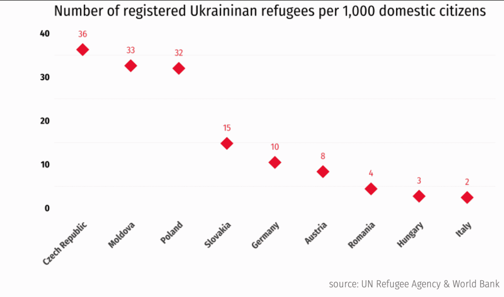

# 一名教师如何革新捷克共和国的数据教育

> 原文：<https://web.archive.org/web/20221212135909/https://www.datacamp.com/blog/how-one-teacher-revolutionized-data-education-in-the-czech-republic>

自 2021 年 3 月以来，我们最自豪的成就之一就是向全球各个国家的中学教师免费开放 [DataCamp 教室](https://web.archive.org/web/20221212135824/https://www.datacamp.com/groups/classrooms)。到 2022 年 7 月，该服务将在美国、英国、比利时、波兰和澳大利亚上线。后来，我们收到了一封令人大开眼界的电子邮件，来自 Smí chov 中等技术和语法学校的教师 Jakub Kormárek，他询问是否可以与捷克的中学教师和学生分享同样功能齐全的优质体验。这是他的故事，用他自己的话说，关于他如何帮助我们将免费数据教育带到他祖国的 1000 多所学校:

通过几封电子邮件，Kormárek 先生使 DataCamp 能够为捷克的高中教师和 16 岁及以上的学生提供免费的数据科学教育、认证和合作。我们喜欢像 Kormárek 先生[(以及他之前在澳大利亚的 David Fenwick)](https://web.archive.org/web/20221212135824/https://www.datacamp.com/blog/datacamp-classrooms-australia)这样的老师利用他们的关系为我们提供所需的学校数据，以改变年轻人和教育工作者学习、教授和应用数据科学的方式。在 DataCamp，我们放眼全球，立足本地。我们已经证明，一个充满激情的人(通常是老师)可以彻底改变年轻人获得关键的、经得起未来考验的技能的途径。

如果您是澳大利亚、比利时、加拿大、捷克共和国、波兰、英国或美国的一名高中教师，[今天就申请 DataCamp 教室](https://web.archive.org/web/20221212135824/https://www.datacamp.com/groups/classrooms)为您和您的所有学生提供为期六个月的可更新的高级访问。几乎每个国家的大学教师都有资格享受这一优惠。

如果你是下一个 Kormárek 先生或 Fenwick 先生，我们希望听到你的声音！请在 [【电子邮件受保护】](/web/20221212135824/https://www.datacamp.com/cdn-cgi/l/email-protection#54303b3a3520311430352035373539247a373b39) 给我们发电子邮件，告诉我们为什么您认为您所在国家的高中教师和学生应该获得免费的数据科学教育。我们只需要一份你们国家所有中学及其电子邮件域名的清单，这样你就能成为一个民族英雄，更重要的是，让成千上万的学生受益，获得他们需要的技能和知识，以保住现在和未来薪酬最高、最有影响力的工作。