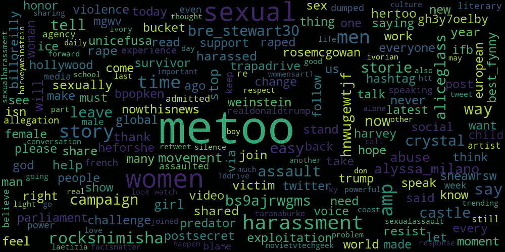
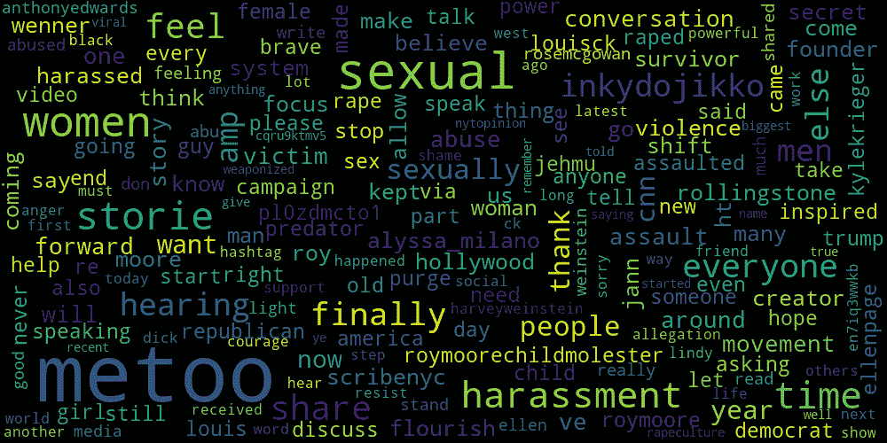
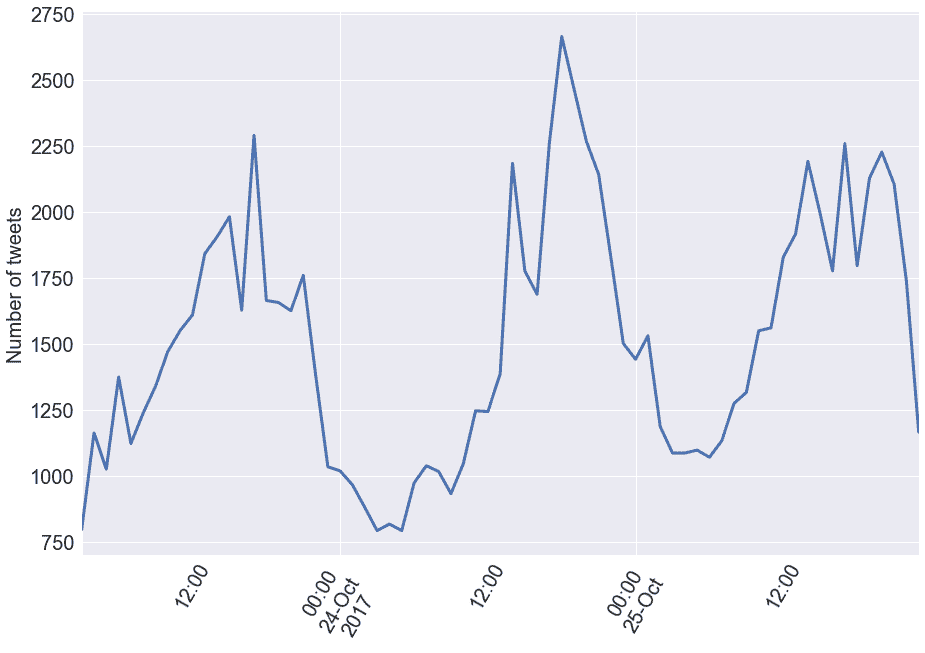
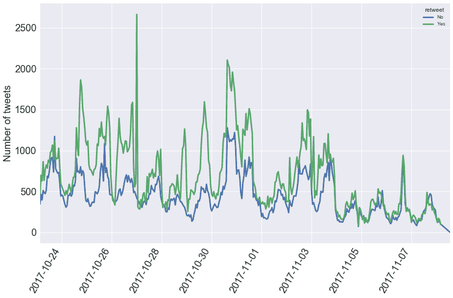
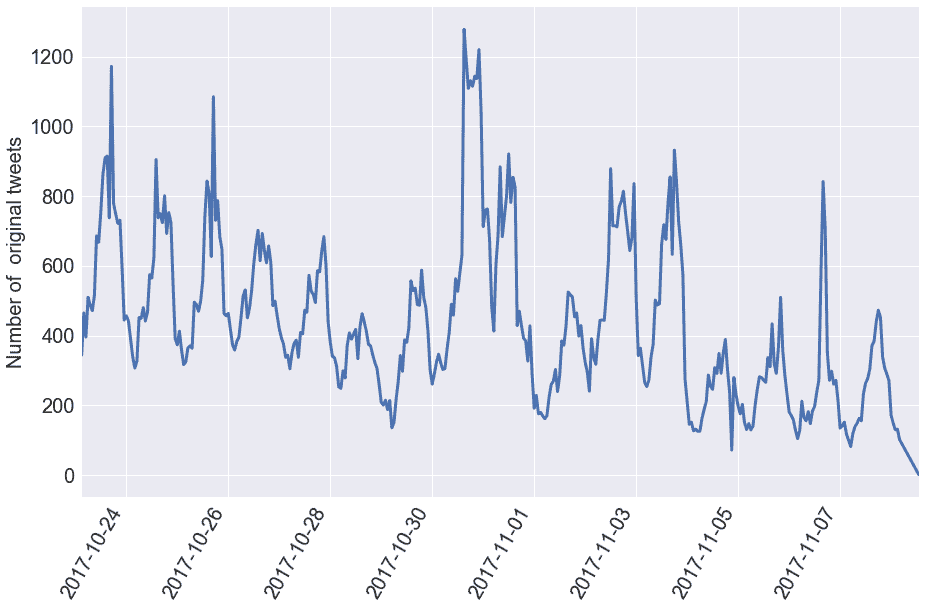
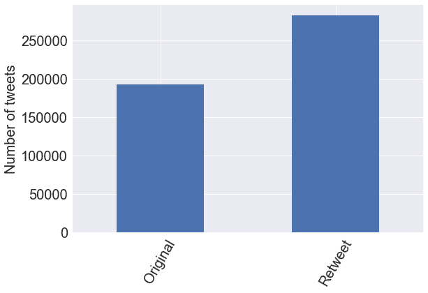
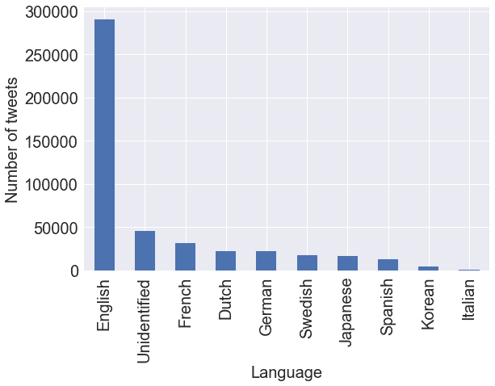
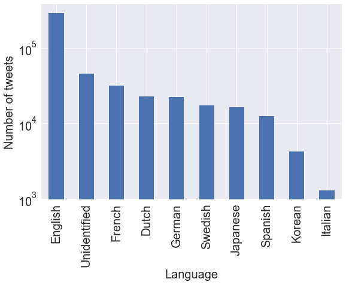
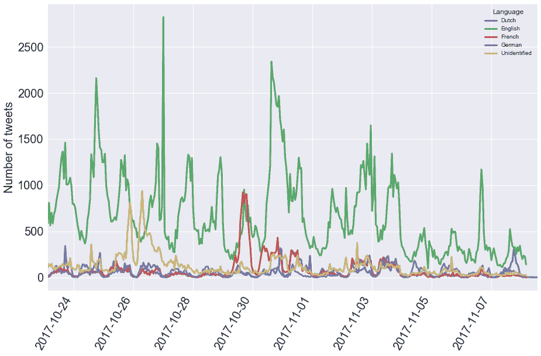

# #MeToo 运动是如何在 Twitter 上传播的

> 原文：<https://web.archive.org/web/20230101103400/https://www.datacamp.com/blog/how-the-metoo-movement-spread-on-twitter>

下面这篇文章包含的内容可能会让一些读者感到不安。这一切都是基于对过去几周包含#MeToo 标签的推文的数据分析。在本文的结论中可以找到用于分析的代码的链接。我们欢迎并鼓励进一步的分析和对话。

| 10 月 24 日至 11 月 7 日的推文文字云 |
|  |
| 11 月 10 日和 11 月 11 日的推特文字云 |
|  |

我用 Twitter API 提取了 50 万条包含#MeToo 标签的最新推文。给定 50 万条推文，不可能给出它们全部包含的内容的摘要。给出最常用单词的一种方法是单词云。上面有两个词云:第一个是从 10 月 24 日到 11 月 7 日之间的推文中生成的；第二个是 11 月 10 日和 11 月 11 日。你能看出有什么不同吗？看看你能找到什么。

对我来说，最明显的区别是被指控的肇事者的名字发生了变化:在第二个词云中，“weinstein”更小，因此在推文中的代表性更低，“billoreilly”不再存在，新的名字，如“louisck”(他承认“[这些故事是真实的](https://web.archive.org/web/20220813094815/https://www.nytimes.com/2017/11/10/arts/television/louis-ck-statement.html)”)和“roymoore”现在出现了。“共和党人”等相关术语也出现了(罗伊·摩尔是共和党人)。出现的许多单词听起来都是真实的。其他人，包括 twitter 用户名，如“aliceglass”，还不太清楚。在这篇文章中，我将深入研究这些推文，我们将了解为什么这些词会出现在词云中。如果你有任何想法、回应和/或反思，请随时在 twitter 上联系我: [@hugobowne](https://web.archive.org/web/20220813094815/https://twitter.com/hugobowne) 。

你可以从这些词云中提取出许多围绕#MeToo 的主要观点。关于更多的上下文，[维基百科](https://web.archive.org/web/20220813094815/https://en.wikipedia.org/wiki/Me_Too_(hashtag%29)声明

> “我也是”(或“#MeToo”，在其他语言中有当地替代词)，作为一个两个词的标签，于 2017 年 10 月在社交媒体上广泛传播，以谴责性侵犯和性骚扰，此前哈维·韦恩斯坦被指控性行为不端。社会活动家塔拉纳·伯克(Tarana Burke)长期以来就在这个意义上使用这个短语，女演员艾莉莎·米兰诺(音译)推广了这个短语，她鼓励女性在推特上宣传自己的经历，以展示厌恶女性行为的普遍性质。从那以后，数百万人使用这个标签来分享他们的经历，包括许多名人。

在撰写本文时，维基百科还报道说

> 到 10 月 15 日，这个短语已经被使用了 20 多万次，到 10 月 16 日，推特被转发了 50 多万次。在脸书，在最初的 24 小时内，超过 470 万人在 1200 万条帖子中使用了该标签。该平台报告称，美国 45%的用户有一个朋友用这个词发帖。

“欧洲议会召开了一次会议，直接回应‘我也是’运动，此前该运动引发了对议会和欧盟驻布鲁塞尔办事处滥用职权的指控。”#MeToo 是一项在过去的一个月中获得了巨大发展势头的运动。在这篇文章中，我将探究它是如何在 twitter 上传播的。

## 推特上#MeToo 的两周鸟瞰图

为了这个分析，我使用 Twitter API 从 10 月 24 日到 11 月 7 日提取包含#MeToo 的推文。这是在第一条#MeToo 推文之后大约一周的两个星期的推文。Twitter API 允许您提取所有推文的子集，因此，尽管推文的绝对数量不会占所有推文的总数，但您将能够看到整体趋势。

让我们先来看看这两周内的推文数量:

尽管大多数标签的半衰期只有几分钟或几小时，但从上面可以看出，#MeToo 已经存在了几个星期。这是一场足够强大的运动，不仅在网上，也在游行和抗议中表现出来。请注意，在上图中，从 10 月 23 日到 10 月 30 日，也就是说，从第一条标有#MeToo 的推文后的一周到之后的一周，该标签的使用没有明显减少的迹象。在那一周里，每天的推文总数相当稳定。只有在第三周，它才显示出下降。还要注意 24 小时的周期性:推特的数量在东部时间晚上 10 点到 12 点之间一直处于最低水平，在东部时间中午 12 点左右达到峰值。这与大多数发自北美的推文是一致的。

如上所述，这两周的推文数量有所减少，但让我们进一步探究一下，看看这段时间有多少推文是原创的，有多少是转发的:

从上面我们可以看到，转发的数量一直占据着原始推文的数量。此外，我们注意到，在过去两周内，推文总数的减少在转发中比在原始推文中更加明显。单看原始推文的数量，你会发现有所减少，但没有你想象的那么多。

我在上面注意到，转发的数量超过了原始推文的数量。事实上，在此期间，60%带有#MeToo 的推文被转发:

然后问题出现了:在 50 万条推特中，有多少条原创推特对所有这些转发负责？在分析时，有 100 条推特被转发超过 1000 次(现在可能会更多，因为转发还在继续)。他们占了捕获的推特总量的约 62，000 条(13%)。请注意，我们的推特搜索不会捕捉到许多转发的内容。

有 1，000 条推文被转发了至少 100 次，这些占所有被捕获推文的 25%以上。

有哪些热门推文？让我们来看看在分析时转发次数最多的 5 条推文:

| 

> As a reminder, if a woman doesn't post [# MeToo](https://web.archive.org/web/20220813094815/https://twitter.com/hashtag/MeToo?src=hash&ref_src=twsrc%5Etfw) , it doesn't mean she hasn't been sexually assaulted or harassed. Survivors don't owe you their stories.
> 
> — Alexis Benveniste (@apbenven) [October 16, 2017](https://web.archive.org/web/20220813094815/https://twitter.com/apbenven/status/919902089110872064?ref_src=twsrc%5Etfw)

 | 

> For my wife, my daughter and all the women ... I support you all. This has to change. [#metoo](https://web.archive.org/web/20220813094815/https://twitter.com/hashtag/metoo?src=hash&ref_src=twsrc%5Etfw) [#nomore](https://web.archive.org/web/20220813094815/https://twitter.com/hashtag/nomore?src=hash&ref_src=twsrc%5Etfw)
> 
> — Jensen Ackles (@JensenAckles) [October 17, 2017](https://web.archive.org/web/20220813094815/https://twitter.com/JensenAckles/status/920149248880009217?ref_src=twsrc%5Etfw)

 | 

> For those who silently carry their [# MeToo](https://web.archive.org/web/20220813094815/https://twitter.com/hashtag/MeToo?src=hash&ref_src=twsrc%5Etfw) , you are loved, cherished and trusted. You don't owe anyone your story.
> 
> — Grace Starling (@GraceStarling4) [October 16, 2017](https://web.archive.org/web/20220813094815/https://twitter.com/GraceStarling4/status/919756449965838336?ref_src=twsrc%5Etfw)

 |
| 

> [#MeToo](https://web.archive.org/web/20220813094815/https://twitter.com/hashtag/MeToo?src=hash&ref_src=twsrc%5Etfw) 。 I'm 14 and he's 36\. I may be deaf, but silence is the last thing you hear from me. pic.twitter.com/hLmBJ7PgmK
> 
> — Marlee Matlin (@MarleeMatlin) [October 18, 2017](https://web.archive.org/web/20220813094815/https://twitter.com/MarleeMatlin/status/920453826364235776?ref_src=twsrc%5Etfw)

 | 

> [# MeToo](https://web.archive.org/web/20220813094815/https://twitter.com/hashtag/MeToo?src=hash&ref_src=twsrc%5Etfw)【https://t . co/vwssdltu 3n】T2
> 
> —莫妮卡·莱温斯基(@ Monica Lewinsky)[2017 年 10 月 16 日](https://web.archive.org/web/20220813094815/https://twitter.com/MonicaLewinsky/status/919732300862181377?ref_src=twsrc%5Etfw)

 |   |

在分析时，这些是被转发最多的*。在收集的数据中被转发次数最多的推文呢？让我们来看看这些:*

 *| 

> That's why I had to leave the Crystal Castle. Here is my story: [https://t.co/bs9aJRwgms](https://web.archive.org/web/20220813094815/https://t.co/bs9aJRwgms) [# MeToo](https://web.archive.org/web/20220813094815/https://twitter.com/hashtag/metoo?src=hash&ref_src=twsrc%5Etfw)
> 
> —Alice Glass (@ Alice Glass) [October 24, 2017](https://web.archive.org/web/20220813094815/https://twitter.com/ALICEGLASS/status/922875671021436928?ref_src=twsrc%5Etfw)

 | 

> 没有简单的方法告诉你。但是是时候了. .[# MeToo](https://web.archive.org/web/20220813094815/https://twitter.com/hashtag/MeToo?src=hash&ref_src=twsrc%5Etfw)https://t . co/HnwugEWtJF】T2
> 
> —Breanna Stewart(@ bre _ Stewart 30)[2017 年 10 月 30 日](https://web.archive.org/web/20220813094815/https://twitter.com/bre_stewart30/status/924954161510150145?ref_src=twsrc%5Etfw)

 | 

> I la diputada s'ha quedat sola denunciant l'assetjament sexual a les dones. Quina pena i quina vergonya. [#MeToo](https://web.archive.org/web/20220813094815/https://twitter.com/hashtag/MeToo?src=hash&ref_src=twsrc%5Etfw)
> © Patrick Hertzog/AFP [pic.twitter.com/AtCxumRu5Z](https://web.archive.org/web/20220813094815/https://t.co/AtCxumRu5Z)
> 
> — Eva Piquer (@EvaPiquer) [October 25, 2017](https://web.archive.org/web/20220813094815/https://twitter.com/EvaPiquer/status/923300624665419776?ref_src=twsrc%5Etfw)

 |
| 

> 华丽的公主画在 [@LaCroix](https://web.archive.org/web/20220813094815/https://twitter.com/LaCroix?ref_src=twsrc%5Etfw) 。[骚扰](https://web.archive.org/web/20220813094815/https://twitter.com/hashtag/harcelement?src=hash&ref_src=twsrc%5Etfw)[【meto】](https://web.archive.org/web/20220813094815/https://twitter.com/hashtag/MeToo?src=hash&ref_src=twsrc%5Etfw)[pic。推特(Twitter)。com/jfm 1 do 6 wlo](https://web.archive.org/web/20220813094815/https://t.co/JFm1do6WlO)
> 
> —frédéric pommer(@ Fred _ POM)[2017 年 11 月 2 日](https://web.archive.org/web/20220813094815/https://twitter.com/fred_pom/status/925998002967375872?ref_src=twsrc%5Etfw)

 | 

> In Sweden, which claims to have achieved the highest level of gender equality in the world, "t0" now women's allegations of sexual violence emerge like a flood. T1, T2 and Sweden's Meitu, T3, # MeToo and T4 Movement.
> 
> — 여성신문 (@wnewskr) [October 29, 2017](https://web.archive.org/web/20220813094815/https://twitter.com/wnewskr/status/924464132493000704?ref_src=twsrc%5Etfw)

 |   |

“ALICEGLASS”是最初单词云中的一个用户名。现在很明显，她的用户名在那里，因为她在收集的推文中被转发了很多。爱丽丝·格拉斯是一位创作歌手，她是电子乐队 Crystal Castles 的创始人和主唱，她离开了乐队，你可以在这里阅读她的声明。大量的转发也是“水晶”和“城堡”出现在单词 cloud 中的原因。

所以我们有其他用数字表示的语言，这很有趣。在北美和英语语言中开始的运动不仅传播到了其他语言，而且以一种重要的方式传播，正如西班牙语、法语和韩语推文在两周内出现在转发量前五名的事实所证明的那样。现在让我们更深入地探讨一下跨语言的 tweets 分布。

## #MeToo 在全球的传播

首先，让我们看看所有包含#MeToo 的推文中出现的语言，并检查它们出现的频率:

英语占主导地位，然后身份不明。然后我们有法国，荷兰，德国，瑞典，日本，西班牙和韩国。由于我们有几个标度的计数(即，以千、万和十万为单位)，用对数 y 轴绘制该图是有意义的，这意味着$10^3$(一千)和$10^4$(一万)之间的视觉距离与$10^4$和$10^5$(十万)之间的视觉距离相同:

我们现在可以看到，虽然英语确实占主导地位，但还有其他几种语言，每种语言都有数万条推文:法语(32K)、荷兰语(23K)和日语(16K)，等等。事实上，近 40%的推文由外语或未识别的语言表示(45K，这通常是外语，只是 twitter 使用的算法无法检测到)。

现在，让我们来探究一下在这两周内，使用#MeToo 标签的不同语言的使用情况是如何变化的:

这个数字至少有三个方面引起了我的注意，值得进一步研究:

*   10 月 26 日，当英语处于低谷时，有一个未识别语言的高峰；
*   10 月 30 日，法语推文的数量飙升至英语推文的数量；
*   在 11 月 8 日，荷兰语推文的数量有一个峰值，并接近英语推文的数量。

现在让我们来研究这些。

## 不明语言推文的激增

对不明语言推文激增的解释是，伊娃·皮克用加泰罗尼亚语转发了以下推文:

> I la diputada s'ha quedat sola denunciant l'assetjament sexual a les dones. Quina pena i quina vergonya. [#MeToo](https://web.archive.org/web/20220813094815/https://twitter.com/hashtag/MeToo?src=hash&ref_src=twsrc%5Etfw)
> © Patrick Hertzog/AFP [pic.twitter.com/AtCxumRu5Z](https://web.archive.org/web/20220813094815/https://t.co/AtCxumRu5Z)
> 
> — Eva Piquer (@EvaPiquer) [October 25, 2017](https://web.archive.org/web/20220813094815/https://twitter.com/EvaPiquer/status/923300624665419776?ref_src=twsrc%5Etfw)

Twitter 的算法无法识别这条推文的语言，加泰罗尼亚语，这条推文在 10 月 26 日周四被转发了 4876 次。

## 法语推文的激增

10 月 30 日，法语推文的激增是由于以下三条推文的转发，分别有 555、347 和 327 条转发:

> 你可以找到四句话对一个受害妇女说。[【metoo】](https://web.archive.org/web/20220813094815/https://twitter.com/hashtag/MeToo?src=hash&ref_src=twsrc%5Etfw)[【平衡木】](https://web.archive.org/web/20220813094815/https://twitter.com/hashtag/Balancetonporc?src=hash&ref_src=twsrc%5Etfw)[【pic . Twitter . com/3 lmauq 3u 4s](https://web.archive.org/web/20220813094815/https://t.co/3lmauq3U4S)
> 
> — Caroline De Haas (@carolinedehaas) [October 29, 2017](https://web.archive.org/web/20220813094815/https://twitter.com/carolinedehaas/status/924654851149189120?ref_src=twsrc%5Etfw)

> 摩根在巴黎参加了示威游行[【metoo】](https://web.archive.org/web/20220813094815/https://twitter.com/hashtag/MeToo?src=hash&ref_src=twsrc%5Etfw)。对她来说，这种动员只能是一个开端。[pic . Twitter . com/m0 swlewjn](https://web.archive.org/web/20220813094815/https://t.co/m0SWleuwJN)
> 
> — Brut FR (@brutofficiel) [October 30, 2017](https://web.archive.org/web/20220813094815/https://twitter.com/brutofficiel/status/924961633654530048?ref_src=twsrc%5Etfw)

> 我喜欢这个卡介苗！[【metoo】](https://web.archive.org/web/20220813094815/https://twitter.com/hashtag/MeToo?src=hash&ref_src=twsrc%5Etfw)[pic . Twitter . com/b5 BBA 4 VC 8d](https://web.archive.org/web/20220813094815/https://t.co/b5bBA4VC8D)
> 
> — caroline le diore (@DioreLd) [October 29, 2017](https://web.archive.org/web/20220813094815/https://twitter.com/DioreLd/status/924667126744576000?ref_src=twsrc%5Etfw)

还要注意的是，上面的第一条推文也包含# Balancetonporc 标签，翻译成英文就是“expose your pig”。# balancetonporc 和轻微变体出现在 27%的法语#MeToo 推文中，现在被认为是#MeToo 的法语类似物。这里可以阅读更多[。](https://web.archive.org/web/20220813094815/https://www.vox.com/world/2017/10/18/16490818/france-me-too-weinstein-sexual-harassment)

荷兰语推特上的小高峰是怎么回事？我将把它作为一个挑战留给热心的读者。

## 结论

在这篇文章中，你看到了#MeToo 运动已经获得了持续的发展势头，尽管它始于北美，但它已经扩展到了全球。你可以通过 twitter 数据可视化(50 万条推文的文字云)看到，在第一次使用该标签后，出现了新的披露和指控，可以合理地得出结论，这是其持续势头的一部分。你也看到了许多推文被转发，这表明参与度很高，即使那些自己没有原创推文的人也是如此。在接下来的几天里，我将提供用于从 twitter 中提取推文并执行上述分析的代码。我热情地鼓励你看看你还能在数据中找到什么。这不能代替广泛阅读和与人讨论。

如果你有任何想法、回应和/或反思，请随时在 twitter 上联系我: [@hugobowne](https://web.archive.org/web/20220813094815/https://twitter.com/hugobowne) 。

您可以在这个库的[中找到用于这个分析的代码。](https://web.archive.org/web/20220813094815/https://github.com/datacamp/datacamp-metoo-analysis)*