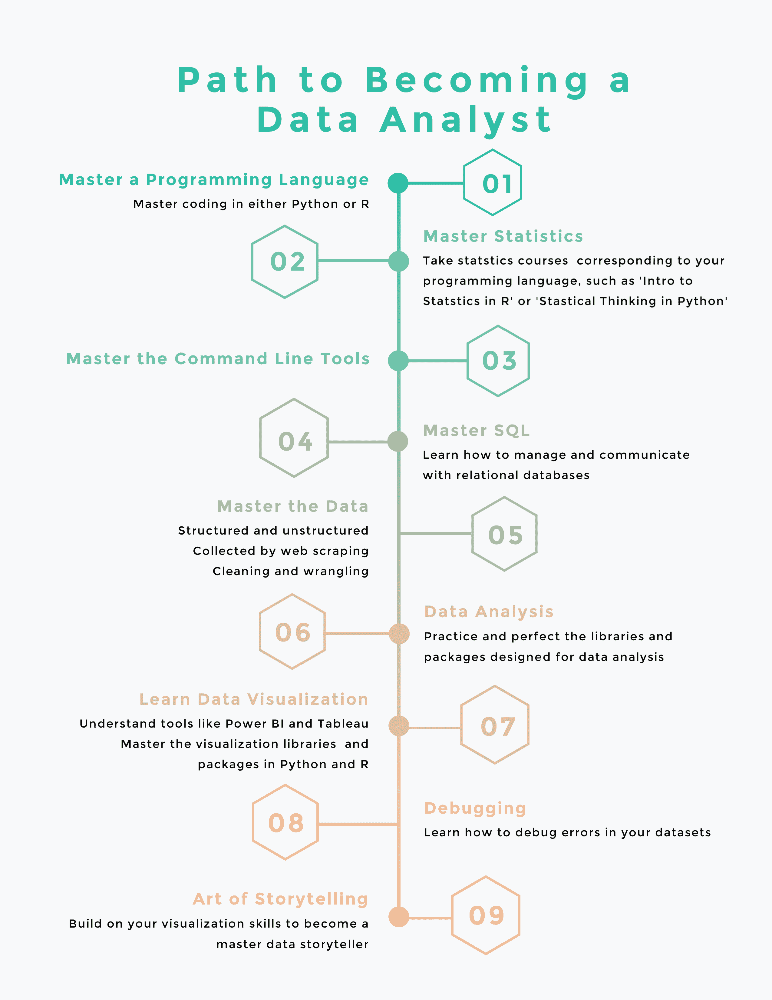

# 如何在 2023 年成为数据分析师:开始职业生涯的 5 个步骤

> 原文：<https://web.archive.org/web/20221210075939/https://www.datacamp.com/blog/how-to-become-a-data-analyst>

## 成为数据分析师的五个步骤

如果你想成为一名数据分析师，你需要采取五个主要步骤:

1.  学习基本的数据分析技能
2.  获得证明这些技能的资格
3.  在各种项目中练习您的数据分析师技能
4.  为你的作品创建一个作品集
5.  申请初级数据分析师工作

在本帖中，我们将更详细地了解这些要点，为您提供开始成为数据分析师之旅所需的一切信息。

## 为什么要开始数据分析师的职业生涯？

近年来，寻找如何成为数据分析师的人越来越多。这个角色变得越来越受欢迎，这对于我们在现代世界创造的[海量数据](https://web.archive.org/web/20221212135912/https://seedscientific.com/how-much-data-is-created-every-day)来说并不奇怪。

各行各业的公司都需要能够驾驭数据、分析数据、从中提取有意义的数据驱动洞察，并利用这些洞察帮助他们解决关键业务问题的专家。因此，有几个原因可以让你考虑从事数据分析师的职业:

*   **对角色的需求**。数据分析师的[就业市场蓬勃发展，](https://web.archive.org/web/20221212135912/https://www.forbes.com/sites/bernhardschroeder/2021/06/11/the-data-analytics-profession-and-employment-is-exploding-three-trends-that-matter/?sh=38142dcf3f81)而且短期内没有放缓的迹象。美国劳工统计局的数据显示，2021 年至 2031 年间，分析师职位数量预计将增长 23%。如果你在寻找一份经得起未来考验的职业，这份工作可能就是你要找的。
*   **工资**。数据分析师的工资通常很高，在美国[的平均工资约为 63，632 美元。](https://web.archive.org/web/20221212135912/https://www.payscale.com/research/US/Job=Data_Analyst/Salary)
*   **工作满意度**。根据 PayScale 的数据，数据分析师普遍对自己的工作非常满意，平均得分为 3.9 分(5 颗星)。

## 如何成为一名数据分析师

下面，我们概述了如何从零开始成为一名数据分析师。这很大程度上是假设你刚进入这个行业，尽管很多都与那些已经具备一些基础知识的人相关。

就成为分析师需要多长时间而言，这在很大程度上取决于个人。那些有一点现有知识和经验的人可以在几个月内掌握技能。对于其他人来说，需要几年的学习。

然而，从本质上来说，你需要几个要素才能在这个行业中茁壮成长，包括:

*   对数据的天生好奇
*   关键编程语言和技能
*   相关项目的组合
*   一份写得很好的简历
*   LinkedIn 和类似网站上引人注目的简介
*   与其他数据专家联网

## 第一步:学习基本的数据分析技能

### 从数据分析的基础开始

普遍的看法是，要开始学习数据分析，你必须擅长数学、统计学或编程。虽然这些领域的背景确实提供了坚实的技术基础，但这并不意味着来自其他教育和专业背景的人无法从事数据分析职业。

学习分析数据需要一些深入的学习、专注和大量的实践。即使当你陷入困境、筋疲力尽、灰心丧气或看不到任何进展时，你也必须保持一定程度的乐观。

一个有抱负的数据分析师应该对数据有创造力和好奇心，有探索的心态，能够进行分析性思考，能够独立工作或在团队中工作，并愿意投入必要的时间和精力。这些都是有助于你成功的品质。

你需要从掌握一些基本的数据分析技能开始，比如统计学的[基础，比如包括中心和扩散的测量、概率分布和假设检验。](https://web.archive.org/web/20221212135912/https://www.datacamp.com/courses/introduction-to-statistics)

你也可以从电子表格中的[数据分析开始，感受收集和争论，并学习 Power BI](https://web.archive.org/web/20221212135912/https://www.datacamp.com/courses/data-analysis-in-spreadsheets) 和其他工具中的[探索性数据分析是如何工作的。](https://web.archive.org/web/20221212135912/https://www.datacamp.com/courses/exploratory-data-analysis-in-power-bi)

### 选择要学习的编程语言

数据分析师通常会使用几种编程语言，这意味着没有错误或正确的选择。本质上，您需要[掌握 SQL](https://web.archive.org/web/20221212135912/https://www.datacamp.com/tracks/sql-fundamentals) 来查询和操作数据库，但是您需要为您的下一个编程语言在 R 和 Python 之间做出选择。

你可以在另一篇文章中找到 Python 和 R 的数据分析对比。你也可以通过 R 或 [Python](https://web.archive.org/web/20221212135912/https://www.datacamp.com/tracks/data-analyst-with-python) 学习[成为数据分析师。](https://web.archive.org/web/20221212135912/https://www.datacamp.com/tracks/data-analyst-with-r)

本质上，在这一点上，您将学习如何用您喜欢的编程语言导入、清理、操作和可视化数据。您将发现一些可以帮助您完成各种任务并提高编程技能的库。

## 第二步:获得数据分析资格

大多数雇主会希望看到你在数据分析方面的资格证明。有各种各样的途径，这很大程度上取决于你目前的教育水平和对主题的熟悉程度。

例如，几所大学提供数据分析的学士和硕士学位，但走这条路需要大量的时间和金钱投入:你需要花 2-4 年的时间进行全日制学习，费用可能在 3-20 万美元之间。

此外，如果你报名参加学士学位课程，你将需要完成数据分析以外的课程要求。成为数据分析师不一定需要学位，但它肯定会有所帮助。

如果你有一台电脑并能上网，网上学习可以让你在世界的任何地方灵活地学习。此外，通过在线课程学习比在大学学习要便宜得多:例如，你可以在不到一年的时间内完成我们的[数据分析师职业轨迹](https://web.archive.org/web/20221212135912/https://www.datacamp.com/tracks/data-analyst-with-r)和[数据分析师认证](https://web.archive.org/web/20221212135912/https://www.datacamp.com/certification/data-analyst)，其成本只是大学学习的一小部分。

一个理想的在线自学计划包括一个详尽而平衡的课程，涵盖最重要的数据分析主题和技术，以及大量实践它们的机会。

因此，如果你正在寻找如何成为一名没有经验的数据分析师，你的学习之路应该是这样的:

## 步骤 3:练习你的数据分析师技能

一旦你掌握了一些基本技能，你就需要开始自己开发它们。有多种方法可以做到这一点:

### 从事单个项目

通过做各种练习和完成课程建议的数据分析项目，你将有大量的机会将你的新技能运用到工作中。练习你的技能，解决模拟或真实世界的问题，将为你未来的工作经验打下坚实的基础。

在这个阶段，获得一些真实、干净的数据集和预选的想法来探索将有助于保持你的学习兴趣，并避免额外的搜索或头脑风暴的干扰。你可以看看我们的一系列[数据科学项目](https://web.archive.org/web/20221212135912/https://www.datacamp.com/projects)来帮助你检验你的技能。

然而，总有一天你会为现实世界的数据分析师工作经验做好准备，你需要继续进行更高级的学习:为了最好地“推销”自己，你会想向潜在雇主展示你独立工作和研究的能力。

因此，你将需要承担个人项目，一切都将由你负责:选择主题，获取必要的数据，思考你的研究方向，设计项目结构，提出并检查假设，有效地交流你的发现，并规划前进的方向。

因此，个人项目通常比指导项目花费更多的时间，但它们将帮助你在求职时脱颖而出。

### 将免费数据集用于数据分析项目

一旦你为你的项目想出了一个好的主题，你的下一步就是找到相关的数据去探索。为此，有许多在线存储库提供各种免费数据集。除了 DataCamp 项目，您还可以使用:

*   [data camp Workspace](https://web.archive.org/web/20221212135912/https://www.datacamp.com/workspace)–一个在线集成开发环境(IDE)，提供用于编写代码、分析数据和练习技能的数据集。
*   最受欢迎的网站，存储了数千个关于各种主题的免费数据集，既有真实世界的，也有合成的。
*   [UCI 机器学习库](https://web.archive.org/web/20221212135912/https://archive.ics.uci.edu/ml/index.php)——包含开源数据集。其中大部分都是干净的、结构良好的和有据可查的。
*   [FiveThirtyEight](https://web.archive.org/web/20221212135912/https://data.fivethirtyeight.com/)–在这里，您可以找到关于不同主流主题的交互式数据驱动文章，以及这些文章使用的数据集。
*   [谷歌数据集搜索](https://web.archive.org/web/20221212135912/https://datasetsearch.research.google.com/)——一个基于关键词的搜索引擎，就像普通的谷歌搜索一样。它存储了超过 2500 万个免费公共数据集。

## 步骤 4:创建数据分析师项目组合

至此，你应该已经在成为一名数据分析师的路上了。然而，要面对潜在的雇主，你需要有一份工作作品集。您可以查看我们关于[构建数据科学组合](https://web.archive.org/web/20221212135912/https://www.datacamp.com/blog/how-to-build-a-great-data-science-portfolio-with-examples)的完整指南，从中获得一些灵感。

当你第一次以入门级数据分析师的身份进入就业市场时，如果你最初的项目组合主要包含来自在线训练营或数据相关大学工作的指导顶点项目，这是可以理解的。在这个阶段，它也是非常好的，并预计将有许多不同的新兵训练营项目对不同的概念进行研究，展示各种工具和技术。

然而，你想用你的作品集让你的激情和兴趣闪耀出来。讲述一个你的技能是如何发展的，你的专长在哪里的故事。你想展示你的技术和软技能，并设计它来吸引你的读者。

理想情况下，你应该避免每个人都有的千篇一律的项目，而是专注于你已经完成的、你最感兴趣的项目。你开发的项目组合越多，你就越能去除大范围的、普通的项目。

当你觉得自己已经准备好探索自己选择的特定业务领域时，你可以开始专注于获取领域知识，并制作与该特定领域相关的个人项目。

您可以将您的数据分析项目组合免费保存在 [DataCamp Workspace](https://web.archive.org/web/20221212135912/https://www.datacamp.com/workspace) 、 [GitHub](https://web.archive.org/web/20221212135912/https://github.com/) 或 [Kaggle](https://web.archive.org/web/20221212135912/https://www.kaggle.com/) 上。它们不是托管此类投资组合的唯一免费平台，但这两个平台广受欢迎，是入门级数据专家的最佳选择，因为它们可以确保您的项目具有良好的可见性。你也可以考虑创建一个个人网站。

## 第五步:开始申请初级数据分析师的工作

一旦你对自己的能力和投资组合有了信心，就该考虑如何找到一份数据分析师的工作了。我们得到了以下一些提示:

### 确保你拥有所需的技能

在开始找工作之前，你可能想快速复习一下你的数据分析师技能，并将其与现代市场对该职位的要求进行比较。

一个好的起点是看一下数据分析师的几个职位的描述，并写下目前最需要的技能。您可以查看我们的[数据分析师职位描述模板](https://web.archive.org/web/20221212135912/https://www.datacamp.com/resources/data-sheets/data-analyst-job-description)以获取一些灵感。

要想得到一份数据分析师的工作，以下是公司通常希望看到的基本技能:

*   Python 或 R(尤其是他们用于数据分析的专用库)
*   结构化查询语言
*   命令行
*   统计数字
*   数据清理和争论
*   数据分析
*   数据可视化
*   网页抓取
*   排除故障
*   数据叙事
*   处理非结构化数据

如果上面的列表看起来让你不知所措，不要感到气馁；你可能不需要所有的数据分析师工作都需要这些技能。通常，每个公司在合适的候选人身上寻找不同的技能。

想了解某个用人单位的具体要求，最好的方法就是阅读相应的职位描述。如果，在这一点上，你觉得你缺少一些关键的技能，考虑提高技能。

最后，不要忘记还有一些重要的数据分析师软技能:

*   分析思维
*   多任务处理
*   好奇心
*   创造力
*   通讯技能
*   灵活性
*   独立工作和团队合作的能力
*   决策
*   商业领域知识

### 创建专业数据分析师简历

现在该写简历了。乍一看，这似乎是一项容易的任务。然而，在现实中，花一些时间和精力来制作一份引人注目、看起来专业的简历，吸引招聘人员的注意是值得的。您可能会发现以下文章很有帮助:[创建数据科学家简历的技巧](https://web.archive.org/web/20221212135912/https://www.datacamp.com/blog/tips-to-build-your-data-scientist-resume)。

虽然本文主要讨论的是为数据科学家角色创建简历，但是这里的大部分技巧也适用于任何其他与数据相关的职业。让我们简要概述文章中最重要的建议:

*   把你的简历放在一页纸上。
*   选择合适的简历模板。您可以从头开始创建，也可以使用带有各种简历模板的在线简历生成器。不妨考虑以下资源:[简历](https://web.archive.org/web/20221212135912/https://resume.io/)、[泽蒂](https://web.archive.org/web/20221212135912/https://zety.com/resume-builder)、[简历生成器](https://web.archive.org/web/20221212135912/https://www.resumebuilder.com/)、 [Canva](https://web.archive.org/web/20221212135912/https://www.canva.com/it_it) 、 [CakeResume](https://web.archive.org/web/20221212135912/https://www.cakeresume.com/) 、 [VisualCV](https://web.archive.org/web/20221212135912/https://www.visualcv.com/) 、 [ResumeCoach](https://web.archive.org/web/20221212135912/https://www.resumecoach.com/lp/resume-builder) 。
*   创建你的主简历。这可以是一份很长的、非常详细的简历，有很多页和很多要点。在这里，你可以包括你所有的工作经验(如果你想转行的话，甚至包括以前不相关的工作经验)，学习，项目，技术和软技能，以及其他相关信息。你可以使用这个版本的简历作为申请任何数据分析师职位的基础。
*   根据您申请的每个职位描述定制您的数据分析师简历。仔细阅读职位描述，弄清楚公司对候选人的要求，在简历中加入/突出必要的技能和关键词。此外，你可以浏览该公司的网站(它的使命、价值观和产品)，并参考它，使你的简历反映出你是最合适的人选。
*   简洁但信息丰富。
*   使用简单但有效的语言。
*   检查错误和错别字。
*   考虑包括以下部分:

*   联系信息
*   目标
*   工作经历
*   项目
*   技能
*   教育

最后四个部分的出现顺序取决于你真实的相关经历，因此也取决于你想先展示什么。

### 开发您的在线档案

你的 LinkedIn/Kaggle/Medium/GitHub 或任何其他相关的专业简介都应该与你的数据分析师简历相符，甚至可以用缩影的形式来表现你的简历。这里的主要目标是让你的读者知道你是一名数据分析师，即使你在这个领域还没有实际的工作经验。

换句话说，你必须提升自己，创造独特的个人品牌，才能进入数据分析的竞争激烈的劳动力市场。

以下是一些有用的提示:

*   保持你的专业档案和项目组合的更新。
*   在标题中，写数据分析师，而不是你现在的职业，如果你是一个职业改变者。避免在标题中添加“渴望”这个词。
*   包括你的照片，也许还有一张与数据相关的封面图片。
*   提供专业的联系方式。
*   包括任何相关的执照、证书、技能、成就、推荐以及与你的其他专业资料的交叉链接。

写一份高效简历的一些建议在这里也适用。简洁但信息丰富，使用简单但有效的语言，检查错误和错别字，仔细检查你的联系方式，避免包括你的技能水平。

### 与其他数据专业人员交流

由于你正试图进入一个全新的领域，你需要开始在数据世界中拓展你的职业网络。创建一个引人注目的 LinkedIn、GitHub 或类似的个人资料是很好的第一步。

然而，你可以更积极地加入各种数据社区或团体，参加在线和现场 meetup 活动和会议，在社交网络上关注和联系合适的人，评论社交媒体数据相关内容，并发表关于数据分析主题的文章。

让数据专家围绕在你身边会有所帮助，数据营、[社区](https://web.archive.org/web/20221212135912/https://www.datacamp.com/community)的数据爱好者可以提供帮助和支持，并拓宽你在数据世界的人脉。

### 申请数据分析师职位空缺

最后，你已经学会了如何成为一名数据分析师，是时候开始申请你的第一份工作了。有大量的资源可以用来找工作，一般的工作门户网站有

[LinkedIn](https://web.archive.org/web/20221212135912/https://www.linkedin.com/) 、[果然](https://web.archive.org/web/20221212135912/https://www.indeed.com/)、 [Google for Jobs](https://web.archive.org/web/20221212135912/https://jobs.google.com/about) 、[simple Hired](https://web.archive.org/web/20221212135912/https://www.simplyhired.com/)、 [AngelList](https://web.archive.org/web/20221212135912/https://angel.co/) 、 [Hired](https://web.archive.org/web/20221212135912/https://hired.com/) 都有房源。

更多面向数据的职位信息，请查看 [DataCamp Jobs](https://web.archive.org/web/20221212135912/https://www.datacamp.com/data-jobs) 寻找并登陆你梦想中的数据职位。另外，请记住，如果您通过 DataCamp 获得了[数据分析师认证](https://web.archive.org/web/20221212135912/https://www.datacamp.com/certification)，您将获得我们职业服务团队根据您的个人需求量身定制的求职支持。

一旦你获得了面试机会，你就需要准备一些[数据分析师面试问题](https://web.archive.org/web/20221212135912/https://www.datacamp.com/blog/how-to-prepare-for-a-data-analyst-interview)，你可以在另一篇文章中找到细节。

### 直接联系潜在雇主

在使用这种求职方法的同时，你可以尝试一种不那么传统、更耗时但也更有效的方法:直接联系感兴趣的公司。

要走这条路线，先找到他们的官网，探索他们的主页和职业页面，找到他们的联系方式。阅读他们的使命和价值观，他们的服务和产品，以及任何其他相关的内容。试着弄清楚你如何成为这个雇主的理想候选人。

一旦你对他们的业务有了更多的了解，你可以给他们发一封电子邮件，附上你为该公司量身定制的数据分析简历，证明你非常适合他们。这的确是一种在特定雇主眼中脱颖而出的安全方式。

### 做好记录，一路调整你的策略

发送简历时，无论是发送到各种求职门户网站还是直接发送到某个组织，都要记录下您发送的简历版本以及相应的公司名称和职位描述。

如果你不能马上找到一份数据分析师的工作，也不要气馁。如果你的求职过程需要一些时间，这是绝对正常的，记住拒绝对大多数人来说是不可避免的障碍。你的失败不应该让你沮丧或失去希望。

继续申请新的工作岗位，继续提高你的技能。试着分析你的简历、作品集或求职过程中哪些地方可以改进，并做出相应的改变。

如果被拒绝了，一定要寻求反馈，如果你得到了反馈，试着通过强化你的优点和改进你的缺点来充分利用这些信息。如果您遵循了本文中的所有建议，那么获得作为数据分析师的第一份工作只是时间、坚持和努力的问题。

## 成为 DataCamp 的数据分析师

现在，你应该知道如何成为一名数据分析师，以及你需要做些什么来实现你的目标。在这篇文章中，我们讨论了:

*   开始学习数据分析的先决条件
*   如何选择最佳资格
*   为什么单个项目对你的投资组合如此重要，以及在哪里搜索数据集
*   可以添加到您的投资组合中的其他项目
*   公司通常在数据分析师身上寻找的技术和软技能
*   创造一份优秀简历的细微差别和技巧
*   您的在线状态、可见性以及与数据专家互动的重要性
*   在哪里以及如何找工作，以及如何在申请时保持乐观和自信

掌握了所有这些信息，是时候让你继续前进，从今天开始学习了。

这个问题的答案取决于你目前的技能和理解水平，以及你的目标是什么。那些有一点现有知识和经验的人可以在几个月内掌握技能。对其他人来说，需要几年大学水平的学习。

要成为一名成熟的数据分析师，你需要掌握很多技能。因此，这可能相当困难。然而，有很多优秀的资源可以帮助你一路走来。另外，你学得越多，就越容易坚持学习。

理想情况下，你需要一些数学和统计学方面的技能。您还需要知道如何分析、建模和解释数据，以及一些编程技能(尤其是 Python、SQL、R 等)。你需要注重细节，有很好的解决问题的技巧，并且能够与他人合作愉快。

外面有很多工具。其中最著名的是 Python、R、SQL、Jupyter Notebook、Tableau、Power BI、Apache Spark，甚至 Exel。你会发现数据分析的每个方面都有工具。

是的，除了大量的工作机会和相对较高的薪水，数据分析师通常对自己的工作感到满意。有很好的发展途径，有各种各样的方法来调整你的职业生涯。

毫无疑问，虽然这可能不是每个人的职业，但几乎任何人都可以学习这些技能，如果他们投入时间和精力的话。有些方面会很有挑战性，进步有时会很慢，但通过循序渐进，有可能掌握成为数据分析师所需的所有技能。