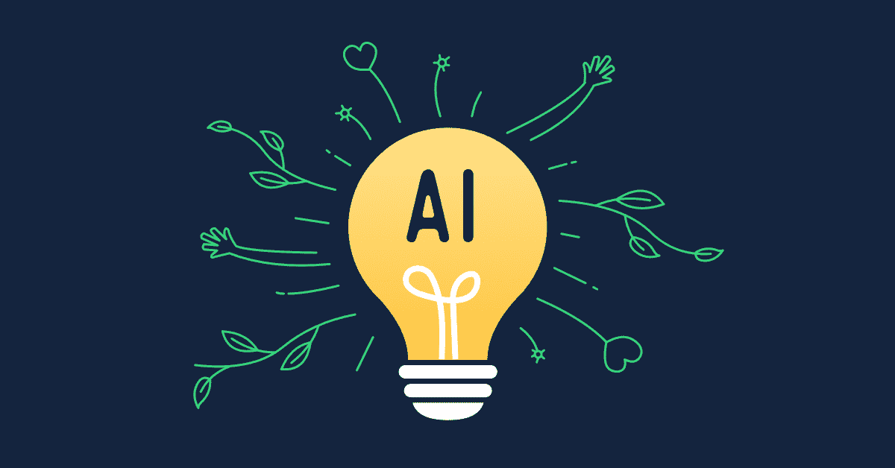
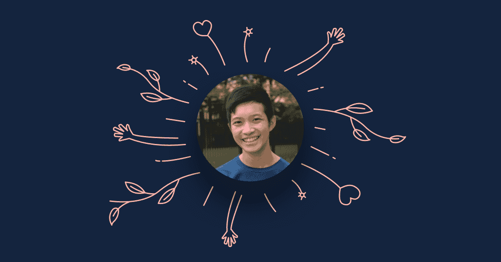
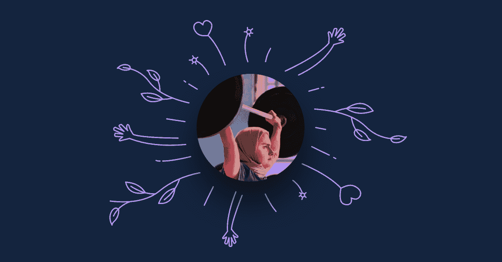
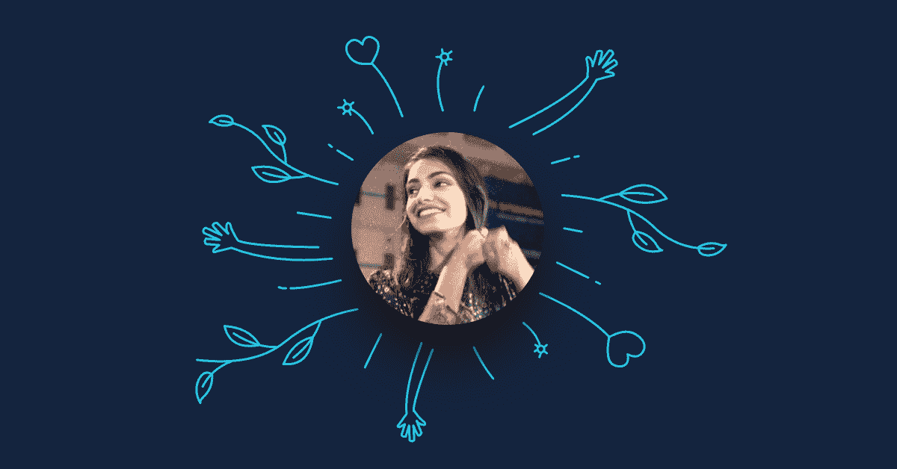

# 如何在数据科学领域建立有意义的职业生涯

> 原文：<https://web.archive.org/web/20230101103339/https://www.datacamp.com/blog/how-to-build-a-meaningful-career-in-data-science>

需要一些灵感来引导您的数据科学职业朝着最有影响力的方向发展吗？

数据科学家的角色通常被称为 21 世纪最性感的工作。也许你被这个职业吸引是因为你热爱数学、编程和一切技术。但我敢打赌，你们中的许多人也对使用数据产生真正的影响感兴趣。

在调整数据和建立机器学习模型的漫长一天结束时，你会想说，“今天我创造了一些将积极影响某人生活的东西。”换句话说，你希望看到你的工作在现实世界中展开。

在 [Omdena](https://web.archive.org/web/20220518135621/https://omdena.com/) ，我们提供了一个协作学习环境，初级人才和经验丰富的导师可以在这里一起应对[现实世界的人工智能挑战](https://web.archive.org/web/20220518135621/https://omdena.com/projects)。我们的使命是将理论教育与实践联系起来，使世界各地的个人能够应对人类面临的一些最大挑战。

我们很荣幸与 DataCamp 合作，帮助我们不同经验水平的合作者利用互联网上最好的课程，按照他们自己的进度学习。

### 来自创伤后应激障碍(PTSD)挑战的三个鼓舞人心的故事

Albert、Kulsoom 和 Anam 都获得了两个月免费参加所有 DataCamp 课程的机会，这是因为他们出色的表现和社区精神。在我们的 [PTSD 人工智能挑战赛](https://web.archive.org/web/20220518135621/https://omdena.com/projects)中，他们与 32 名人工智能爱好者合作了两个月，构建了一个智能聊天机器人，帮助在低资源环境中面临可怕情况的个人诊断 PTSD，例如在战争和难民区。他们都使用了 DataCamp 的课程来提高他们的个人技能，从而真正改变世界。

## 艾伯特

17 岁的 Albert 是我们最年轻的合作者，但他对数据的热情和渴望激励了我们 AI 挑战赛中的其他 32 名合作者。用他自己的话说，这是他对这次经历的看法。

### 你对数据科学中有意义的职业的定义是什么？

我对有意义的 DS 职业生涯的定义是用一个人的知识和技能让世界变得更好。数据科学是一个极其强大的工具，善用它非常重要。像任何东西一样，它可以被用于善意或恶意的目的。

利用 DS 来解决诸如应对气候变化、提高农业产量和检测深度造假等问题，才是真正有意义的影响。

### 在你加入我们的挑战之前，你是如何看待学习 AI 的？

在加入 Omdena PTSD 挑战赛之前，学习 AI 感觉就是上一堆课，看视频，看论文，编程模型。一旦挑战开始，我意识到我错过了一个重要的方面:社区。加入数据科学从业者社区对于获得帮助、被激励以及学习团队合作和协作的技能非常重要！

### 你在这次挑战中学到的最重要的技能是什么，你将应用它来建立你未来的职业生涯？

这个挑战真的教会了我如何在团队中好好工作。在过去，我主要是单独从事我的机器学习项目。在这次 PTSD 挑战中，能够与世界各地的队友合作对于协调不同的任务至关重要。我可以把这段经历带到我未来的职业生涯中。

## 库苏姆

Kulsoom Abdullah 在 2011 年世界锦标赛上成为第一位代表巴基斯坦参赛的女子举重运动员。

### 你在举重生涯中学到的最重要的经验是什么，可以应用到生活中？

我想说我得到的教训是，我低估了自己的能力。很可能我们都低估了自己的能力。

### 作为人工智能中的一名女性，你必须克服的最大挑战是什么？

冒名顶替综合症——感觉自己很失败，觉得自己不配获得成功！

在大学里，我不得不学习并意识到这不是我的错，而是我的环境造成的。我还识别并处理了微侵犯和明目张胆的行为。我通过寻找积极的空间，如信任的家人、朋友、导师，以及照顾好自己来克服它。通过冒险，拥抱我的恐惧，“假装直到你成功”。

“我没有什么可失去的”帮助我向媒体介绍了我的举重比赛挑战和学术/工作情况。

这仍然是一项正在进行的工作。我希望我能继续进步，并帮助别人不处理我不得不做的事情。

### 如果你可以在广告牌上写一句话给正在挣扎的人，你会给他们什么建议？

恐惧和怀疑都是暂时的，继续走下去，享受旅程就好。

## 阿南

当 Anam 加入我们的 [PTSD 人工智能挑战赛](https://web.archive.org/web/20220518135621/https://medium.com/omdena/i-was-struggling-with-ptsd-now-i-help-to-cure-it-through-ai-5bf98fcdd39)时，她几乎没有人工智能经验，但却有着长期与 PTSD 作斗争的个人经历。她加入了我们的 AI 挑战赛，并晋升为初级机器学习工程师。

### 是什么让你加入了 Omdena 的 PTSD AI 挑战赛？

亲身体验 PTSD 的生活对我来说是一个完美的挑战。成为它的一部分比一个人自己的收获更大，比如学习 ML 或增加他们在 it 方面的经验。这意味着帮助那些因创伤后应激障碍而在生活中面临许多障碍的人们。如果这意味着我能在如此大的事业中扮演哪怕是一个小角色，我已经准备好成为这个挑战的一部分。

### 你在这次挑战中学到了什么，你将应用于建立你未来的职业生涯？

通常，作为一所大学的学生，我们会收到一些有明确答案和固定范围的问题。和 Omdena 一起应对这个挑战是完全不同的。它帮助我理解了如何利用我们的知识来解决现实世界的问题并有所作为。这也让我明白，与我们习惯的方法相比，如此大规模和真正影响的问题需要一种不同的方法。一次奇妙的经历！

#### 想成为 Omdena 的合作者，加入我们的一个 AI 来迎接好的挑战吗？[在此申请](https://web.archive.org/web/20220518135621/https://omdena.com/our-projects/)。