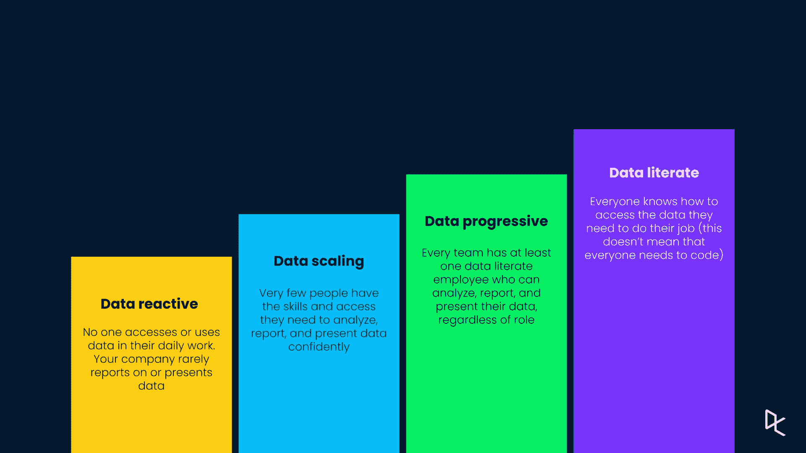
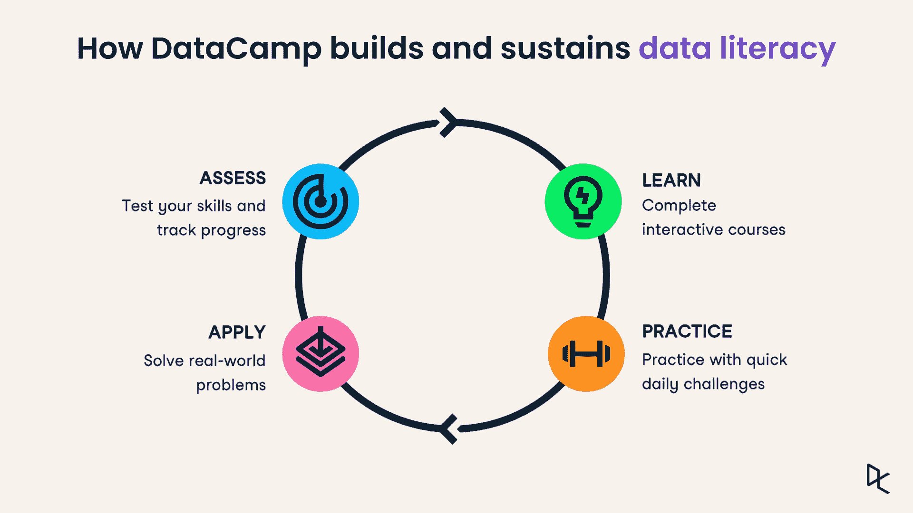

# 如何说服您的经理购买企业数据营

> 原文：<https://web.archive.org/web/20230101103145/https://www.datacamp.com/blog/how-to-convince-your-manager-to-buy-datacamp-for-business>

## 需要回答的重要数据问题

做一些研究是构建你的推销的关键，因为你必须证明在你的工作场所使用 DataCamp 的理由与你的组织的目标和学习文化是一致的。

在此阶段要问的一些问题是:

*   我的组织/团队目前如何使用数据？我们目前使用什么技术(Python、R、SQL、BI 工具、电子表格)？与此相关，有没有我们计划或可能采纳的？

*   我的组织是否有数据战略或数据转换计划？大多数组织都了解更多数据驱动的重要性，但许多组织没有工具或技能来帮助他们实现这一目标。如果您的组织已经宣布了一项数据转型战略，那么人才转型在该计划中处于什么位置？

*   我的组织目前如何提高技能？是否有学习和发展预算？这是通过个人预算还是通过集中的学习和发展团队决定的？您过去是否使用过数据技能培训提供商？如果是，结果是什么，为什么会出现这种结果？

以上问题的答案可以帮助你准备一个符合你的公司和团队目标的案例。例如:如果你的工作场所已经有了一种数据驱动的文化，那么就把你的推销定位在 DataCamp 上，这是变得更加数据驱动的下一步。如果您的组织尚未制定数据转型计划，DataCamp 的技能提升可能是开始制定计划的绝佳机会。

*根据 [NewVantage Partners](https://web.archive.org/web/20220529062128/https://c6abb8db-514c-4f5b-b5a1-fc710f1e464e.filesusr.com/ugd/e5361a_76709448ddc6490981f0cbea42d51508.pdf) 的数据，99%的组织都在投资人工智能和数据科学，但只有 29%的组织有培训目标。据报道，成为数据驱动的最大障碍是缺乏数据技能和文化。*

## 组织你的推销

根据组织的文化和规模，这一步可以采取的形式可以是办公室里的快速推介，也可以是封装在文档中的结构化提案。不管是哪种方式，都要简明扼要。

### 1.这里有几个方法可以让你组织你的推销。

解释为什么 DataCamp 对您的团队有用

阐明为什么购买新工具或技能提升解决方案对团队或组织有益总是很重要的。这里有几个项目可以解释你为什么要推销 DataCamp。

#### 借鉴个人经验

如果你曾经使用过个人 DataCamp 帐户，并发现它很有价值，请讨论你在整个学习过程中获得了哪些技能，以及它们如何帮助你在当前工作中取得进步。这将有助于将潜在的学习成果与组织的目标联系起来。

#### 讨论数据升级的好处

您可以在 [DataCamp 资源中心](https://web.archive.org/web/20220529062128/https://www.datacamp.com/resources)上找到大量信息，解释在所有类型的团队中获得数据技能的重要性。然而，根据您使用的工具堆栈和您在组织中所处的位置，讨论数据升级的重要性是很重要的。这里有一些你可以分享的有价值的资源:

#### 基于数据科学工具的资源:

*   [所有团队都应该学习 SQL 的 3 个理由](https://web.archive.org/web/20220529062128/https://www.datacamp.com/community/blog/why-your-organization-should-upskill-on-sql)
*   [所有团队都应该学习 R 的 3 个理由](https://web.archive.org/web/20220529062128/https://www.datacamp.com/community/blog/three-reasons-why-all-teams-should-learn-r)
*   [为什么贵公司需要 Python 进行业务分析](https://web.archive.org/web/20220529062128/https://www.datacamp.com/community/blog/why-your-company-needs-python-for-business-analytics)
*   【Tableau 如何帮助您的组织获得更好的数据洞察力

#### 数据科学团队资源:

*   [金融分析师如何利用数据技能](https://web.archive.org/web/20220529062128/https://www.datacamp.com/community/blog/how-financial-analysts-can-start-leveraging-data-skills)
*   [成为数据驱动型营销人员](https://web.archive.org/web/20220529062128/https://www.datacamp.com/resources/whitepapers/becoming-a-data-driven-marketer-1)
*   [您的团队可以开始利用数据科学的四种方式](https://web.archive.org/web/20220529062128/https://www.datacamp.com/community/blog/four-ways-your-team-can-start-leveraging-data-science)

#### 将数据技能提升与您组织的战略联系起来

您的组织可能计划变得更加数据驱动，并转型为数据组织。通常情况下，人才转型和使成员具备数据技能是至关重要的组成部分。

DataCamp 提供大多数主要数据工具和概念的课程，可以帮助团队和组织在数据素养领域取得进步。查看[数据表](https://web.archive.org/web/20220529062128/https://www.datacamp.com/resources/?type=data-sheets)部分，获取可与您的团队分享的快速资源，并探索 DataCamp 的[案例研究](https://web.archive.org/web/20220529062128/https://www.datacamp.com/resources/?type=case-studies)，了解各行各业组织转变其数据技能的成功案例。

### 2.解释 DataCamp 对企业的价值

在强调了 DataCamp for Business 为什么会对您的组织有益之后，再来概述一下 DataCamp for Business 提供的一些功能。

*根据[埃森哲和 Qlik](https://web.archive.org/web/20220529062128/https://www.accenture.com/_acnmedia/PDF-115/Accenture-Human-Impact-Data-Literacy-Latest.pdf) 的研究，认为自己懂数据的员工更有可能感到被信任并有权做出更好的决策。*

[DataCamp for Business](https://web.archive.org/web/20220529062128/https://www.datacamp.com/groups/business) 为团队和组织提供单一平台来评估、学习、应用和试验数据。我们的在线平台允许学习者随时随地按照自己的节奏获得所需的数据技能，从概念上的非编码基础知识到数据科学和机器学习。不需要安装或下载软件。学习者观看简短的视频教程，并在无风险的环境中完成动手编程练习，这样他们就可以在浏览器中开始使用自己喜欢的工具和主题。这种现代化的学习方法是我们平均课程完成率达到 60%的原因，远远高于传统的在线课程提供商。

DataCamp 行之有效的学习方法为学习和保持提供了一个循环过程。

#### 以下是一些需要强调的关键特性:

*   [交互式学习体验](https://web.archive.org/web/20220529062128/https://www.datacamp.com/interactive-learning)使任何人都能够通过定时评估来评估他们的数据技能，通过提供定制反馈的交互式课程来获取新技能，并通过有指导和无指导的项目来保留和应用他们的知识。所有这些都在浏览器中，无需安装。
*   [一流的数据技能内容库](https://web.archive.org/web/20220529062128/https://www.datacamp.com/courses)。DataCamp 提供 350 多门课程、10 多项评估和 90 多个项目，由行业和学术界的领先数据科学家提供。
*   [预先定制的学习路径](https://web.archive.org/web/20220529062128/https://www.datacamp.com/tracks/skill)旨在为您提供数据科学、数据分析等方面的所有必要技能。管理人员还可以指定定制的学习路线和任务，从而轻松创建适合您组织的业务和技术挑战的课程。
*   [对于经理而言，简单的团队管理](https://web.archive.org/web/20220529062128/https://www.datacamp.com/groups/business/custom-learning-solutions)—您可以从您的企业仪表板集中管理您帐户的所有方面，无需安装。
*   [通过 DataCamp 的学习排行榜，轻松可视化您组织的数据技能发展](https://web.archive.org/web/20220529062128/https://www.datacamp.com/groups/business/reporting),使您能够跟踪每个人的学习进度，报告您的学习计划的影响，并了解您朝着目标的进展情况。

[https://web.archive.org/web/20220529062128if_/https://fast.wistia.net/embed/iframe/m052ohmwqx?videoFoam=true](https://web.archive.org/web/20220529062128if_/https://fast.wistia.net/embed/iframe/m052ohmwqx?videoFoam=true)

*右键单击[复制此视频](https://web.archive.org/web/20220529062128/https://datacamp-1.wistia.com/medias/m052ohmwqx)的链接，并与您的经理分享。*

如果您需要更多证据，您可以将下面这句话直接复制并粘贴到您的推介中:DataCamp 得到了 2000 多家组织和《财富》1000 强企业中 80%以上企业的信任。通过 DataCamp 学习的公司，包括谷歌、优步、安联、汇丰和诺华，完成率比行业平均水平高出 6 倍。

### 3.讨论定价

当然，你的老板需要知道 DataCamp 的成本——你可以这样讨论这些问题:

*   [DataCamp 的专业计划](https://web.archive.org/web/20220529062128/https://www.datacamp.com/groups/subscribe/account)是我们面向企业的年度会员。每个座位起价 300 美元(至少 2 个座位)，你可以以低于每人每天一杯咖啡的价格提升你的团队或组织的技能。
*   在我们的[企业计划](https://web.archive.org/web/20220529062128/https://www.datacamp.com/business/demo)中，我们还提供了更多高级功能。如果你想了解更多，你可以和我们一起安排一次[免费演示](https://web.archive.org/web/20220529062128/https://www.datacamp.com/business/demo)。

如果您觉得需要更全面的提案，您仍应涵盖这些要点，但现在您可以更详细地介绍数据升级的好处和投资回报。以下是您可以使用的一些资源:

讨论 DataCamp for Business 的额外灵活性和便利性，例如:

*   与[学习管理提供商](https://web.archive.org/web/20220529062128/https://www.datacamp.com/groups/business/integration)兼容，包括[学位](https://web.archive.org/web/20220529062128/https://www.datacamp.com/degreed-data-science-training)以及我们与[单点登录服务](https://web.archive.org/web/20220529062128/https://www.datacamp.com/groups/business/integration)的整合。
*   我们针对企业的专业数据科学[认证](https://web.archive.org/web/20220529062128/https://www.datacamp.com/certification-for-business)。
*   提供一名[客户成功经理](https://web.archive.org/web/20220529062128/https://www.datacamp.com/groups/business/customer-success)，他将与您协商您组织的目标，并推荐学习内容，以快速跟踪您团队的成功。
*   内部流动性高的公司的员工通常会比内部流动性低的公司多呆一倍时间，因此通过提高数据技能来实现这一点是留住员工和降低招聘成本的好方法( *[LinkedIn 2021 年工作场所学习报告](https://web.archive.org/web/20220529062128/https://learning.linkedin.com/resources/workplace-learning-report)* )

你设法说服你的老板了吗？立即让您的团队开始使用[商业数据营](https://web.archive.org/web/20220529062128/https://www.datacamp.com/groups/business)！

