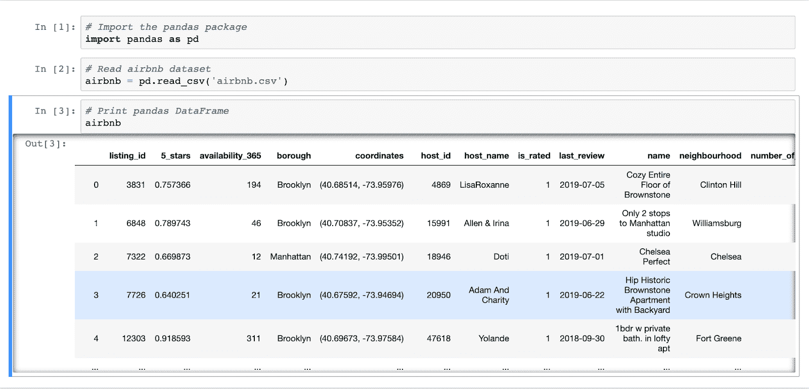
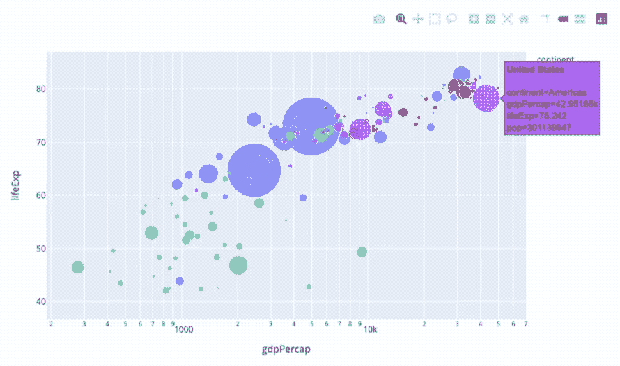

# 如何学习熊猫

> 原文：<https://web.archive.org/web/20221129034451/https://www.datacamp.com/blog/how-to-learn-pandas>

pandas 是最流行的 Python 数据科学包之一，是在 Python 中处理表格数据的标准工具。幸运的是，一个完全的初学者可以在几周内学会并开始用熊猫编程。以下是开始的方法。

## 开始之前需要知道什么

### 熊猫是什么？

pandas 是您应该学习的第一批 Python 包之一，因为它易于使用、开源，并且允许您处理大量数据。它允许快速有效的数据操作、数据聚合和旋转、灵活的时间序列功能等等。

pandas 具有许多与 SQL 或 Excel 相同的功能，并且可以接受各种数据类型——从 CSV 和文本文件到 Microsoft Excel 文件、SQL 数据库等等。它还有一个额外的好处，允许您将它们转换为 DataFrame 对象，data frame 对象只是表示类似于 Excel 中的表格数据的列和行——但在 Python 中。

##### 活动中的熊猫数据框

### 熊猫如何融入 PyData 生态系统？

当使用 Python 分析数据时，pandas 通常与其他包和工具结合使用。这些软件包包括用于对数据进行预测的机器学习软件包，如 [scikit-learn](https://web.archive.org/web/20220828175903/https://scikit-learn.org/) ，数据可视化软件包，如 [Matplotlib](https://web.archive.org/web/20220828175903/https://matplotlib.org/) 和 [seaborn](https://web.archive.org/web/20220828175903/https://seaborn.pydata.org/) ，以及工具，如 [Jupyter Notebooks](https://web.archive.org/web/20220828175903/https://jupyter.org/) ，用于创建和共享包含代码、可视化和文本的报告。所有这些工具构成了通常所说的 [PyData 生态系统](https://web.archive.org/web/20220828175903/https://pandas.pydata.org/community/ecosystem.html)。但是你不需要担心一下子学会所有这些工具——从关注熊猫开始。

## 熊猫学习之旅的六个步骤

### 1)学习基本的 Python 语法

pandas 是一个为 Python 构建的包，所以在开始使用 pandas 之前，您需要牢固掌握基本的 Python 语法。学习语法时很容易陷入困境，因为入门课程通常只关注 Python 语法，这让学习变得很麻烦。

根据经验，您应该在语法上花费尽可能少的时间，并学习足够的语法来开始使用 pandas 完成简单的任务。这里有一个纯 Python 资源列表，可以帮助您入门:

*   [Python 3 实用介绍](https://web.archive.org/web/20220828175903/https://realpython.com/products/python-basics-book/)
*   [Python 的主教程页面](https://web.archive.org/web/20220828175903/https://docs.python.org/3/tutorial/)
*   [DataCamp 对 Python 的介绍](https://web.archive.org/web/20220828175903/https://www.datacamp.com/courses/intro-to-python-for-data-science)

### 2)设置您的 Python 环境

在使用 pandas 之前，您需要在您的机器上设置一个 Python 环境。这将允许你应用你的新技能，并用你自己的数据对熊猫进行实验。

要为数据科学设置 Python 环境，我建议安装一个 [Anaconda 发行版](https://web.archive.org/web/20220828175903/https://www.anaconda.com/products/individual)，以便方便地安装 pandas 以及相关的数据科学包和工具，如 Jupyter 笔记本。

要获得关于使用 Anaconda 设置 Python 环境的入门知识，请观看我的[实践培训](https://web.archive.org/web/20220828175903/https://www.datacamp.com/resources/webinars/setting-up-your-python-environment)的分步教程。你也可以按照初学者指南在 [Windows](https://web.archive.org/web/20220828175903/https://www.datacamp.com/community/tutorials/installing-anaconda-windows) 和 [Mac OS X](https://web.archive.org/web/20220828175903/https://www.datacamp.com/community/tutorials/installing-anaconda-mac-os-x) 上安装 Anaconda。

### 3)边做边学

在 DataCamp，我们相信边做边学是学习和应用编程技能的最佳方式。将您的熊猫技能应用于指导项目将帮助您走出舒适区，学习如何调试和阅读文档，并获得使用真实数据的信心。

要精通 pandas，需要知道如何导入和导出不同类型的数据、操作和重塑数据、透视和聚合数据、从数据框架中获得简单的见解等等。以下是涵盖这些主题及更多内容的资源列表，包含易于实施的指导项目形式的熊猫代码:

*   熊猫网站提供了大量的入门教程。更重要的是，它有许多[社区教程](https://web.archive.org/web/20220828175903/https://pandas.pydata.org/pandas-docs/stable/getting_started/tutorials.html)来帮助新用户入门。
*   熊猫食谱是一本优秀的书籍，提供了丰富的代码，基于项目的方法来与熊猫一起工作。它还介绍了 PyData 生态系统中熊猫经常使用的其他包，如用于数据可视化的 seaborn。
*   数据营提供从初级到高级的一系列熊猫课程。[熊猫基金会](https://web.archive.org/web/20220828175903/https://www.datacamp.com/courses/pandas-foundations)课程向您展示如何从浏览器导入数据框架、进行基本的探索性分析以及分析时间序列。

### 4)使用真实世界的数据处理项目

在真实世界的数据上练习你所学的熊猫技能是一种很好的方式来保留你的技能，并在日常工作中自信地应用它们。

开始你自己的项目有很多种方法。首先，如果您的日常工作需要您处理表格数据，请开始使用 pandas，而不是像 Google Sheets 和 Microsoft Excel 这样的电子表格软件。虽然这最初可能需要更多的时间，但它将帮助你提高和保持你的熊猫技能，从长远来看，使你更快更熟练。

[Kaggle](https://web.archive.org/web/20220828175903/http://www.kaggle.com/) 包含一系列真实世界的数据集和机器学习竞赛。虽然我鼓励你学习机器学习，但它最适合更高级的学习者，所以确保最初专注于专注于数据分析和探索熊猫的项目。你可以通过在 Kaggle 或者像 [Medium](https://web.archive.org/web/20220828175903/http://www.medium.com/) 这样的博客平台上写数据分析笔记本来做到这一点。

### 5)掌握调试的艺术

任何有抱负的程序员需要磨练的最容易被忽视的技能之一是调试。每一个 Python 和 pandas 的实践者，不管技术水平如何，都面临着代码的错误和问题。当您在 pandas 代码中遇到错误时，这些资源可供您使用:

*   当我的代码遇到错误时，谷歌是我的第一个去处。几乎总是，我的熊猫查询的答案会在前十个搜索结果中。
*   [Stack Overflow](https://web.archive.org/web/20220828175903/https://stackoverflow.com/) 是最大的开发者社区，从业者可以通过提问和回答编程问题来寻求代码调试方面的帮助。它目前包含大约 18 万个关于熊猫的问题[。如果你想自己发布一个问题，请确保在措辞问题时遵循他们的](https://web.archive.org/web/20220828175903/https://stackoverflow.com/questions/tagged/pandas?sort=MostVotes&edited=true)[最佳实践](https://web.archive.org/web/20220828175903/https://stackoverflow.com/help/how-to-ask)。
*   文档永远是你的朋友，熊猫文档是广泛的。它涵盖了熊猫所有可能的功能以及最佳实践。

### 6)不断拓展你的熊猫技能

继续建立和扩大你的熊猫技能。许多资源涵盖了先进的熊猫主题。例如，Ashish Kumar 的[掌握熊猫](https://web.archive.org/web/20220828175903/https://www.amazon.com/Mastering-pandas-complete-installation-techniques-ebook/dp/B07WFM4JXZ)涵盖了加速和简化你的熊猫工作流程的技术。这篇[真正的 Python 博客文章](https://web.archive.org/web/20220828175903/https://realpython.com/python-pandas-tricks/)涵盖了高级用户的技巧和诀窍。你也可以开始学习 PyData 生态系统中的其他软件包如何扩展你的熊猫能力，如 [seaborn](https://web.archive.org/web/20220828175903/https://seaborn.pydata.org/) 和 [plotly](https://web.archive.org/web/20220828175903/https://plotly.com/) ，用于创建交互式情节。

##### 用 Plotly 制作的互动情节

扩展您的 pandas 技能的一个很好的方法是重温您在学习之旅开始时编写的一些 pandas 代码。尝试寻找机会来简化您的代码，采用最佳实践，并利用 PyData 生态系统中的其他包。

我希望你能从这篇博文中受到启发，并且这些资源对你有用。掌握熊猫是一个终生的学习之旅——我自己仍在努力。在 DataCamp，熊猫涵盖了我们的核心课程，我们正在不断改进和增加我们的内容。最后，我邀请你加入数千名学习者的 [DataCamp Slack 社区](https://web.archive.org/web/20220828175903/https://support.datacamp.com/hc/en-us/articles/360001915993-The-DataCamp-Slack-Community-An-Overview)，为你的熊猫之旅获得支持！

Adel Nehme 是 DataCamp 的数据科学传播者。他以前是一名内容开发人员，在那里他与讲师合作了一系列 Python 课程，并创建了我们的课程[用 Python](https://web.archive.org/web/20220828175903/https://www.datacamp.com/courses/cleaning-data-in-python) 清理数据。