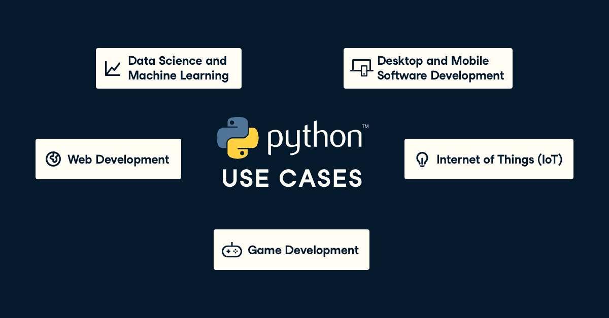
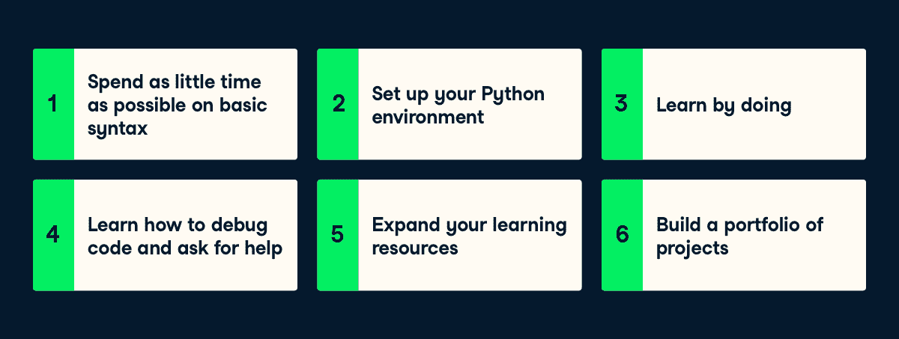
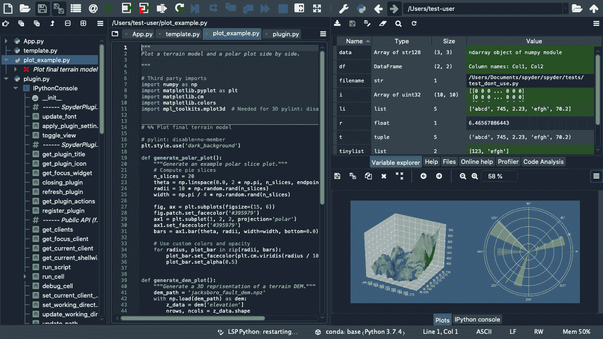

# 如何学习 Python

> 原文：<https://web.archive.org/web/20221129034451/https://www.datacamp.com/blog/how-to-learn-python>

Python 是当今最流行的编程语言，广泛应用于软件和 web 开发、游戏开发、数据科学、机器学习等垂直领域。对于有抱负的数据科学家、数据分析师、数据工程师和机器学习科学家来说，学习 Python 势在必行。

好消息是，一个完全的初学者可以在几周内学会并开始用 Python 编程。以下是开始的方法。

## 在你开始之前知道你的动机

Python 是一种高度通用的编程语言，有许多用例。在开始学习 Python 的过程中，有一个明确的动机是很重要的。瞄准感兴趣的领域将帮助你更快地开始，并过滤掉不适合你的用例的学习资源。当我需要在学校使用 Python 进行数据科学项目时，我开始了自己的 Python 学习之旅。我没有 Python 或编程经验，需要快速上手。幸运的是，通过一些在线资源，我能够在短短几个月内熟练掌握。这里列出了 Python 有帮助的相关领域:

### 1.数据科学和机器学习

Python 受欢迎程度的上升可以归因于其丰富的数据科学和机器学习包和工具集。研究人员使用像 [pandas](https://web.archive.org/web/20220630225156/https://pandas.pydata.org/) 这样的数据分析包来分析 [Covid 数据](https://web.archive.org/web/20220630225156/https://www.sciencedirect.com/science/article/pii/S2352340920310726)，从业者可以通过像 [scikit-learn](https://web.archive.org/web/20220630225156/https://scikit-learn.org/) 、 [Keras](https://web.archive.org/web/20220630225156/https://keras.io/) 和 [PyTorch](https://web.archive.org/web/20220630225156/https://pytorch.org/) 这样的库来快速应用机器学习，以检测欺诈行为、对图像进行分类并产生产品建议。

### 2.桌面和移动软件开发

无论是构建简单的软件应用程序，如计算器，还是更复杂的软件应用程序，如文档编辑器和社交网络。Python 提供了大量的工具来原型化、开发和运行桌面或移动应用程序，例如 [wxWidgets](https://web.archive.org/web/20220630225156/https://wxpython.org/) 和 [Kivy](https://web.archive.org/web/20220630225156/https://kivy.org/) 。

### 3.Web 开发

你知道像优步、网飞和 Spotify [这样的网络应用是用 Python](https://web.archive.org/web/20220630225156/https://yourstory.com/mystory/top-twelve-python-applications-real-world-know/amp) 开发的吗？Python 上有多种简化网站开发的 web 框架。诸如 [Flask](https://web.archive.org/web/20220630225156/https://flask.palletsprojects.com/en/2.0.x/) 、 [Django](https://web.archive.org/web/20220630225156/https://www.djangoproject.com/) 、 [Bottle](https://web.archive.org/web/20220630225156/https://bottlepy.org/docs/dev/) 和 [Pyramid](https://web.archive.org/web/20220630225156/https://trypyramid.com/) 之类的软件包都提供了快速原型化和构建可扩展 web 应用的工具。

### 4.游戏开发

这可能令人惊讶，但像模拟人生 4 和文明 4 这样的游戏都是用 Python 开发的。Python 库如 [PyGame](https://web.archive.org/web/20220630225156/https://www.pygame.org/download.shtml) 和 [Turtle](https://web.archive.org/web/20220630225156/https://docs.python.org/3/library/turtle.html) 简化了游戏的原型和开发。

### 5.物联网

嵌入式系统和物联网(IoT)的兴起推动了跨领域的创新和业务流程改进。Python 提供了一套软件包，使得在 [Arduino](https://web.archive.org/web/20220630225156/https://www.arduino.cc/) 、 [Raspberry Pi](https://web.archive.org/web/20220630225156/https://www.raspberrypi.org/) 和其他[物联网设备](https://web.archive.org/web/20220630225156/https://www.home-assistant.io/integrations/)如 Alexa 和 Google Home 上设计、创建和部署物联网设备变得容易。

## Python 学习之旅的 6 个步骤

### 1.在基本语法上花尽可能少的时间

当学习任何编程语言时，学习语法很容易陷入困境。入门课程通常将重点放在纯 Python 语法上，而不是 Python 如何解决特定问题，这使得学习变得很麻烦。不要误解我的意思:学习 Python 语法对于任何初学 Python 的人来说都是必不可少的，但是根据经验，您应该学习足够的语法来开始处理简单的项目。当我开始我的 Python 数据科学之旅时，我学到了足够的语法，能够使用 [pandas](https://web.archive.org/web/20220630225156/https://pandas.pydata.org/) 完成简单的数据分析任务。以下是语法资源列表:

*   [Python 3 实用介绍](https://web.archive.org/web/20220630225156/https://realpython.com/products/python-basics-book/)
*   [Python 的主教程页面](https://web.archive.org/web/20220630225156/https://docs.python.org/3/tutorial/)
*   [Coursera 由 Google 教授的 Python 速成班](https://web.archive.org/web/20220630225156/https://www.coursera.org/learn/python-crash-course)
*   [DataCamp 的 Python 入门课程](https://web.archive.org/web/20220630225156/https://www.datacamp.com/courses/intro-to-python-for-data-science)

### 2.设置您的 Python 环境

在处理项目之前，您需要在您的机器上设置一个 Python 环境。能够在自己的机器上进行项目是应用新技能的最好方式。为了设置您的数据科学环境，我建议安装一个 [Anaconda](https://web.archive.org/web/20220630225156/https://www.anaconda.com/products/individual) 发行版，它可以方便地安装所有相关的数据科学包，以及一个用于编辑 Python 代码的集成开发环境，名为 [Spyder](https://web.archive.org/web/20220630225156/https://www.spyder-ide.org/) 。

要获得关于使用 Anaconda 设置 Python 环境的入门知识，请观看我的[实践培训](https://web.archive.org/web/20220630225156/https://www.datacamp.com/resources/webinars/setting-up-your-python-environment)的分步教程。你也可以按照初学者指南在 [Windows](https://web.archive.org/web/20220630225156/https://www.datacamp.com/community/tutorials/installing-anaconda-windows) 和 [Mac OS X](https://web.archive.org/web/20220630225156/https://www.datacamp.com/community/tutorials/installing-anaconda-mac-os-x) 上安装 Anaconda。

##### [Spyder 集成开发环境的图像](https://web.archive.org/web/20220630225156/https://www.spyder-ide.org/)

### 3.实践中学习

在 DataCamp，我们相信边做边学是学习和应用编程技能的最佳方式。无论你关注的领域是什么，参与项目都会帮助你走出舒适区，学会如何调试和阅读文档，并向潜在雇主展示你的技能。

#### 数据科学和机器学习

数据科学和机器学习是当今[发展最快的](https://web.archive.org/web/20220630225156/https://business.linkedin.com/content/dam/me/business/en-us/talent-solutions/emerging-jobs-report/Emerging_Jobs_Report_U.S._FINAL.pdf)重点领域之一。在线数据技能培训有许多解决方案:

*   [DataCamp](https://web.archive.org/web/20220630225156/https://www.datacamp.com/) 提供超过 130 门交互式 Python 课程和 39 个项目，涵盖广泛的数据科学和机器学习主题。您将通过直接在浏览器中编码来从头开始构建您的技能，并将您的技能应用于金融、营销、体育、历史等各种数据集。
*   [Python 数据科学手册](https://web.archive.org/web/20220630225156/https://jakevdp.github.io/PythonDataScienceHandbook/)提供了 Python 中主要数据科学包和技术的极好概述。方便的是，所有的内容都可以在 [GitHub](https://web.archive.org/web/20220630225156/https://github.com/jakevdp/PythonDataScienceHandbook) 上以 Jupyter 笔记本的形式获得。
*   Coursera 上的 [IBM 数据科学专业证书](https://web.archive.org/web/20220630225156/https://www.coursera.org/professional-certificates/ibm-data-science)专业化包含九门课程，涵盖了数据分析、数据可视化、机器学习等领域的一系列技术。专业化的[最终课程](https://web.archive.org/web/20220630225156/https://www.coursera.org/learn/applied-data-science-capstone)是一个在 Foursquare 数据上结合这些技术的顶点项目。
*   [Codeacademy 数据科学家路径](https://web.archive.org/web/20220630225156/https://www.codecademy.com/learn/paths/data-science)提供了一系列关于数据科学和使用 Python 进行机器学习的课程，最终形成一个最终的作品集项目。

#### 桌面和移动软件开发

Python 提供了一系列工具来原型化和开发桌面和移动应用程序。以下是帮助您入门的学习资源列表:

*   ZetCode wxWidgets 教程提供了用 [wxWidgets](https://web.archive.org/web/20220630225156/https://wxpython.org/) 构建图形用户界面的分步介绍，并向学习者展示了如何构建一个简单的俄罗斯方块游戏。
*   Kivy 提供了一系列关于如何在 Python 上用 Kivy 构建简单移动应用的教程。

#### Web 开发

Python web 开发的两个主要包是 Flask 和 Django。虽然对这两个包的利弊还有[讨论](https://web.archive.org/web/20220630225156/https://steelkiwi.medium.com/flask-vs-django-how-to-understand-whether-you-need-a-hammer-or-a-toolbox-39b8b3a2e4a5),但这里列出了这两个包的学习资源:

*   烧瓶教程页面解释了如何建立一个简单的博客网站。如果你是一个视觉学习者，[这个 YouTube 视频](https://web.archive.org/web/20220630225156/https://www.youtube.com/watch?v=MwZwr5Tvyxo)是一个很好的用 Flask 建立网站的介绍。
*   使用 Django 教程页面学习构建 web 应用程序。 [Real Python](https://web.archive.org/web/20220630225156/https://realpython.com/get-started-with-django-1/) 也很好地解释了这一点，并包括一个 web 开发人员组合的样本项目列表。

#### 游戏开发

虽然现代游戏开发由虚幻引擎和 Unity 等游戏引擎主导，但大多数开发人员使用 JavaScript、C#、C++或 Java，以下 python 包是进入游戏开发的好方法:

*   PyGame 教程页面向你展示了如何用 PyGame 构建一系列不同的游戏。视觉学习者可以按照[这个 YouTube 视频](https://web.archive.org/web/20220630225156/https://www.youtube.com/watch?v=Q-__8Xw9KTM)用 Python 制作一个太空入侵者游戏。
*   [Real Python](https://web.archive.org/web/20220630225156/https://realpython.com/beginners-guide-python-turtle/) 为 Python 中的游戏开发提供了一个极好的[海龟](https://web.archive.org/web/20220630225156/https://docs.python.org/3/library/turtle.html)包概述，以一个海龟赛跑游戏作为最终项目结束。

#### 物联网

物联网设备在我们周围无处不在，收集关于我们环境的数据，并且预计数量只会增加，以下是涵盖如何使用 Python 对物联网设备进行编程的资源列表:

*   Coursera 的[编程物联网(IOT)专业化简介](https://web.archive.org/web/20220630225156/https://www.coursera.org/specializations/iot)为初学者提供了一系列关于如何用 Python 与 Arduino 和 Raspberry Pi 平台进行接口的课程。这个专业以一个[顶点项目](https://web.archive.org/web/20220630225156/https://www.coursera.org/learn/internet-of-things-project)结束，在这个项目中，学习者将编写一个物联网系统。
*   LinkedIn Learning 的[使用 Python 和 Raspberry Pi 的物联网](https://web.archive.org/web/20220630225156/https://www.linkedin.com/learning/raspberry-pi-essential-training?replacementOf=internet-of-things-with-python-and-raspberry-pi)通过使用不同的项目作为案例研究，向您展示如何使用 Python 编写 Raspberry Pi。

### 4.学习如何调试代码和寻求帮助

任何有抱负的程序员需要磨练的最容易被忽视的技能之一是调试。每个 Python 实践者，不管技术水平如何，都面临着代码的错误和问题。当您在代码中遇到错误时，请确保使用以下资源:

*   当我的代码遇到错误时，谷歌几乎总是我第一个去的地方。我的 Python 查询的答案几乎总是在前 10 个搜索结果中。
*   [Stack Overflow](https://web.archive.org/web/20220630225156/https://stackoverflow.com/) 是最大的开发者社区，从业者可以通过提问和回答编程问题来寻求代码调试方面的帮助。很多时候，你的 Python 问题已经被[问过了，回答了](https://web.archive.org/web/20220630225156/https://stackoverflow.com/questions/tagged/python)。如果你想自己发布一个问题，请确保在措辞问题时遵循他们的[最佳实践](https://web.archive.org/web/20220630225156/https://stackoverflow.com/help/how-to-ask)。
*   文档永远是你的朋友。无论是使用内置的 [Python](https://web.archive.org/web/20220630225156/https://docs.python.org/3/) 函数，还是使用像[熊猫](https://web.archive.org/web/20220630225156/https://pandas.pydata.org/docs/)这样的下载包，你总能在你正在使用的包的网站上找到详细描述功能、可能的错误和教程的文档。

### 5.扩展您的学习资源

既然您已经设置了 Python 环境，参与了指导性项目，并学习了如何调试，那么是时候扩展您的知识并不断提高您的技能了。这里有一个资源列表可以帮助你做到这一点:

*   博客可以帮助你跟上 Python 的最新趋势和技术。我最喜欢的一个是 [Real Python](https://web.archive.org/web/20220630225156/https://realpython.com/) ，因为它在我不会使用的包中托管了入门和教程。他们还有一份包含 Python 技巧和窍门的小型时事通讯。
*   在提高您的 Python 技能时，阅读他人的代码非常有用。对于数据科学和机器学习来说， [Kaggle](https://web.archive.org/web/20220630225156/https://www.kaggle.com/) 是一个极好的资源，可以看到经验丰富的数据科学家如何解决问题。也可以在 GitHub 上看看自己喜欢的开源包的源代码。
*   参加[会议](https://web.archive.org/web/20220630225156/https://python.geekle.us/)、[聚会](https://web.archive.org/web/20220630225156/https://www.meetup.com/topics/python/)，以及其他有更多经验的从业者参加的社区聚会。这将给你机会与更有经验的 Python 程序员交流和学习。

### 6.构建项目组合

现在你已经准备好开始处理复杂的开放式项目，并将它们展示在未来雇主的投资组合中。当处理开放式项目时，最好从简单的开始，处理与您的工作直接相关的 Python 项目。如果你正在寻找灵感，[这篇 Edureka 博客文章](https://web.archive.org/web/20220630225156/https://www.edureka.co/blog/python-projects/)包含了游戏开发、网页开发、数据科学和机器学习领域的开放式项目列表。

你可以通过在 [Github](https://web.archive.org/web/20220630225156/http://www.github.com/) 上托管你的代码并写关于你的项目的博客文章来开始建立你的投资组合。这让你有能力展示你的技术写作能力，并教初学者你如何开发你的项目。你可以通过开发自己的网站或者使用像 [Medium](https://web.archive.org/web/20220630225156/http://www.medium.com/) 这样的博客托管服务来写博客。

我希望你能从这篇博文中受到启发，并且这些资源对你有用。掌握任何编程语言都是一个终生学习的过程——我自己仍在努力。在 DataCamp，Python 是我们核心课程的一部分，我们不断改进和增加我们的内容。最后，我邀请您加入到数千名学习者的 [DataCamp Slack 社区](https://web.archive.org/web/20220630225156/https://support.datacamp.com/hc/en-us/articles/360001915993-The-DataCamp-Slack-Community-An-Overview)中，在您的 Python 之旅中获得支持！

Adel Nehme 是 DataCamp 的数据科学传播者。他以前是一名内容开发人员，在那里他与讲师合作了一系列 Python 课程，并创建了我们的课程[用 Python](https://web.archive.org/web/20220630225156/https://www.datacamp.com/courses/cleaning-data-in-python) 清理数据。