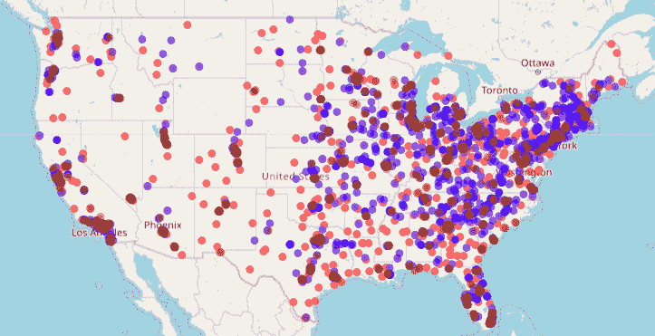

# R 怎么入门

> 原文：<https://web.archive.org/web/20221129034451/https://www.datacamp.com/blog/how-to-learn-r>

r 是 2020 年最流行的语言之一，广泛应用于金融、商业和学术界。对于一个完全的初学者来说，在几周内学会并开始用 R 编程是可能的。以下是开始的方法。

## 1.消费 R 内容

Stack Overflow 对于任何有抱负的数据从业者来说都是一个很好的资源——他们有最大的关于 R 的链接集合和一个 [r-faq](https://web.archive.org/web/20220705000442/https://stackoverflow.com/questions/tagged/r-faq?tab=Votes) 标签，其中包含学习 R 的重要问题和答案。通读这些问题是了解如何解决常见任务和避免常见陷阱的好方法。

CRAN 提供了一个类似的 [FAQ 资源](https://web.archive.org/web/20220705000442/https://cran.r-project.org/doc/FAQ/R-FAQ.html)，以及[任务视图](https://web.archive.org/web/20220705000442/https://cran.r-project.org/web/views/)，其中列出了所有在特定领域使用的 R 包。例如，[财务任务视图](https://web.archive.org/web/20220705000442/https://cran.r-project.org/web/views/Finance.html)列出了应用财务的所有包。

找到关于 R 的博客的主要地方是 R 博客作者。最好的(而且免费！)关于学习 R 的入门书籍是由 Garrett Grolemund 和 Hadley Wickham 所著的数据科学的 [R。](https://web.archive.org/web/20220705000442/https://r4ds.had.co.nz/)

对于视觉学习者来说，YouTube 有许多很棒的解释者视频来帮助你开始。R 节目 101 频道有一位非常热情的主持人。从[为什么你应该使用 R](https://web.archive.org/web/20220705000442/https://www.youtube.com/watch?v=9kYUGMg_14s) 视频开始。我还喜欢[动态数据脚本 R 系列](https://web.archive.org/web/20220705000442/https://www.youtube.com/c/RProgrammingDDS?ucbcb=1)，里面有更长的 [R 编程新手教程](https://web.archive.org/web/20220705000442/https://www.youtube.com/watch?v=BvKETZ6kr9Q)。

## 2.参加在线课程

显然，在 DataCamp，我们是学习数据科学的在线课程的忠实粉丝！关于 R，需要知道的一件重要事情是，它的功能是跨包划分的。R Core 团队开发了一组核心包，称为“base-R”。下载 R 时会包含这些软件包。其他软件包可以由任何人创建——R 生态系统是由社区驱动的。一组特别重要的包装被称为“tidyverse”这些包被设计成能很好地协同工作，并使数据操作和可视化更容易。

*   DataCamp 采用边做边学的方法，包括短视频和动手编码练习。我们的 R 课程从快速介绍 base-R 开始，一直到[介绍 R](https://web.archive.org/web/20220705000442/https://www.datacamp.com/courses/free-introduction-to-r) ，但是我们的大部分课程都是建立在 tidyverse 包之上的，从[介绍 Tidyverse](https://web.archive.org/web/20220705000442/https://www.datacamp.com/courses/introduction-to-the-tidyverse) 开始。
*   Coursera 的 [R 编程](https://web.archive.org/web/20220705000442/https://www.coursera.org/learn/r-programming)涵盖了 R 语言的基础知识，深入到具有挑战性的概念，并使用了具体的例子。
*   LinkedIn Learning 的[数据科学硕士 R](https://web.archive.org/web/20220705000442/https://www.linkedin.com/learning/paths/master-r-for-data-science)路径最适合已经有编程或数据科学经验的学习者。

##### r 包使得创建像这样的交互式可视化和地图变得容易。来源:[传单](https://web.archive.org/web/20220705000442/https://leafletjs.com/) | [OpenStreetMap](https://web.archive.org/web/20220705000442/https://www.openstreetmap.org/) 投稿人， [CC-BY-SA](https://web.archive.org/web/20220705000442/https://creativecommons.org/licenses/by-sa/2.0/)

## 3.设置您的 R 环境

要使用 R，我们建议安装 R、RStudio 和 git，您可能还需要定制 RStudio 和您的 R 概要文件。观看我的[实践培训](https://web.archive.org/web/20220705000442/https://www.datacamp.com/resources/webinars/setting-up-your-r-environment)获得如何做到这一点的分步指南。

如果你喜欢遵循书面说明，你也可以遵循[初学者指南在 Windows、Mac OS X 和 Ubuntu](https://web.archive.org/web/20220705000442/https://www.datacamp.com/community/tutorials/installing-R-windows-mac-ubuntu) 上安装 R。

如果你想在不安装任何东西的情况下使用 R，你可以免费注册 [RStudio Cloud](https://web.archive.org/web/20220705000442/https://www.rstudio.com/products/cloud/) 。

## 4.从事研发项目

没有什么可以替代使用真实数据的实践经验——您可能想要构建自己的数据科学项目组合。

如果你想下载自己的数据，并在数据清理、探索性数据分析和数据可视化方面建立技能， [R4DS 在线学习社区](https://web.archive.org/web/20220705000442/https://www.rfordatasci.com/)有一个名为[整洁星期二](https://web.archive.org/web/20220705000442/https://www.tidytuesday.com/)的伟大项目，它给你一个新的数据集，让你每周尝试分析。更有经验的用户可能希望从 [Kaggle](https://web.archive.org/web/20220705000442/https://www.kaggle.com/general) 下载并导入公共数据集。

当然，如果你能接触到你公司的真实数据，你应该使用它。最好使用你感兴趣的数据，或者对你的职业生涯有影响的数据。接受创造性的、开放式的挑战是掌握新技能的最佳方式。

## 5.继续拓展你的 R 技能

继续建立和拓展你的 R 技能——但是要小心常见的陷阱。帕特里克·伯恩斯的《地狱》是一本关于常见陷阱的经典著作，读起来很轻松愉快。

如果你遇到困难，邮件列表是一个提问的好地方。虽然邮件列表现在可能感觉完全过时了，但主要的好处是列表中有很多使用 R 几十年的人会给你回复，包括开发 R 的 R-Core 团队。

和任何其他语言一样，你需要练习和完善你的 R 技能，以便变得舒适和流利。温习一下 [R 编程](https://web.archive.org/web/20220705000442/https://www.indeed.com/career-advice/interviewing/r-programming-interview-questions)或[机器学习](https://web.archive.org/web/20220705000442/https://www.datacamp.com/courses/practicing-machine-learning-interview-questions-in-r)中的常见面试问题。保持积极的态度，坚持下去，你会在数据科学和分析领域找到一份工作。