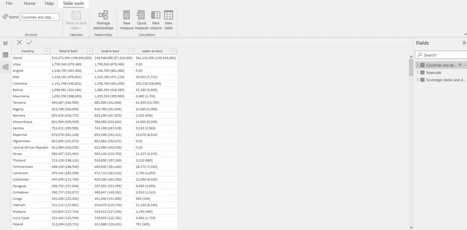
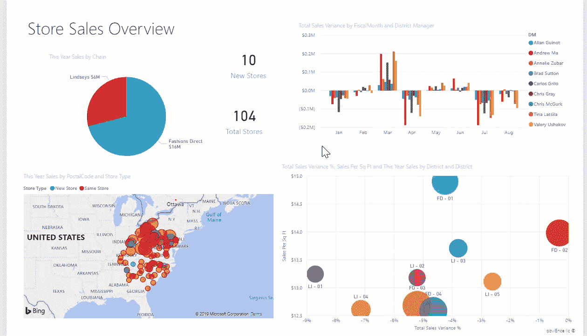
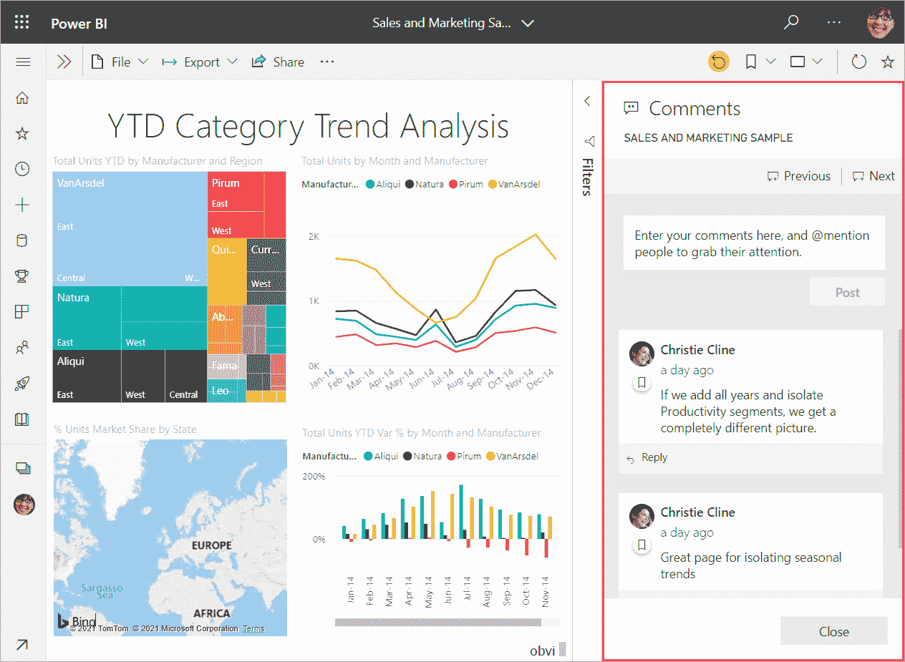
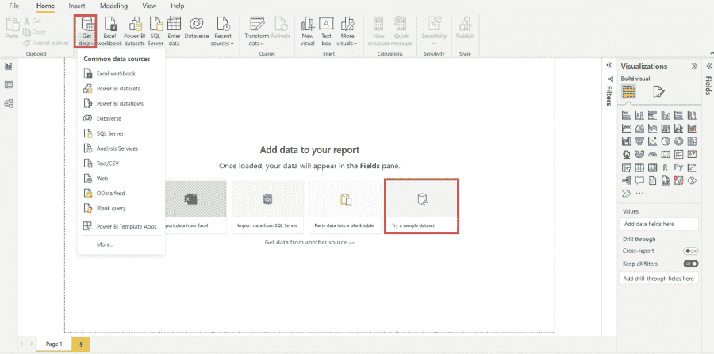
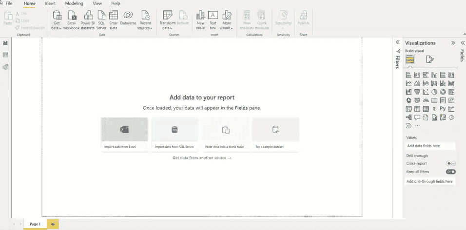
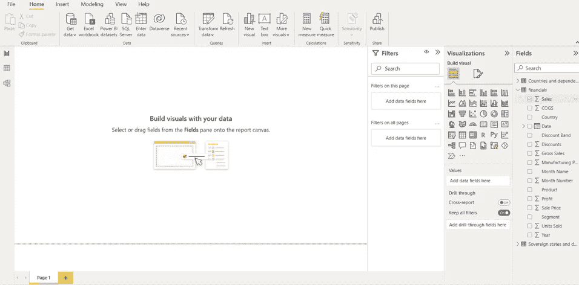
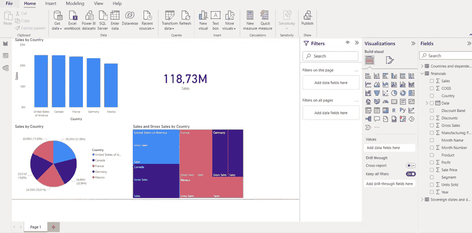

# 如何从 Excel 过渡到 Power BI

> 原文：<https://web.archive.org/web/20230101103007/https://www.datacamp.com/blog/how-to-transition-from-excel-to-power-bi>

微软 Excel 可以说是地球上使用最广泛的数据工具。其易用性和简单的界面使任何人都可以几乎无障碍地处理数据，并执行不同类型的操作，如编辑数据集、应用公式和函数、可视化数据等。然而，随着数据量和复杂性的增加，在 Excel 中进行有效的[数据工作将变得更加困难。这就是微软的另一个工具 Power BI 发挥作用的地方。](https://web.archive.org/web/20221212140010/https://www.datacamp.com/data-courses/spreadsheet-courses)

Power BI 是一款高效而强大的商业智能工具，旨在管理和分析数据，并创建可轻松与其他人共享的动态交互式仪表盘。虽然拥有与 Excel 类似的界面，Power BI 增强了 Excel 在数据驱动时代为非编码专业人士提供支持的能力。幸运的是，这意味着 Excel 专家可以轻松掌握 Power BI 并扩展他们的数据技能。在本文中，我们将通过以下问题来分析 Excel 用户如何开始使用 Power BI:

*   什么是 Power BI？
*   Power BI 相对于 Excel 的优势
*   [如何开始使用 Power BI](https://web.archive.org/web/20221212140010/https://www.datacamp.com/learn/power-bi) 简单教程

## 什么是 Power BI？

Power BI 是一个强大的商业智能工具，使您能够通过易于使用的可定制数据可视化来有效地报告见解。它的拖放界面使非编码专业人员能够设计、部署和共享复杂的可定制仪表板。越来越多的组织正在使用 Power BI，目前有超过 [250，000 个组织](https://web.archive.org/web/20221212140010/https://powerbi.microsoft.com/en-us/blog/microsoft-named-a-leader-in-2021-gartner-magic-quadrant-for-analytics-and-bi-platforms/#:~:text=Microsoft%20Power%20BI%20has%20helped,to%20make%20data%20driven%20decisions.)在使用它。

BI 有三个主要组件，每个组件都有不同的用途:

*   **Power BI Desktop**—提供数据分析和创建工具的桌面应用。它是免费使用的，你可以在这里下载[。](https://web.archive.org/web/20221212140010/https://powerbi.microsoft.com/en-us/desktop)
*   **Power BI 服务**—基于云的 Power BI 版本，提供轻量级报告编辑，以及共享和分发报告的能力。
*   **Power BI Mobile**—Power BI 的移动版本，允许您在旅途中创作、查看和共享报告。

还有 Power BI 的付费版本，如 Power BI Pro 和 Power BI Premium，它们支持协作、数据治理、访问移动应用程序等附加功能。Power BI Pro 也是 [Microsoft Office 365 E5 计划](https://web.archive.org/web/20221212140010/https://www.microsoft.com/en-gb/microsoft-365/enterprise/e5?rtc=1&activetab=pivot:overviewtab)的一部分，这意味着如果您的组织使用 Microsoft Office，您很有可能已经获得了它。

不过，出于入门的目的，你肯定可以坚持使用 Power BI Desktop，因为你可以在 Desktop 中应用的一切也适用于 [Power BI Pro](https://web.archive.org/web/20221212140010/https://powerbi.microsoft.com/en-us/pricing) 。

如果你对 [Power BI vs Tableau](https://web.archive.org/web/20221212140010/https://www.datacamp.com/blog/power-bi-vs-tableau-which-one-should-you-choose) 如何叠加感兴趣，请查看我们的独立文章。

## Power BI 相对于 Excel 的优势

鉴于 Power BI 的流行和从业者使用它的不同方式，它相对于 Excel 的主要优势是什么？虽然我们可以列举很多，但这里是 Power BI 优于 Excel 的三大优势。

### 1.存储和处理大量数据

使用 Power BI 的一个主要优势是能够快速处理大数据集。事实上，如果一个文件的大小超过 500 MB，或者长度超过 100 万行，那么在 Excel 中工作是很困难的。此外，Power BI 可以轻松地连接单独的表，扩展了轻松连接数据集的能力。这是 Power BI 胜过 Excel 的另一个特点。

### 2.设计强大的仪表板和可视化

虽然 Excel 提供了基本的数据可视化功能，但在 Power BI 中工作的主要优势是它能够设计和部署有吸引力的、交互式的、可定制的报告和仪表板。为了体验这些报告的作用，您可以查看 [Power BI 社区图库](https://web.archive.org/web/20221212140010/https://community.powerbi.com/t5/Data-Stories-Gallery/bd-p/DataStoriesGallery)，它拥有由从业者开发的各种仪表板和报告。数据可视化在 Power BI 中有多么强大的一个例子就是交叉过滤特性——它允许数据消费者基于数据的一个或多个维度过滤报告。

### 3.更好、更简单的协作功能

Power BI 相对于 Excel 的另一个关键优势是其协作和共享特性。例如，分析师可以在仪表板和可视化工具上协同工作，这些工具具有评论和注释等功能。此外，您可以为仪表板及其底层数据集设置细粒度的访问级别，这是一种称为[行级安全性](https://web.archive.org/web/20221212140010/https://docs.microsoft.com/en-us/power-bi/enterprise/service-admin-rls)的功能，或者防止在报告中共享过期数据。这使得 Power 阿碧比 Excel 更适合现代的分布式数据工作流。

## 

## Power BI 入门

既然我们已经介绍了 Power BI 相对于 Excel 的主要优势，那么让我们来分析一下任何 Excel 专家如何开始他们的 Power B 学习之旅。此部分分为以下步骤:

*   从基础开始
*   构建一个简单的报告
*   练习你自己的数据
*   将您的 Excel 技能与 Power BI 相结合

### 学习基础知识

当然，在过渡到任何新工具时，学习基础知识总是很重要的。然而，很容易陷入单纯关注基础知识和使用 Power BI 背后的理论的困境。作为一个经验法则，学习足够的基础知识来开始简单的分析和可视化工作，并从那里增长你的信心和技能。出于学习基础知识的目的，这里列出了您可以使用的资源:

*   [如何使用微软 Power BI 作者:Kevin Strartvert](https://web.archive.org/web/20221212140010/https://www.youtube.com/watch?v=TmhQCQr_DCA)
*   [微软的 Power BI 课程和跟踪](https://web.archive.org/web/20221212140010/https://docs.microsoft.com/en-us/learn/powerplatform/power-bi)
*   [Avi Singh 的 Power BI 教程](https://web.archive.org/web/20221212140010/https://www.youtube.com/watch?v=AGrl-H87pRU)
*   [DataCamp 的 Power BI 课程简介](https://web.archive.org/web/20221212140010/https://www.datacamp.com/courses/introduction-to-power-bi)

### 构建一个简单的报告

一旦你觉得你有足够的基础知识可以开始学习，开始学习的最好方法是通过构建简单的仪表板和报告开始练习。你可以通过下载免费的 [Power BI 桌面应用](https://web.archive.org/web/20221212140010/https://powerbi.microsoft.com/en-us/desktop)立即开始这样做。虽然在内存和协作方面存在一些限制，但对于小型数据集来说，这已经足够了。下面是在 Power BI 中构建简单仪表板的分步指南。

#### 获取和加载数据

将数据加载到 Power BI 主要有两种方式。第一种方法是单击菜单中的“获取数据”按钮，然后决定要导入的数据类型。Power BI 支持各种数据类型，从 Excel 工作簿到 SharePoint 文件，甚至可以连接到数据库。

如果您还没有任何数据集可供使用，您也可以尝试一个样本数据集，可以在位于中心的红框中突出显示的部分访问该数据集。

在本教程中，我们将从 Power BI 下载一个示例，名为[财务数据示例工作簿](https://web.archive.org/web/20221212140010/https://docs.microsoft.com/en-us/power-bi/create-reports/sample-datasets#sales--returns-sample-pbix-file)。下载完成后，您只需使用“获取数据”按钮并选择“Excel 工作簿”选项。然后，选择名为 financials 的表，并按 Load 按钮。

一旦你加载了表格，你可以点击“数据视图”来查看它，如下图所示。你会注意到 Power BI 的数据视图界面和 Excel 的用户界面非常相似。此外，您还可以应用类似的操作，比如重命名、添加和删除列、过滤数据、替换列的值等等。例如，我们可以过滤“国家”列以删除“美国”。还可以按升序或降序对列进行排序。

#### 构建报告

现在数据已经加载到 Power BI 中，我们可以构建一个简单的报告。要构建报告，您可以转到下面 gif 中突出显示的报告视图。

在这个窗格中，您可以在右侧看到表格的名称及其对应的列。在本例中，我们可视化了一些与销售和国家字段相关的数据。为此，您可以选择这两个字段，并从可视化效果窗格中选择不同类型的可视化效果。您还可以可视化数据分组，例如“按国家的销售额”。

#### 发布报告

完成报告后，您就可以分享一些漂亮的交互式数据可视化效果了！要共享此报告，您首先需要在 Power BI 服务中发布它。做这件事有三个步骤:

1.  在菜单中单击“文件”后选择“发布”
2.  编译一个目的地，比如我的工作区，然后按 Select 按钮
3.  此时，您需要在 Power BI 中选择打开“您的文件名”链接。它还会要求您登录。如果你还没有注册帐户，它会让你创建一个新的。

就这样！我们的报告现已发布在 Power BI 在线应用程序中。如果您想[与其他人共享报告](https://web.archive.org/web/20221212140010/https://docs.microsoft.com/en-us/power-bi/collaborate-share/service-share-dashboards)，您需要点击顶部的共享按钮。有两种分享方式。第一种可能是复制报告的链接，并将其发送给同事。另一种方法是通过 Outlook 或团队来分享。然而，只有订阅了 Power BI Pro 或 Power BI Premium 的[服务](https://web.archive.org/web/20221212140010/https://powerbi.microsoft.com/en-us/pricing),才可以与其他人共享报告。

## 在你自己的数据上练习

Power BI 应用程序的简短示例展示了它如何加速基于 Excel 的数据从业者的工作流程。更广泛地说，Power BI 拥有一系列功能，在处理日常数据任务时可以提高生活质量。为了让你的商务智能技能更上一层楼，从日常工作中的项目开始练习。这可以是在工作中使用自己的数据时使用 Power BI 而不是 Excel，或者在您感兴趣的数据集上构建项目组合。关于建立项目组合的最佳实践，你可以听听尼克·辛格和凯文·霍在 [DataFramed 播客](https://web.archive.org/web/20221212140010/https://www.datacamp.com/community/podcast/ace-the-data-science-interview)上的发言。

## 不要停止使用 Excel

即使我们指出 Power BI 与 Excel 相比具有更优越的功能，但这并不意味着您必须停止使用 Excel。相反，Excel 是对 Power BI 的极大补充，它们绝对可以[一起使用](https://web.archive.org/web/20221212140010/https://www.red-gate.com/simple-talk/databases/sql-server/bi-sql-server/best-worlds-using-excel-power-bi-together)。使用这两种工具的一种方法是在 Excel 中进行简单的预处理，保存修改，并使用 Excel 的发布功能直接发布到 Power BI。您还可以利用 Power BI 的[Excel 分析](https://web.archive.org/web/20221212140010/https://docs.microsoft.com/en-us/power-bi/collaborate-share/service-analyze-in-excel)功能深入了解 Power BI 报告的底层数据。结合使用这两种工具进行有效的数据处理有很多种方法，因此请确保采用最适合您正在执行的任务的工具。

## 更多电源 BI 资源

我们希望本教程对你有用。本文旨在提供一个快速概述，让您毫不费力地开始学习 Power BI。让我们重复一下，虽然 Power BI 对于获得高级功能非常重要，但 Excel 有自己的实用程序，最好与 Power BI 结合使用。

本教程还为您提供了学习更多专业应用的基础知识。为了更深入地学习，DataCamp 提供了 Power BI 中的[数据可视化](https://web.archive.org/web/20221212140010/https://www.datacamp.com/courses/data-visualization-in-power-bi)和 Power BI 中的[数据建模](https://web.archive.org/web/20221212140010/https://www.datacamp.com/courses/data-modeling-in-power-bi)课程。如果你喜欢在商业案例中直接应用知识，你也可以看看[案例研究:在 Power BI](https://web.archive.org/web/20221212140010/https://www.datacamp.com/courses/case-study-analyzing-job-market-data-in-power-bi) 中分析就业市场数据。

想要从事数据方面的职业？在微软能源商务智能职业跟踪中发现我们的[数据分析师，您将立即为工作做好准备。](https://web.archive.org/web/20221212140010/https://www.datacamp.com/tracks/data-analyst-in-power-bi)