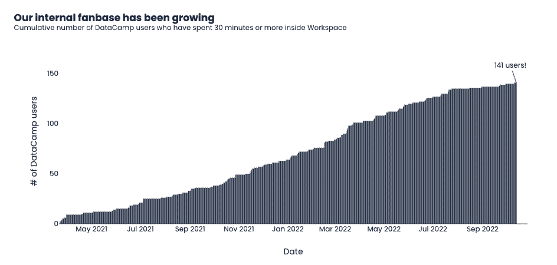
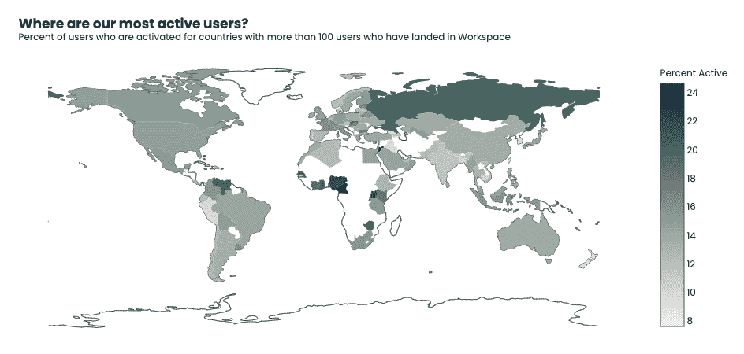
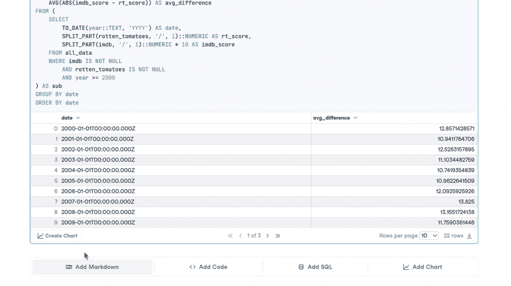
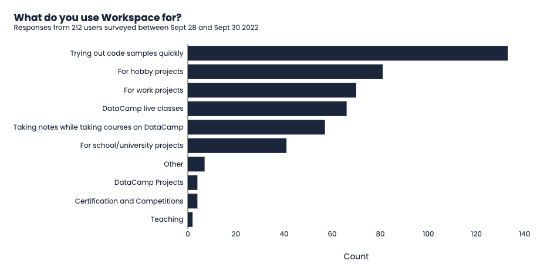

# 我们如何切换到 Workspace 进行内部分析

> 原文：<https://web.archive.org/web/20221212135909/https://www.datacamp.com/blog/how-we-switched-to-workspace-for-our-internal-analytics>

当 DataCamp Workspace 首次推出时，我们努力确保它是执行数据科学和数据分析工作的最佳体验。这意味着构建一个快速、轻量级的编辑器，实现实时协作，并生成专业的只读报告。

同时，我们依靠第三方工具来执行我们的内部分析。使用 Workspace 的用户数量和在平台上花费的时间等产品指标使用其他工具进行跟踪。我们意识到，如果我们想认真地将 Workspace 作为专业工作的工具，我们需要自己使用它。

本文将深入探讨我们过去如何进行内部分析，以及我们如何过渡到 Workspace。它还将涵盖我们从过渡中获得的优势和经验。

## 我们的工作区前分析

在 Workspace 之前，我们对产品进行内部分析的主要工具是元数据库。Metabase 是一个商业智能工具，它连接到一个包含工作区内容和活动信息的数据湖。有了元数据库，我们可以快速运行 SQL 查询，生成报告，甚至创建动态仪表板。

元数据库在团队中被广泛使用。我们使用它来监控用户对不同类型内容的参与程度，用户在 Workspace 上花费的时间，以及每天、每周和每月有多少用户与 Workspace 进行交互。

在这一点上，使用 Workspace 进行分析并不常见。只有当我们遇到 SQL 或 Metabase 的无代码可视化能力的限制时，才会发生这种情况。在这些情况下，我们将导出原始数据，手动将其添加到新的工作空间，然后继续使用 Python 进行分析。然而，这一过程非常繁琐，使得更新数据变得非常困难。

## 为什么我们过渡到工作空间

随着 Workspace 的发展，我们想要回答的关于用户及其在 Workspace 上的时间的问题变得越来越复杂。尽管元数据库非常方便，但我们的许多问题都需要 Python 和 r。

我们也知道，如果我们想提供最好的用户体验，我们需要自己使用它，这种做法叫做“狗食”。事实上，要理解 Workspace 的局限性和令人沮丧的地方，还有什么比我们自己使用它更好的方法呢？

出于这两个原因，我们设定了从 2022 年夏天开始将大部分分析从元数据库转移到工作空间的目标。

## 转变

当我们在 Workspace 中启动 SQL 单元时，这种转变就开始了。现在，我们能够查询我们在元数据库中访问的相同数据，但是查询结果立即转换成 Python 或 R DataFrame(取决于我们使用的工具)。我们可以很容易地在查询数据库和使用我们选择的工具分析结果之间切换。几周之内，我们将大部分现有查询从 Metabase 迁移到 Workspace。

截至撰写本文时，我们有 141 名不同的 DataCamp 用户在 Workspace 中花费了 30 分钟或更长时间。从图表中可以看出，这是一个稳定的进步！

我们不断招募新的数据营员加入 Workspace！

## 切换到 Workspace 的优势

自从切换到 Workspace 后，我们在日常工作中发现了几个关键优势:

1.  **完全可定制的可视化:**虽然元数据库提供了许多可视化和可定制的属性，但可能性并不是无限的。使用 Workspace，我们的 SQL 查询结果将作为数据帧返回。这意味着我们可以使用 Python 库(如 Plotly)来创建带有注释、自定义主题和独特绘图类型的图表。

*我们通过访问内部数据在 Workspace 中创建了一个可视化示例。*

1.  **高级分析:**通过将 SQL 与 Python 或 R 相结合，我们可以使用 SQL 无法实现的技术即时分析我们的数据。这使我们能够对用户进行细分，并训练分类模型来预测用户在工作区内的工作方式。
2.  **描述性报告:**仪表板对于熟悉产品的用户来说是非常好的。然而，对于新来的人或者团队之外的人来说，解释一个仪表板是有挑战性的。借助 Workspace，我们可以在整个报告中嵌入书面摘要，供相关利益相关方日后阅读。
3.  **可共享和社交出版物:**共享已发布工作区链接的能力已经变得非常有价值。发布的分析最终会到我们的首席执行官和其他高管手中，然后他们会以评论和问题的形式添加反馈。结合已发布工作空间的描述性质，管理层可以在闲暇时通读分析工作，而无需面对面的简报。
4.  **无代码图表:**大多数数据营员都有 SQL 技能，但并不是每个人都能熟练地使用 Python 或 r。图表单元格使不太懂技术的用户能够使用高质量的可视化工具交流他们的见解，而无需编写一行代码。

*我们的无代码图表单元格在行动！*

## 到目前为止我们所了解到的

截至 10 月中旬，DataCampers 已经在 Workspace 中累计工作了 4132 小时！我们现在已经将所有与季度目标和产品使用相关的集中报告迁移到 Workspace。以下是我们的主要经验总结，以及这些经验对工作空间产品的影响:

1.  **速度至关重要:**工作区加载、代码执行或查询返回结果的等待时间比预期的要长，这很烦人。这种体验应该至少和在本地运行的 Jupyter 笔记本上工作一样快，甚至更快。我们的团队在减少笔记本和出版物加载时间方面取得了长足的进步。他们还努力确保代码执行与本地笔记本相当。
2.  **不是每个人都想看代码:**过去，我们的出版物会包含充满复杂 SQL 查询和密集 Python 代码的大单元格。虽然这有助于同事们审查报告的技术方面，但它往往会妨碍对报告的真实见解。您可以通过切换到 Workspace 中的 JupyterLab 编辑器来隐藏单元格和出版物，但这并没有反映在 DataCamp 笔记本编辑器中。了解到这一点，我们已经发布了一种方法，可以毫不费力地在您的工作空间中隐藏代码和 SQL 单元格。这允许您确保一个漂亮的只读报告，您可以与任何利益相关者共享。我们的用户喜欢它。
3.  **重新运行笔记本电脑可能会令人沮丧:**在我们的大部分跟踪中，我们严重依赖于用户数量、活动水平和功能采用情况的每日更新。与有新数据时刷新的动态控制面板不同，工作区每次都必须重新运行。根据我们自己的经验，我们计划支持工作区执行调度。这将确保报告始终包含最新的见解。

这些学习不包括自从我们切换到 Workspace 以来对编辑器所做的许多小调整。在内部和外部用户反馈的推动下，用户界面、仪表板和图表单元格等功能正在不断改进。

## 前进

虽然使用我们自己的产品的过程揭示了我们可以改进的许多方面，但我们知道这只是故事的一半。结合我们内部收到的反馈，我们的团队一直在努力采访 Workspace 用户。这些访谈补充了我们的发现，并帮助我们抓住内部测试中可能遗漏的内容。

我们还在 9 月下旬发起了一项用户调查，作为我们双周简讯的一部分。这项调查使我们能够从用户那里收集定量信息。这些结果有助于我们确定工作空间的高优先级计划，并了解我们的产品是如何使用的。当然，调查数据是用 Workspace 分析和可视化的！

我们的用户报告使用 Workspace 的主要原因是为了快速试用代码示例。你如何使用 Workspace？

在接下来的几个月里，我们计划向工作区专属的分析环境更进一步。随着我们的工程团队对产品的每一项新功能和改进，这种过渡变得更加容易。

如果您对使用 Workspace 来满足您自己的内部数据分析和数据科学需求感兴趣，您可以在此阅读更多相关信息[。或者更好的是，跳到一个空的](https://web.archive.org/web/20221129032949/https://workspace-docs.datacamp.com/) [Python](https://web.archive.org/web/20221129032949/http://app.datacamp.com/workspace/new?_tag=template&templateKey=python-base&utm_source=media&utm_medium=blog&utm_campaign=workspace-transition-article) 或 [R](https://web.archive.org/web/20221129032949/http://app.datacamp.com/workspace/new?_tag=template&templateKey=r-base&utm_source=media&utm_medium=blog&utm_campaign=workspace-transition-article) 工作区，现在就开始编码吧！