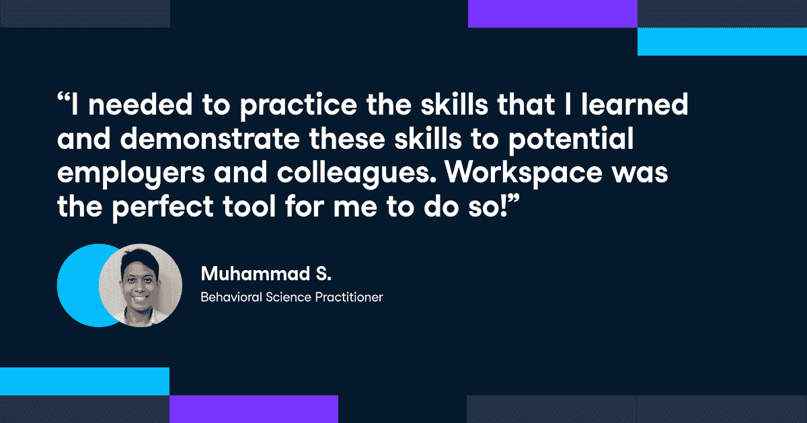

# 工作空间如何促进学习者的个人发展

> 原文：<https://web.archive.org/web/20230101103145/https://www.datacamp.com/blog/how-workspace-empowers-learners-personal-development>

在这篇博文中，我们采访了三位学习者，以了解使用 Workspace 如何让他们的学习之旅受益，并帮助他们提升职业前景。

### 完美的技能提升环境

Muhammad Salman 是新加坡的一名行为科学从业者，他一直使用 Datacamp 作为一种提高 r。

在出于对人工智能的兴趣开始使用 DataCamp 后，他意识到自己的兴趣与 r 更一致。使用 DataCamp，他做出了改变，并从今年年初开始勤奋练习，共完成了 15 门课程！

Muhammad 使用 Workspace 作为工具来继续他的学习之旅，并应用他新获得的数据技能。

### 理想的个人发展环境

edX 的产品经理 Nathan 在 2017 年初开始使用 DataCamp。当时，他将它作为发现 Python 和分析的一种手段，并完成了超过 15 门课程和数据科学职业生涯！

Workspace 发布后，他开始将它作为一个有双重目的的文件夹使用:首先，能够将他学到的所有东西联系起来作为实践，其次，建立一个学习者记录，记录他所有的课程和完成的工作，可以在他的个人资料中查看。他继续解释说，他的主要目标是创造一个他思考的产物——“我能做什么”和“我不能做什么”。

对于内森来说，工作空间的概念不仅仅是获取知识，而是保留和练习。这是他在纽约 Airbnb 上的工作空间出版物中看到的，该出版物基于来自 Kaggle 的数据集，鉴于他正在预订蜜月，它感觉离家很近。正是这些小事情让练习和应用你的技能变得更有价值。

> Workspace 是我真正突破数据科学知识极限的理想工具。内森

Nathan 将于今年秋天在密歇根大学攻读应用数据科学硕士学位。他认可 DataCamp 帮助他被录取，我们迫不及待地想看到他将要完成的惊人的事情！

### 便捷的在线编码工具

Ray 一开始有制药背景，但目标是进入数据科学领域。为此，他报名参加了加州大学博尔德分校的研究生学位课程，开始了他的职业生涯。

Ray 主要使用 Workspace 作为工具，为职业发展目的构建他的投资组合。他利用自己的技能发表了大量见解，从对全球健康和财富的分析到掷骰子游戏。Ray 一直使用 Workspace 作为他练习和应用代码的首选工具。

Workspace 提供的独特价值主张，如无需安装的基于云的编码环境，是 Ray 最感兴趣的:

> 我最喜欢 Workspace 的一点是，我几乎可以在任何地方设置一点伪云...登录单点并继续(工作)。-雷

有兴趣了解 Workspace 如何改善您的学习之旅吗？立即开始使用[工作空间](https://web.archive.org/web/20220528193403/http://workspace.datacamp.com/)！

