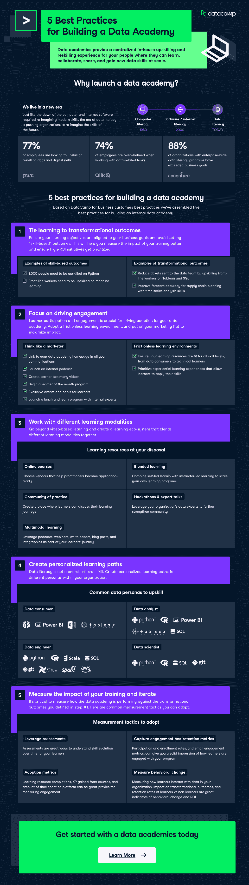

# [信息图表]建设数据学院的 5 个最佳实践

> 原文：<https://web.archive.org/web/20221210085053/https://www.datacamp.com/blog/infographic-5-best-practices-for-building-a-data-academy>

随着组织试图在数据驱动的时代蓬勃发展，数据科学技能变得越来越需要。根据普华永道对 32，000 多名员工的调查，在对自动化和使用自动化系统的需求越来越关注的情况下，77%的员工正在寻找机会重新掌握数字和数据技能。

因此，组织正在建立内部数据科学技能学院，以提高数据流畅性，并将学习嵌入工作流程。该信息图将展示从面向企业客户的 DataCamp 中学到的构建数据学院的 5 个最佳实践。

## 构建数据学院的 5 个最佳实践

### 1.将学习与变革成果联系起来

确保你的学习目标与你的业务目标一致，避免设定“基于技能”的结果。这将有助于您更好地衡量培训的影响，并确保高投资回报计划得到优先考虑。

| **基于技能的结果示例** | **转型成果示例** |
| 1000 个人需要用 Python 升级技能 | 通过提高一线员工在 Tableau 和 SQL 上的技能，减少发送给数据团队的传票 |
| 一线工人需要提升机器学习技能 | 利用时间序列分析技巧提高供应链计划的预测准确性 |

### 2.专注于推动参与度

学习者的参与和投入对于推动数据学院的采用至关重要。采用一种无摩擦的学习环境，戴上你的营销帽子，以最大化影响。以下是一些你可以采用的策略:

*   在所有宣传材料中链接到您的数据学院主页
*   启动内部播客
*   制作学员证词视频
*   开始月度最佳学员计划
*   面向学员的专属活动和福利
*   与内部专家一起启动午餐和学习计划
*   确保您的学习资源适合从数据消费者到技术学习者的所有技能水平
*   优先考虑让学习者应用技能的体验式学习经历

### 3.使用不同的学习方式

超越基于视频的学习，创建一个融合不同学习模式的学习生态系统。学习模式包括:

*   **在线课程:**选择能够帮助从业者做好应用准备的供应商
*   **实践社区:**创建一个学习者可以讨论他们学习历程的地方
*   **多模态学习:**将播客、网络研讨会、白皮书、博客文章和信息图表作为学习者旅程的一部分
*   **混合学习:**将自学和教师指导的学习相结合，扩展您自己的学习计划
*   **黑客马拉松&专家讲座:**利用您组织的数据专家来进一步加强社区

### 4.创建个性化的学习路径

数据素养不是放之四海而皆准的技能。为组织内的不同角色创建个性化的学习路径。在本[白皮书](https://web.archive.org/web/20220930130817/https://www.datacamp.com/resources/whitepapers/l-and-d-guide-to-data-literacy)中了解有关数据角色的更多信息。

### 5.衡量你的培训的影响并重复

根据您在步骤 1 中定义的转型成果来衡量 data academy 的表现非常重要。以下是您可以采用的常用测量策略。

*   **评估:**评估是了解学习者技能随时间演变的好方法
*   **采用:**学习资源完成情况、从课程中获得的经验以及在平台上花费的时间都是衡量参与度的重要指标
*   **参与度和保持度指标:**参与率和注册率，以及电子邮件参与度指标，可以让您对学员如何参与您的项目有一个清晰的印象。
*   **行为变化:**衡量学习者如何与组织中的数据互动、对转型成果的影响以及学习者相对于非学习者的保留率是行为变化和投资回报率的重要指标