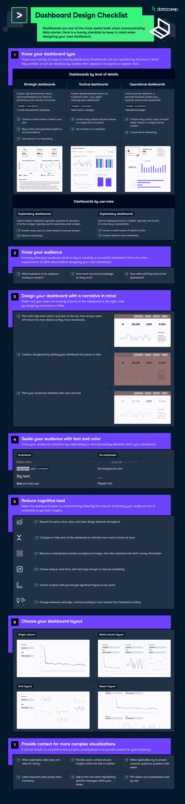

# [信息图表]仪表板设计清单

> 原文：<https://web.archive.org/web/20230101102817/https://www.datacamp.com/blog/infographic-dashboard-design-checklist>

仪表板是分析过程中的一个关键组件，因为它们以易于理解的形式为各种利益相关者提供了信息的简要概述。仪表板的最终目标是帮助用户做出最佳决策，并利用这个不断增长的数据池。此清单包含设计以下仪表板时需要记住的关键信息。

## 了解您的仪表板类型

有多种方法对仪表板进行分类。仪表板可以按其包含的详细程度或其目的是浏览还是解释数据来分类。

### 按详细程度划分的仪表板

1.  **战略仪表板:**包含高级业务指标和长时间跨度(例如，过去 12 个月的财务表现)，最适合高管和执行领导。
2.  **战术仪表板:** 包含特定团队的详细业务指标。(例如，数字标记支出仪表板)。最适合团队领导或经理。
3.  **运营仪表板:** 包含特定业务问题的详细信息(例如，客户服务票据仪表板)。最适合现场分析师。

### 按用例划分的仪表板

1.  **探索性仪表板:**用于探索数据集，以生成供讨论或进一步分析的问题。通常用于探索性数据分析。
2.  **解释性仪表盘:** 用于显示关键结果或见解。通常用作数据故事或演示的一部分。

## 了解你的受众

了解受众的需求是创建成功仪表板的关键。在设计下面的仪表板之前，这里有一些需要考虑的要求。要问的关键问题:

1.  观众希望回答什么问题？
2.  他们有多少技术知识？
3.  他们多久看一次仪表盘？

## 在设计你的仪表板时，要考虑到叙事

通过设计叙述或流程，确保您的用户以正确的顺序查看仪表板部件。以下是在设计一个记叙文仪表板时的一些注意事项。

1.  从顶部的高级指标和图表开始，然后让您的用户向下钻取更多的细节。
2.  通过将仪表板拆分成窗格或选项卡来创建故事板。
3.  用颜色和文字吸引观众的注意力

## 用文字和颜色引导你的观众

通过强调或不强调仪表板中的元素来集中观众的注意力。

### 强调

*   鲜艳的颜色
*   高光或低光
*   大文本
*   字体或斜体文本

### 去强调

*   浅色或柔和的颜色
*   没有背景颜色
*   小型文本
*   常规字体

## 减少认知负荷

通过减少您的受众为获得数据洞察力而必须进行的思考量，使仪表板更容易理解。以下是在减少认知负荷时需要考虑的一些问题。

1.  在整个仪表板上重复相同的颜色、尺寸和其他设计元素。
2.  折叠或隐藏部分仪表板，以最小化一次显示的内容。
3.  删除或弱化边框、背景图像和其他不传达信息的元素。
4.  选择文本足够大的易读字体，以提高可读性。
5.  用足够有用的有效数字来格式化数字。
6.  垂直排列元素—垂直滚动比水平滚动更自然。

## 选择您的仪表板布局

仪表板可以有多种布局，从单栏布局到多栏布局，甚至是报表布局。查看页面顶部的信息图，了解详细的概述。

## 为更复杂的可视化提供上下文

注释更复杂的可视化效果并为您的受众提供上下文可能会有所帮助。在为复杂的可视化提供上下文时，需要记住以下一些注意事项。

1.  适用时，为清晰起见，标注轴和标题
2.  围绕标题或副标题中的见解提供有用的上下文
3.  如果适用，尝试用标签回答常见的观众问题
4.  必要时标注重要的数据点
5.  突出显示标签中的特定消息时，调整字体大小
6.  并排绘制表格和可视化