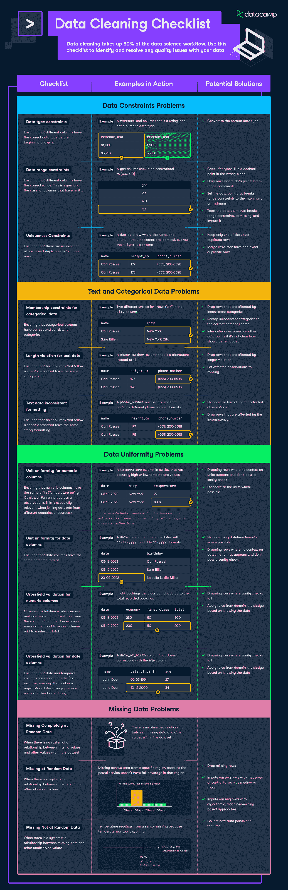

# [信息图表]数据清理清单

> 原文：<https://web.archive.org/web/20220627024316/https://www.datacamp.com/blog/infographic-data-cleaning-checklist>

数据清理占据了数据科学工作流程的 80%。这就是我们创建此清单的原因，以帮助您识别和解决数据的任何质量问题。如果你想了解更多关于清理数据的知识，请分别查看我们关于用 Python 和 [R](https://web.archive.org/web/20220704152425/https://www.datacamp.com/courses/cleaning-data-in-r) 清理数据的课程。

[*点击上图*](https://web.archive.org/web/20220704152425/https://res.cloudinary.com/dyd911kmh/image/upload/v1654855370/Marketing/Blog/Data_Cleaning_Checklist.pdf) 下载该信息图

## 数据约束问题

### 1.数据类型约束

*   **是什么:**在开始分析之前，确保不同的列具有正确的数据类型。
*   **实例:**一个`revenue_usd`列，它是一个字符串，而不是数字数据类型。
*   **可能的解决方案:**转换成正确的数据类型

### 2.数据范围约束

*   **是什么:**确保不同的列有正确的范围。对于有限制的列尤其如此。
*   **实例:**一个`gpa`列应该被约束为[0.0，4.0]
*   **潜在解决方案:**
    *   检查错别字，比如小数点在错误的位置。
    *   删除数据点违反范围约束的行
    *   将打破范围约束的数据点设置为最大值或最小值
    *   将违反范围约束的数据点视为缺失，并对其进行估算

### 3.唯一性约束

*   **是什么:**确保您的行中没有完全相同或几乎完全相同的重复项。
*   **实例:**一个重复的行，其中`name`和`phone_number`列相同，但`height_cm`列不同
*   **潜在解决方案:**
    *   仅保留一个完全相同的重复行
    *   合并具有不完全相同的重复行的行

## 文本和分类数据问题

### 1.分类数据的隶属约束

*   **什么是:**确保分类列有正确和一致的类别
*   **实例:**在`city`列中有两个不同的“New York”条目
*   **潜在解决方案:**
    *   删除受不一致类别影响的行
    *   将不一致的类别重新映射到正确的类别名称
    *   如果不清楚应该如何重新映射，则根据其他数据点推断类别

### 2.文本数据的长度冲突

*   **什么是:**确保遵循特定标准的文本列具有相同的字符串长度
*   **实际例子:**美国的`phone_number`列是 9 个字符而不是 14 个字符
*   **潜在解决方案:**
    *   删除受长度冲突影响的行
    *   将受影响的观察设置为缺失

### 3.格式不一致的文本数据

*   **什么是:**确保遵循特定标准的文本列具有相同的字符串长度
*   **实际例子:**美国的`phone_number`列是 9 个字符而不是 14 个字符
*   **潜在解决方案:**
    *   删除受长度冲突影响的行
    *   将受影响的观察设置为缺失

## 数据一致性问题

### 1.数字列的单位一致性

*   **是什么:**确保数字列有相同的单位(所有观测值的温度都是摄氏度或华氏度。当连接来自不同国家或来源的数据集时，这一点尤其重要。)
*   **运行中的示例:**以摄氏度为单位的温度列，它具有荒谬的高温或低温值
*   **潜在解决方案:**
    *   删除没有出现单元上下文并且没有通过健全性检查的行
    *   尽可能使单位标准化

### 2.日期列的单位一致性

*   **是什么:**确保日期列具有相同的日期时间格式
*   **实例:** `birthday`列，其中`dd-mm-yyyy`和`mm-dd-yyyy`中有日期
*   **潜在解决方案:**
    *   尽可能标准化日期时间格式
    *   删除没有出现日期时间格式的上下文并且没有通过健全性检查的行

### 3.数字列的跨字段验证

*   **什么是:**跨字段验证是指我们在一个数据集中使用多个字段来确保另一个字段的有效性。例如，确保部分到全部的列相加得到相关的总数。
*   **实例:**每个等级的航班预订量加起来就是记录的预订总量
*   **潜在解决方案:**
    *   删除健全性检查失败的行
    *   在了解数据的基础上应用领域知识中的规则

### 4.日期列的跨字段验证

*   **是什么:**确保日期和时间列通过完整性检查(例如，确保网上研讨会注册日期总是在网上研讨会出席日期之前)
*   **实例:**与`age`列不对应的`date_of_birth`列
*   **潜在解决方案:**
    *   删除健全性检查失败的行
    *   在了解数据的基础上应用领域知识中的规则

## 缺失数据问题

### 1.完全随机失踪

*   **是什么:**当缺失值与数据集中的其他值之间没有系统关系时
*   **实例:**数据集中缺失数据和其他值之间没有观察到的关系
*   **潜在解决方案:**
    *   删除缺少的行
    *   使用中心性度量(如中位数或平均值)估算缺失行
    *   用基于算法和机器学习的方法估算缺失的行
    *   收集新的数据点和要素

### 2.随机缺失数据

*   **是什么:**当缺失数据与其他观测值之间存在系统关系时
*   **实例:**缺少特定地区的人口普查数据，因为邮政服务没有覆盖该地区
*   **潜在解决方案:**
    *   删除缺少的行
    *   使用中心性度量(如中位数或平均值)估算缺失行
    *   用基于算法和机器学习的方法估算缺失的行
    *   收集新的数据点和要素

### 3.不随意丢失数据

*   **是什么:**当缺失数据与其他未观测值之间存在系统关系时
*   **实例:**由于温度过低或过高，传感器的温度读数丢失
*   **潜在解决方案:**
    *   删除缺少的行
    *   使用中心性度量(如中位数或平均值)估算缺失行
    *   用基于算法和机器学习的方法估算缺失的行
    *   收集新的数据点和要素