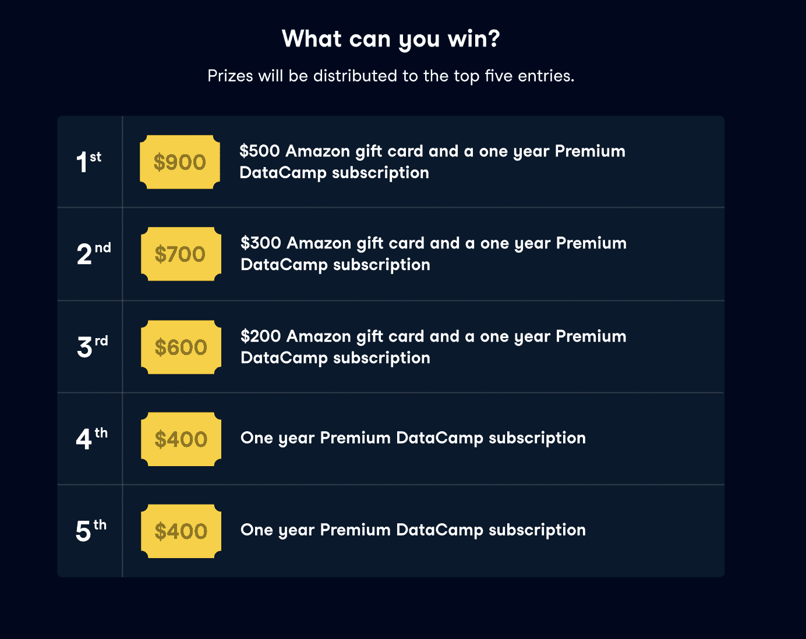
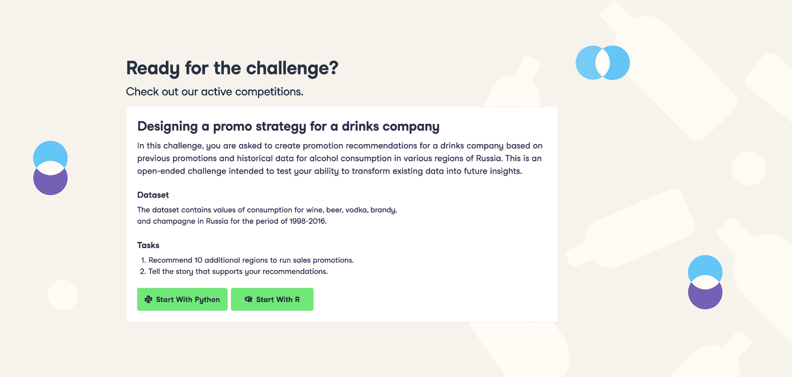

# 介绍 DataCamp 竞赛！

> 原文：<https://web.archive.org/web/20230101103145/https://www.datacamp.com/blog/introducing-datacamp-competitions>

## 我们为什么要发起数据科学竞赛？

我们创办了 DataCamp，通过边做边学来帮助每个人培养数据技能。我们不断创新，让学习者更容易从学习到运用技能解决现实世界的挑战。例如，我们已经创建了 80 多个不同的项目，我们已经推出了浏览器内工具工作区，并且我们已经设计了两个认证评估，这两个评估基于学习者应用他们所学知识的能力。

我们现在很高兴地宣布启动[数据科学竞赛](https://web.archive.org/web/20220705003324/https://app.datacamp.com/learn/competitions)，在比赛中，您将根据数据集和问题陈述进行分析。这种数据分析将在工作空间笔记本中执行和呈现，然后将通过 upvote 系统和经验丰富的数据科学家小组进行评估。从今天开始，将会有丰厚的奖品等着您去赢取，这将会是一件经常发生的事情！

## 首届 DataCamp 数据科学大赛是什么？

我们的第一次数据科学竞赛“为一家饮料公司设计促销策略[”现已开始，如果你很好奇，可以去看看。](https://web.archive.org/web/20220705003324/https://app.datacamp.com/learn/competitions/russian-alcohol-promotions)

在这个挑战中，你需要根据俄罗斯各地区以前的促销和历史酒精消费数据，为一家饮料公司创建促销建议。

## 参加数据营比赛对你的职业生涯有什么帮助？

DataCamp 竞赛旨在帮助用户获得真实世界的数据科学经验，类似于数据分析师在工作场所通常会遇到的情况。所有学习者都可以通过参与来加强他们的数据科学经验和编码技能，并有机会建立一个强大的作品集，其内容将作为评判过程的一部分得到一个向上投票的分数。此外，非参与者将有机会通过看到其他人如何找到复杂数据问题的创造性解决方案，从提交的出版物中学习。

## 需要什么样的比赛

每周，我们的团队都会根据真实世界的数据集和问题陈述发起新的挑战。一旦竞赛启动，学习者有两周时间完成分析，并使用我们的在线数据科学笔记本 Workspace 发布分析结果。

一旦你提交了你的分析，你就可以在你的社交媒体上和你的朋友分享你的出版物来获得投票。这也将使他们能够在更广泛的公众投票开始之前，尽早投赞成票。

提交截止日期后，评审过程开始。这一步是双重的:

*   数据营学习者和其他数据科学爱好者给出版物投票，最受欢迎的将由评委评审。
*   评委们将在接下来的一周评估这些出版物，并从中选出他们自己的前五名。

在“为一家饮料公司设计促销策略”的案例中:

*   提交将于 2021 年 10 月 31 日下午 11:59 PT 结束，投票将于 11 月 1 日开始。在这一天，所有 workspace 笔记本出版物都将开放给更广泛的公众投票，您将能够投票支持您最喜爱的出版物，以增加其获奖的机会。
*   投票将于 11 月 7 日结束。
*   评委将确定 5 名获胜者，然后在 11 月 12 日宣布。

## 什么技能水平的数据营比赛？

数据营竞赛是开放式的挑战，旨在测试您的分析、讲故事和可视化技能。作为建议，我们建议您完成与您将在分析中使用的工具相关的技能课程。DataCamp 竞赛在某些方面类似于 Kaggle，尽管它们将更加关注现实世界的分析，因此更容易获得更广泛的受众。

## 接下来还有什么？

如果你还没有，一定要关注脸书、Twitter、LinkedIn 和 Instagram 上的 DataCamp，每周我们都会宣布新比赛的启动和主题！

好奇？您可以在这里了解有关我们的[数据科学竞赛的更多信息，如果您想要一些灵感，您可以查看我们的工作空间竞赛的获奖出版物。](https://web.archive.org/web/20220705003324/https://support.datacamp.com/hc/en-us/articles/4410791195031)

*   [第一名 Kok Kwang 的贷款数据](https://web.archive.org/web/20220705003324/https://tinyurl.com/5cfv44k7)
*   [第二名 Nikolaos Christoforidis 的贷款数据](https://web.archive.org/web/20220705003324/https://tinyurl.com/4sz37tww)
*   [第三名 Patrick Coulombe 的《优化特征工程中的高尔砝码》](https://web.archive.org/web/20220705003324/https://tinyurl.com/sazjdemc)
*   [第四名 Renaat de Rudere 的《互联网新闻与消费者参与》](https://web.archive.org/web/20220705003324/https://tinyurl.com/xcfx3aks)
*   [第五名——互联网新闻和消费者参与度](https://web.archive.org/web/20220705003324/https://tinyurl.com/cm6nxsbx)