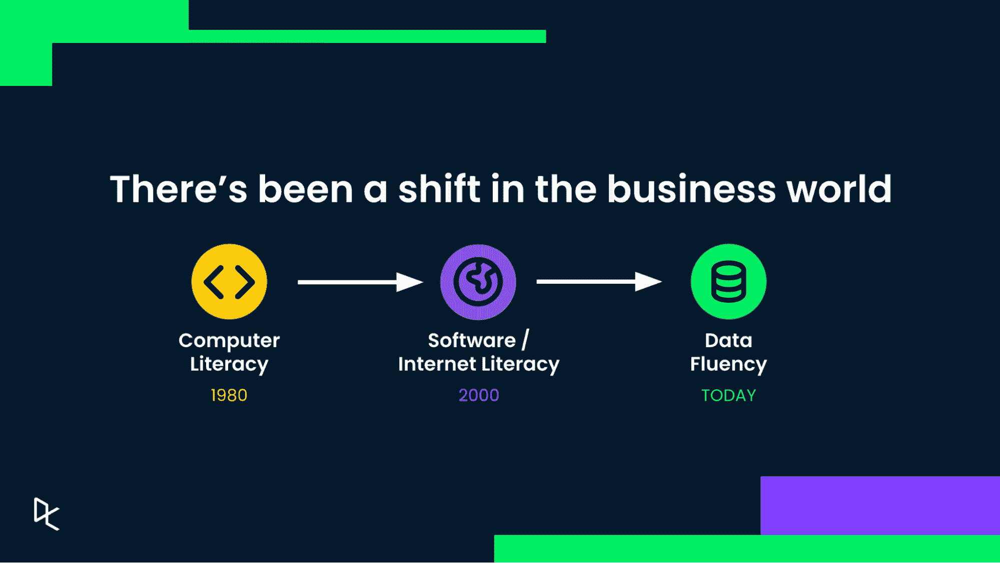
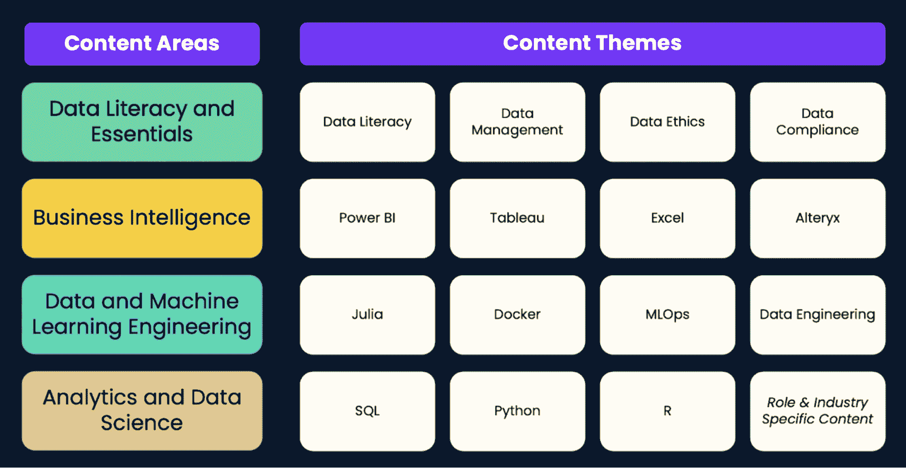

# 推出 DataCamp 无限计划

> 原文：<https://web.archive.org/web/20221212135909/https://www.datacamp.com/blog/introducing-datacamp-unlimited-plan>

在 DataCamp，我们的使命是为每个人普及数据技能。

多年来，我们观察到高管一直低估内部对数据技能培训的需求。同样，我们也看到员工，无论是数据专家还是数据消费者，都表达了对学习资源的需求和渴望。无论是希望磨练新兴技术技能的数据专业人员，还是希望培养数据能力的非专家，都明显需要这种数据流畅性。

不幸的是，几乎每个在线教育提供商所采用的典型的基于座位的标准模型**危及了数据教育计划**。它为员工提供了不平等的数据培训机会，限制了组织全面培养数据技能的能力。

这些观察要求我们按照我们的使命行动。

在数据流畅的时代，数据技能的民主化意味着每个组织，无论规模大小，都应该接受培训。因此，我们提出了 DataCamp Unlimited，这是一个经济高效的计划，我们已经在一些客户中进行了测试。

DataCamp Unlimited 为各种规模的**企业客户**提供了在其整个运营过程中使用 DataCamp 学习平台的机会。我们提供可预测的固定年费，没有隐藏费用，没有使用或座位限制，消除了典型的基于座位的许可证计划的摩擦和管理负担。

在试验过程中，我们看到参与度比预期惊人地增长了 4 倍。特别是，一位客户在短短几个月内帮助 10，000 多名员工开始了他们的数据流畅之旅。这一转变极大地提高了组织利用数据洞察力、进行数据驱动的决策以及利用新方法来理解和使用数据的能力。

*今天，我们很高兴向所有企业客户推出 DataCamp Unlimited。*

## 对数据流畅性的需求

在过去的十年里，商业世界发生了巨大的变化。

每个行业的组织都开始生成大量数据。那些能够利用这些数据的人已经获得了突破性的洞察力和相当大的竞争优势。

这种向数据导向型企业的转变将我们带入了一个新时代:

**数据流畅的时代**。

当商业世界转变时会发生什么？以前的专业技能一夜之间变成了赌注。突然间，几乎每个人都需要这些技能来保持相关性，无论是专业人士还是组织。

如果我们回到 40 年前，计算机改变了我们的生活和工作方式。对所有专业人士来说，计算机知识变得至关重要，不仅仅是在 IT 领域，在金融、人力资源、市场营销等领域也是如此。

二十年后，互联网和软件做了同样的事情；互联网和软件素养成为所有员工的必备技能，而不仅仅是电脑极客。

**今天，我们看到数据流畅性是新的必备技能。它不再仅仅是数据科学家和专家所需要的；也是数据洞察的消费者和所有希望以数据驱动的方式做出决策的人的需求。这种需求意味着每个人都需要获得这些技能的机会，就像每个人都有机会学习如何使用电脑、浏览互联网或发送电子邮件一样。**

## DataCamp 无限计划:适合所有企业

DataCamp 无限制计划允许各种规模的企业客户无限制地使用 DataCamp 学习平台及其所有功能，以提高数据流畅性。与座位计划不同，它的价格是固定的，每年的费用是可预测的，没有隐藏的费用。

如今，几乎每个数据领导者，以及 L&D 的部门和执行团队，都在思考如何最好地为他们的团队配备必要的数据工具和技能，为数据流畅时代做好准备。

因此，从现在开始，DataCamp 将为其企业客户提供 DataCamp 无限计划的选项，作为基于座位的计划的替代方案。

这个 DataCamp 无限计划允许我们的客户在整个组织中最大限度地访问和使用 DataCamp 学习平台。**凭借可预测的固定年费、无隐藏费用、无使用或席位限制，我们消除了典型的基于席位的许可计划的摩擦和管理负担。**

我们的无限计划价格并不仅限于最大的财富 100 强公司。作为一家拥有 200 名员工的公司，我们希望所有规模的公司都可以访问它。因此，我们为不同规模的公司提供不同的定价方案。如果你想了解更多，请联系我们。

因此，如果你是一个希望提升员工技能的企业组织，DataCamp Unlimited 可能是合适的。[比较我们的计划](https://web.archive.org/web/20221129054728/https://www.datacamp.com/compare-business-plans)并从今天开始。

## 为什么选择 DataCamp Unlimited？

自从推出我们的无限计划以来，我们的早期企业采用者已经看到试用 DataCamp 的员工数量呈指数级增长。不仅如此，实际的学习也增加了——一些客户看到的内容量是原来的 5 倍。

无限计划的客户可以访问我们的完全交互式数据课程，该课程涵盖了在当前数据优先的世界中取得成功的所有必要概念。这意味着 1000 多个小时的现有技术和主题(R、SQL、Python、PowerBI、Tableau、数据工程、数据素养等)的学习材料，以及 Julia、人工智能和气流等新兴技术和趋势。

此外，由于没有使用或座位限制，我们消除了通常在基于座位的模型中分发许可证带来的管理负担。

[立即联系我们，了解这将如何为您的团队和组织服务](https://web.archive.org/web/20221129054728/https://www.datacamp.com/business/demo)。

## 立即开始您的数据流畅之旅

**我们不仅仅想成为技术供应商；我们希望成为您数据流畅之旅的合作伙伴。**

入职并培训数百人的大型团队绝非易事。因此，当您选择 DataCamps Unlimited 时，您将拥有一整个专家团队作为您的后盾。

1.  您将获得一名**专门的客户成功经理**，他将为您提供资源和指导，帮助您开始学习计划。他们将帮助您设置学习任务、目标和时间表，审查您的学习计划的投资回报率，并帮助您建立 SSO & LMS 集成。
2.  您还可以访问我们的**数据学习**专家团队，创建量身定制的入职计划和定制学习路径，并获得专家培训建议，以满足您的数据技能培养目标。

除了我们的专家团队提供的指导和支持，每位无限计划客户还可以访问我们的全部企业功能- LMS 集成、技能测量功能、定制学习跟踪、作业、单点登录和高级报告工具。