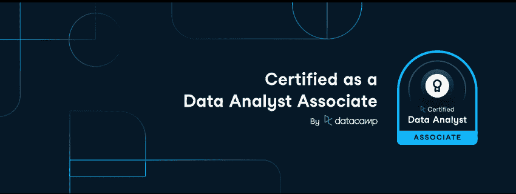
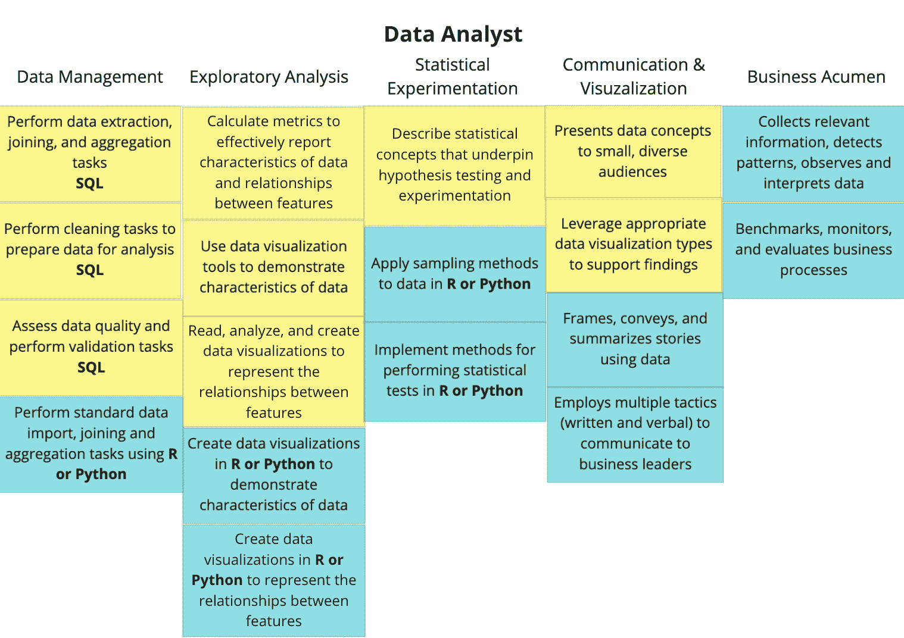

# 引入新的助理认证

> 原文：<https://web.archive.org/web/20221129035725/https://www.datacamp.com/blog/introducing-new-associate-certifications>

## 什么是助理认证？

认证项目通常提供不同级别的认证，可分为助理或基础、专业、专家或硕士。这些级别提供了更多的灵活性，允许你在职业生涯的不同阶段证明你的知识和能力。

去年，DataCamp 推出了专业认证，衡量一至两年专业数据经验后的技能水平。现在，我们很高兴地宣布增加了助理认证，这将使你们中刚刚起步的人获得第一个官方数据认证。

数据分析师和数据科学家助理认证是与行业专家合作开发的，这些专家在许多不同行业的数据职位招聘方面拥有丰富的经验。

## 助理认证与专业认证有何不同？

助理认证衡量数据特定领域的入门级能力，如数据管理、探索性分析、统计实验、建模、数据科学编程和数据通信。

黄色=协理员等级胜任力。 蓝色=专业等级胜任力。

对于数据分析师助理，认证要求只有一次考试和案例研究，对于两个助理认证，案例研究要求只涉及书面报告，而不是专业认证所需的录音演示。

数据分析师助理认证衡量 SQL 和数据可视化技能。

## 我如何开始助理认证？

很容易上手！前往新的 [DataCamp 认证仪表板](https://web.archive.org/web/20221212135841/https://app.datacamp.com/certification/certification-2022) ，查看数据分析师或数据科学家助理认证的要求。在那里，你可以找到一个可以在 DataCamp 上学习的课程列表，以帮助你做好准备。一旦你为认证做好准备，你将注册开始第一次考试。

此外，当您获得助理认证时，只要您准备好了，就可以跳过第一个考试要求，快速进入专业认证。 [今天领证](https://web.archive.org/web/20221212135841/https://app.datacamp.com/certification/certification-2022) ！