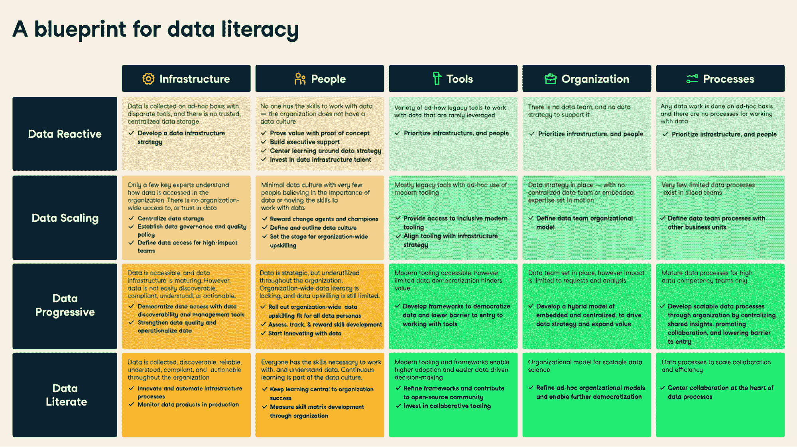

# 介绍数据成熟度网络研讨会系列

> 原文：<https://web.archive.org/web/20221129035725/https://www.datacamp.com/blog/introducing-the-data-maturity-webinar-series>

2021 年 10 月，我们启动了数据成熟度评估，帮助团队和组织确定他们在数据成熟度谱上的位置。从那以后，我们听到了数百名数据领导者和从业者讲述他们的组织如何转型和适应数据扫盲时代。

数据素养之路由四个阶段的成熟度谱组成，首先是数据反应、数据扩展、数据渐进，最后是数据素养。为了从一个阶段进入下一个阶段，五个关键杠杆需要持续的监测和投资。这五个杠杆就是我们所说的 IPTOP 框架。

*   **基础架构:**可扩展的数据基础架构，可确保数据在整个组织内可收集、可发现、可靠、可理解、合规且可操作。
*   **People:** 打造一种数据驱动的文化，在这种文化中，所有员工都理解数据的价值，并拥有处理数据的技能，而不论其角色如何(这并不意味着每个人都需要编码！).
*   **工具:**数据从业者使用的工具、软件和系统，以及如何通过降低数据使用门槛的框架进一步推动数据民主化。
*   **组织:**如何组织、开发和培养数据人才，以及采用在整个组织中推广可扩展数据科学的组织模式。
*   **流程:**数据专家和团队采用的流程，使他们的工作更具可预测性和协作性，并确保与业务目标保持一致。

[数据成熟度评估](https://web.archive.org/web/20220810143027/https://www.datacamp.com/resources/tools/take-datacamps-data-maturity-assessment)帮助数百家组织了解他们在数据成熟度谱中的位置。这就是为什么我们非常兴奋地宣布将在整个 8 月举办一个由四部分组成的网络研讨会系列，专门讨论数据成熟度的来龙去脉，以及您的组织如何成为数据驱动型组织。

## 数据成熟度网络研讨会系列的预期

在我们由四部分组成的数据成熟度网络研讨会系列中，我们将深入探讨如何在数据成熟度方面取得进展。以下是您可能会遇到的不同会议:

### [数据成熟度的 5 个维度](https://web.archive.org/web/20220810143027/https://www.datacamp.com/webinars/data-maturity-dimentions)—美国东部时间 8 月 4 日上午 11 点

在本次会议中，我们将为如何在您的组织中实现数据成熟度做好准备。我们将讨论对基础设施、人员、工具、组织和流程的投资如何帮助您沿着数据成熟的道路前进。此外，我们将讨论如何最大限度地利用数据成熟度评估，以及如何在您指导组织的数据成熟度时使用它。

### [数据成熟度的基础架构组成部分](https://web.archive.org/web/20220810143027/https://www.datacamp.com/webinars/data-maturity-infrastructure)—美国东部时间 8 月 11 日上午 11 点

在本专题讲座中，我们将讨论基础设施投资在成为数据驱动型时的核心理念是如何为任何与数据交互的人提供民主化、受监管的数据访问。我们将展示成熟度范围内数据基础设施的概念和示例，并概述来自 Airbnb、网飞等数据驱动型组织的北极星示例。

### [数据成熟度的人员&组织组成](https://web.archive.org/web/20220810143027/https://www.datacamp.com/webinars/data-maturity-people-organization)—美国东部时间 8 月 18 日上午 11 点

作为 IPTOP 框架的基础元素，投资于人们在日常生活中处理数据的能力对于确保所有其他数据驱动型投资获得投资回报至关重要。在整个会议期间，我们将概述如何在整个成熟度范围内加速数据文化和素养，适用于数据技能的技能提升计划的示例，如何激发对技能提升的兴趣，如何跨成熟度阶段组织数据团队，等等。

### [数据成熟度的工具和流程部分](https://web.archive.org/web/20220810143027/https://www.datacamp.com/webinars/data-maturity-tools-processes)—美国东部时间 8 月 25 日上午 11 点

在数据成熟度网络研讨会系列的最后一场会议中，我们将详细介绍如何在数据成熟度范围内利用数据工具和更好的流程。作为 IPTOP 框架的支持层，投资于工具和流程，使人们能够最大限度地利用数据，这对于进入数据成熟的最后阶段至关重要。

在整个会议期间，我们将讨论组织与整个成熟度范围内的工具的关系，它如何实现民主化的数据洞察，如何建立跨数据团队工作的流程，等等。

## 如何注册

我们很高兴分享我们从[数据成熟度评估](https://web.archive.org/web/20220810143027/https://www.datacamp.com/resources/tools/take-datacamps-data-maturity-assessment)中学到的东西，并揭示贵组织如何在数据成熟度方面取得进步。使用以下链接注册数据成熟度网络研讨会系列。

*   [数据成熟度的 5 个维度](https://web.archive.org/web/20220810143027/https://www.datacamp.com/webinars/data-maturity-dimentions)—美国东部时间 8 月 4 日上午 11 点
*   [数据成熟度的基础架构组成部分](https://web.archive.org/web/20220810143027/https://www.datacamp.com/webinars/data-maturity-infrastructure)—美国东部时间 8 月 11 日上午 11 点
*   [数据成熟度的人员&组织组成](https://web.archive.org/web/20220810143027/https://www.datacamp.com/webinars/data-maturity-people-organization)—美国东部时间 8 月 18 日上午 11 点
*   [数据成熟度的工具和流程部分](https://web.archive.org/web/20220810143027/https://www.datacamp.com/webinars/data-maturity-tools-processes)—美国东部时间 8 月 25 日上午 11 点