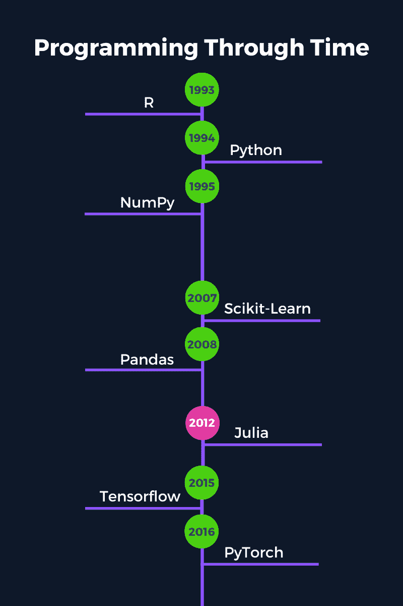
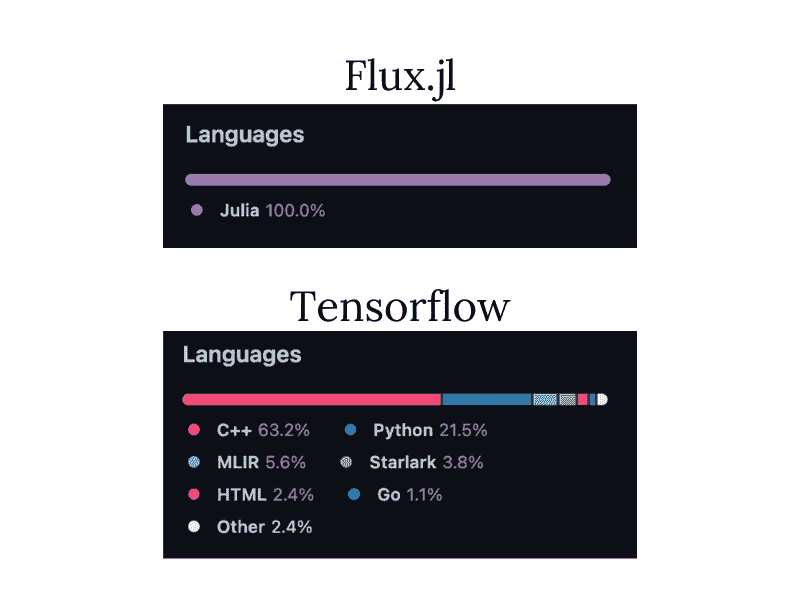

# 朱莉娅的机器学习导论

> 原文：<https://web.archive.org/web/20221212135909/https://www.datacamp.com/blog/introduction-machine-learning-julia>

## 朱莉娅是什么？

Julia 是一种相对较新的编程语言，于 2012 年首次发布。尽管 Julia 只有十年的历史，但它一直在快速发展，根据 2022 年 10 月的 TIOBE 指数，它现在是 30 种顶级编程语言之一。

Julia 的一个突出特点是它是为科学计算而构建的。这意味着 Julia 既容易使用又快速，同时还能够以极快的速度处理大量数据和复杂计算。一个著名的 Julia 标语是它“运行起来像 C，但读起来像 Python。”

Julia 是一种编译语言，读起来像解释语言。大多数其他能够解决计算密集型问题的传统编译语言(如 C 或 C++)必须首先编译成机器可读的格式，然后才能执行。

另一方面，Julia 可以通过简单的解释语言(如 Python)实现相同的性能，但不需要在执行前编译。相反，Julia 使用实时(JIT)编译器在运行时编译。

## 为什么选择朱莉娅做机器学习？

Python 长期以来一直主导着数据科学和机器学习领域，这是有充分理由的。它是一种非常强大、灵活的编程语言。然而，Python 有一些缺点在 Julia 中并不是问题。

与 Julia 相比，Python 的一些缺点是:

*   Python 是一种速度较慢的解释型语言，提高速度的选择有限。这可以让大数据机器学习项目相比 Julia 效率低下。
*   Python 使用单一分派，这对于函数和库之间可以使用和共享的类型有很大的限制。
*   Python 语言的设计中没有内置并行计算和线程。虽然有些库允许一些线程，但这并不是最佳的。

在这一节中，我们将讨论 Julia 是机器学习的最佳选择的几个原因。

你可以在另一篇博客文章中进一步探讨这种语言的兴起以及 2022 年【Julia 是否值得学习。

### 1.简单易用

朱莉娅有一个非常友好的语法，接近英语。这使得学习起来更快，因为代码通常很直观，容易理解。

Julia 安装起来也很快，很容易上手。不需要安装该语言的特殊发行版(比如 Python 和 Anaconda ),也不需要遵循任何复杂的安装过程(比如 C 和 C++)。

对于机器学习从业者来说，你越早消除编程方面的摩擦，你就能越早开始做你最擅长的事情:分析数据和建立模型。

### 2.速度

朱莉娅最大的特点之一是它的速度。我们在上面提到过，Julia 是一种编译语言，在速度上比解释语言有相当大的提高。

Julia 与 C、C++和 Fortran 一起属于“千万亿次浮点运算俱乐部”。没错；这个独家俱乐部只有四个成员和一个加入要求:只需在峰值性能时达到每秒一个 petaflop(即一千万亿次运算)的速度。

在机器学习中遇到大量数据并不罕见，因此在将模型部署到生产中时，使用快速编程语言可以显著缩短训练时间并降低成本。

### 3.分解的代码很快

在 Julia 中，不需要向量化代码来提高性能。以循环和本机函数的形式编写去因子化代码已经很快了。虽然在 Julia 中向量化代码可能会略微提高速度，但这是不必要的。

编写和使用分解的代码可以在构建机器学习模型时节省大量时间，因为您不需要重构代码来提高速度。

### 4.代码重用和多重分派

Julia 使用鸭式输入来“猜测”函数的适当类型。这个特征意味着:如果它像鸭子一样走路，像鸭子一样说话，它很可能是一只鸭子。因此，任何满足函数隐式规范的对象都被支持——不需要显式地指定它。

然而，鸭式打字并不总是适合于特殊情况，这就是多重分派的用武之地。使用多重分派，您可以为一个函数定义多个特殊情况，根据满足的条件，该函数将在运行时选择最合适的选项。

多重分派在机器学习中很有用，因为你不必考虑可以传递给函数的每一种可能的类型。相反，Julia 中的包可以保持高度的灵活性，同时还可以在不同的包之间共享代码和类型。

考虑日期格式:有几个软件包可以使用它们自己的自定义日期和日期/时间格式。例如，Python 内置的 datetime 格式和 Pandas datetime64[ns]格式。在 Julia 中，只有一个基于日期的格式，由内置的 dates 模块在所有包之间共享。

### 5.内置包管理

包在 Julia 和 Pkg 中被自动管理。Pkg 之于 Julia 就像 Pip 之于 Python 一样，但要好得多。Julia 通过两个文件管理环境:Project.toml 和 Manifest.toml。这些文件告诉 Julia 项目中使用了哪些包及其版本。Julia 文件(包含项目和清单 toml 文件)的文件夹位置成为环境，而不是在外部定义特殊的环境。

这种内置的、简化的包管理方法使得共享和复制您的机器学习项目和分析更加容易。

### 6.双语问题

您知道只有 20-30%的 Python 包实际上是由 Python 代码组成的吗？

这种对其他语言的依赖是因为，为了开发在任务中高效和有效的包，它们必须用低级语言如 C 和 C++来构建。

这些包使用这样的语言是因为，在科学计算中，开发解决方案和包通常涉及两种编程语言:易于使用的原型语言(如 Python)来构建解决方案的快速初始实现，然后是快速语言(如 C++)，其中所有代码都被重写为最终版本的解决方案。

可以想象，这是一个缓慢、低效的过程，不仅对于初始开发如此，对于长期维护和新特性也是如此。

另一方面，Julia 中的包可以在 Julia 中原型化、开发和维护。因此，这将整个开发周期缩短到仅仅是时间的一小部分。

## 朱莉娅机器学习包

Julia 现在在其总注册表中包含超过 7400 个包。虽然这与 Python 中可用的包的数量(超过 200，000 个)相差甚远，但找到合适的包来解决特定的问题仍然具有挑战性。

本节将探讨分析数据和构建机器学习模型所需的主要软件包。

然而，如果你刚刚开始使用 Julia 中的机器学习，请首先尝试包工具箱: [MLJ](https://web.archive.org/web/20221116235553/https://alan-turing-institute.github.io/MLJ.jl/dev/about_mlj/) 。这个包是专门为将最流行的机器学习包收集到一个单一的、容易访问的地方而构建的，可以节省您为您的项目寻找最佳机器学习包的时间。MLJ 目前支持超过 [20 种不同的机器学习包](https://web.archive.org/web/20221116235553/https://alan-turing-institute.github.io/MLJ.jl/dev/list_of_supported_models/)。

以下是您将在机器学习项目中遇到的一些最常见的包的列表-从导入、清理和可视化数据到构建模型:

*   笔记本:冥王星，伊古利亚，木星
*   **包/环境管理** : Pkg
*   **导入和处理数据** : CSV、数据帧
*   **绘图和输出**:绘图、StatsPlots、LaTeXStrings、Measures、Makie
*   **统计和数学**:随机、统计、线性代数、统计基础、分布、假设检验、核密度、套索、组合学、特殊函数、根
*   **个人机器学习包**:

*   广义线性模型(如线性回归、逻辑回归):GLM
*   深度学习:Flux，Knet
*   支持向量机:LIBSVM
*   决策树，随机森林，AdaBoost:决策树
*   k-最近邻居:最近邻居
*   k 均值聚类:聚类
*   主成分分析:多元统计

还有许多实现和包装器可用于流行的 Python 包，如 Scikit-Learn 和 Tensorflow。但是，您不一定需要使用这些包，因为您可能会失去使用 Julia 的许多强大优势(例如速度和多任务分派)。

## Julia 机器学习入门

开始使用 Julia 的最好方法之一是使用 Pluto 笔记本环境。在本节中，我们将讨论使用 Pluto 的好处，尤其是在您的数据科学之旅的开始阶段，此时您仍在学习如何与 Julia 一起构建机器学习项目。我们还浏览了一些最佳资源，用于了解更多关于 Julia 和机器学习的信息。

### 普路托

Pluto 是一个简单易用的交互式笔记本环境，具有友好的用户界面。这种简单性非常适合从 Julia 开始的初学者。Pluto 还有许多附加功能，允许您几乎毫不费力地构建更加引人注目的机器学习解决方案:

#### 反应的

在评估一个单元时，Pluto 还会考虑必须运行其他哪些单元。此功能确保在评估当前单元格之前更新所有从属单元格。

关于 Pluto 的一个很棒的事情是，它足够聪明，可以准确地知道除了当前单元之外还需要运行哪些单元，这样，如果您在笔记本的某个地方做了更改，就不会遇到需要更新每个单元的问题。

Pluto 还会清理旧的或删除的代码，并更新任何依赖单元的输出来反映这一操作。如果您在一个单元格中定义了一个变量，然后又删除了该单元格，那么 Pluto 也会将该变量从其名称空间中删除。此外，任何依赖的代码单元格都将显示一条错误消息，表明它需要的变量现在已被删除。

#### 相互作用的

反应性导致细胞之间的自动互动。这对于快速创建交互式图表或在变量改变时自动更新的对象特别有用。

Pluto 的美妙之处在于，该变量可以是笔记本中的一个交互式小部件，比如内置的滑块或文本框。如果你懂 Javascript，你甚至可以设计自己的小部件。

反应性和交互性使您能够基于您的机器学习模型和数据分析生成动态报告和仪表盘。成功的机器学习项目的关键是沟通，Pluto 使演示和解释您的项目变得更加容易。

#### 自动化包管理

Pluto 与 Pkg 无缝集成，允许在您的笔记本中自动管理包。不仅如此，你实际上并不需要在 Pluto 之外安装软件包。布鲁托(和朱莉娅)运行和复制你的笔记本所需的所有信息都存储在笔记本里！

这意味着您可以与同事或同学共享您的笔记本电脑，并且您可以确保该笔记本电脑需要运行的所有正确的软件包都将随之而来。

#### 版本控制

所有的冥王星笔记本储存为可执行文件。jl 文件。如果您在文本编辑器中打开一个笔记本，它看起来会与您在浏览器中看到的笔记本有些不同。该文件将包含笔记本所需的所有信息，例如代码、单元格依赖关系和执行顺序。但是，这些文件不包含任何输出。所有这些都使得使用 Git 和 GitHub 进行版本控制变得更加容易。

#### 导出和共享

Pluto 笔记本可以导出为. jl 可执行文件、静态 PDF 或静态 HTML 文件。如果您导出为 HTML 格式，那么与您共享该文件的人也可以选择下载和编辑原始笔记本文件，而无需在他们的计算机上安装 Julia。

冥王星通过与 [Binder](https://web.archive.org/web/20221116235553/https://mybinder.org/) 合作来实现这一点，Binder 是一个在线托管冥王星笔记本的免费平台(它也可以与其他编程语言一起工作，如 Python 和 R)。

这项功能是机器学习工作流程中的最后一步:首先，您进行分析，然后在笔记本中构建一个交互式报告来展示结果，最后，您可以与能够复制和编辑分析的技术同事以及非技术人员共享笔记本。

### 学习 Julia 的资源

以下是学习 Julia 编程语言以及如何在数据科学和机器学习中使用它的一些最值得推荐的资源:

*   如果你喜欢在互动的环境中学习，我们有一个介绍朱莉娅的课程
*   对于 Julia 编程语言的全面解释，图书[Think Julia:How to Think Like a Computer Scientist](https://web.archive.org/web/20221116235553/https://benlauwens.github.io/ThinkJulia.jl/latest/book.html)是最好的资源之一。
*   查看我们的 Julia 初学者教程,获得一步一步的 Julia 入门指南
*   参见我们的[备忘单](https://web.archive.org/web/20221116235553/https://www.datacamp.com/cheat-sheet/julia-basics-cheat-sheet)获取 Julia 编程要点的便捷指南。