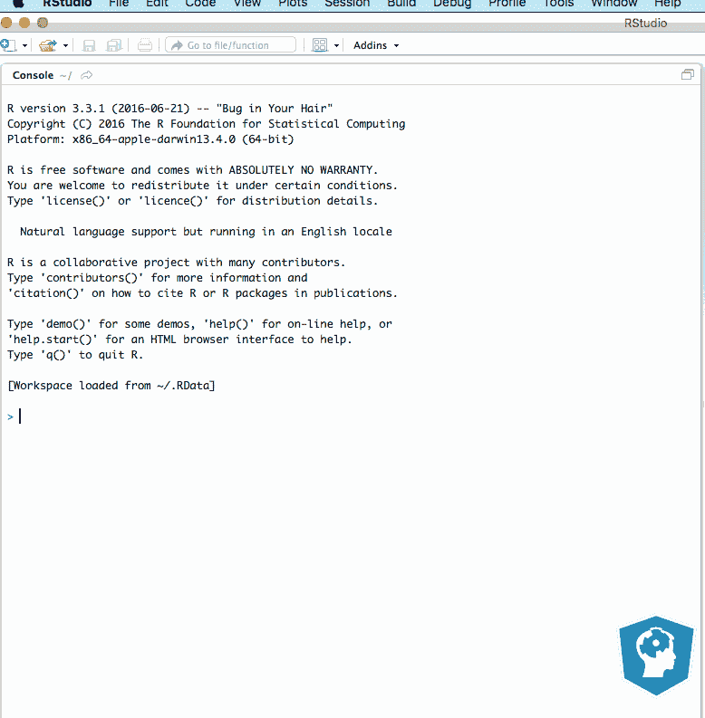
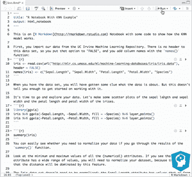

# Jupyter 和 R Markdown:带 R 的笔记本

> 原文：<https://web.archive.org/web/20230101103415/https://www.datacamp.com/blog/jupyter-and-r-markdown-notebooks-with-r>

在处理数据科学问题时，您可能希望建立一个交互式环境，以便与其他人一起工作并共享项目代码。你可以用笔记本轻松设置。

在其他情况下，您可能只想交流工作流以及为分析数据科学问题而收集的结果。对于透明且可重复的报告，笔记本也能派上用场。

没错；笔记本非常适合您想要将纯文本与丰富的文本元素(如图形、计算等)结合在一起的情况。

本教程将涵盖以下主题:


*   在 [Jupyter 笔记本](#jupyter)中使用 R 的实用介绍。您将看到如何安装 R 内核，以及如何使用 R magics 使您的笔记本真正具有交互性，
*   关于 [R Markdown 笔记本](#markdown)的介绍:您将了解该功能在可再生研究和 R 的历史中是如何发展的，它与其他计算笔记本相比如何，您如何安装和使用它，以及哪些提示和技巧会派上用场，
*   概述[这两个笔记本之间的异同](#compare)，重点介绍笔记本共享、代码执行、版本控制和项目管理；和
*   你还将了解在你使用 R 时，Jupyter 和 R Markdown 笔记本的其他[替代品，如 Bookdown、DataCamp Light、Shiny 等。](#alternatives)


## r 和朱庇特笔记本

与你可能想到的相反，Jupyter 并没有限制你只使用 Python:笔记本应用程序是语言不可知的，这意味着你也可以使用其他语言。

在 Jupyter 中开始使用 R 有两种一般的方法:使用内核或者建立一个 R 环境，这个环境拥有开始研究数据科学的所有必要工具。

### 用 R 内核在 Jupyter 中运行 R

如上所述，运行 R 的第一种方式是使用内核。如果你想获得 Jupyter 中所有可用内核的完整列表，请点击[这里](https://web.archive.org/web/20221002230534/https://github.com/ipython/ipython/wiki/IPython-kernels-for-other-languages)。

要使用 R，您需要加载并激活 IRKernel，以便在笔记本环境中开始使用 R。

首先，你需要安装一些软件包。请确保不要在 RStudio 控制台中这样做，而是在常规的 R 终端中这样做，否则您会得到如下错误:

```py
Error in IRkernel::installspec() :
Jupyter or IPython 3.0 has to be installed but could neither run “jupyter” nor “ipython”, “ipython2” or “ipython3”.
(Note that “ipython2” is just IPython for Python 2, but still may be IPython 3.0)
```

```py
$ R

> install.packages(c('repr', 'IRdisplay', 'evaluate', 'crayon', 'pbdZMQ', 'devtools', 'uuid', 'digest')) 
```

该命令将提示您键入一个数字来选择一个 CRAN mirror 来安装必要的软件包。输入一个数字，安装将继续。

```py
> devtools::install_github('IRkernel/IRkernel')
```

然后，您仍然需要使 R 内核对 Jupyter 可见:

```py
# Install IRKernel for the current user

> IRkernel::installspec()

# Or install IRKernel system-wide

> IRkernel::installspec(user = FALSE)
```

现在用`jupyter notebook`打开笔记本应用程序。当你创建一个新的笔记本时，你会看到 R 出现在内核列表中。

### 在 jupiter 中使用 r essentials 环境

快速使用 R 的第二个选择是在您当前的环境中安装 R essentials:

```py
conda install -c r r-essentials 
```

这些“必需品”包括 [dplyr](https://web.archive.org/web/20221002230534/https://www.rdocumentation.org/packages/dplyr/versions/0.5.0) 、 [shiny](https://web.archive.org/web/20221002230534/https://www.rdocumentation.org/packages/shiny/versions/0.14.2) 、 [ggplot2](https://web.archive.org/web/20221002230534/https://www.rdocumentation.org/packages/ggplot2/versions/2.2.0) 、 [tidyr](https://web.archive.org/web/20221002230534/https://www.rdocumentation.org/packages/tidyr/versions/0.6.0) 、 [caret](https://web.archive.org/web/20221002230534/https://www.rdocumentation.org/packages/caret/versions/6.0-73) 和 [nnet](https://web.archive.org/web/20221002230534/https://www.rdocumentation.org/packages/nnet/versions/7.3-12) 等包。如果您不想在当前环境中安装 essentials，可以使用以下命令为 R essentials 创建一个新环境:

```py
conda create -n my-r-env -c r r-essentials
```

现在打开笔记本应用程序，开始使用 r。

您可能想知道如果您想要安装额外的包来阐述您的数据科学项目，您需要做什么。毕竟，这些包可能足以让您入门，但是您可能需要其他工具。

嗯，您可以通过运行以下命令来构建 Conda R 包，例如:

```py
conda skeleton cran ldavis conda build r-ldavis/
```

或者你可以通过`install.packages()`或者`devtools::install_github`从 R 里面安装包(从 GitHub 安装包)。您只需要确保将新的包添加到 Jupyter 使用的正确的 R 库中:

```py
install.packages("ldavis", "/home/user/anaconda3/lib/R/library")
```

如果你想了解更多关于内核或者在 Docker 环境中运行 R 的知识，请查看[这个页面](https://web.archive.org/web/20221002230534/https://www.datacamp.com/community/tutorials/tutorial-jupyter-notebook/)。

### 给 Jupyter 添加一些 R 魔法

使用笔记本电脑的一个巨大优势是它们为您提供了一个交互式的环境。这种交互性主要来自所谓的“魔法命令”。

这些命令允许你从 Python 切换到命令行指令，或者用另一种语言写代码，比如 R、Julia、Scala 等等

要从 Python 切换到 R，首先需要下载下面的包:

```py
%load_ext rpy2.ipython
```

之后，您可以开始使用 R，或者使用`%R` magic 命令在您的数据分析中轻松地从 Python 切换到 R。

让我们用一个小例子来演示 R 魔术是如何工作的:

```py
# Hide warnings if there are any
import warnings
warnings.filterwarnings('ignore')
# Load in the r magic
%load_ext rpy2.ipython
# We need ggplot2
%R require(ggplot2)
# Load in the pandas library
import pandas as pd 
# Make a pandas DataFrame
df = pd.DataFrame({'Alphabet': ['a', 'b', 'c', 'd','e', 'f', 'g', 'h','i'],
                   'A': [4, 3, 5, 2, 1, 7, 7, 5, 9],
                   'B': [0, 4, 3, 6, 7, 10,11, 9, 13],
                   'C': [1, 2, 3, 1, 2, 3, 1, 2, 3]})
# Take the name of input variable df and assign it to an R variable of the same name
%%R -i df
# Plot the DataFrame df
ggplot(data=df) + geom_point(aes(x=A, y=B, color=C))
```

如果你想了解更多关于 Jupyter 的细节，如何设置笔记本，从哪里下载应用程序，如何运行笔记本应用程序(通过 Docker，pip install 或 Anaconda 发行版)或其他细节，请查看我们的[权威指南](https://web.archive.org/web/20221002230534/https://www.datacamp.com/community/tutorials/tutorial-jupyter-notebook/) 。

## 恋恋笔记本

直到最近，Jupyter 似乎一直是 R 用户的热门解决方案，仅次于 Apache Zeppelin 或 Beaker 等笔记本。

此外，报告数据分析结果的其他替代方法，如 R Markdown、Knitr 或 Sweave，在 R 社区中非常受欢迎。

然而，随着 RStudio 最近发布的 R 或 R Markdown 笔记本电脑，这种情况可能会发生变化。

你看到了:R Markdown 笔记本的背景是复杂的，值得看看 R 的可再生研究的历史，以了解是什么推动了这种笔记本的创造和发展。最终，你也会意识到这款笔记本与众不同。

### r 和可再生研究的历史

在他的演讲中，J . J Allaire 证实了 R 本身在可重复研究方面的努力，Emacs 将文本代码和输入结合起来的努力，Pandoc，Markdown 和 knitr 项目，以及计算笔记本多年来一直在平行发展并相互影响。他证实，所有这些因素最终导致了 r。

首先，计算笔记本有相当长的历史:自从 80 年代末 Mathematica 的前端发布以来，已经有了很多进步。2001 年，费尔南多·佩雷斯开始开发 IPython，但直到 2011 年该团队发布了 IPython 的 0.12 版本才得以实现。SageMath 项目始于 2004 年。之后一直有很多笔记本。数据科学界最著名的是 Beaker (2013 年)、Jupyter (2014 年)和 Apache Zeppelin (2015 年)。

然后，还有影响了 RStudio 的笔记本应用程序创建的标记语言和文本编辑器，即 Emacs、Markdown 和 Pandoc。Org-mode 发布于 2003 年。这是自由软件文本编辑器 Emacs 中注释、计划和创作的编辑和组织模式。六年后，Emacs org-R 开始为 R 用户提供支持。另一方面，Markdown 在 2004 年作为一种标记语言发布，它允许你以一种可以转换成 HTML 或其他格式的方式格式化你的纯文本。又过了几年，Pandoc 被释放了。它是一个写作工具，也是发布工作流的基础。

最后，R 社区为确保研究的可重复性和透明性所做的努力也促成了 R 笔记本的兴起。2002 年，引入了 Sweave，允许在 LaTeX 文档中嵌入 R 代码以生成 PDF 文件。这些 pdf 文件结合了叙述和分析、图形、代码和计算结果。十年后，开发了 knitr 来解决 Sweave 中长期存在的问题，并将其他附加包中存在的功能组合到一个单独的包中。它是 r 中用于动态报告生成的透明引擎。Knitr 允许任何输入语言和任何输出标记语言。

同样在 2012 年，R Markdown 作为 Markdown 的一个变种被创建，它可以嵌入 R 代码块，并可以与 knitr 一起使用来创建可复制的基于 web 的报告。最大的优势是，现在仍然没有必要再使用 LaTex，它有一个学习和使用的学习曲线。R Markdown 的语法非常类似于常规的 Markdown 语法，但确实有一些调整，因为您可以包括，例如，LaTex 方程。

### R Markdown 与计算笔记本

R Markdown 可能是 R 社区中报告数据分析最受欢迎的选项之一。毫无疑问，它仍然是 R Markdown 笔记本的核心组件。

R Markdown 和 notebooks 也有一些共同之处，例如交付可重复的工作流，将代码、输出和文本编织在一个文档中，支持交互式小部件和多种格式的输出。然而，它们的侧重点有所不同:R Markdown 侧重于可再现的批处理执行、纯文本表示、版本控制、产品输出，并提供了与 R 脚本相同的编辑器和工具。

另一方面，传统的计算笔记本侧重于代码内联输出、跨会话缓存输出、共享代码和在单个文件中输出。笔记本强调交互式执行模式。它们不使用纯文本表示，而是使用结构化数据表示，比如 JSON。

这一切解释了 RStudio 笔记本应用程序的目的:它结合了 R Markdown 的所有优点和计算笔记本必须提供的好东西。

这就是为什么 R Markdown 是 R Markdown Notebook 的核心组件:RStudio 将其 Notebook 定义为“一个 R Markdown 文档，其中包含可以独立和交互执行的块，输出直接位于输入下方”。

## 如何使用 R 笔记本

如果你曾经使用过 Jupyter 或任何其他计算笔记本，你会发现工作流程非常相似。有一点可能看起来非常不同，那就是默认情况下，现在你不再使用代码单元了:你更愿意使用一种文本编辑器，在其中用 R Markdown 指示你的代码块。

### 如何安装和使用 R Markdown 笔记本电脑

使用笔记本电脑的第一个要求是您的 PC 上有最新版本的 RStudio。由于笔记本是 RStudio 的新功能，因此仅在 r studio 1.0 或更高版本中提供。所以，检查你是否安装了正确的版本是很重要的。

如果你没有 r studio 1.0 或更高版本，可以在这里下载最新版本[。](https://web.archive.org/web/20221002230534/https://www.rstudio.com/products/rstudio/download/)

然后，要创建一个新的笔记本，你去文件标签，选择“新文件”，你会看到创建一个新的 R Markdown 笔记本的选项。如果 RStudio 提示您更新一些包，只需接受提议，最终会出现一个新文件。

**提示**:通过查看文档的顶部，仔细检查你是否在使用笔记本。输出应该是 html_notebook。

您将看到文档中出现的默认文本是 R Markdown。R Markdown 对你来说应该很熟悉，但如果你还不太精通，你可以随时查看我们的[报道和 R Markdown 课程](https://web.archive.org/web/20221002230534/https://www.datacamp.com/courses/reporting-with-r-markdown/)或浏览[R studio 提供的材料](https://web.archive.org/web/20221002230534/http://rmarkdown.rstudio.com/lesson-1.html)。



**注意**您可以随时使用齿轮图标来调整笔记本的工作空间:您可以选择扩展、折叠和删除代码的输出，更改预览选项和修改输出选项。

如果您想要更改语法突出显示、应用另一个主题、调整输出中出现的图形的默认宽度和高度等，最后一个选项会很方便。

从那里开始，您可以开始插入代码块和文本！

您可以通过两种方式添加代码块:通过键盘快捷键 *Ctrl + Alt + I* 或 *Cmd + Option + I* **，**或使用工具栏中的插入按钮。

使用这些 R Markdown 笔记本的好处在于，当你一次执行大量代码块或多个代码块时，你可以跟踪代码块的执行情况，这要感谢出现在左侧的绿色小条。另外，注意底部有一个进度条。

您可以在下面的 gif 中看到绿色进度条:



谈论代码执行:有多种方法可以执行 R 代码块。

你可以运行一个代码块或者运行下一个代码块，运行上面和下面的所有代码块；但是您也可以选择重启 R 并运行所有块，或者重启并清除输出。

**注意**当你执行笔记本的代码时，你也会看到输出出现在你的控制台上！对于那些经常使用 Jupyter 等其他计算笔记本的人来说，这可能是一个相当大的区别。

如果在笔记本的代码块执行过程中出现任何错误，执行将会停止，并且在产生错误的代码块旁边会出现一个红色的条。

您可以通过在块选项中添加`errors = TRUE`来抑制执行的暂停，就像这样:

```py
```{r, error=TRUE}
iris <- read.csv(url("http://mlr.cs.umass.edu/ml/machine-leaning-databases/"), header = FALSE)
names(iris) <- c("Sepal.Length", "Sepal.Width", "Petal.Length", "Petal.Width", "Species")
```py
```

**注意**错误仍然会出现，但是笔记本的代码执行不会停止！

### 如何使用 R Markdown 笔记本的魔力

就像使用 Jupyter 一样，您也可以使用 R Markdown 笔记本进行交互工作。它的工作方式与 Jupyter 有点不同，因为没有真正的魔法命令；要使用其他语言，您需要向笔记本中添加单独的 Bash、Stan、Python、SQL 或 Rcpp 块。

这些选项对您来说似乎非常有限，但是您可以通过工具栏的 insert 按钮轻松地添加这些类型的代码块，这是一种补偿。

使用这些代码块也很容易:你可以在 J . J Allaire 出版的本文档中看到一个 SQL 块的例子。对于 Bash 命令，您只需键入命令。不需要额外的字符，比如'`!`'来表示您正在 Bash 中工作，就像您在使用 Jupyter 时所做的那样。

### 如何输出 R Markdown 笔记本

在渲染笔记本的最终版本之前，您可能想要预览您已经执行的操作。有一个方便的特性可以让你做到这一点:你可以在你的工具栏中找到它。

单击“预览”按钮，文档的临时版本将在右侧的“查看器”选项卡中弹出。

通过在笔记本顶部的第一部分添加一些行，您可以调整输出选项，如下所示:

```py
---
title: "Notebook with KNN Example"
output:
  pdf_document:
    highlight: tango
    toc: yes
  html_notebook:
    toc: yes
---
```

要查看在哪里可以获得这些发行版，您可以试着编织，控制台输出将为您提供可以下载必要软件包的站点。

请注意，这只是导出笔记本的众多选项之一:还可以呈现 GitHub 文档、word 文档、beamer 演示等。这些是常规 R Markdown 文件已经有的输出选项。你可以在这里找到更多信息[。](https://web.archive.org/web/20221002230534/https://github.com/rstudio/rmarkdown)

## 使用 R Notebook 的提示和技巧

除了你应该记住的一般编码实践，例如记录你的代码和应用一致的命名方案、代码分组和名称长度，你还可以使用以下提示来制作一个他人使用和阅读的笔记本:

*   就像计算笔记本一样，将大代码块或生成多个输出的代码块分割成多个块可能会很方便。这样，您将改善总体用户体验，并增加笔记本的透明度。
*   利用键盘快捷键来加快工作速度。您会在工具栏中找到大多数命令，就在您要执行的命令旁边。
*   使用工具栏中的拼写检查器来确保报表的词汇是正确的。
*   如果笔记本代码太多，可以选择隐藏代码。你可以通过代码块选项或者在笔记本本身的 HTML 文件中做到这一点！

## R 笔记本对 Jupyter 笔记本

除了上面提到的 Jupyter 和 R Markdown 笔记本之间的区别之外，还有更多的东西。

我们来对比一下 Jupyter 和 R Markdown 笔记本吧！

你会发现有四个方面值得考虑:笔记本共享、代码执行、版本控制和项目管理。

**笔记本分享**

R Markdown 笔记本的源代码是一个`.Rmd`文件。但是当你保存一个笔记本时，会在旁边创建一个`.nb.html`文件。这个 HTML 文件是一个关联文件，它包含 R Markdown 源代码的副本和生成的输出。

这意味着您不需要特殊的查看器来查看文件，而您可能需要它来查看用 Jupyter 应用程序制作的笔记本，它们是简单的 JSON 文档，或者具有结构化格式输出的其他计算笔记本。你可以在任何网络服务器、GitHub 上发布你的 R Markdown 笔记本，或者作为电子邮件附件发布。

还有一些 API 来呈现和解析 R Markdown 笔记本:这使得其他前端工具能够为 R Markdown 创建笔记本创作模式。或者可以使用 API 创建不同笔记本格式之间的转换工具。

要共享您在 Jupyter 应用程序中制作的笔记本，您可以将笔记本导出为幻灯片、博客、仪表板等。你可以在本教程中找到更多信息。然而，也有默认选项来生成 Python 脚本、HTML 文件、Markdown 文件、PDF 文件或重构的文本文件。

**代码执行**

R Markdown 笔记本有运行一个代码块或运行下一个代码块、运行上下所有代码块的选项；除了这些选项，您还可以选择重启 R 并运行所有块，或者重启并清除输出。

当您使用 R 时，这些选项是很有趣的，因为 R Markdown 笔记本允许所有的 R 代码片段共享相同的环境。然而，如果您使用的是非 R 代码段，这可能是一个巨大的缺点，因为这些代码段不共享环境。

总而言之，这些代码执行选项为那些一直在努力使用 Jupyter 提供的代码执行选项的用户增加了相当大的灵活性，即使这些选项没有太大的不同:在 Jupyter 应用程序中，您可以选择运行单个单元、运行单元和运行所有单元。您也可以选择清除当前或所有输出。代码环境在代码单元之间共享。

**版本控制**

有人声称 Jupyter 搞乱了笔记本的版本控制，或者很难在这些笔记本上使用 git。这个问题的解决方案是将笔记本导出为脚本，或者设置一个过滤器来修复在提交时不应该更改的元数据部分，或者去除运行计数和输出。

R Markdown 笔记本似乎使这个问题变得更容易处理，因为它们有关联的 HTML 文件来保存代码的输出，而且笔记本文件本质上是纯文本文件，版本控制会容易得多。您可以选择仅将您的`.Rmd`文件放在 GitHub 或您的其他版本系统上，或者您也可以包含`.nb.html `文件。

**项目管理**

由于 R Markdown 笔记本是 RStudio 开发套件的原生产品，因此这些笔记本将与您的 R 项目无缝集成。此外，这些笔记本还支持其他语言，包括 Python、C 和 SQL。

另一方面，Jupyter 项目不是任何开发工具包的原生项目:从这个意义上说，将这个笔记本与您的项目无缝集成需要花费一些努力。但这款笔记本仍然支持更多的语言，如果你想使用 Scala、Apache Toree、Julia 或其他语言，它将是你更合适的伴侣。

## Jupyter 或 R Markdown 笔记本的替代产品

除了可以用作交互式数据科学环境的笔记本电脑，它可以让您轻松地与同事、同行和朋友分享您的代码，您还可以考虑其他选择。

因为有时候你不需要笔记本，而是需要一个仪表盘，一个互动学习平台或者一本书，比如说。

您已经在第二部分了解了 Sweave 和 Knitr 等选项。其他一些选项有:

*   尽管这篇博文在一定程度上介绍了 R Markdown，但是你应该知道你可以用它做更多的事情。例如，您可以使用 [flexdashboard](https://web.archive.org/web/20221002230534/http://rmarkdown.rstudio.com/flexdashboard/) 构建仪表板。
*   或者你也可以使用 [Bookdown](https://web.archive.org/web/20221002230534/https://bookdown.org/) 通过 R Markdown 快速发布 HTML、PDF、ePub、Kindle 图书。
*   Shiny 是一个你也可以用来创建仪表盘的工具。要开始使用 Shiny，请前往[本页](https://web.archive.org/web/20221002230534/https://rstudio.github.io/shinydashboard/get_started.html)。
*   在教育环境中， [DataCamp Light](https://web.archive.org/web/20221002230534/https://github.com/datacamp/datacamp-light) 也可以在你的博客或网站上创建互动教程。如果你想在工作中看到 DataCamp light，例如去[这个教程](https://web.archive.org/web/20221002230534/https://www.datacamp.com/community/tutorials/18-most-common-python-list-questions-learn-python/)。