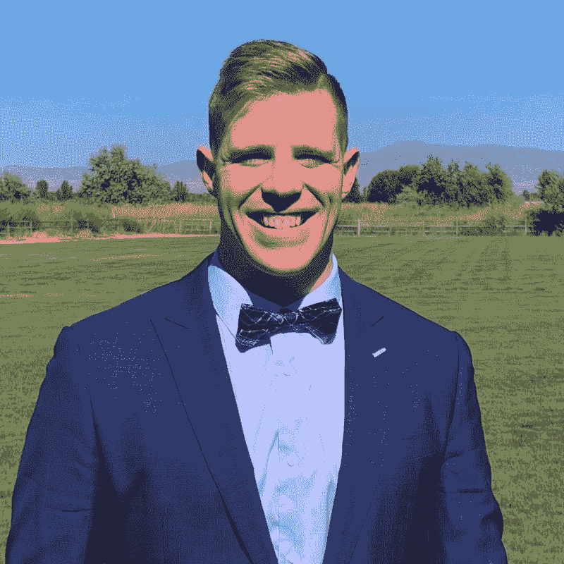
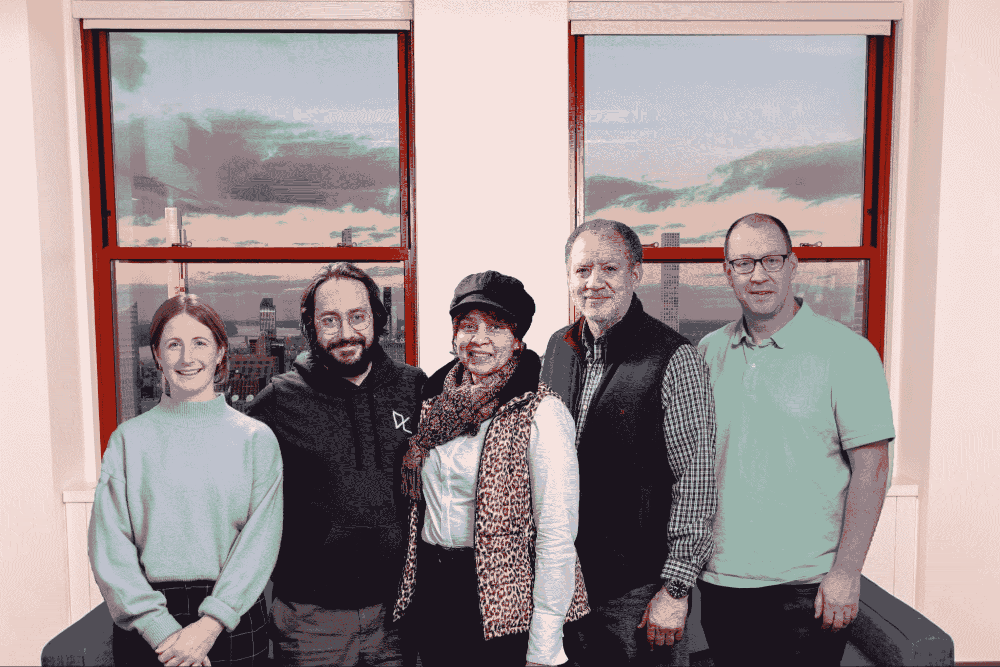
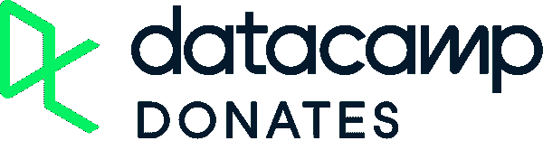

# Q1 2022 年申请数据营捐赠的最后机会

> 原文：<https://web.archive.org/web/20221129045128/https://www.datacamp.com/blog/last-chance-in-q1-2022-to-apply-for-datacamp-donates>

当我们结束 2021 年的最后一章时，DataCamp 希望尽一切努力将免费的世界级数据科学教育提供给最需要它的弱势群体。这就是为什么我们将 Q1 2022 数据营捐赠合作伙伴队列的申请截止日期延长了整整一周。新的截止时间是美国东部时间 2022 年 1 月 31 日 11:59。代表您的非营利组织申请为您的整个社区赢得一年的免费专业数据营！看看我们从[数据营每周捐赠](https://web.archive.org/web/20220810054207/http://www.datacamp.com/donates)学员那里获得的许多成功案例中的一些吧:

“我通过 GDSC 国际律师协会获得了免费使用 DataCamp 的许可，目的是学习目前全世界急需的技能。在 DataCamp 上完成 Python 和 SQL 课程一个月后，我在 Growthhopper 找到了一份数据分析师的工作。感谢 DataCamp 提供这个机会！”

~ Shehroze Shahid，学生，巴基斯坦卡拉奇

“我对 DataCamp 在学习数据科学和编程方面的出色表现感到震惊。我发现 DataCamp 是一个非常棒的学习论坛，因为你可以实际尝试你在整个赛道中学到的概念。无论您阅读了多少数据科学博客或书籍，没有什么比实际编写解决方案和完成项目更有学习价值。DataCamp 打破了我的预期，帮我在耐克找到了一份灰色市场数据分析师的工作。”

——蒙大拿州比尔格，美国陆军老兵，暴线学员，华盛顿州范沃弗

就在感恩节之前，我们很高兴地欢迎 DataCamp 捐赠领导和学习者来到我们位于帝国大厦的办公室，与 DataCamp 领导团队见面。DataCamp 首席人力官 Catalina Schveniger 表示:“我们很高兴能够与 Per Scholas 和 Women in Data 的学习者和领导者面对面交流，这是我们最有价值的两个 DataCamp 捐赠合作伙伴。“得知我们的三位客人即将开始全新的工作，这部分要归功于他们通过 DataCamp 捐赠获得的技能，这是非常令人满意的。”

来自纽约的海伦娜·希尔(Helena Hill)参加了此次活动，她说:“了解更多关于数据库和电子表格的知识，对我在 Per Scholas 担任经理的新职位有所帮助。她接着描述了她新发现的知识如何影响她的日常生活，甚至是工作之外的生活:“数据营让我成为一个更聪明的信息消费者。我更加意识到操纵和歪曲图表中的数据是多么容易，例如，有时是无意的。”Per Scholas 的业务解决方案高级总监 Tiernan Walsh 收到了 60 多份 Helena 职位的申请，她将自己的成功归功于使用 DataCamp 获得的知识。

(From left to right) Rachel Provost (Women in Data), Nathaniel Taylor-Leach (Director of Social Impact, DataCamp), Helena Hill, Terrence X. Daniels, and Tiernan Walsh (Per Scholas)

## 三个月。20 个合伙人。2500 多条生命

第四季度是 DataCamp 捐赠的又一个重要季度。我们增加了来自 17 个国家的 20 个组织。这相当于超过 2，500 名弱势人群 DataCamp 正在帮助他们在数据科学领域找到更好的工作。迄今为止，DataCamp Donates 仅在一年多的时间里就送出了超过 28，000 份订阅，而我们才刚刚开始！！

以下是上个季度我们有幸成为 DataCamp 捐赠合作伙伴的所有新组织和回归组织:

| [雅典耀统计圈](https://web.archive.org/web/20220810054207/http://www.coamanila.com/orgpage/17?fbclid=IwAR3hgmBgvTwhWN_9Lcgy2j957u2oI3SHoQEPpJGr14AoN-rX_dqA782qfDE) | [尼日利亚数据科学](https://web.archive.org/web/20220810054207/https://www.datasciencenigeria.org/) |
| [深度学习。艾](https://web.archive.org/web/20220810054207/https://www.deeplearning.ai/) | [流行的开发者](https://web.archive.org/web/20220810054207/https://developersinvogue.org/) |
| [能源气候](https://web.archive.org/web/20220810054207/https://www.energianaccion.org/) | [友谊庇护所](https://web.archive.org/web/20220810054207/https://www.friendshipshelter.org/) |
| [伦敦的 GDP](https://web.archive.org/web/20220810054207/https://gdg.community.dev/gdg-london/) | [GDSC 扶起了狄利曼](https://web.archive.org/web/20220810054207/https://gdsc.community.dev/university-of-the-philippines-diliman/) |
| [GDSC 是](https://web.archive.org/web/20220810054207/https://gdsc.community.dev/institute-of-business-administration-karachi/) | [GDSC 产品生命周期](https://web.archive.org/web/20220810054207/https://gdsc.community.dev/pamantasan-ng-lungsod-ng-maynila/?fbclid=IwAR2V0n-M63TJUaMbn2Se-dXana_uQytO9Xd8iuQSxb3F0lFhecTpnJHGMSQ) |
| [GDSC 信德穆斯林大学](https://web.archive.org/web/20220810054207/https://gdsc.community.dev/sindh-madressatul-islam-university/) | [全球黑客](https://web.archive.org/web/20220810054207/https://globalhacks.net/) |
| [工业工程师俱乐部](https://web.archive.org/web/20220810054207/https://iec-enp.com/) | [国际咨询网(图标)](https://web.archive.org/web/20220810054207/http://www.internationalconsultingnetwork.org/) |
| [雷斯奇尔法官](https://web.archive.org/web/20220810054207/https://justicereskill.com/) | MSAC MLSA UET 白沙瓦 |
| [Plazi](https://web.archive.org/web/20220810054207/http://plazi.org/) | 雪兰莪人力资源发展中心 |
| 为菲律宾人教书 | [Yakera](https://web.archive.org/web/20220810054207/https://yakera.org/) |

## 成为 DCD 的合伙人，成为当地的英雄

唯一阻止你为当地有抱负的数据专业人士社区提供一年免费数据营的是你自己！如果您的组织提供职业发展、工作安置或其他社会服务，它是成为 DataCamp 捐赠合作伙伴的理想候选人。我们也欢迎来自数据科学或编码社区组织以及科研非营利组织的申请。

[在 2022 年 1 月 31 日前代表组织](https://web.archive.org/web/20220810054207/http://www.datacamp.com/donates/apply)申请成为 DataCamp 捐赠合作伙伴。。Q2 2022 的申请将于 2022 年 2 月 14 日开始。我们期待在 2022 年支持你！

