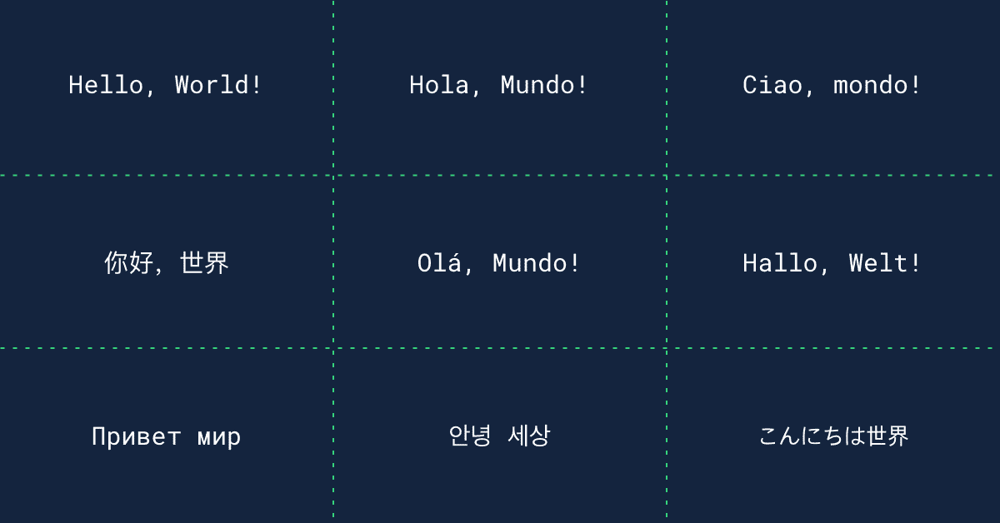

# 通过我们新的字幕翻译，用您的母语学习

> 原文：<https://web.archive.org/web/20230101103301/https://www.datacamp.com/blog/learn-in-your-native-language-with-our-new-subtitle-translations>

## 世界各地的数据营学习者正在打开母语字幕。

我们的使命是为每个人普及数据科学和分析教育。但直到最近，我们只有英语字幕，这是全球商业语言。问题？我们的许多学习者母语不是英语，而[给了我们反馈](https://web.archive.org/web/20220817162835/https://support.datacamp.com/hc/en-us/requests/new?ticket_form_id=360000029413)他们更喜欢用母语学习。为了支持我们在世界各地的学习者，我们开发了九种流行语言的课程字幕:**西班牙语、法语、中文(简体)、葡萄牙语、德语、韩语、日语、俄语、**和**意大利语**。在我们的帮助中心了解如何更改字幕语言。

我们已经知道字幕很受欢迎。大约有 30%的学习者开始学习我们的课程时会启用字幕——你也不例外。结合视觉和听觉的学习方式是有效的。许多学习者希望边听边读，这有助于理解。此外，字幕使我们的目录更容易被不同背景和需求的人所理解。

我们不希望我们的母语不是英语的学习者不得不付出两倍的努力来达到和其他人一样的目标。我们希望每个人都能理解数据，并用数据语言进行交流。

上个月，我们为所有课程推出了九种不同语言的新字幕。从那以后，我们看到 20%打开字幕的学习者使用非英语字幕，以西班牙语、汉语和葡萄牙语为主。

如果没有来自学习者的输入，我们的产品团队永远不会踏上这个旅程，他们希望学习不同的语言。请继续让我们知道[我们如何改进产品功能](https://web.archive.org/web/20220817162835/https://support.datacamp.com/hc/en-us/requests/new?ticket_form_id=360000029413)比如我们的翻译，并推荐我们接下来应该考虑添加哪些语言。我们也希望听到您对我们课程的[反馈](https://web.archive.org/web/20220817162835/https://support.datacamp.com/hc/en-us/requests/new?ticket_form_id=360000029453)！我们可以一起让 DataCamp 成为一个各行各业的人都可以学习数据语言的地方。