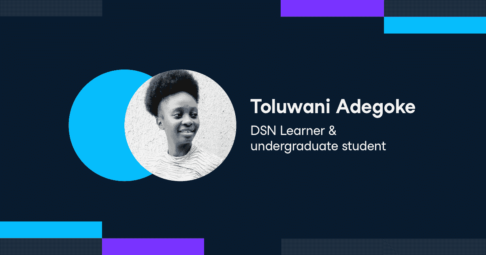

# 尼日利亚数据科学的学习者正在通过 DataCamp 实现个人和专业的里程碑

> 原文：<https://web.archive.org/web/20221129034451/https://www.datacamp.com/blog/learners-at-data-science-nigeria-are-achieving-personal-and-professional-milestones-with-datacamp>

DataCamp 于今年春天启动了我们的赠品计划，旨在为世界各地的弱势群体免费提供高质量的数据科学教育。我们希望它能为那些渴望提升技能的人提供新的机会，并在疫情找到收入更高的工作。我们在这项计划中的合作伙伴之一是尼日利亚数据科学公司。他们正在利用 DataCamp 课程的深度，为所有尼日利亚人的利益建立令人兴奋的数据项目。

## 关于尼日利亚数据科学

[尼日利亚数据科学](https://web.archive.org/web/20221212135912/https://www.datasciencenigeria.org/) (DSN)是一家人工智能非营利组织，旨在培训、指导和激励尼日利亚学生培养高级分析和数据科学技能。DSN 的数据科学家 Ezekiel Ogundepo 表示:“我们热爱 DataCamp 推动数据科学教育民主化的使命。“这符合我们在尼日利亚数据科学公司的愿景，即建立一个世界级的人工智能知识、研究和创新生态系统，提供高影响力和转型研究、商业应用、人工智能优先的初创企业、就业能力和社会公益用例。我们的目标是在 10 年内培养 100 万名人工智能人才，我们希望尼日利亚能够成为全球 10 大人工智能人才/知识目的地之一，并产生 20%的 GDP 乘数效应。这就是为什么我们向我们的员工、我们的 AI+社区成员以及一些 DSN 人工智能训练营 2020 的优秀参与者发放许可证。”

这是一个非常雄心勃勃的目标，但通过适当的培训是可以实现的。“我们的员工和我们的各个社区正在通过在 DataCamp 学习各种数据科学和机器学习课程来武装自己。我在 DataCamp 上学习编程。

## 使用 DataCamp 实现最高效率

他们的员工、志愿者和学生在 DataCamp 上接受的培训数量证明了该组织对提升尼日利亚在全球数据科学界的形象的重视程度。在短短的四个月内，他们的成员和员工已经完成了 3400 小时的学习。完成了 450 多门课程，获得了超过 1，000，000+的经验。

这种令人印象深刻的订婚的原因是什么？“实际操作的体验、简化的视频内容和讲师都非常棒，”毕马威(KPMG)的 DSN 学员兼实习生 Jeremiah Nwaneri 说。“这很吸引人。一旦你开始使用 DataCamp，你就会想继续学习。DataCamp 课程讲师是伟大的激励者和推动者。我的学习热情大幅飙升。”

拉多克·阿金托拉理工大学的学生托卢瓦尼·阿德戈克对此表示赞同:“我觉得这很有趣。参与 DataCamp 项目帮助我改善了我的简历和投资组合。”让他们的成员保持积极性和学习的是 DataCamp 的各种课程和活动，这些课程和活动吸引了不同的学习风格。DSN 学习者经常引用我们的指导和非指导[项目](https://web.archive.org/web/20221212135912/https://www.datacamp.com/projects)、[信号评估](https://web.archive.org/web/20221212135912/http://datacamp.com/signal)和[移动应用](https://web.archive.org/web/20221212135912/http://datacamp.com/mobile)体验作为他们最喜欢的功能。

对于 DSN 的数据分析师 Peter Onuoha 来说，DataCamp 的核心功能提供了您在课程中、在您的网络浏览器中学习和实践所需的所有工具。“将开发人员环境集成到他们的学习网站中是非常了不起的。我不必在 Jupyter 笔记本和教学视频之间穿梭，因为所有的东西都在网站上，”他说。

在新冠肺炎期间，在家学习是一个优先事项，我们的目标是提供最佳的学习体验，以培养在线数据技能。DSN 学习者发现，即使与传统的面对面教育相比，他们从使用 DataCamp 中获得的收益也令人印象深刻。Julius Odunga 说:“数据营和面对面教育之间似乎没有区别。“每次我在代码中犯了一个错误，DataCamp 都有办法告诉我到底哪里出错了。”

“DataCamp 给人一种由世界级导师亲自授课的感觉，”Fortune Uwha 说。我们的平台为她提供了评估、学习和实践其数据科学技能的工具，并将其应用到现实世界中。

根据 Ezekiel 的说法，“迄今为止收集的经验证据表明，与面对面的计算机科学教育相比，DataCamp 更有效，这有着显著的差异(P 值< 0.05)。”

## 真正的学习，真正的成果

许多 DSN 学习者报告说，DataCamp 帮助他们在编码竞赛中获得更高的名次，获得荣誉和建立信心，并在简历中脱颖而出。Fortune 是一名 DSN 学习者，目前正在寻找工作，她感谢 DataCamp 最近的成功:“凭借通过 Python track 学习机器学习基础知识的各种课程获得的技能，我在 Kaggle 上举办的数据科学尼日利亚黑客马拉松中名列第 10 位。”

但是一整年免费使用 DataCamp 的意义不仅仅是获得奖牌和奖杯。许多 DSN 学习者报告说，他们在 DataCamp 上获得的技能帮助他们获得了实习、带薪工作，甚至改善了他们目前的工作状况。《财富》杂志证实，“在 DataCamp 上的学习帮助我保持了最新的编程技能。它帮助我的大脑在工作中保持敏锐。这帮助我获得了几个自由职业项目。”

DataCamp 的边做边学方法已经帮助许多学习者应用和分享他们的知识。Emmanuel Onwuegbusi 使用他在 DataCamp [中学到的自然语言处理技能建立了](https://web.archive.org/web/20221212135912/https://medium.com/analytics-vidhya/build-an-ocr-and-summarize-webapp-using-pytesseract-gensim-and-django-13d0ff911d93)一个 [OCR 系统](https://web.archive.org/web/20221212135912/https://emmamichael.pythonanywhere.com/)，该系统从图像中提取文本，并使用 GENSIM 包来总结 OCRed 文本。对于 DSN 的常驻数据科学家 Ezekiel 来说，持续的健康危机是最紧迫的应用。“我用 R 在[时间序列中学习了 DataCamp 的技能轨迹，我能够操纵各种新冠肺炎时间序列数据，”他说。“此外，我们刚刚在《数据》杂志上发表了一篇关于疫情期间尼日利亚经济和医疗保健的文章](https://web.archive.org/web/20221212135912/https://datacamp.com/courses/time-series-analysis-in-r)[，使用了在 DataCamp 上获得的技能。”](https://web.archive.org/web/20221212135912/https://doi.org/10.1016/j.dib.2020.106424)

DSN 成员将他们的技能带到了学术界，但他们也在努力为大众可视化这些重要的数据。阿库雷联邦理工大学的学生 Precious Ebiendele 在 DataCamp 上只上了两门数据可视化课程，就为全尼日利亚建造了一个[新冠肺炎病例跟踪器](https://web.archive.org/web/20221212135912/https://precious-ebiendele.shinyapps.io/covid9JA)。他说，“对于一个新的或有抱负的数据科学家，我会推荐 DataCamp，因为它的简单性和教学方法。”

如果你知道一个非营利组织可以免费订阅 DataCamp，请联系 [【电子邮件保护】](/web/20221212135912/https://www.datacamp.com/cdn-cgi/l/email-protection#16717f60737761776f567277627775777b663875797b) 。