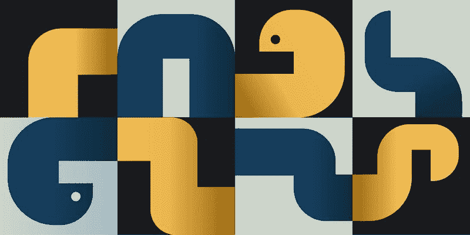

# Python 之禅的启示

> 原文：<https://web.archive.org/web/20221129040406/https://www.datacamp.com/blog/lessons-from-the-zen-of-python>



## Python 的禅是什么？

Python 的禅是一套十九条格言，作为 Python 设计的指导原则。它实际上应该是二十句格言；但是 Python 的创造者吉多·范·罗苏姆仍然没有按照 Python 之禅的创造者蒂姆·彼得斯的意图添加最后的警句。据报道，圭多表示，失踪的第二十句格言是“一些奇怪的蒂姆·彼得斯内部笑话。”

尽管缺少了第二十条格言，Python 的 Zen 在 2004 年被标准化为 PEP 20，因为它对 Python 程序员的开发过程有重大影响。遵循 Python 的禅不是强制性的，但是建议了解它并牢记在心。如果您忘记了课程，您可以通过从 Python 解释器运行 import this 来轻松地刷新您的记忆。

```py
>>> import this
The Zen of Python, by Tim Peters

Beautiful is better than ugly.
Explicit is better than implicit.
Simple is better than complex.
Complex is better than complicated.
Flat is better than nested.
Sparse is better than dense.
Readability counts.
Special cases aren't special enough to break the rules.
Although practicality beats purity.
Errors should never pass silently.
Unless explicitly silenced.
In the face of ambiguity, refuse the temptation to guess.
There should be one-- and preferably only one --obvious way to do it.
Although that way may not be obvious at first unless you're Dutch.
Now is better than never.
Although never is often better than *right* now.
If the implementation is hard to explain, it's a bad idea.
If the implementation is easy to explain, it may be a good idea.
Namespaces are one honking great idea -- let's do more of those!
```

在本文中，我们将更详细地讲述每一课。

## #1 美丽总比丑陋好

如果你是一个程序员，毫无疑问，你的技术很高。用代码解决问题的能力不是一件容易的事情，但是作为一名 Pythonista，对您的期望更高。漂亮的代码比难看的代码好。Python 的迅速崛起部分是由于它的可访问性:它简单、易读、优雅。作为 Python 开发人员，您有责任通过编写漂亮的代码来维护 Python 标准。

什么是美丽的代码？嗯，这是主观的——情人眼里出西施，诸如此类。一个简单的经验法则是编写清晰、易读、其他开发人员容易理解的代码。例如:

```py
"""
Initial code was created by Vishal Sharma
See:  https://towardsdatascience.com/the-zen-of-python-a-guide-to-pythons-design-principles-93f3f76d088a
"""
def collatz(num):
    if num % 2 == 0:
        return num // 2
    else:
        return 3 * num + 1

number = input("Enter a number: ")

while number != 1:
    number = collatz(int(number))
    print(number)

"""
Enter a number: 5
16
8
4
2
1
"""
```

上面的代码工作得非常好，但不一定很漂亮。我们在 collatz 函数中有一个不必要的 else 条件，可以按如下方式删除:

```py
def collatz(num):
  if num % 2 == 0:
      return num // 2

  return 3 * num + 1
```

因此，当面对两个工作代码的场景时，您应该选择更简单、可读性更好、更容易理解的一个。

## #2 显式比隐式好

将任何格言解释为“不言自明”是一个巨大的错误——然而，你仍然会看到人们这样做。“显式比隐式好”背后的主要观点是，详细代码比间接代码更可取。尽你所能确保你的代码的功能没有隐藏在晦涩的语言后面。不了解你的程序的人也应该能够理解你的代码中发生了什么。

## #3 简单胜于复杂

如果你的伴侣在晚餐后拿出一台喷射机来洗碗，你可能会笑。这不仅是一个非常愚蠢的解决方案，而且盘子很有可能会被损坏。同样，将高度复杂的解决方案应用于简单的编程问题也是极其不切实际的。没有必要让你的解决方案过于复杂，即使你认为这让你看起来很聪明。你可能会造成比正义更大的伤害，这在 Python 中是不受欢迎的。

看看这个用于反转字符串的函数:

```py
def reverse_string(string):
    if len(string) == 1:
        return string
    else:
        return reverse_string(string[1:]) + string[0]

string = "kurtis"

print(reverse_string(string))

"""
sitruk
"""
```

上面的代码当然解决了这个问题，但它是不必要的复杂。如果您很好地掌握了 Python，您会知道字符串可以通过索引来反转。

```py
string = "kurtis"

# annonymous function solution
reverse_string = lambda x: x[::-1]

# function solution
def reverse(string):
    return string[::-1]

print(reverse_string(string))
print(reverse(string))

"""
sitruk
sitruk
"""
```

## #4 复杂比复杂好

现在，用喷射洗盘子是不切实际的:你最好用一种简单的方法，比如用自来水。但是如果问题是清洗一辆 4x4 的路虎呢？前面的格言和这一条提醒我们，简单和复杂的技术都可以用来解决一个问题。清洗一辆四轮驱动的路虎揽胜并不是一个简单的问题，尝试使用你用来洗碗的相同技术可能会奏效，但比使用喷洗更复杂。因此，你应该选择简单而不是复杂，但是在简单不切实际的情况下，你最好选择复杂——知道简单的限制。

## #5 扁平比嵌套好

程序员喜欢将事物组织成类别、子类别和子子类别，作为分离功能的一种方式。虽然这听起来很有条理，但以这种方式组织代码可能会比组织更混乱。

将所有代码放在一个顶层模块中没有任何问题:这意味着您不必做像`from spam.foo.bar.john.doe import chicken` 这样的事情来访问特定的功能。添加的子类别越多，代码就变得越复杂。尽你所能尽可能坚持一个扁平的结构。

## #6 稀疏比密集好

程序员被认为是最聪明的人类之一，所以没有必要用过于复杂的技巧来强调你的智力。你最常听到的是“如何用 1 行代码完成[一些复杂的任务]”有时，一行程序是合理的，但是要避免为了将所有功能放在一行中而牺牲可读性的情况。

以这段代码为例:

```py
"""
Code source Al Sweigart
See: https://inventwithpython.com/blog/author/al-sweigart.html0
"""
print('\n'.join("%i bytes = %i bits which has %i possible values." % (j, j*8, 256**j-1) for j in (1 << i for i in range(8))))
"""
1 bytes = 8 bits which has 255 possible values.
2 bytes = 16 bits which has 65535 possible values.
4 bytes = 32 bits which has 4294967295 possible values.
8 bytes = 64 bits which has 18446744073709551615 possible values.
16 bytes = 128 bits which has 340282366920938463463374607431768211455 possible values.
32 bytes = 256 bits which has 115792089237316195423570985008687907853269984665640564039457584007913129639935 possible values.
64 bytes = 512 bits which has 13407807929942597099574024998205846127479365820592393377723561443721764030073546976801874298166903427690031858186486050853753882811946569946433649006084095 possible values.
128 bytes = 1024 bits which has 179769313486231590772930519078902473361797697894230657273430081157732675805500963132708477322407536021120113879871393357658789768814416622492847430639474124377767893424865485276302219601246094119453082952085005768838150682342462881473913110540827237163350510684586298239947245938479716304835356329624224137215 possible values.
"""
```

代码当然可以工作，但理解起来绝对是一场噩梦:它既狭窄又难以阅读。

让我们看看，如果我们把同样的代码写成稀疏代码，它会是什么样子:

```py
# Sparse example
bytes_and_bits = {j: j*8 for j in (1 << i for i in range(8))}

for bytes, bits in bytes_and_bits.items():
    print(f"{bytes} bytes = {bits} which has {256**bytes-1} possible values")

"""
1 bytes = 8 which has 255 possible values
2 bytes = 16 which has 65535 possible values
4 bytes = 32 which has 4294967295 possible values
8 bytes = 64 which has 18446744073709551615 possible values
16 bytes = 128 which has 340282366920938463463374607431768211455 possible values
32 bytes = 256 which has 115792089237316195423570985008687907853269984665640564039457584007913129639935 possible values
64 bytes = 512 which has 13407807929942597099574024998205846127479365820592393377723561443721764030073546976801874298166903427690031858186486050853753882811946569946433649006084095 possible values
128 bytes = 1024 which has 179769313486231590772930519078902473361797697894230657273430081157732675805500963132708477322407536021120113879871393357658789768814416622492847430639474124377767893424865485276302219601246094119453082952085005768838150682342462881473913110540827237163350510684586298239947245938479716304835356329624224137215 possible values
"""
```

上面的代码更容易阅读，做的事情和一行程序完全一样。

## #7 可读性计数

如果你还没有猜到，当谈到 Python 时，可读性是很重要的。你的工作就是写一次代码。然而，它很有可能会被多次阅读。考虑到这一点，去掉变量名和函数名中的元音并不是一个好主意:在可以将函数命名为 create_lst 或 create_list 的情况下，选择后者。

## #8 特例不足以打破规则

python[以及一般的编程]充满了许多需要遵循的最佳实践。最好遵循最佳实践，而不是按照自己的方式去做，因为这通常会导致不一致、不可读的代码。

## #9 尽管实用性胜过纯粹性

第九课是第八课的延伸。是的，遵循最佳实践是更好的，但是不遵守规则也会导致不可读的代码。因此，每个规则都可能有例外。如果你解决问题的方式更实用、可读性更强、更容易理解，那么最好背离既定的最佳实践。

## #10 错误永远不应该悄无声息地过去

无声错误是指程序返回错误代码或无错误代码，而不是引发异常。一个程序崩溃总比错误消失并继续运行要好。从长远来看，消除错误会导致程序中出现更难消除的错误。

## #11 除非明确禁止

第十一课是第十课的延伸。在某些情况下，您可能希望忽略程序导致的错误。在这种情况下，最佳做法是在代码中显式隐藏错误。

## #12 面对模棱两可的话，拒绝猜测的诱惑

计算机只做我们告诉它们去做的事情:如果你的代码没有像你希望的那样运行，那是因为它在做你告诉它去做的事情。试图通过盲目地尝试几种不同的解决方案直到其中一个奏效来解决问题是一个糟糕的策略——你可能会掩盖问题而不是解决它。抵制诱惑。相反，思考问题的逻辑，并运用批判性思维来提出适当的解决方案。

## #13 应该有一种——最好只有一种——显而易见的方法去做

Perl 编程语言的格言是:“有不止一种方法可以做到这一点！”有太多的选择往往会导致选择超载。当有多种方法来编写实现相同目标的代码时，也会出现类似的情况。您在编写代码的方式上有了更多的灵活性，但是现在您必须学习所有可能的代码编写方式以便阅读它:学习所有场景所需的额外工作是不必要的。

## #14 尽管这种方式一开始可能并不明显，除非你是荷兰人

这句格言展示了 Tim Peters 的幽默感:Python 编程语言的创造者、Python 的终身仁慈独裁者(BDFL)吉多·范·罗苏姆是荷兰人。这是一个笑话，提醒我们能够理解和回忆 Python 的语言规则对于除了它的创造者之外的所有人来说都是困难的。

## #15 现在总比没有好

这句格言告诉我们，陷入无限循环的代码或挂起的代码比没有挂起的代码更糟糕。

## #16 尽管从来没有比现在更好

从第十六课继续:等待你的程序执行完比过早终止它并得到不正确的结果要好。

## #17 如果实现很难解释，这是一个坏主意

如果您能够理解自己的实现，这还不够好-“我知道我想说什么”并不能解决问题。编程是一项团队活动，如果你无法向你的队友解释你的实现，那么很有可能你把解决方案做得太复杂了。

## #18 如果实现很容易解释，这可能是一个好主意

然而，易于解释的代码并不一定意味着它不是坏代码——它只是意味着它易于解释。您可能仍然有糟糕的代码，但是它易于解释的事实意味着您的思路是正确的。

## #19 名称空间是一个非常棒的想法——让我们多做一些吧！

名称空间是 Python 中使用的一种抽象，用于组织程序中分配给对象的名称。当给出一个特定的名称空间和范围时，Python 能够确定当您调用一个符号名称时所指的对象。这句格言的意思是，Python 组织符号名称的方式非常棒。

## 结论

在这篇文章中，我们展示了我们对 Python 之禅的理解，这是为了激励 Python 程序员编写干净、可读的代码而创建的准则。虽然有些人将 Python 的禅视为无缝代码编写的终极蓝图，但其他人却不太重视它。我们建议您尝试将这些原则应用到您自己的代码中，看看它们如何直接改进您的工作。如果你想了解更多关于编写优化代码的知识，请查看 DataCamp 的[编写高效的 Python 代码](https://web.archive.org/web/20221129054617/https://www.datacamp.com/courses/writing-efficient-python-code)。