# 面向所有级别的机器学习项目

> 原文：<https://web.archive.org/web/20221129041202/https://www.datacamp.com/blog/machine-learning-projects-for-all-levels>

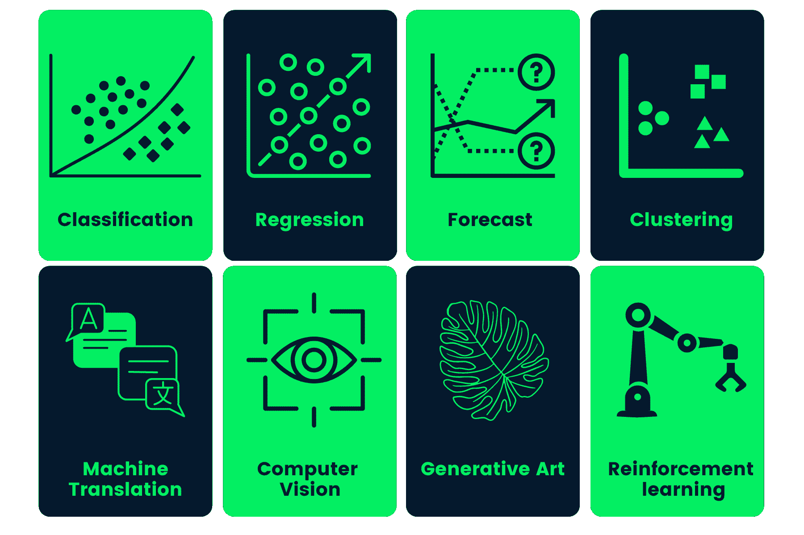

## 面向初学者的机器学习项目

初学者机器学习项目包括处理结构化表格数据。您将应用数据清理、处理和可视化的技能进行分析，并使用 scikit-learn 框架来训练和验证机器学习模型。

对于机器学习初学者来说，我们有一个非常棒的无代码[人人机器学习课程](https://web.archive.org/web/20221206161023/https://www.datacamp.com/courses/introduction-to-machine-learning-with-R)。

### 用随机森林预测出租车费用

在[预测出租车费用](https://web.archive.org/web/20221206161023/https://www.datacamp.com/projects/496)项目中，您将使用纽约出租车数据集预测赚取最高费用的地点和时间。您使用 tidyverse 进行数据处理和可视化。为了预测位置和时间，您将尝试使用基于树的模型，如决策树和随机森林。

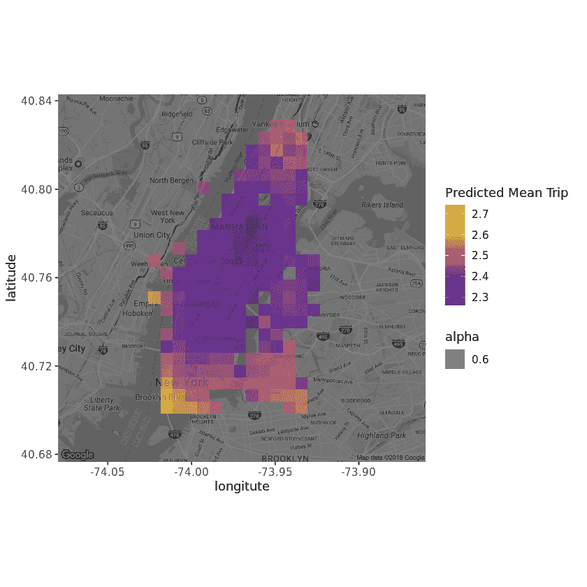

预测出租车费用项目是一个指导性项目，但是您可以在不同的数据集上复制结果，例如[首尔的自行车共享需求](https://web.archive.org/web/20221206161023/https://www.datacamp.com/workspace/datasets/dataset-python-bike-sharing-demand)。处理一个全新的数据集将有助于您进行代码调试，并提高您解决问题的技能。

### 从音频数据中分类歌曲流派

在[分类歌曲流派机器学习项目](https://web.archive.org/web/20221206161023/https://www.datacamp.com/projects/449)中，你将使用歌曲数据集将歌曲分为两类:“嘻哈”或“摇滚”您将检查要素之间的相关性，使用 scikit-learn 的 StandardScaler 归一化数据，对缩放后的数据应用 PCA(主成分分析),并可视化结果。

之后，您将使用 scikit-learn 逻辑回归和决策树模型来训练和验证结果。在这个项目中，您还将学习一些高级技术，如类平衡和交叉验证，以减少模型偏差和过度拟合。

| 决策树:
精准回忆 f1-比分支持

嘻哈 0.66 0.66 0.66 229
摇滚 0.92 0.92 0.92 972

avg/total 0.87 0.87 0.87 1201 |

| Logistic 回归:
精准回忆 f1-得分支持度

嘻哈 0.75 0.57 0.65 229
摇滚 0.90 0.95 0.93 972

avg/total 0.87 0.88 0.87 1201 |

从音频数据中对歌曲流派进行分类是一个指导性的项目。您可以在不同的数据集上复制该结果，例如[酒店预订需求](https://web.archive.org/web/20221206161023/https://www.datacamp.com/workspace/datasets/dataset-r-hotel-booking-demand)数据集。你可以用它来预测客户是否会取消预订。

### 预测信用卡批准

在[预测信用卡批准](https://web.archive.org/web/20221206161023/https://www.datacamp.com/projects/558)项目中，您将使用超参数优化和逻辑回归构建一个自动信用卡批准应用程序。

您将应用处理缺失值、处理分类特征、特征缩放、处理不平衡数据以及使用 GridCV 执行自动超参数优化的技能。这个项目将把你从处理简单干净的数据的舒适区中推出来。

作者图片

预测信用卡批准是一个指导性项目。您可以在不同的数据集上复制结果，比如来自 LendingClub.com 的贷款数据。您可以使用它来构建一个自动贷款批准预测器。

### 商店销售

[商店销售](https://web.archive.org/web/20221206161023/https://www.kaggle.com/competitions/store-sales-time-series-forecasting/code)是一项 Kaggle 入门竞赛，参与者训练各种时间序列模型，以提高他们在排行榜上的分数。

在该项目中，将为您提供商店销售数据，您将清理数据、执行广泛的时间序列分析、要素缩放以及训练多元时间序列模型。

要提高您在排行榜上的分数，您可以使用打包和投票回归等集合。

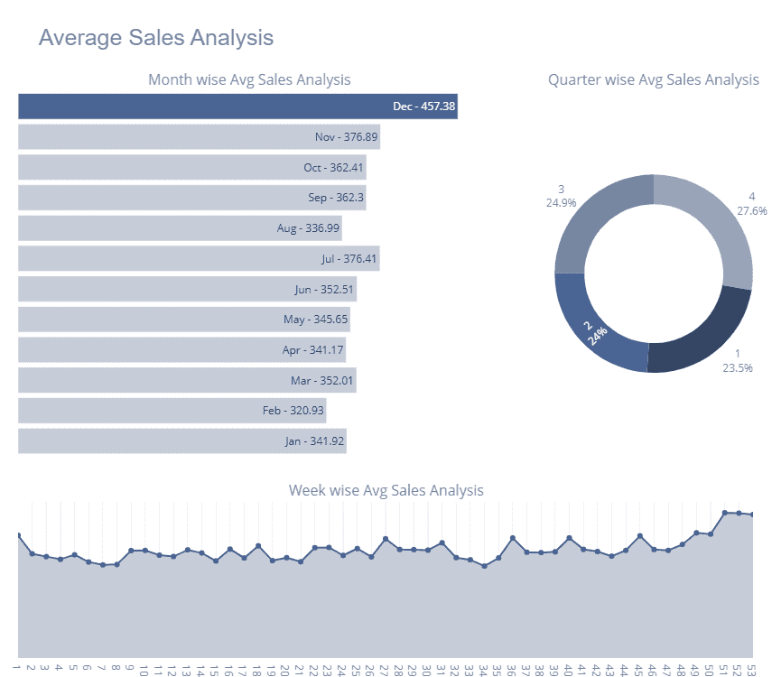

图片来自 [Kaggle](https://web.archive.org/web/20221206161023/https://www.kaggle.com/code/kashishrastogi/store-sales-analysis-time-serie)

商店销售是一个基于 Kaggle 的项目，你可以查看其他参与者的笔记本。

为了提高您对时间序列预测的理解，尝试将您的技能应用到[股票交易所](https://web.archive.org/web/20221206161023/https://www.datacamp.com/workspace/datasets/dataset-r-stock-exchange)数据集，并使用[脸书预言家](https://web.archive.org/web/20221206161023/https://github.com/facebook/prophet)来训练单变量时间序列预测模型。

### 给予生命:预测献血

在[献出生命:预测献血](https://web.archive.org/web/20221206161023/https://www.datacamp.com/projects/646)项目中，您将预测献血者是否会在给定的时间窗口内献血。该项目中使用的数据集来自台湾的一辆流动献血车，作为献血运动的一部分，输血服务中心开车到各个大学收集血液。

在这个项目中，你正在处理原始数据，并将其提供给 [TPOT](https://web.archive.org/web/20221206161023/https://github.com/EpistasisLab/tpot) Python AutoML(自动机器学习)工具。它将搜索数百个机器学习管道，以找到最适合我们数据集的管道。

然后，我们将使用来自 TPOT 的信息来创建具有标准化特征的模型，并获得更好的分数。

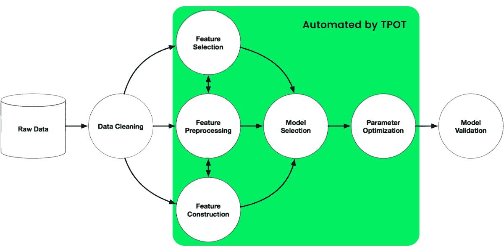

作者图片

给予生命:预测献血是一个指导性项目。您可以在不同的数据集上复制结果，例如[独角兽公司](https://web.archive.org/web/20221206161023/https://www.datacamp.com/workspace/datasets/dataset-python-unicorn-companies)。你可以用 TPOT 来预测一家公司的估值是否会超过 50 亿美元。

学习[机器学习基础知识](https://web.archive.org/web/20221206161023/https://www.datacamp.com/tracks/machine-learning-fundamentals-with-python)以了解更多关于监督和非监督学习的信息。

## 中级机器学习项目

这些中级机器学习项目专注于结构化和非结构化数据集的数据处理和训练模型。学习使用各种统计工具清理、处理和扩充数据集。

### 气候变化对鸟类的影响

在[气候变化对鸟类的影响](https://web.archive.org/web/20221206161023/https://www.datacamp.com/projects/664)项目中，您将使用 caret 训练关于鸟类观察和气候数据的逻辑回归模型。您将执行数据清理和嵌套，为空间分析准备数据，创建伪缺席，训练 glmnet 模型，并在地图上可视化四十年的结果。

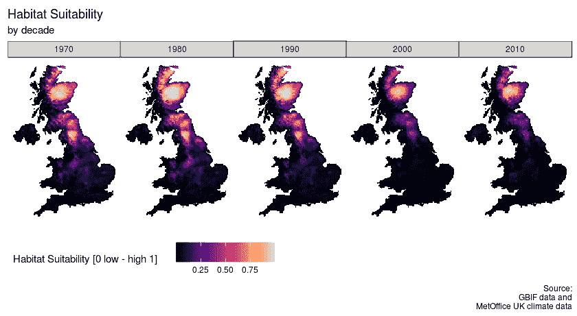

气候变化对鸟类的影响是一个有指导的中级机器学习项目。您可以在不同的数据集上复制该结果，如 [Airbnb 列表](https://web.archive.org/web/20221206161023/https://www.datacamp.com/workspace/datasets/dataset-r-airbnb-listings)数据集。您可以使用 caret 根据特征和位置来预测列表的价格。

2 个月内成为 R 的[机器学习科学家，掌握各种可视化和机器学习 R 包。](https://web.archive.org/web/20221206161023/https://www.datacamp.com/tracks/machine-learning-scientist-with-r)

### 从情节摘要中查找电影相似性

在[从情节摘要中寻找电影相似性](https://web.archive.org/web/20221206161023/https://www.datacamp.com/projects/648)项目中，您将使用各种 NLP(自然语言处理)和 KMeans 来根据 IMDB 和维基百科中的情节预测电影之间的相似性。

您将学习合并数据，对文本执行标记化和词干化，使用 TfidfVectorizer 对其进行转换，使用 KMeans 算法创建聚类，最后绘制树状图。

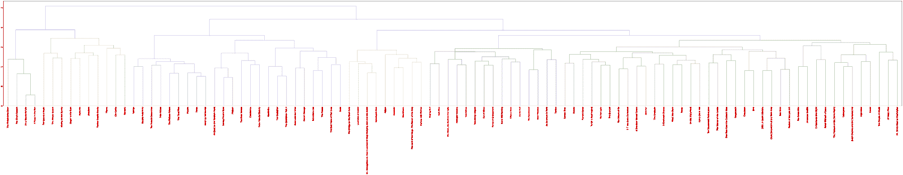

尝试在不同的数据集上复制结果，例如网飞电影数据集。

### 机器学习中最热门的话题

在[机器学习最热门话题](https://web.archive.org/web/20221206161023/https://www.datacamp.com/projects/158)项目中，你将使用文本处理和 LDA(线性判别分析)从 NIPS 研究论文的大集合中发现机器学习的最新趋势。您将执行文本分析，为 word cloud 处理数据，为 LDA 分析准备数据，并使用 LDA 分析趋势。

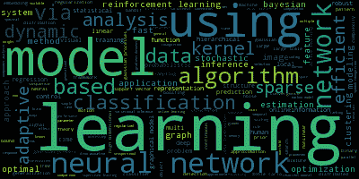

### 天真的蜜蜂:从图像中预测物种

在[nave Bees:Predict Species from Images](https://web.archive.org/web/20221206161023/https://www.datacamp.com/projects/412)项目中，您将处理图像并训练 SVM(支持向量分类器)模型来区分蜜蜂和大黄蜂。您将操作和处理图像，提取要素并将其展平为一行，使用 StandardScaler 和 PCA 为模型准备数据，训练 SVM 模型并验证结果。

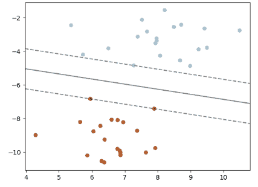

### 基于 librosa 的语音情感识别

在[使用 Librosa 的语音情感识别](https://web.archive.org/web/20221206161023/https://data-flair.training/blogs/python-mini-project-speech-emotion-recognition)项目中，您将使用 Librosa、声音文件和 sklearn 处理声音文件，以便 MLPClassifier 从声音文件中识别情感。

您将加载和处理声音文件，执行特征提取，并训练多层感知器分类器模型。该项目将教会你音频处理的基础知识，以便你可以进一步训练深度学习模型，以实现更好的准确性。

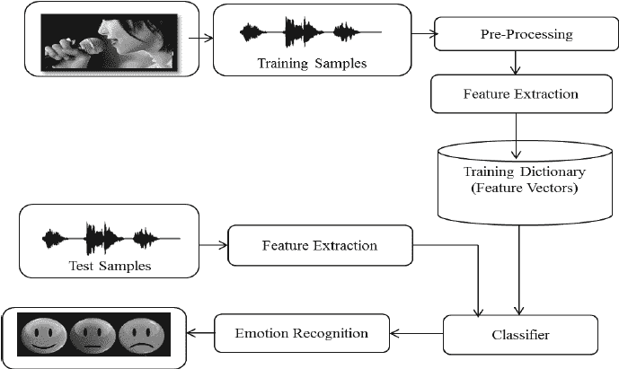

图片来自[researchgate.net](https://web.archive.org/web/20221206161023/https://www.researchgate.net/profile/Ratnadeep-Deshmukh-2/publication/270899631/figure/fig1/AS:295126711717888@1447375099658/Architecture-of-Speech-Emotion-Recognition-System.png)

## 高级机器学习项目

高级机器学习项目专注于建立和训练深度学习模型，处理非结构化数据集。您将训练卷积神经网络、门控递归单元、微调大型语言模型和强化学习模型。

### 使用变形金刚建造瑞克·桑切斯机器人

在[使用变形金刚构建 Rick Sanchez 机器人](https://web.archive.org/web/20221206161023/https://towardsdatascience.com/make-your-own-rick-sanchez-bot-with-transformers-and-dialogpt-fine-tuning-f85e6d1f4e30)项目中，你将使用 DialoGPT 和拥抱脸变形金刚库来构建你的人工智能聊天机器人。

您将处理和转换您的数据，在 Rick 和 Morty dialogues 数据集上构建和微调微软的大规模预训练响应生成模型(DialoGPT)。您还可以创建一个简单的 Gradio 应用程序来实时测试您的模型:[里克&莫蒂街区聚会](https://web.archive.org/web/20221206161023/https://huggingface.co/spaces/Gradio-Blocks/RickandMorty-BlockParty)。

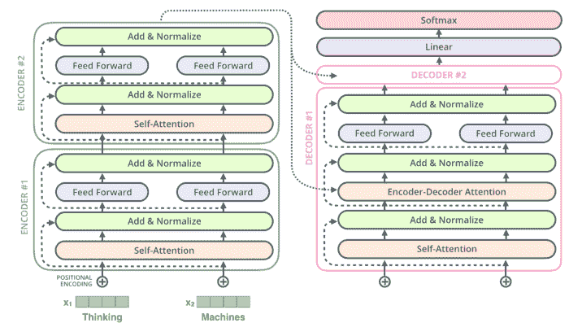

### 基于深度学习的手语识别

在 [ASL 识别](https://web.archive.org/web/20221206161023/https://www.datacamp.com/projects/509)项目中，你将使用 Keras 构建一个 CNN(卷积神经网络)用于美国手语图像分类。

您将可视化图像并分析数据，处理建模阶段的数据，对图像数据集进行编译、训练和 CNN，并可视化错误的预测。您将使用错误的预测来提高模型性能。

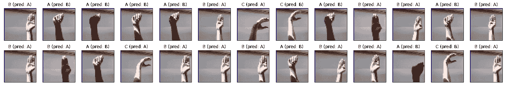

阅读一篇[深度学习](https://web.archive.org/web/20221206161023/https://www.datacamp.com/tutorial/tutorial-deep-learning-tutorial)教程，了解基础知识和现实世界的应用。

### 天真的蜜蜂:用图像进行深度学习

在[nave Bees](https://web.archive.org/web/20221206161023/https://www.datacamp.com/projects/555)项目中，您将构建并训练一个深度学习模型来区分蜜蜂和大黄蜂图像。您将从图像和标签数据处理开始。

然后，您将标准化图像，并将数据集分为测试和评估两部分。之后，您将使用 Keras 构建和编译深度卷积神经网络，最后，您将训练和评估结果。

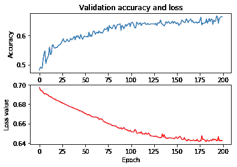

### 使用深度学习的股票市场分析和预测

在[股市分析和预测](https://web.archive.org/web/20221206161023/https://medium.com/nerd-for-tech/stock-market-analysis-and-forecasting-using-deep-learning-f75052e81301)项目中，您将使用 GRUs(门控递归单元)来构建深度学习预测模型，以预测亚马逊、IBM 和微软的股价。

在第一部分中，您将深入时间序列分析，以了解股票价格的趋势和季节性，然后您将使用这些信息来处理您的数据，并使用 PyTorch 建立一个 GRU 模型。如需指导，您可以查看 GitHub 上的[代码源](https://web.archive.org/web/20221206161023/https://github.com/soham2707/Stock-Market-Analysis-And-Forecasting-Using-Deep-Learning/blob/master/Stock_market.ipynb)。

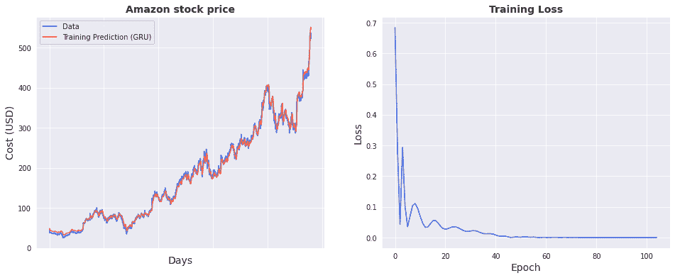

图片来自[索哈姆·南迪](https://web.archive.org/web/20221206161023/https://github.com/soham2707/Stock-Market-Analysis-And-Forecasting-Using-Deep-Learning/blob/master/Stock_market.ipynb)

### Connect X 的强化学习

[Connect X](https://web.archive.org/web/20221206161023/https://www.kaggle.com/competitions/connectx) 是 Kaggle 的入门模拟比赛。构建一个 RL(强化学习)代理来与其他 Kaggle 竞赛参与者竞争。

您将首先学习游戏如何工作，并为基线创建一个虚拟的功能代理。之后，您将开始尝试各种 RL 算法和模型架构。你可以尝试在深度 Q 学习或近似策略优化算法上建立模型。

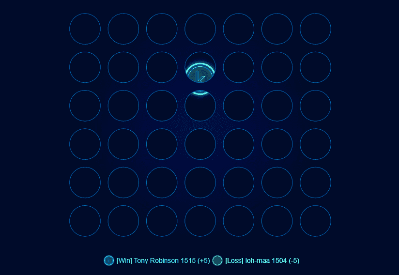

Gif from [连接 X | Kaggle](https://web.archive.org/web/20221206161023/https://www.kaggle.com/competitions/connectx/leaderboard?dialog=episodes-episode-44248100)

通过参加[Machine Learning Scientist with Python](https://web.archive.org/web/20221206161023/https://www.datacamp.com/tracks/machine-learning-scientist-with-python)career track，开始您的专业机器学习之旅。

## 最后一年学生的机器学习项目

最后一年的项目需要你花一定的时间来产生一个独特的解决方案。你将研究多模型架构，使用各种机器学习框架来规范和扩充数据集，理解过程背后的数学，并根据你的结果写一篇论文。

### 带变压器的多语言 ASR

在[多语言 ASR](https://web.archive.org/web/20221206161023/https://huggingface.co/blog/fine-tune-xlsr-wav2vec2) 模型中，您将使用土耳其音频和转录对 Wave2Vec XLS-R 模型进行微调，以构建自动语音识别系统。

首先，您将理解音频文件和文本数据集，然后使用文本标记器，提取特征，并处理音频文件。之后，您将创建一个训练器、WER 函数、加载预训练模型、调整超参数以及训练和评估模型。

你可以使用拥抱脸平台来存储模型重量，并发布 web 应用程序来实时转录语音:[流式乌尔都语 Asr](https://web.archive.org/web/20221206161023/https://huggingface.co/spaces/kingabzpro/real-time-Urdu-ASR) 。

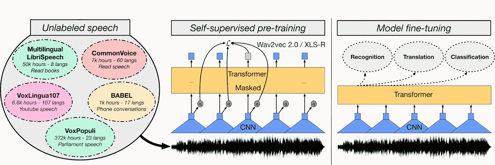

图片来自[huggingface.co](https://web.archive.org/web/20221206161023/https://huggingface.co/blog/fine-tune-xlsr-wav2vec2)

### 一拍脸风格化

在 [One Shot Face Stylization](https://web.archive.org/web/20221206161023/https://github.com/mchong6/JoJoGAN) 项目中，您可以修改模型以改善结果，或者在新的数据集上微调 JoJoGAN 以创建您的风格化应用程序。

它将使用原始图像，通过 GAN 反转和微调预训练的 StyleGAN 来生成新图像。你会了解各种生成对立的网络架构师。之后，您将开始收集配对数据集来创建您选择的样式。

然后，在以前版本的 StyleGAN 的示例解决方案的帮助下，您将与新的架构师一起尝试产生现实主义的艺术。

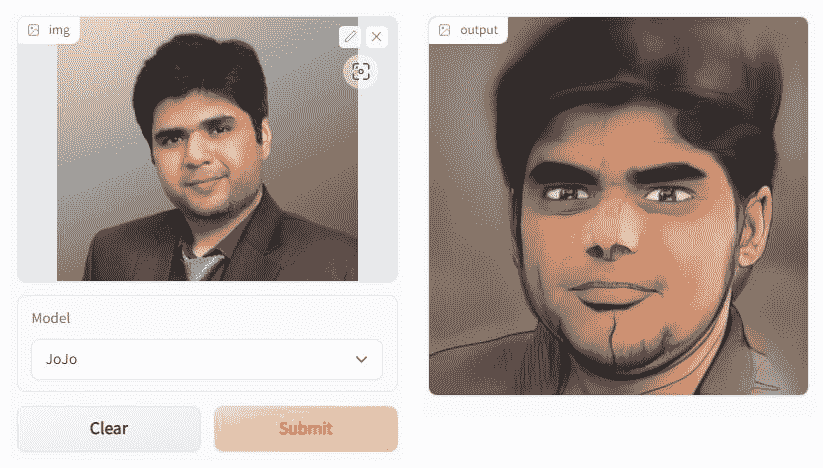

图像是使用 [JoJoGAN](https://web.archive.org/web/20221206161023/https://huggingface.co/spaces/akhaliq/JoJoGAN) 创建的

### H&M 个性化时尚推荐

在 [H & M 个性化时尚推荐](https://web.archive.org/web/20221206161023/https://www.kaggle.com/competitions/h-and-m-personalized-fashion-recommendations)项目中，您将基于以前的交易、客户数据和产品元数据来构建产品推荐。

该项目将测试你的 NLP、CV(计算机视觉)和深度学习技能。在最初的几周，您将了解数据以及如何使用各种功能来提出基线。

然后，创建一个简单的模型，只使用文本和分类特征来预测推荐。之后，继续结合 NLP 和 CV 来提高你在排行榜上的分数。您还可以通过查看社区讨论和代码来更好地理解问题。

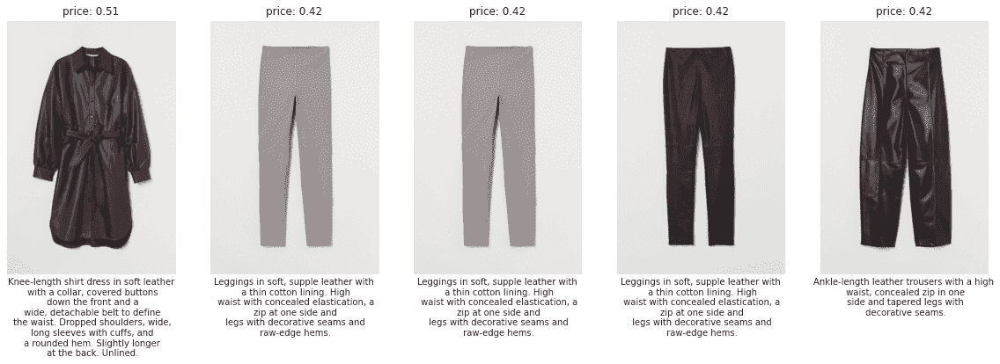

图片来自 [H &米达先看](https://web.archive.org/web/20221206161023/https://www.kaggle.com/code/vanguarde/h-m-eda-first-look)

### Atari 2600 的强化学习代理

在 [MuZero for Atari 2600](https://web.archive.org/web/20221206161023/https://paperswithcode.com/paper/mastering-atari-go-chess-and-shogi-by#code) 项目中，您将使用 MuZero 算法为 Atari 2600 游戏构建、训练和验证强化学习代理。阅读[教程](https://web.archive.org/web/20221206161023/https://medium.com/geekculture/muzero-explained-a04cb1bad4d4)了解更多关于穆泽罗算法的知识。

目标是建立一个新的或修改现有的架构，以提高在全球排行榜上的分数。要理解该算法在强化学习中是如何工作的，需要三个多月的时间。

这个项目是数学重，需要你有 Python 的专业知识。你可以找到建议的解决方案，但要达到世界一流，你必须建立自己的解决方案。

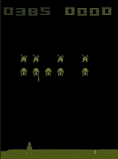

Gif 来自作者| [拥抱脸](https://web.archive.org/web/20221206161023/https://huggingface.co/kingabzpro/dnq-SpaceInvadersNoFrameskip-V4)

### MLOps 端到端机器学习

要想被顶级公司聘用，MLOps 端到端机器学习项目是必不可少的。如今，招聘人员正在寻找能够使用 MLOps 工具、数据编排和云计算创建端到端系统的 ML 工程师。

在这个项目中，您将使用 TensorFlow、Streamlit、Docker、Kubernetes、cloudbuild、GitHub 和 Google Cloud 构建和部署一个位置图像分类器。主要目标是使用 CI/CD 自动构建机器学习模型并将其部署到生产中。有关指导，请阅读[机器学习、管道、部署和 MLOps](https://web.archive.org/web/20221206161023/https://www.datacamp.com/tutorial/tutorial-machine-learning-pipelines-mlops-deployment) 教程。

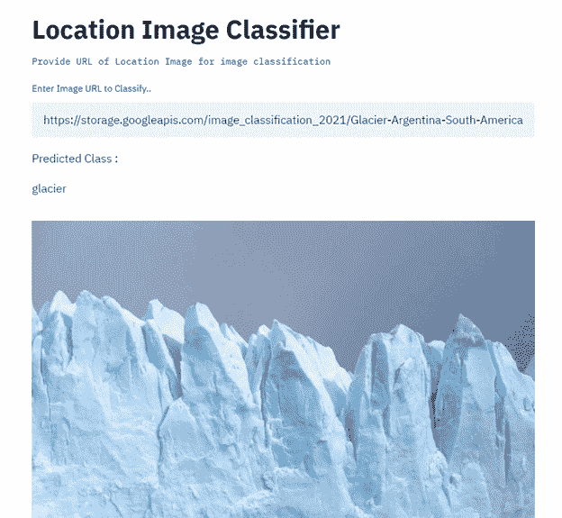

图片来自 [Senthil E](https://web.archive.org/web/20221206161023/https://medium.com/@esenthil?source=post_page-----1a7907698a8e--------------------------------)

## 用于投资组合构建的机器学习项目

为了建立你的机器学习组合，你需要突出的项目。向招聘经理或招聘人员展示你可以用多种语言编写代码，理解各种机器学习框架，使用机器学习解决独特的问题，并理解端到端的机器学习生态系统。

### 张量处理器上的伯特文本分类器

在 [BERT 文本分类器](https://web.archive.org/web/20221206161023/https://www.analyticsvidhya.com/blog/2021/08/training-bert-text-classifier-on-tensor-processing-unit-tpu)项目中，您将使用大型语言模型，并使用 TPU(张量处理单元)在阿拉伯语上对其进行微调。您将学习使用 TensorFlow 处理文本数据，修改模型架构以获得更好的结果，并使用 Google 的 TPUs 对其进行训练。与 GPU 相比，它将减少 10 倍的训练时间。

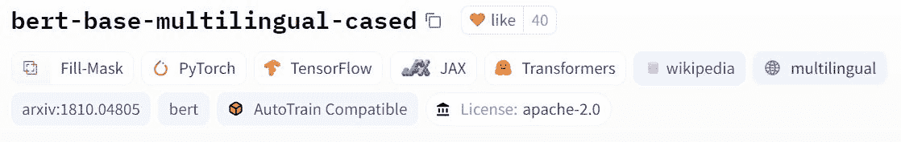

图片来自[拥抱脸](https://web.archive.org/web/20221206161023/https://huggingface.co/bert-base-multilingual-cased)

### 基于 Julia 的图像分类

在使用 FastAI.jl 项目的[图像分类中，您将使用 Julia，它是为高性能机器学习任务设计的，用于创建简单的图像分类。你将学习一种新的语言和一个叫做 FastAI 的机器学习框架。](https://web.archive.org/web/20221206161023/https://towardsdatascience.com/simple-image-classification-using-fastai-jl-83960d1d2ce1)

您还将了解 FastAI API 来处理和可视化 imagenette 2–160 数据集，加载 ResNet18 预训练模型并使用 GPU 对其进行训练。这个项目将为您打开一个新世界，让您使用 Julia 探索和开发深度学习解决方案。

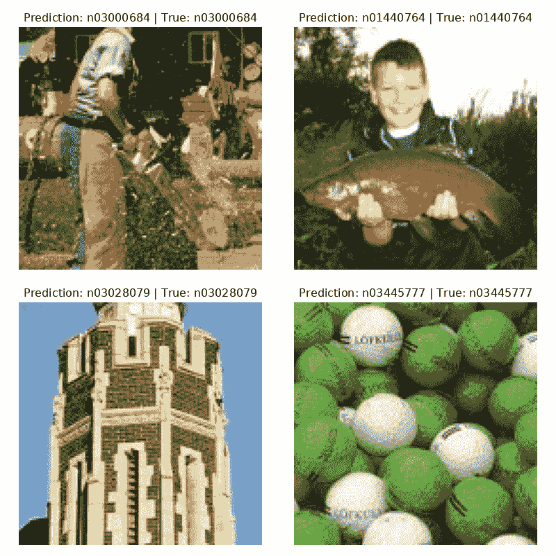

图片来自作者

### 图像字幕生成器

在[图像标题生成器](https://web.archive.org/web/20221206161023/https://www.analyticsvidhya.com/blog/2018/04/solving-an-image-captioning-task-using-deep-learning)项目中，您将使用 Pytorch 构建 CNN 和 LSTM 模型来创建图像标题生成器。您将学习处理文本和图像数据，建立一个 CNN 编码器和 RNN 解码器，并在调谐超参数上训练它。

要构建最好的字幕生成器，您需要了解编码器-解码器架构、NLP、CNN、LSTM，以及使用 Pytorch 创建训练器和验证函数的经验。

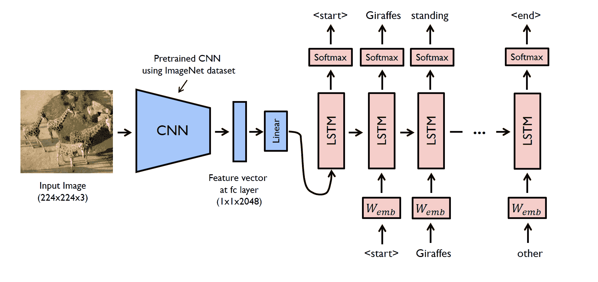

图片来自[使用深度学习的自动图像字幕](https://web.archive.org/web/20221206161023/https://www.analyticsvidhya.com/blog/2018/04/solving-an-image-captioning-task-using-deep-learning)

### 使用神经网络生成音乐

在[生成音乐](https://web.archive.org/web/20221206161023/https://towardsdatascience.com/how-to-generate-music-using-a-lstm-neural-network-in-keras-68786834d4c5)项目中，您将使用 Music21 和 Keras 构建生成音乐的 LSTM 模型。您将了解 MIDI 文件、音符和和弦，并使用 MIDI 文件训练 LSTM 模型。

您还将学习创建模型架构、检查点和损失函数，并学习使用随机输入来预测音符。主要目标是使用 MIDI 文件来训练神经网络，从模型中提取输出，并将它们转换为 MP3 音乐文件。

图片来自[sigur ur skúLi](https://web.archive.org/web/20221206161023/https://medium.com/@sigurdurssigurg)| LSTM 网络制作的音乐

### 将机器学习应用部署到生产中

对于在该领域寻找更好机会的机器学习专业人士，强烈推荐将机器学习应用部署到生产项目中。

在这个项目中，您将使用 Plotly、Transformers、MLFlow、Streamlit、DVC、GIT、DagsHub 和 Amazon EC2 在云上部署机器学习应用程序。这是展示你的 MLOps 技能的绝佳方式。

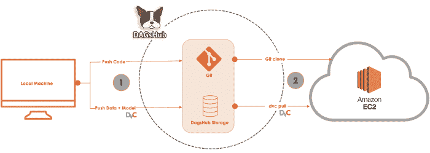

图片来自 [Zoumana Keita](https://web.archive.org/web/20221206161023/https://zoumanakeita.medium.com/?source=post_page-----eb7dcb17b8ba--------------------------------)

## 如何开始一个机器学习项目？

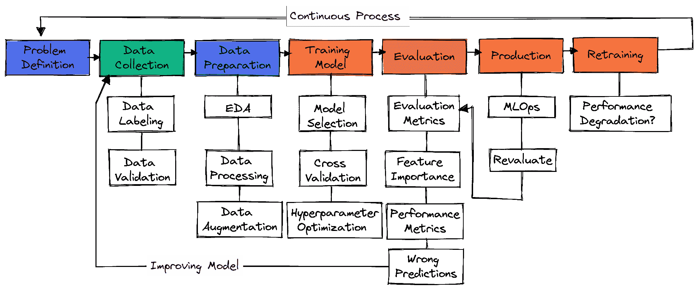

作者图片

在典型的机器学习项目中没有标准步骤。所以，它可以只是数据收集、数据准备和模型训练。在本节中，我们将了解构建生产就绪型机器学习项目所需的步骤。

### 问题定义

你需要了解业务问题，并提出你将如何使用机器学习来解决它的大致想法。寻找研究论文、开源项目、教程和其他公司使用的类似应用程序。确保您的解决方案切实可行，并且数据易于获取。

### 数据收集

您将从各种来源收集数据，对其进行清理和标记，并为数据验证创建脚本。确保您的数据没有偏见或包含敏感信息。

### 数据准备

填充缺失值、清理和处理数据以进行数据分析。使用可视化工具来了解数据的分布以及如何使用要素来提高模型性能。特征缩放和数据扩充用于为机器学习模型转换数据。

### 培训模式

选择通常用于特定问题的神经网络或机器学习算法。使用交叉验证和使用各种超参数优化技术来获得最佳结果的训练模型。

### 模型评估

在测试数据集上评估模型。确保您针对特定问题使用了正确的模型评估指标。准确性并不是所有问题的有效衡量标准。检查分类的 F1 或 AUC 分数或回归的 RMSE。可视化模型特征的重要性，删除不重要的特征。评估性能指标，如模型训练和推理时间。

确保模型已经超越了人类基线。如果没有，就回去收集更多高质量的数据，重新开始这个过程。这是一个迭代的过程，在这个过程中，您将不断地使用各种功能工程技术、模式架构师和机器学习框架来提高性能。

### 生产

在获得最先进的结果后，是时候使用 MLOps 工具将您的机器学习模型部署到生产/云环境中了。根据实时数据监控模型。大多数模型在生产中都会失败，所以为一小部分用户部署它们是个好主意。

### 再培训

如果模型未能实现结果，您将回到绘图板并提出更好的解决方案。即使你取得了很大的成果，由于数据漂移和概念漂移，模型也会随着时间退化。重新训练新数据也使你的模型适应实时变化。

数据准备、特征工程和模型选择/训练。关键步骤可能因项目而异。在深度学习项目中，是数据处理、模型选择、模型验证。

1.  了解业务问题以及机器学习如何帮助解决这些问题。
2.  确保你有培训所需的质量数据。
3.  清理和处理数据。
4.  通过查看业务案例研究和执行数据分析来了解您的数据，从而了解分布情况。
5.  定义模型和业务绩效指标。
6.  模型选择和训练。
7.  模型验证和再训练。
8.  实现 MLOps(机器学习操作)
9.  将模型部署到生产中。

是的。要想被聘为机器学习工程师，你需要掌握多种编程语言，了解机器学习和深度学习算法，学习高等数学来完善模型架构。

您还将了解事物的操作方面，如 MLOps、云计算、主动学习、实验跟踪、仪表板、CI/CD 以及在真实数据上测试模型。

是的，它在机器学习从业者和研究人员中很受欢迎。

*   很容易学习和阅读。
*   现代机器学习工具基于 Python
*   它有一个庞大的支持社区
*   与其他语言和工具的多重集成。
*   从数据分析到网络开发，你几乎可以完成所有的任务。

是的，但是你在达到最先进的效果方面会受到限制。对机器学习模型进行编码可以让您控制数据、参数、模型架构、系统性能和模型验证。

在提供平均数据的良好结果方面，无代码工具正在变得越来越好，但如果你想被录用，你需要学习基础知识，学会从头开始创建整个生态系统。

是的，机器学习是一个令人惊叹的职业，它可以让你学习并为人工智能的发展做出贡献。发达国家的需求很高，平均而言，在美国，你每年可以得到 111，139 美元以上。