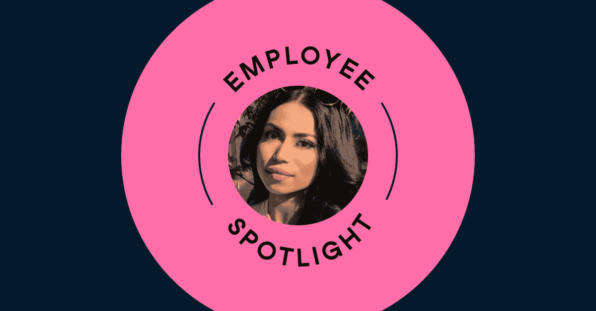

# 新员工聚焦:创建最佳平台，消除数据文盲

> 原文：<https://web.archive.org/web/20230101103238/https://www.datacamp.com/blog/new-hire-spotlight-creating-the-best-platform-to-fight-data-illiteracy>

## 告诉我们你加入 DataCamp 的途径。

大学毕业后，我开始在技术部门工作，担任项目经理，但没过多久，我就迷上了产品开发以及设计和制造人们喜欢的产品的想法。五年前，我过渡到我的第一个产品角色，那时我意识到我适合这份工作。从那以后，我在各种行业担任产品经理，之前的职位是金融科技。在金融科技公司工作了几年后，我渴望在一个监管较少的环境中工作，在那里我可以更有创造力，为更有意义的事情做出贡献，而 DataCamp 似乎是一个合适的地方。

## 你在 DataCamp 的入职体验如何？

我会把我在 DataCamp 的入职经历描述为“做你认为最好的事情”我这么说的意思是，我被赋予了自由，去想办法让自己快速适应，并照做。这无疑促使我从第一天起就自给自足，事后看来这是塞翁失马焉知非福，因为仅仅过了两个月，我就已经觉得自己已经在这里待了很长时间。

## DataCamp 让你兴奋的是什么？

与这么多有才华的人合作。

## 你的家庭办公室是什么样的？

你肯定会认为，在家工作了一年后，我已经投资了一个合适的办公室设置？但是没有，我现在每天都坐在最不舒服的椅子上几个小时！也只是因为我不想用办公椅毁了我家的美观。

## 你业余时间喜欢做什么？

我是一个超级健身爱好者。封锁前，健身房还开着的时候，我会一周去五次健身房。除此之外，我总是埋头读书(无论去哪里，我都带着一本书),或者在户外探险，在大自然中漫步或者徒步旅行。我也喜欢弹钢琴，但那是在我家里的人还没有厌倦我制造的噪音的时候。

## 你最近学到了什么有趣的东西？

从头开始做寿司。

## 你对 DataCamp 的发展和市场定位有何看法？

至少可以说，DataCamp 的发展令人印象深刻。没有多少公司将自己定位为肩负着消除数据文盲的使命。该平台致力于为人们提供实践学习机会，其成本很容易被证明是合理的。DataCamp 还通过持续关注创新，在区分自己与竞争对手方面做得很好，而 [DataCamp 2.0](https://web.archive.org/web/20220713161230/https://www.datacamp.com/community/blog/datacamp-2-0) 就是这种区分的最好例子。

## 你会对其他考虑在 DataCamp 工作的人说些什么？

如果你想为一家将会把你推向成功新高度的公司工作，DataCamp 绝对是合适的地方。该公司非常希望其员工茁壮成长，因为它一直致力于创造一个既赋权又积极的环境。最终，DataCamp 的员工并非完全不同。我们都想来工作，做好工作，并为此感到有价值。我们还想知道我们正在朝着更多的东西努力，在 DataCamp，这正是你最终的感受，不管你在公司呆了多久。

你愿意加入 DataCamp 的 Raushon 吗？我们目前正在纽约招聘员工；伦敦；比利时鲁汶；和偏远地区。查看我们的[空缺职位](https://web.archive.org/web/20220713161230/https://www.datacamp.com/jobs/)。