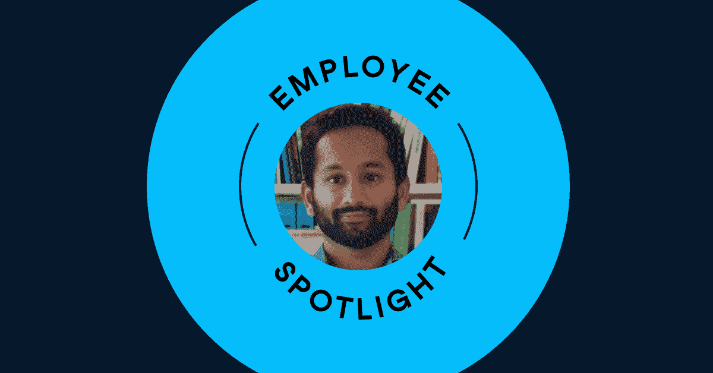

# 新员工聚焦:在远程工作环境中的 DataCamp 中提升

> 原文：<https://web.archive.org/web/20230101103238/https://www.datacamp.com/blog/new-hire-spotlight-ramping-up-at-datacamp-in-a-remote-work-environment>

## 告诉我们你加入 DataCamp 的途径。

在 INSEAD 大学攻读 MBA 期间，我一直在寻找一种快速的方法来掌握我的一门经济学课程所需的 SQL 技能。DataCamp 的易用性给我留下了深刻的印象，所以我查阅了 INSEAD 的校友名录，看看我是否能与公司的人联系上。我就是这样遇到了 Jelle，DataCamp 的财务副总裁。在一次关于 DataCamp 的使命和它的人的快速咖啡聊天后，我被吸引住了。我找到了一个正合我胃口的产品营销职位，于是就申请了。

## 你喜欢 DataCamp 的入职流程的哪些方面？

尤其让我印象深刻的是:

*   我的经理:我喜欢我的经理卡罗琳·哈里斯(Caroline Harris)在整个过程中的亲历亲为。她花了整整一周的时间来确保我和另一名新员工对 DataCamp 的一切都了如指掌。这真的有助于我迅速进入状态。
*   人员:我在 DataCamp 的入职经历揭示了所有员工的协作和理解天性。从咖啡聊天到最琐碎的问题，总有人会帮忙。
*   透明度:我知道很多公司喜欢说他们是透明的，但是 DataCamp 确实是透明的。从 CEO 会议记录到敏感的财务指标，每个员工都可以使用这些工具。这建立了一个信任的环境，这是让我快速提升的关键。我还计划与创始人交谈，了解他们对创办公司的原因的看法。

## 你业余时间喜欢做什么？

我坚信健康的身体等同于健康的精神。你通常会发现我在尝试最新的健身趋势，尝试我的饮食。所有的事情都被封锁了，我最近的活动是骑自行车。空荡荡的伦敦街道非常适合我的新爱好😃。

我也是一个狂热的旅行者！在 Covid 之前的 12 个月里，我有机会访问了 14 个国家。我喜欢探索新的地方，了解不同的文化。一旦安全了，我期待着一些旅行。

## 你最近学到了什么有趣的东西？

你可以虚拟地建立稳固的关系。我一直对在家工作持怀疑态度，尤其是在偏远的环境中开始一份新工作。我在数据营的经历证明我错了。与全球各地的同事一起，我看到每个人都意识到不仅工作的重要性，而且建立社会资本的重要性。每次会议都有社交元素——无论是庆祝个人胜利、介绍婴儿还是宠物。这些举措有助于团队合作，创造积极的工作环境。

## 你对 DataCamp 的发展和市场定位有何看法？

首先，我可能有偏见，但我真的相信 DataCamp 拥有市场上最好的数据学习平台。在加入之前，我最近完成了 DataCamp 的 SQL 简介课程，这为我提供了学校项目所需的工具。

最近的品牌重塑给人一种清新的感觉。它给我们所有的内容带来了新的生机，这很棒。

需要做的事情还有很多，但我相信 DataCamp 有合适的产品，更重要的是，有合适的人来取得成功。

## 你会对其他考虑为 DataCamp 工作的人说些什么？

与数据营员取得联系并交谈。亲自了解这家公司，看看它是否适合你。我们正在给人们的生活带来实实在在的影响，同时乐在其中！

## 你做过最诡异的工作是什么？

大学期间的那个夏天，我是我们校友筹款团队的一员。这份工作是以佣金为基础的，所以我很早就知道对外销售并不容易。由于那次经历，我对销售团队产生了很多共鸣！

## 你还有什么想和我们的学员分享的吗？

DataCamp 建立在主动实践学习的基础上。我们独特的实践方法“评估-学习-实践-应用”使我们真正成为提升数据流畅性的最佳场所。在这个越来越以数据为导向的世界中，您不一定要成为数据科学家才能从我们提供的服务中受益。

你愿意加入 Adnan 的数据营吗？我们目前正在纽约招聘员工；伦敦；比利时鲁汶；和偏远地区。查看我们的[空缺职位](https://web.archive.org/web/20220813092546/https://www.datacamp.com/jobs/)。