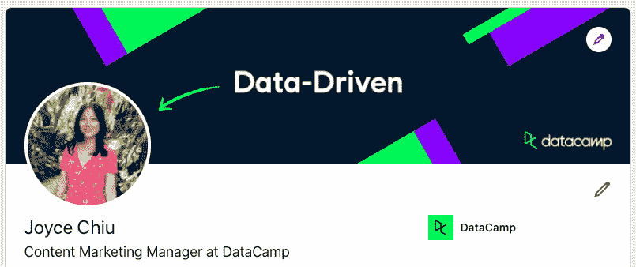

# 新年，新的 LinkedIn 封面图片

> 原文：<https://web.archive.org/web/20221129033105/https://www.datacamp.com/blog/new-year-new-linkedin-cover-image>

在 LinkedIn 上脱颖而出的最好方法之一就是使用定制的 LinkedIn 封面图片。大多数 LinkedIn 用户坚持使用默认的 LinkedIn 封面图片，这是一个很大的错失机会。很容易在你的个人资料中注入一些个性，用一张展示你职业身份或抱负的图片让自己与众不同。

这就是为什么我们为一些最常见的数据角色和身份创建了定制的 LinkedIn 封面图像。作为参考，我的看起来是这样的:

如果你想像我一样更新你的 LinkedIn 个人资料，只需点击下面最符合你身份的描述来下载封面图片:

*   [数据爱好者](https://web.archive.org/web/20220630222059/https://res.cloudinary.com/dyd911kmh/image/upload/f_auto,q_auto:best/v1610040100/Linkedin_Cover_-_Data_Enthusiast_qgfd0z.png)
*   [数据分析师](https://web.archive.org/web/20220630222059/https://res.cloudinary.com/dyd911kmh/image/upload/f_auto,q_auto:best/v1610040676/Linkedin_Cover_-_Data_Analyst_cb4umx.png)
*   [数据工程师](https://web.archive.org/web/20220630222059/https://res.cloudinary.com/dyd911kmh/image/upload/f_auto,q_auto:best/v1610040100/Linkedin_Cover_-_Data_Engineer_enf4cd.png)
*   [数据专业](https://web.archive.org/web/20220630222059/https://res.cloudinary.com/dyd911kmh/image/upload/f_auto,q_auto:best/v1610040100/Linkedin_Cover_-_Data_Professional_vowtyw.png)
*   [数据架构师](https://web.archive.org/web/20220630222059/https://res.cloudinary.com/dyd911kmh/image/upload/f_auto,q_auto:best/v1610040100/Linkedin_Cover_-_Data_Architect_vomzkz.png)
*   [商业智能分析师](https://web.archive.org/web/20220630222059/https://res.cloudinary.com/dyd911kmh/image/upload/f_auto,q_auto:best/v1610040553/Linkedin_Cover_-_Business_Intelligence_Analyst_pwivdt.png)
*   [量化分析师](https://web.archive.org/web/20220630222059/https://res.cloudinary.com/dyd911kmh/image/upload/f_auto,q_auto:best/v1610380543/Linkedin_Cover_-_Quantitative_Analyst_zkq29v.png)
*   [数据库管理员](https://web.archive.org/web/20220630222059/https://res.cloudinary.com/dyd911kmh/image/upload/f_auto,q_auto:best/v1610039229/Linkedin_Cover_-_Database_Administrator_virz8n.png)
*   [机器学习工程师](https://web.archive.org/web/20220630222059/https://res.cloudinary.com/dyd911kmh/image/upload/f_auto,q_auto:best/v1610039227/Linkedin_Cover_-_Machine_Learning_Engineer_nv0ytj.png)
*   [机器学习科学家](https://web.archive.org/web/20220630222059/https://res.cloudinary.com/dyd911kmh/image/upload/f_auto,q_auto:best/v1610039224/Linkedin_Cover_-_Machine_Learning_Scientist_dwrdkl.png)
*   [数据科学家](https://web.archive.org/web/20220630222059/https://res.cloudinary.com/dyd911kmh/image/upload/f_auto,q_auto:best/v1610040100/Linkedin_Cover_-_Data_Scientist_py4mog.png)
*   [数据架构师](https://web.archive.org/web/20220630222059/https://res.cloudinary.com/dyd911kmh/image/upload/f_auto,q_auto:best/v1610040100/Linkedin_Cover_-_Data_Architect_vomzkz.png)
*   [统计学家](https://web.archive.org/web/20220630222059/https://res.cloudinary.com/dyd911kmh/image/upload/f_auto,q_auto:best/v1610040550/Linkedin_Cover_-_Statistician_wlxcwh.png)
*   [商业分析师](https://web.archive.org/web/20220630222059/https://res.cloudinary.com/dyd911kmh/image/upload/f_auto,q_auto:best/v1610040551/Linkedin_Cover_-_Business_Analyst_typawx.png)
*   [数据和分析经理](https://web.archive.org/web/20220630222059/https://res.cloudinary.com/dyd911kmh/image/upload/f_auto,q_auto:best/v1610040100/Linkedin_Cover_-_Data_and_Analytics_Manager_i4ozqa.png)
*   [数据说书人](https://web.archive.org/web/20220630222059/https://res.cloudinary.com/dyd911kmh/image/upload/f_auto,q_auto:best/v1610039231/Linkedin_Cover_-_Data_Storyteller_ygvafx.png)
*   [数据驱动](https://web.archive.org/web/20220630222059/https://res.cloudinary.com/dyd911kmh/image/upload/f_auto,q_auto:best/v1610040101/Linkedin_Cover_-_Data-Driven_t1tqsx.png)

要将图像添加为 LinkedIn 上的背景照片:

*   点击 LinkedIn 主页顶部的 ***Me*** 图标。
*   点击 ***查看简介*** 。
*   点击你的介绍卡右上角的 ***摄像头*** 图标。
*   点击 ***上传照片*** 从电脑中选择一张图片，点击打开。
*   点击 ***应用*** 。照片会自动上传。不需要重新定位图像。

如需更多帮助，请查看 LinkedIn 帮助文章。

让我们知道你对 LinkedIn 、 [Twitter](https://web.archive.org/web/20220630222059/https://twitter.com/DataCamp) 、[脸书](https://web.archive.org/web/20220630222059/https://www.facebook.com/datacampinc/)或 [Instagram](https://web.archive.org/web/20220630222059/https://www.instagram.com/datacamp/) 上这些横幅的看法吧！我们希望这将是您表达对数据热爱的一种有趣方式。