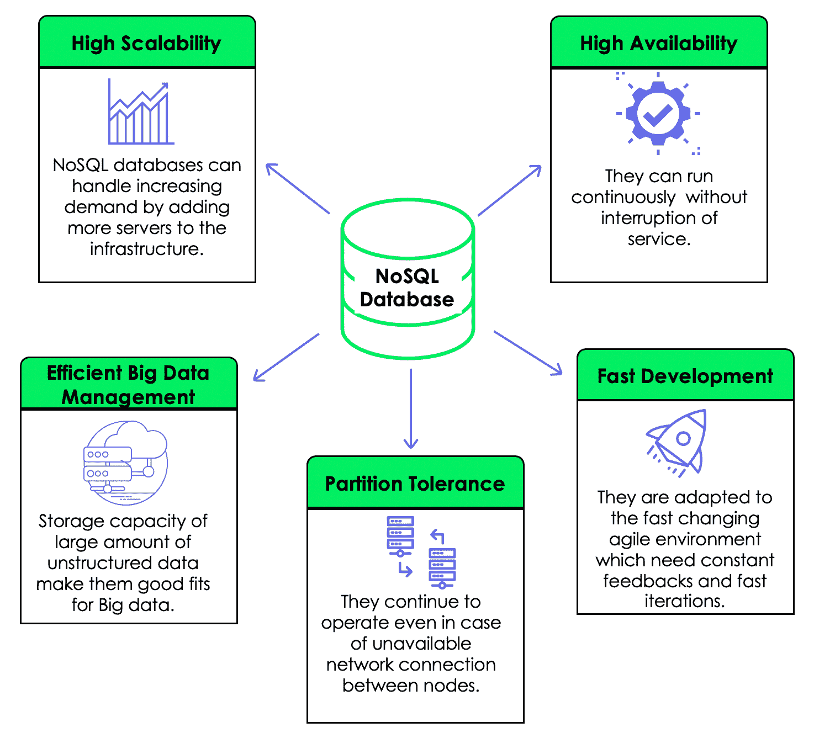
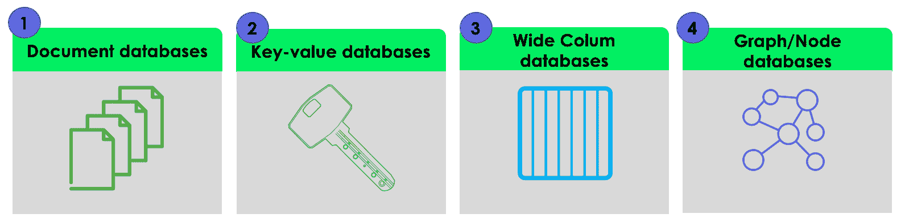
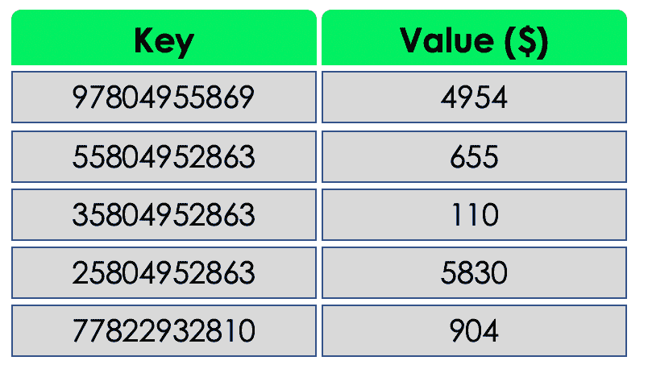
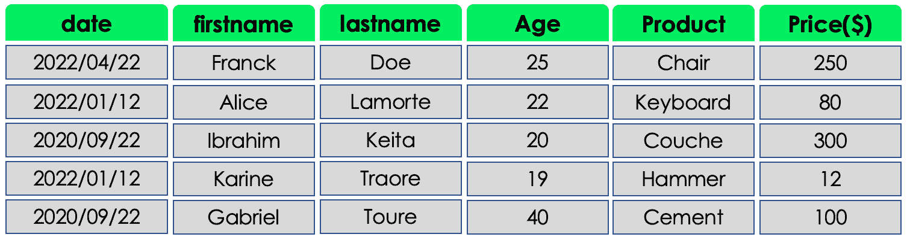
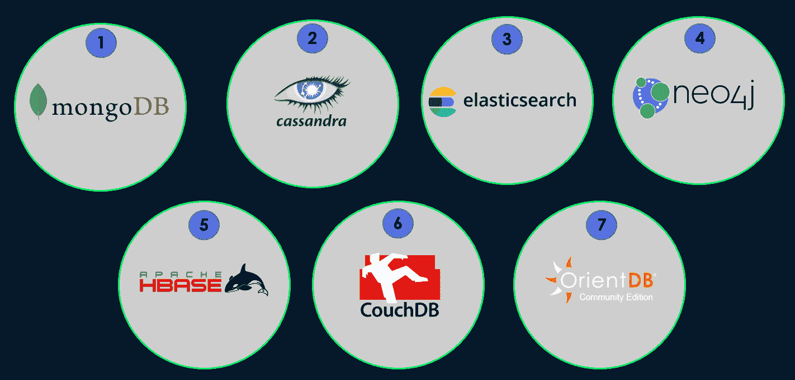

# NoSQL 数据库:每个数据科学家需要知道的

> 原文：<https://web.archive.org/web/20230101102924/https://www.datacamp.com/blog/nosql-databases-what-every-data-scientist-needs-to-know>

我们为数据科学家探索 NoSQL 数据库的来龙去脉。

## 数据科学和 NoSQL 数据库

作为一名数据科学家，不仅要建立机器学习模型，还要能够处理、分析和更好地交流来自不同格式 数据的结果 ***。***

多年来，传统的 SQL 数据库一直被用作唯一的数据库类型。然而，由于 20 世纪 90 年代中期互联网的极度普及和数字化转型，一种新的数据类型变得突出: ***NoSQL 数据库*** 。它们是针对传统 SQL 数据库的弱点而引入的。

例如，数据科学家和机器学习工程师可以使用 NoSQL 数据库来存储数据、模型的元数据、特征和操作参数。另一方面，数据工程师可以利用它们来存储和检索干净的数据。

在这个概念性的博客中(不需要编码)，我们将首先建立你对 NoSQL 数据库的理解，然后再探索 NoSQL 的重要性。我们还将比较 SQL 和 NoSQL 数据库，并了解后者的用途和类别。最后，我们将研究最受数据科学家欢迎的 NoSQL 数据库。

## 什么是 NoSQL 数据库？

NoSQL 代表 ***而不仅仅是 SQL*** ，这意味着 NoSQL 数据库具有非关系的特殊性，因为它们可以以非结构化格式存储数据。下图突出显示了 NoSQL 数据库的五个主要特征。

## 为什么 NoSQL 数据库很重要？

NoSQL 数据库在行业中变得流行，因为它有以下优点:

*   **多模式数据** : NoSQL 数据库比传统的 SQL 数据库更加灵活，因为它们可以存储结构化(例如从传感器捕获的数据)、非结构化(图像、视频等)。)，以及半结构化(XML、JSON 等)。)数据。
*   **简单的可扩展性**:这很简单，因为他们的对等架构，这意味着多台机器可以添加到架构中。
*   **全球可用性**:由于数据库是全球共享的，因此可以通过不同地理区域的不同机器同时访问相同的数据。
*   **灵活性** : NoSQL 数据库可以通过频繁的更新和新特性快速适应不断变化的需求。

## NoSQL 数据库与 SQL 数据库

|   | **SQL 数据库** | NoSQL 数据库 |
| **语言** | SQL 数据库使用结构化查询语言来执行操作，需要使用预定义的模式来更好地与数据交互。 | 另一方面，NoSQL 数据库使用动态模式来查询数据。此外，一些 NoSQL 数据库使用类似 SQL 的语法进行文档操作。 |
| **数据模式** | SQL 数据库有一个预定义的固定格式，不能为新数据而改变。 | NoSQL 数据库更加灵活。这种灵活性意味着可以在没有预定义结构的情况下创建数据库中的记录，并且每个记录都有自己的结构。 |
| **可扩展性** | SQL 数据库只能纵向扩展，这意味着单台机器需要在一定水平上增加 CPU、RAM 和 SSD 来满足需求。 | NoSQL 数据库是水平可扩展的，这意味着向现有基础设施添加额外的机器来满足存储需求。 |
| **大数据支持** | 垂直扩展使得 SQL 数据库很难存储非常大的数据(Pb)。 | 水平扩展和动态数据模式使 NoSQL 适用于大数据。此外，NoSQL 数据库是由顶级互联网公司(亚马逊，谷歌，雅虎等)开发的。)来面对快速增长的数据量的挑战。 |
| **属性** | SQL 数据库使用 ACID(原子性、一致性、隔离性、持久性)属性。 | 另一方面，NoSQL 数据库使用 CAP(一致性、可用性、分区容差)属性。 |

## 什么时候应该使用 NoSQL 数据库？

在这个快速发展和竞争激烈的环境中，各行业需要收集尽可能多的数据来满足其业务目标。收集数据是一回事，但将它们存储在正确的基础架构中是另一个挑战。困难在于数据可能有不同的类型，如图像、视频、文本和声音。使用关系数据库存储这些不同的数据类型并不总是明智之举。然而，问题仍然存在:

***什么时候用 NoSQL 代替 SQL？***

在以下情况下，您应该考虑使用 NoSQL:

*   **数据不断变化**:当您不知道您的系统或应用程序未来将如何发展时，这意味着您可能想要添加新的数据类型、新的功能等。
*   **大量数据**:当您的企业需要处理可能会随着时间增长的大量数据时。
*   **不一致**:当数据一致性和 100%完整性不是你的优先考虑事项时。例如，当你为你的企业开发一个社交媒体平台时，所有的员工立刻看到你的帖子可能不是问题。
*   **可扩展性和成本** : NoSQL 数据库提供了更大的灵活性，可以随着数据需求的变化控制成本。

## 4 种主要类型的 NoSQL 数据库

NoSQL 数据库分为四大类。每一个都有其特殊性，所以您应该选择最适合您的用例的一个: ***下面，我们重点介绍了主要的 NoSQL 数据库示例*** 。本节旨在通过提供这些数据库的角色、它们的优势和局限性的非详尽列表以及它们的使用案例来涵盖每一个数据库。

### 1.文档数据库

这种类型的数据库旨在存储和查询 JSON、XML、BSON 等。，文档。每个文档都是数据库中的一行或一条记录，并且采用键值格式。文档存储关于一个对象及其相关数据的信息。例如，下面的数据库包含三条记录，每条记录给出一个学生的信息。对于第一个文档， **firstname** 是一个键， **Franck** 是它的值。

#### 文档数据库优势

*   **无模式**:数据存储的格式和结构没有限制。这是有益的，尤其是当数据库中有连续的转换时。
*   **易于更新**:可以增加或删除一条新信息，而不改变该特定文档的其余现有字段。
*   **性能提升**:关于一个文档的所有信息都可以在那个完全相同的文档中找到。不需要参考外部信息，这对于关系数据库来说可能不是这样，在关系数据库中用户可能需要请求其他表。

#### 文档数据库限制

*   **一致性检查问题**:因为单据之间不一定需要有关系，两个单据可以有不同的字段。
*   **原子性问题**:如果我们必须改变两个文档集合，我们将需要为每个文档运行单独的查询。

#### 何时使用文档数据库

*   当您的数据模式将来会不断变化时，建议使用。

#### 文档数据库应用程序

*   由于它们的灵活性，文档数据库对于在线用户简档是实用的，其中不同的用户可以有不同类型的信息。在这种情况下，每个用户的配置文件仅通过使用特定于他们的属性来存储。
*   它们可用于内容管理，这需要有效存储来自各种来源的数据。该信息可用于创建和整合新类型的内容。

### 2.键值数据库

这些是最简单的 NoSQL 数据库。每个条目都以一个**键值**对的形式存储在数据库中。我们可以把它想象成一个正好有两列的表。第一列包含一个唯一的键。第二列是每个键的值。这些值可以是不同的数据类型，如整数、字符串和浮点，也可以是更复杂的数据类型，如图像和文档。

以下示例说明了一个包含客户信息的键-值数据库，其中键是他们的电话号码，值是他们每月的购买量。

#### 键值数据库的优势

*   **简单性**:键值结构很简单。由于没有数据类型，所以使用起来很简单。
*   **速度**:简单的数据格式使得 ***读******写*** 操作更快。

#### 键值数据库限制

*   它们不能对值列执行任何筛选，因为返回值是存储在值字段中的所有信息。
*   只有拥有一个键和值，它才会得到优化。存储多个值需要一个解析器。
*   该值仅作为一个整体进行更新，这需要获取完整的数据，对该数据执行所需的处理，并最终存储回整个数据。当处理需要大量时间时，这可能会造成性能问题。

#### 何时使用键值数据库

*   适用于基于简单关键字查询的应用程序。
*   用于需要临时存储缓存等简单对象的简单应用程序。
*   当需要实时数据访问时，也可以使用它们。

#### 应用程序

*   它们更适合需要临时存储简单对象(如缓存)的简单应用程序。

### 3.宽列数据库

顾名思义，面向列的数据库用于将数据存储为列的集合，其中每一列都单独处理，实现逻辑基于 [Google 大表纸](https://web.archive.org/web/20221106181859/https://static.googleusercontent.com/media/research.google.com/fr//archive/bigtable-osdi06.pdf)。它们主要用于商业智能、数据仓库管理和客户关系管理等分析工作负载。

例如，我们可以使用聚合函数 AVG 在每一列上分别快速获得客户和产品的平均年龄和平均价格。

### 4.图形/节点数据库

图形数据库用于通过边存储、映射和搜索节点之间的关系。节点代表一个数据元素，也称为对象或实体。每个节点都有一个输入或输出边。边表示两个节点之间的关系。这些边包含一些与它们连接的节点相对应的属性。

***“Zoumana 在德州理工大学学习。他喜欢在大学里面的公园里跑***

#### 图形/节点数据库优势

*   它们是一种敏捷灵活的结构。
*   数据库中节点之间的关系是人类可读和明确的，因此容易理解。

#### 图形/节点数据库限制

*   没有标准化的查询语言，因为每种语言都是平台相关的。
*   前面的原因使得在面临问题时很难在网上找到支持。

#### 何时使用图形/节点数据库

*   当您需要创建数据元素之间的关系并能够快速检索这些关系时，可以使用它们。

#### 应用程序

*   它们可用于在实时金融交易中执行复杂的**欺诈检测。**
***   它们可以用于 ***从社交媒体*** 中挖掘数据。例如，LinkedIn 使用图表数据库来识别哪些用户相互关注，以及这些用户和他们的专业知识之间的关系(ML Engineer)。*   ***网络映射*** 非常适合用图形来表示，因为这些网络映射了硬件和它们支持的服务之间的关系。**

 **## 7 个最佳 NoSQL 数据科学数据库

现在，您对 NoSQL 数据库有了更好的了解，让我们来看看数据科学项目中流行的 NoSQL 数据库列表。这个分析只关注开源的 NoSQL 数据库。

### 1.MongoDB

MongoDB 是一个开源的面向文档的数据库，以 JSON 格式存储数据。它是最常用的数据库，旨在实现高可用性和可伸缩性，提供自动共享和内置复制。我们的[对 MongoDB 的介绍课程](https://web.archive.org/web/20221106181859/https://www.datacamp.com/courses/introduction-to-using-mongodb-for-data-science-with-python)涵盖了 MongoDB 和 Python 的使用。它有助于获得使用 MongoDB 操作和分析灵活结构化数据的技能。[优步、LaunchDarkl、Delivery Hero 和 4300 家公司在他们的技术堆栈中使用 MongoDB](https://web.archive.org/web/20221106181859/https://stackshare.io/mongodb)。

### 2.卡桑德拉

Cassandra 也是一个开源的大型列数据库。它可以将您的数据分布在多台机器上，并在您向基础架构中添加新机器时自动重新分区。优步、脸书、网飞和 506 家其他公司在他们的技术堆栈中使用它。

### 3.弹性搜索

与 MongoDB 类似，Elasticsearch 也是一个面向文档的数据库，并且是开源的。它是世界领先的搜索和分析工具，专注于可扩展性和速度。优步、Shopify、Udemy 和大约 3760 家其他公司在他们的堆栈中使用它。

### 4.Neo4J

Neo4J 是一个开源的面向图形的数据库。主要用于处理不断增长的有关系的数据。据报道，大约有 220 家公司在他们的技术堆栈中使用它。

### 5.HBase

这是一个分布式的面向列的数据库。它还提供了与基于 Apache Hadoop 的 Google BigTable 相同的功能。[据报道，81 家公司在其技术堆栈中使用 h base](https://web.archive.org/web/20221106181859/https://stackshare.io/hbase)。

### 6.CouchDB

CouchDB 也是一个开源的面向文档的数据库，以 JSON 格式收集和存储数据。大约有 84 家公司在他们的技术堆栈中使用它。

### 7.OrientDB

OrientDB 也是一个开源数据库，它是一个多模型数据库，支持图形、文档、键值和对象模型。据报道，只有 13 家公司在他们的技术堆栈中使用它。

## 结论

本博客涵盖了 NoSQL 数据库的主要方面，以及在当今快速发展的环境中，它们如何有益于您的数据科学项目。为了实现适合您的用例的数据库，您可以选择所有的工具。如果您仍然对使用它们犹豫不决，现在是您和您的队友利用这些数据库的时候了。

为了了解更多信息，我们涵盖 [NoSQL 概念](https://web.archive.org/web/20221106181859/https://www.datacamp.com/courses/nosql-concepts)的课程将加强您对我们之前涵盖的四个主要数据库的了解。**