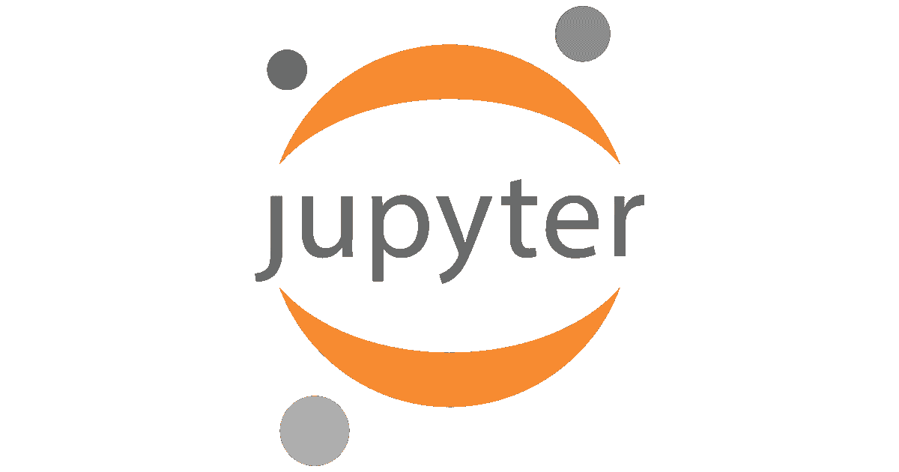
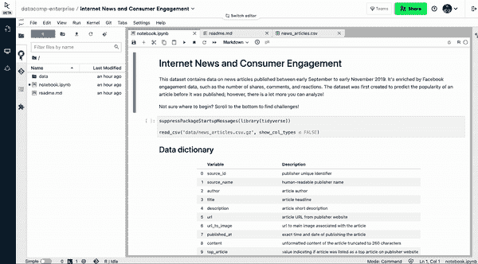
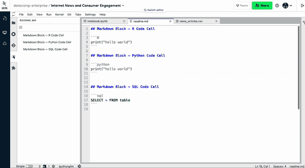
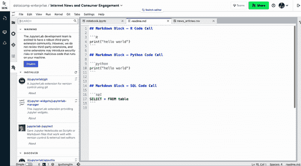
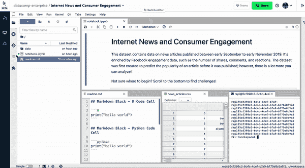
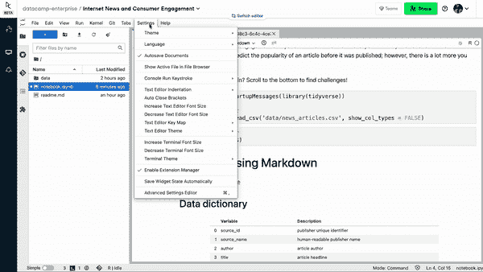

# 面向 R 用户的笔记本

> 原文：<https://web.archive.org/web/20220627024316/https://www.datacamp.com/blog/notebooks-for-r-users>

一年多前，我们推出了 DataCamp Workspace，这是我们基于云的笔记本 IDE，旨在让从业者和团队能够无缝地处理数据并进行在线协作。截至今天，成千上万的个人和团队使用 Workspace 来分析数据和分享他们的见解，构建投资组合项目，并在比赛中竞争。

我们最近将我们的 [RStudio 工作区迁移到了 DataCamp 的笔记本编辑器或 JupyterLab](https://web.archive.org/web/20220702200211/https://workspace-docs.datacamp.com/resources/migrating-away-from-rstudio) 。这意味着 R 用户可以享受最新的工作空间特性，包括共享、协作、评论、原生 SQL 集成等等。在这篇博客文章中，我们概述了 JupyterLab 的主要功能，它与 RStudio 的不同之处，以及 R 用户如何利用 DataCamp 笔记本编辑器。

## JupyterLab:新一代笔记本界面

JupyterLab 是一个基于 web 的交互式开发环境，适用于 R 和 Python 笔记本，以及其他编程语言。专为数据科学和机器学习工作流而设计，其丰富的界面由笔记本、终端、文本编辑器和文件浏览器组成。它的模块化设计也邀请开源社区创建扩展来扩展 JupyterLab 的功能。在 JupyterLab 中，一旦一个单元运行，每个代码单元的输出就会出现。像在 R Markdown 笔记本中一样，用户也可以用 Markdown 注释散布代码块。

*data camp 工作区上 JupyterLab 界面概述*

### JupyterLab ≈ RStudio

JupyterLab 和 RStudio 都是流行的 R 语言集成开发环境(IDE)。除了一些细微的差异，它们在功能和感觉上都非常相似。除此之外，RStudio 还附带了一个文件管理器、终端、变量浏览器，甚至还有一个函数帮助窗格。这使得程序员可以方便地访问各种文件和设置，使分析更快更容易。在 JupyterLab 中也可以找到许多这样的特性。在本节中，我们将重点介绍 JupyterLab 接口的主要组件。

#### 侧栏

左侧边栏包含五个图标:

*   一个**文件浏览器**，在这里你可以打开不同的文件
*   **正在运行的终端和内核**，可以看到正在运行的进程
*   **Git** ，您可以在其中管理存储库
*   **目录**，你可以浏览笔记本的轮廓
*   **扩展管理器**，您可以在这里下载笔记本扩展

 *文件管理器概述*

 *运行终端和内核*

*目录概述*

*扩展管理器概述*

#### 主要工作区域

主要的工作区域是从业者编写代码、运行 shell 命令和编辑 markdown 文档的地方。与 RStudio 非常相似，用户可以根据自己的喜好定制布局。从业者可以选择专注于单个窗格或者同时在几个窗格上工作。

*JupyterLab 的可定制界面*

#### 顶部菜单栏

与 RStudio 一样，顶部菜单栏包含一组模式和功能区，允许用户执行以下操作:

*   **文件**用于打开、保存和下载笔记本等操作
*   **编辑**用于编辑单元格内容(如撤销、重做、删除和拆分单元格)
*   **查看**以定制 JupyterLab 中可用的窗格
*   **Run** 运行 Jupyter 笔记本中的代码块
*   中断或停止内核运行的内核(我们将在后面讨论)
*   用于管理存储库和版本控制的 Git
*   **选项卡**允许用户在 JupyterLab 的选项卡中导航。
*   **设置**给用户定制 JupyterLab 外观的灵活性。
*   帮助包含更多关于 JupyterLab 的信息。

*JupyterLab顶部菜单栏*

## JupyterLab 的代码引擎:内核

在使用 Jupyter 时，您可能会经常读到一个常用术语“内核”。内核是一个执行代码并与 Jupyter 应用程序(如 JupyterLab)交互的进程。它可以被认为是运行 Jupyter 笔记本中包含的代码的引擎。即使笔记本文档、代码控制台或终端关闭，内核仍会继续运行。这意味着用户可以执行长时间运行的操作(可能关闭笔记本文档)并在稍后返回。

要查看所有当前运行的内核，用户可以导航到“运行终端和内核”选项卡。在这里，用户可以重新打开链接到给定内核的笔记本。

*运行终端和内核侧面板*

用户可以执行一些与内核相关的操作，包括

*   **中断一个内核:**这样做会停止笔记本中的代码运行，但会保留笔记本的变量。
*   **关闭内核:**这样做会中断内核，并清除笔记本所有现有的状态和变量。
*   **重启内核:**这样做会关闭现有内核，并启动一个新内核。

*内核菜单栏*

## JupyterLab 入门

让我们浏览一下创建新笔记本并使用 JupyterLab 运行分析的过程。通过使用 [DataCamp 工作区](https://web.archive.org/web/20220702200211/https://www.datacamp.com/workspace)打开一个新的数据集或[模板](https://web.archive.org/web/20220702200211/https://www.datacamp.com/workspace/templates)，您可以按照这些说明进行操作。

### 创建文档

用户可以在 JupyterLab 中使用菜单*文件>新建>笔记本*创建一个新笔记本。这与 RStudio 非常相似。或者，您也可以按左上方的蓝色`+`打开新文件。

*在 JupyterLab 中打开新文件*

### 编写和运行代码

JupyterLab 笔记本由多个块组成，每个块可以包含 markdown 或代码。JupyterLab 中的代码块类似于 RNotebook 中的块。

要创建块，可以点击控制台顶部附近的`+`按钮。你可以通过点击`▶`按钮运行代码块(或者对于 Macbook 用户点击`Cmd+Enter`，或者对于 Windows 用户点击`Control+Enter`)。与 RStudio 类似，运行时输出将显示在代码块下面。请注意，每个代码块都是一次执行的，就像 RStudio 中的“运行当前块”功能一样。

在 RStudio 中，每一行都可以单独运行(*运行>运行选定的行*)。然而，JupyterLab 却不是这样。要单独运行两行，JupyterLab 用户必须使用分割单元功能(编辑>分割单元)将这些行分成代码块。

*运行 JupyterLab 中的代码单元*

### 管理文件

与 RStudio 类似，JupyterLab 也有一个文件管理器界面，用户可以在其中浏览文件和目录。用户可以创建、重命名、移动和复制文件。

JupyterLab 中的文件管理器

### 用降价注释代码

批注是可读笔记本的必备。在 Jupyter Notebook 和 RStudio 中，从业者可以用 markdown 段为他们的代码提供上下文。

为了利用 markdown，JupyterLab 用户可以创建一个新的代码块，并将其转换为 Markdown 块。然后，用户可以使用 markdown 语法来修饰他们的文本。

*在 JupyterLab 中使用 Markdown*

这与 RNotebook 略有不同，在 RNotebook 中，不需要为 markdown 创建单独的块。在编织时，笔记本将被转换成 HTML 文档，代码和减价将在该文档中适当显示。

### 保存和发布笔记本

JupyterLab 中的保存与 RStudio 中的保存类似——JupyterLab 和 RStudio 都会以默认的时间间隔自动保存笔记本。

JupyterLab 允许用户将 Jupyter 笔记本文件(`.ipynb`)导出为其他格式，包括 HTML、LaTeX、Markdown 和 PDF。为此，只需进入*文件>将笔记本保存并导出为……>您理想的输出格式*。

*保存和导出笔记本*

对于 RStudio 用户来说，这或许并不奇怪。在预览 RNotebook 文件时，RStudio 会自动以`.nb.html`的格式保存 HTML 网页。

### 打开终端和代码控制台

终端是运行 shell 命令的界面。当程序员需要交互地运行 R 代码和 shell 命令时，它就派上了用场。在 JupyterLab，你可以进入*文件>新>终端*。这对 RStudio 用户来说可能是新的，因为默认情况下终端面板是显示的。

 *在 JupyterLab* 开设航站楼

### 自定义主题

JupyterLab 自带默认的深色主题(*设置>主题>深色*)。用户也可以使用扩展管理器安装非默认主题。

*木星实验室黑暗主题*

## JupyterLab 诉 RStudio 案

JupyterLab 和 RStudio 相似但不完全相同。这里我们强调两个不同点。

*   **许可证:**Jupyter 项目是在修改后的 BSD 许可证下发布的。另一方面，RStudio 是在 Affero 通用公共许可证下发布的。
*   **功能:**Jupyter 笔记本不支持某些 Markdown 功能，包括用于设置主题的 YAML 标题、配置目录、高级代码外观设置

## 超越 JupyterLab 和 r studio:data camp 笔记本编辑器

虽然 JupyterLab 在处理数据时提供了许多有用的特性，但我们希望在处理 DataCamp Workspace 时为 Python 和 [R 数据从业者](https://web.archive.org/web/20220702200211/https://www.datacamp.com/learn/r)提供额外的好处。这就是我们发布自己的 DataCamp 笔记本编辑器的原因。

DataCamp 笔记本编辑器建立在 Jupyter 笔记本之上，它允许团队轻松编写代码、分析数据和分享见解。它支持 R、Python 和 SQL。以下是 DataCamp 笔记本编辑器的主要功能。

*data camp 笔记本编辑器*

### 轻松协作

现有的工具并不总是允许数据科学家同时编辑相同的代码。当数据科学家开始在彼此之间传递笔记本文件时，瓶颈就形成了。DataCamp Workspace 正面解决了这一问题。这是一个用于笔记本的谷歌文档——多个用户可以在任何给定的时间在一台笔记本上工作。

笔记本可以被发布，并且它的链接可以与用户的队友共享。中继一个位于云上的笔记本比中继一个离线笔记本要好，后者可能在一个本地上运行，但不能在另一个本地上运行。

*data camp 工作空间中的协作*

### 原生 SQL 支持

DataCamp Workspace 的一个便利特性是它的原生 SQL 支持。用户可以建立从 DataCamp 笔记本编辑器到数据库的安全连接，如 PostgreSQL、MySQL 和 Redshift。然后可以使用 R 或 Python 分析从集成数据库中提取的数据。

*工作区中的 SQL*

### 零设置

DataCamp Workspace 及其所有功能无需设置。它随时随需应变，触手可及。无论是使用 JupyterLab 还是 DataCamp 笔记本编辑器，您都可以在网络浏览器上打开 Workspace，您的笔记本环境将在几秒钟内上线。由于 Workspace 生活和运行在云上，你不需要下载或安装任何额外的软件。相比之下，在浏览器上正确安装 JupyterLab 是出了名的困难，尤其是对于初学者。

## DataCamp Workspace 入门

我们希望您喜欢 DataCamp Workspace 如何为您的 R 工作流提供动力的概述。随着我们不断改进现有功能并构建新功能，请务必让我们[知道](https://web.archive.org/web/20220702200211/https://workspace-docs.datacamp.com/resources/support)我们如何为数据从业者创造最佳笔记本环境。

准备好了吗？立即使用 [DataCamp 工作区](https://web.archive.org/web/20220702200211/https://app.datacamp.com/workspace)进行编码。

Filip is the passionate developer behind several of DataCamp's most popular Python, SQL, and R courses. Currently, Filip leads the development of DataCamp Workspace. Under the motto 'Eat your own dog food', he uses the techniques DataCamp teaches its students to understand how learners learn on and interact with DataCamp. Filip holds degrees in Electrical Engineering and Artificial Intelligence.