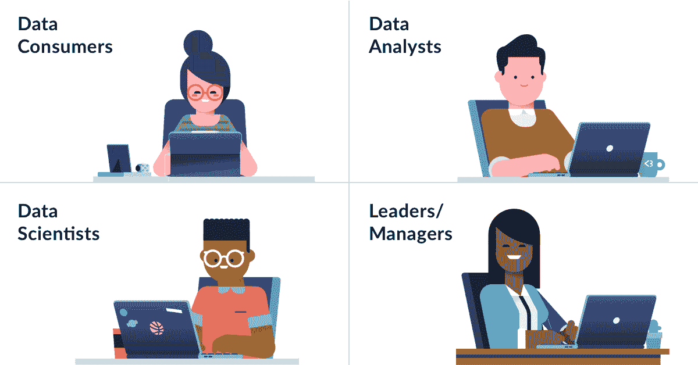
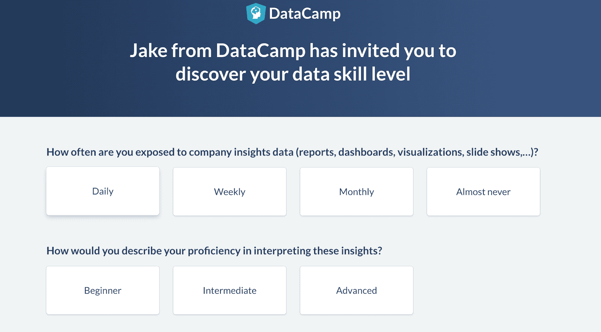
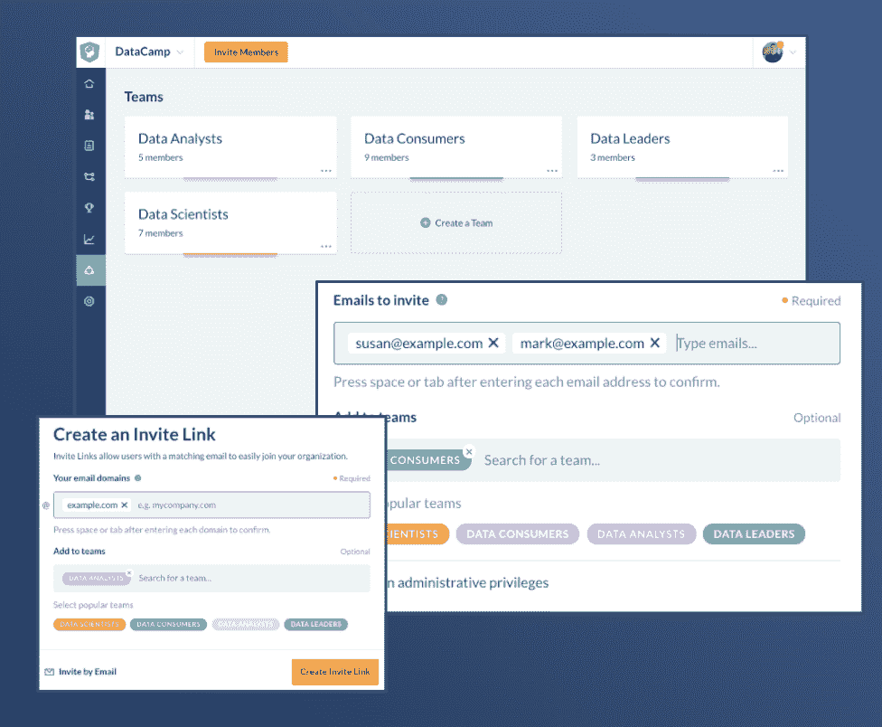
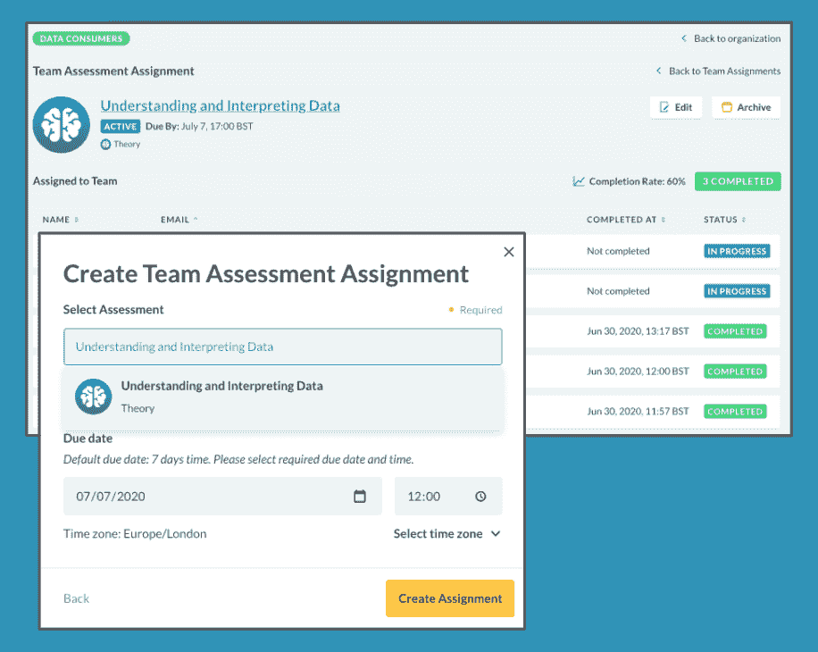
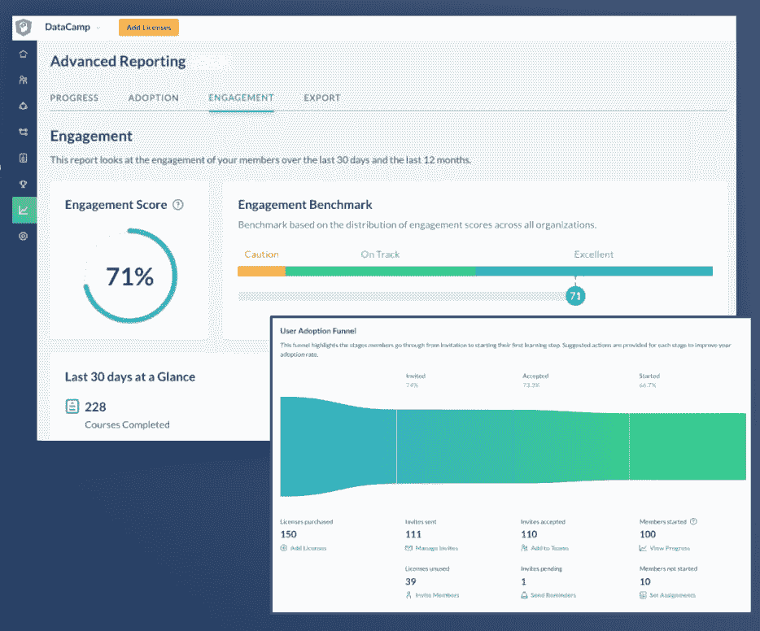
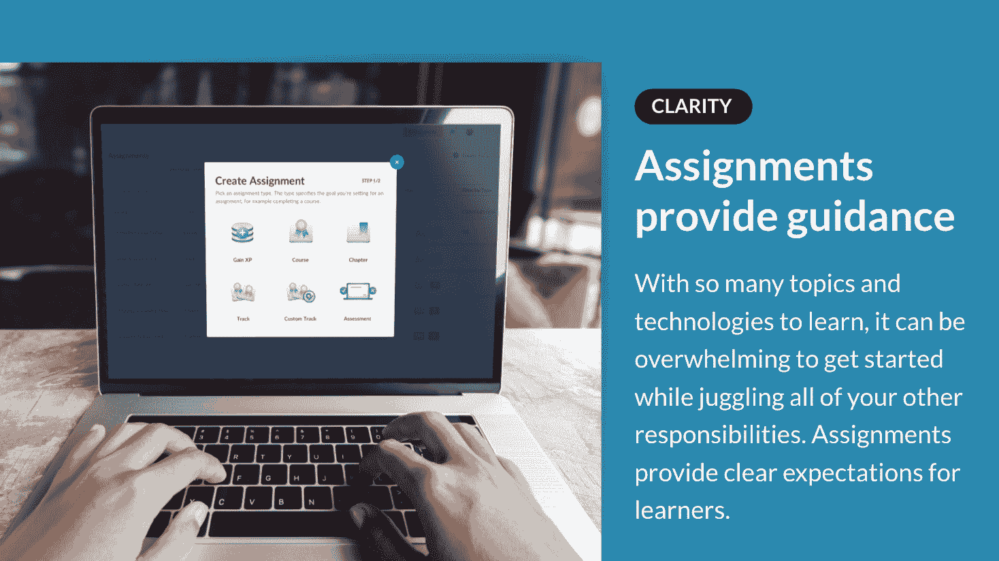
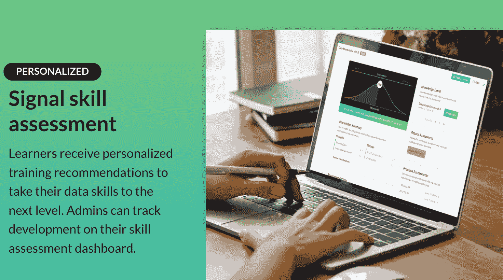
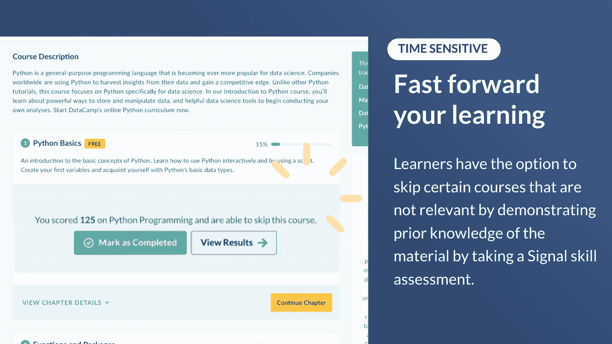

# 角色驱动的学习之旅，转变您的数据计划

> 原文：<https://web.archive.org/web/20221129040116/https://www.datacamp.com/blog/persona-driven-learning-journeys-to-transform-your-data-program>

许多公司都在思考如何用数据加速他们的数字化转型。在本文中，我们将讨论使用人物角色来构建以数据为中心的学习和发展计划的好处，并向您展示如何开始在您的组织中映射角色。

## 为什么你应该在学习过程中使用人物角色

每个人物角色与数据都有不同的关系。不是你公司的每个人都有“数据科学家”的头衔，但这并不意味着他们不需要了解如何处理和解释数据。我们建议采用基于角色的方法来确定需要哪些技能来帮助每个角色实现其绩效目标。

数据角色的目的是将您公司内的每个主要角色映射到他们以最佳方式履行其工作职责所需的技能。

## 四种最常见的角色

DataCamp 目前拥有 1，600 多家企业客户，代表着不同的行业，包括金融服务、医疗保健、咨询、技术、消费品和零售、政府等。我们的业务客户倾向于使用以下角色:数据消费者、领导者/经理、数据分析师、公民数据科学家、数据科学家、数据工程师、数据库管理员、统计学家、机器学习科学家和程序员。

为了这篇博文的目的，我们将关注四个最常见的角色:数据消费者、领导者/经理、数据分析师和数据科学家。

### 数据消费者

*   从事非技术工作，但在日常工作中使用分析结果。几乎每个人都必须消费某种类型的数据，但他们也需要能够解释显示给他们的内容。
*   嗅觉测试:在你给他们看了柱状图后，他们能问出一个合理的问题吗？
*   角色示例:营销经理

### 领导/经理

*   使用分析来监控绩效和制定战略决策。他们可能需要比其他数据消费者更广阔的视野，因为他们需要了解其数据团队的产出，并利用这些见解制定战略决策。
*   嗅探测试:他们根据数据项目的结果做决策吗？
*   角色示例:首席人事官

### 数据分析师

*   定义和开发特定领域的分析以支持决策制定，包括计算描述性统计、可视化和报告。他们通常需要报告和 BI 工具方面的技能来分享见解，需要 SQL 方面的基本技能，甚至需要精通编程语言中的常见操作任务。
*   嗅嗅测试:他们能不流汗地画出柱状图吗？
*   角色示例:运营分析师

### 数据科学家

*   使用特定于领域的高级技术来执行数据科学任务。他们执行高级分析以获得见解，并传达这些见解来帮助回答业务问题。他们通常具有 Python 或 R 编程技能，有信心处理数据，并在高级分析主题(如统计和机器学习)方面具有优势。
*   出于本文的目的，公民数据科学家，或者那些能够履行数据科学家角色的人，也属于这一类别。

## 将角色映射到所需技能

向贵公司的关键人物角色提问，以了解他们的目标和主要关注领域。

### 频率

他们多久需要访问一次特定数据？

### 自我评估的熟练程度

他们如何评价自己在你感兴趣领域的能力？

### 工具

他们是否使用开源编程工具、BI 工具、内部报告或其他工具？

### 嗅觉测试

他们能够理解上下文中的数据或交付所需的报告或模型吗？

## DataCamp 上基于角色的 L&D

DataCamp 在我们的产品体验中就如何为贵公司的每个角色建立有效的学习体验提供了指导。

### 按角色细分

您可以使用 DataCamp 的团队功能，根据平台上的角色对学员进行细分。

### 按角色分配

创建对时间敏感的任务，以保持团队的积极性，并使他们的学习与其数据角色相关的内容保持一致。定制课程让您能够灵活地为每个角色设计合适的学员旅程。

### 衡量和评估

管理员可以轻松了解、衡量和报告培训对您的组织的影响，并了解您如何实现学习目标。

## 使用人物角色对学习者的好处

### 明确的期望

由于有如此多的主题和技术要学习，在开始的同时还要应付其他的责任可能会让人不知所措。作业为学习者提供了明确的期望。

### 个性化体验

通过 DataCamp Signal，学习者可以收到个性化的培训建议，从而将他们的数据技能提升到一个新的水平。管理员可以在其技能评估仪表板上跟踪发展。

### 专为忙碌的专业人士打造

有了 DataCamp，学习者可以快速推进他们的学习。如果学习者能够通过[信号技能评估](https://web.archive.org/web/20220630220629/https://www.datacamp.com/signal)来证明他们之前对该材料的了解，我们会让他们选择跳过某些不相关的课程。

## 对你的团队进行技能审核

我们提供免费的[技能审核](https://web.archive.org/web/20220630220629/https://skill-audit.datacamp.com/discover-your-companys-data-skill-level)，这样你就可以衡量你公司的技能。注册后，您还将有机会看到我们最新的技能评估原型，并有机会塑造我们如何构建产品。

